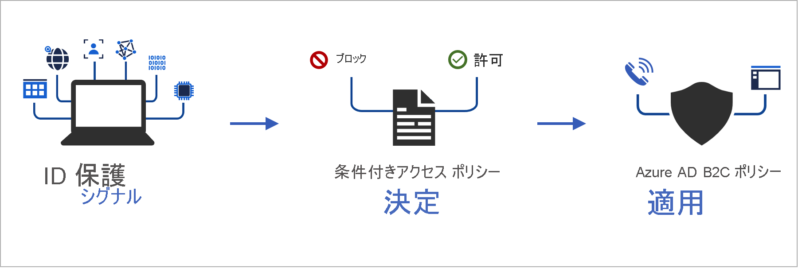

# <a name="add-conditional-access-to-user-flows-in-azure-active-directory-b2c"></a>Azure Active Directory B2C のユーザー フローに条件付きアクセスを追加する

[!INCLUDE [active-directory-b2c-choose-user-flow-or-custom-policy](../../includes/active-directory-b2c-choose-user-flow-or-custom-policy.md)]

対象の Azure Active Directory B2C (Azure AD B2C) ユーザー フローまたはカスタム ポリシーに条件付きアクセスを追加して、アプリケーションへの危険なサインインを管理できます。 Azure Active Directory (Azure AD) 条件付きアクセスは、シグナルをまとめ、決定を行い、組織のポリシーを適用するために Azure AD B2C によって使用されるツールです。



ポリシー条件を使用してリスク評価を自動化すると、危険なサインインがただちに特定され、その後、修復またはブロックされます。

[!INCLUDE [b2c-public-preview-feature](../../includes/active-directory-b2c-public-preview.md)]

## <a name="service-overview"></a>サービスの概要

Azure AD B2C では、各サインイン イベントが評価され、すべてのポリシーの要件が満たされていることを確認したうえで、ユーザー アクセスが許可されます。 この **評価** フェーズでは、条件付きアクセス サービスによって、サインイン イベント時に Identity Protection のリスク検出で収集されたシグナルが評価されます。 この評価プロセスの結果は、サインインを許可するかブロックするかを示す一連の要求です。 Azure AD B2C ポリシーでは、これらの要求を使用して、ユーザー フロー内のアクションを実行します。たとえば、アクセスをブロックしたり、多要素認証 (MFA) などの特定の修復策を使用するようにユーザーに促したりします。 "アクセスのブロック" は、他のすべての設定よりも優先されます。

::: zone pivot="b2c-custom-policy"
サインインの脅威を評価するために使用される条件付きアクセス技術プロファイルの例を次に示します。

```XML
<TechnicalProfile Id="ConditionalAccessEvaluation">
  <DisplayName>Conditional Access Provider</DisplayName>
  <Protocol Name="Proprietary" Handler="Web.TPEngine.Providers.ConditionalAccessProtocolProvider, Web.TPEngine, Version=1.0.0.0, Culture=neutral, PublicKeyToken=null" />
  <Metadata>
    <Item Key="OperationType">Evaluation</Item>
  </Metadata>
  ...
</TechnicalProfile>
```

Identity Protection のシグナルが適切に評価されるようにするには、[ローカルとソーシャルの両方のアカウント](technical-overview.md#consumer-accounts)を含むすべてのユーザーの `ConditionalAccessEvaluation` 技術プロファイルを呼び出す必要があります。 そうしないと、ユーザーに関連付けられているリスクの程度が Identity Protection で正しく表示されません。

::: zone-end

次の *修復* フェーズでは、ユーザーは MFA を求められます。 完了すると、Azure AD B2C によって、特定されたサインインの脅威が修復されたこととその方法が Identity Protection に通知されます。 この例では、Azure AD B2C によって、ユーザーが多要素認証の要求を正常に完了したことが通知されます。

修復は、他のチャンネルを介して行われる場合もあります。 たとえば、管理者またはユーザーによってアカウントのパスワードがリセットされる場合などです。 [危険なユーザー レポート](identity-protection-investigate-risk.md#navigating-the-risky-users-report)でユーザーの "*リスクの状態*" を確認できます。

> [!IMPORTANT]
> 一連の手順の中でリスクを正常に修復するには、"*評価*" 技術プロファイルの実行後に "*修復*" 技術プロファイルが呼び出されたことを確認します。 "*評価*" が "*修復*" なしで呼び出された場合、リスクの状態は " *[危険]* " です。

"*評価*" 技術プロファイルの推奨事項から `Block` が返された場合、"*評価*" 技術プロファイルの呼び出しは必要ありません。 リスクの状態は " *[危険]* " に設定されます。

::: zone pivot="b2c-custom-policy"

特定された脅威を修復するために使用される条件付きアクセス技術プロファイルの例を次に示します。

```XML
<TechnicalProfile Id="ConditionalAccessRemediation">
  <DisplayName>Conditional Access Remediation</DisplayName>
  <Protocol Name="Proprietary" Handler="Web.TPEngine.Providers.ConditionalAccessProtocolProvider, Web.TPEngine, Version=1.0.0.0, Culture=neutral, PublicKeyToken=null"/>
  <Metadata>
    <Item Key="OperationType">Remediation</Item>
  </Metadata>
  ...
</TechnicalProfile>
```

::: zone-end

## <a name="components-of-the-solution"></a>ソリューションのコンポーネント

Azure AD B2C で条件付きアクセスを利用できるようにするコンポーネントを次に示します。

- **ユーザー フロー** また **カスタム ポリシー** - サインインおよびサインアップ プロセスでユーザーを案内します。
- **条件付きアクセス ポリシー** - シグナルをまとめ、決定を行い、組織のポリシーを適用します。 ユーザーが Azure AD B2C ポリシーを使用してアプリケーションにサインインすると、条件付きアクセス ポリシーでは Azure AD Identity Protection のシグナルを使用して危険なサインインが特定され、適切な修復アクションが提示されます。
- **登録済みのアプリケーション** - 適切な Azure AD B2C ユーザー フローまたはカスタム ポリシーにユーザーを誘導します。
- [TOR Browser](https://www.torproject.org/download/) - 危険なサインインをシミュレートします。

## <a name="service-limitations-and-considerations"></a>サービスの制限と考慮事項

Azure AD の条件付きアクセスを使用する場合は、次の点を考慮してください。

- Identity Protection は、ローカル ID と、Google や Facebook などのソーシャル ID の両方で使用できます。 ソーシャル ID の場合は、条件付きアクセスを手動でアクティブ化する必要があります。 ソーシャル アカウントの資格情報が外部の ID プロバイダーによって管理されているため、検出が制限されます。
- Azure AD B2C のテナントでは、[Azure AD 条件付きアクセス](../active-directory/conditional-access/overview.md) ポリシーのサブセットのみを使用できます。


## <a name="prerequisites"></a>前提条件

[!INCLUDE [active-directory-b2c-customization-prerequisites-custom-policy](../../includes/active-directory-b2c-customization-prerequisites-custom-policy.md)]

## <a name="pricing-tier"></a>Pricing tier

危険なサインインのポリシーを作成するには、Azure AD B2C **Premium 2** が必要です。 **Premium P1** のテナントでは、場所、アプリケーション、ユーザーベース、またはグループベースのポリシーに基づいてポリシーを作成できます。 詳細については、「[Azure AD B2C 価格レベルを変更する](billing.md#change-your-azure-ad-pricing-tier)」を参照してください

## <a name="prepare-your-azure-ad-b2c-tenant"></a>Azure AD B2C テナントを準備する

条件付きアクセス ポリシーを追加するには、セキュリティの既定値を無効にします。

1. [Azure portal](https://portal.azure.com/) にサインインします。
2. ポータル ツール バーにある **[ディレクトリ + サブスクリプション]** アイコンを選択し、Azure AD B2C テナントを含むディレクトリを選択します。
3. **[Azure サービス]** で、 **[Azure AD B2C]** を選択します。 または、検索ボックスを使用して検索し、 **[Azure AD B2C]** を選択します。
4. **[プロパティ]** を選択し、次に **[セキュリティの既定値群の管理]** を選択します。

   

5. **[セキュリティの既定値群を有効にする]** で、 **[いいえ]** を選択します。

   ![[セキュリティの既定値群の有効化] トグルを [いいえ] に設定する](media/conditional-access-user-flow/enable-security-defaults-toggle.png)

## <a name="add-a-conditional-access-policy"></a>条件付きアクセス ポリシーを追加する

条件付きアクセス ポリシーとは、割り当てとアクセス制御の if then ステートメントです。 条件付きアクセス ポリシーでは、シグナルをまとめ、決定を行い、組織のポリシーを適用します。 割り当て間の論理演算子は *AND* です。 各割り当ての演算子は *OR* です。


条件付きアクセス ポリシーを追加するには、次の手順を実行します。

1. Azure portal で、 **[Azure AD B2C]** を検索して選択します。
1. **[セキュリティ]** で、 **[条件付きアクセス (プレビュー)]** を選択します。 **[条件付きアクセス ポリシー]** ページが開きます。
1. **[新しいポリシー]** を選択します。
1. ポリシーの名前を入力します (例: "*危険なサインインのブロック*")。
1. **[割り当て]** で **[ユーザーとグループ]** を選択し、次のサポートされている構成のいずれかを選択します。

    |包含  |ライセンス | Notes  |
    |---------|---------|---------|
    |**すべてのユーザー** | P1、P2 |**[すべてのユーザー]** を含めることを選択した場合、このポリシーはすべてのユーザーに影響します。 自分自身をロックしないようにするには、 **[除外]** を選択し、 **[ディレクトリ ロール]** を選択してから、一覧で **[全体管理者]** を選択して、自分の管理者アカウントを除外します。 **[ユーザーとグループ]** を選択し、 **[対象外とするユーザーの選択]** の一覧で自分のアカウントを選択することもできます。  | 
 
1. **[クラウド アプリまたはアクション]** を選択し、 **[アプリを選択]** を選択します。 [証明書利用者アプリケーション](tutorial-register-applications.md)を参照します。

1. **[条件]** を選択し、次の条件から選択します。 たとえば、 **[サインイン リスク]** を選択し、 **[高]** 、 **[中]** 、 **[低]** のリスク レベルを選択します。
    
    |条件  |ライセンス  |Notes  |
    |---------|---------|---------|
    |**ユーザー リスク**|P2|ユーザー リスクは、特定の ID またはアカウントが侵害されているおそれがあることを表します。|
    |**[サインイン リスク]**|P2|サインイン リスクは、特定の認証要求が ID 所有者によって承認されていない可能性があることを表します。|
    |**デバイス プラットフォーム**|サポートされていません| デバイスで実行されているオペレーティング システムによって分類されます。 詳細については、「[デバイス プラットフォーム](../active-directory/conditional-access/concept-conditional-access-conditions.md#device-platforms)」を参照してください。|
    |**場所**|P1、P2|名前付きの場所には、パブリック IPv4 ネットワーク情報、国、リージョンだけでなく、特定の国やリージョンにマップされていない不明な領域が含まれる場合もあります。 詳細については、「[場所](../active-directory/conditional-access/concept-conditional-access-conditions.md#locations)」を参照してください。 |
 
1. **[アクセス制御]** で **[許可]** を選択します。 次に、アクセスをブロックするか許可するかを選択します。
    
    |オプション  |ライセンス |Note  |
    |---------|---------|---------|
    |**アクセスをブロックする**|P1、P2| この条件付きアクセス ポリシーに指定されている条件に基づいて、アクセスできないようにします。|
    |**[アクセス権の付与]** ( **[多要素認証を要求する]** を指定)|P1、P2|この条件付きアクセス ポリシーに指定されている条件に基づいて、ユーザーは Azure AD B2C の多要素認証を行うように要求されます。|

1. **[ポリシーの有効化]** で、次のいずれかを選択します。
    
    |オプション  |ライセンス |Note  |
    |---------|---------|---------|
    |**レポート専用**|P1、P2| レポート専用を使用すると、管理者は、環境で条件付きアクセス ポリシーを有効にする前に、その影響を評価できます。 この状態でポリシーを確認し、多要素認証の要求やユーザーのブロックを行うことなくエンド ユーザーへの影響を判断することをお勧めします。 詳細については、「[監査レポートで条件付きアクセスの結果を確認する](#review-conditional-access-outcomes-in-the-audit-report)」を参照してください|
    | **オン**| P1、P2| アクセス ポリシーが評価されますが、適用されません。 |
    | "**オフ**" | P1、P2| アクセス ポリシーはアクティブにされず、ユーザーには影響しません。 |

1. **[作成]** を選択して、テスト用条件付きアクセス ポリシーを有効にします。

## <a name="conditional-access-template-1-sign-in-risk-based-conditional-access"></a>条件付きアクセス テンプレート 1: サインイン リスクベースの条件付きアクセス

ほとんどのユーザーは、追跡できる正常な動作をしています。この規範から外れた場合は、そのユーザーにサインインを許可すると危険であることがあります。 そのユーザーをブロックしたり、多要素認証を実行してユーザーが本人であることを証明するように求めたりすることが必要な場合もあります。

サインイン リスクは、特定の認証要求が ID 所有者によって承認されていない可能性があることを表します。 P2 ライセンスを所持する Azure AD B2C テナントでは、[Azure AD Identity Protection のサインイン リスク検出](../active-directory/identity-protection/concept-identity-protection-risks.md#sign-in-risk)を組み込んだ条件付きアクセス ポリシーを作成できます。 [B2C の Identity Protection の検出に関する制限事項](./identity-protection-investigate-risk.md?pivots=b2c-user-flow#service-limitations-and-considerations)に注意してください。

リスクが検出された場合、ユーザーは、多要素認証を実行して自己修復し、危険なサインイン イベントを閉じて、管理者に対する不要なノイズが発生しないようにすることができます。

サインイン リスクが "*中*" または "*高*" の場合に MFA を要求するサインイン リスクベースの条件付きアクセス ポリシーを有効にするには、Azure portal または Microsoft Graph API を使用して条件付きアクセスを構成します。

### <a name="enable-with-conditional-access-policy"></a>条件付きアクセス ポリシーを有効にする

1. **Azure portal** にサインインします。
2. **[Azure AD B2C]**  >  **[セキュリティ]**  >  **[条件付きアクセス]** を参照します。
3. **[新しいポリシー]** を選択します。
4. ポリシーに名前を付けます。 ポリシーの名前に対する意味のある標準を組織で作成することをお勧めします。
5. **[割り当て]** で、 **[ユーザーとグループ]** を選択します。
   1. **[Include]\(含める\)** で、 **[すべてのユーザー]** を選択します。
   2. **[除外]** で、 **[ユーザーとグループ]** を選択し、組織の緊急アクセス用または非常用アカウントを選択します。 
   3. **[Done]** を選択します。
6. **[Cloud apps or actions]\(クラウド アプリまたはアクション\)**  >  **[Include]\(含める\)** で、 **[すべてのクラウド アプリ]** を選択します。
7. **[条件]**  >  **[サインイン リスク]** で、 **[構成]** を **[はい]** に設定します。 **[このポリシーを適用するサインイン リスク レベルを選択します]** で、以下の操作を実行します。 
   1. **[高]** と **[中]** を選択します。
   2. **[Done]** を選択します。
8. **[アクセス制御]**  >  **[許可]** で、 **[アクセス権の付与]** 、 **[Require multi-factor authentication]\(多要素認証を要求する\)** の順に選択し、 **[Select]\(選択する\)** を選択します。
9. 設定を確認し、 **[Enable policy]\(ポリシーの有効化\)** を **[オン]** に設定します。
10. **[作成]** を選択して、ポリシーを作成および有効化します。

### <a name="enable-with-conditional-access-apis-optional"></a>条件付きアクセス API を有効にする (省略可能)

MS Graph API シリーズを使用して、サインイン リスクベースの条件付きアクセス ポリシーを作成します。 詳細については、[条件付きアクセス API ](../active-directory/conditional-access/howto-conditional-access-apis.md#graph-api)に関するページを参照してください。

次のテンプレートを使用すると、レポート専用モードで、表示名が "Template 1: Require MFA for medium+ sign-in risk" の条件付きアクセス ポリシーを作成できます。

```json
{
    "displayName": "Template 1: Require MFA for medium+ sign-in risk",
    "state": "enabledForReportingButNotEnforced",
    "conditions": {
        "signInRiskLevels": [ "high" ,
            "medium"
        ],
        "applications": {
            "includeApplications": [
                "All"
            ]
        },
        "users": {
            "includeUsers": [
                "All"
            ],
            "excludeUsers": [
                "f753047e-de31-4c74-a6fb-c38589047723"
            ]
        }
    },
    "grantControls": {
        "operator": "OR",
        "builtInControls": [
            "mfa"
        ]
    }
}
```

## <a name="add-conditional-access-to-a-user-flow"></a>ユーザー フローに条件付きアクセスを追加する

Azure AD 条件付きアクセス ポリシーを追加した後、ユーザー フローまたはカスタム ポリシーで条件付きアクセスを有効にします。 条件付きアクセスを有効にするときに、ポリシー名を指定する必要はありません。

複数の条件付きアクセス ポリシーは、いつでも個々のユーザーに適用される可能性があります。 この場合、最も厳格なアクセス制御ポリシーが優先されます。 たとえば、あるポリシーでは MFA を要求し、別のポリシーではアクセスをブロックする場合、ユーザーはブロックされます。

## <a name="enable-multi-factor-authentication-optional"></a>多要素認証を有効にする (オプション)

ユーザー フローに条件付きアクセスを追加する場合は、**多要素認証 (MFA)** の使用を検討してください。 ユーザーは、SMS または音声によるワンタイム コードか、メールによるワンタイム パスワードを多要素認証に使用できます。 MFA の設定は、条件付きアクセスの設定とは別になっています。 これらの MFA オプションから選択できます。

   - **[オフ]** - サインイン時に MFA が適用されることはありません。ユーザーは、サインアップ時またはサインイン時に MFA への登録を求められません。
   - **[常にオン]** - 条件付きアクセスの設定に関係なく、MFA が常に必須になります。 ユーザーが MFA にまだ登録されていない場合は、サインイン時に登録するよう求められます。 サインアップ時に、ユーザーは MFA に登録するよう求められます。
   - **[条件付き (プレビュー)]** - アクティブな条件付きアクセス ポリシーで求められる場合にのみ、MFA が必須になります。 条件付きアクセスの評価の結果がリスクのない MFA チャレンジである場合、サインイン時に MFA が適用されます。 結果がリスクによる MFA チャレンジであり、"*なおかつ*" ユーザーが MFA に登録されていない場合は、サインインがブロックされます。 サインアップ時には、ユーザーは MFA への登録を求められません。

::: zone pivot="b2c-user-flow"

ユーザー フローの条件付きアクセスを有効にするには、条件付きアクセスがご使用のバージョンでサポートされていることを確認します。 これらのユーザー フローのバージョンには、"**推奨**" というラベルが付けられています。

1. [Azure portal](https://portal.azure.com) にサインインします。

1. ポータル ツール バーにある **[ディレクトリ + サブスクリプション]** アイコンを選択し、Azure AD B2C テナントを含むディレクトリを選択します。

1. **[Azure サービス]** で、 **[Azure AD B2C]** を選択します。 または、検索ボックスを使用して検索し、 **[Azure AD B2C]** を選択します。

1. **[ポリシー]** で **[ユーザー フロー]** を選択します。 次に、ユーザー フローを選択します。

1. **[プロパティ]** を選択し、このユーザー フローで条件付きアクセスがサポートされていることを確認します。そのためには、 **[条件付きアクセス]** というラベルの設定を探します。
 
   ![[プロパティ] で MFA と条件付きアクセスを構成する](media/conditional-access-user-flow/add-conditional-access.png)

1. **[多要素認証]** セクションで、目的の **[方法の種類]** を選択し、 **[MFA enforcement]\(MFA の適用\)** で **[条件付き (プレビュー)]** を選択します。
 
1. **[条件付きアクセス (プレビュー)]** セクションで、 **[Enforce conditional access policies]\(条件付きアクセス ポリシーを適用する\)** チェック ボックスをオンにします。

1. **[保存]** を選択します。


::: zone-end

::: zone pivot="b2c-custom-policy"

## <a name="add-conditional-access-to-your-policy"></a>ポリシーに条件付きアクセスを追加する

1. 条件付きアクセスポリシーの例については、[GitHub](https://github.com/azure-ad-b2c/samples/tree/master/policies/conditional-access) を参照してください。
1. 各ファイル内で、文字列 `yourtenant` を、使用している Azure AD B2C テナントの名前に置き換えます。 たとえば、B2C テナントの名前が *contosob2c* であれば、`yourtenant.onmicrosoft.com` のすべてのインスタンスは `contosob2c.onmicrosoft.com` になります。
1. ポリシー ファイルをアップロードします。
 
### <a name="configure-claim-other-than-phone-number-to-be-used-for-mfa"></a>MFA で使用する電話番号以外の要求を構成する

上記の条件付きアクセス ポリシーでは、`DoesClaimExist` 要求変換メソッドによって、たとえば要求 `strongAuthenticationPhoneNumber` に電話番号が含まれているかどうかなど、要求に値が含まれているかどうかが確認されます。 

要求変換は、要求 `strongAuthenticationPhoneNumber` だけのことではありません。 シナリオに応じて、他の要求も使用できます。 次の XML スニペットでは、代わりに要求 `strongAuthenticationEmailAddress` がチェックされています。 選択する要求には有効な値が必要です。それがない場合、要求 `IsMfaRegistered` は `False` に設定されます。 `False` に設定されると、条件付きアクセス ポリシーの評価によって付与タイプ `Block` が返され、ユーザーがユーザー フローを完了できなくなります。

```XML
 <ClaimsTransformation Id="IsMfaRegisteredCT" TransformationMethod="DoesClaimExist">
  <InputClaims>
    <InputClaim ClaimTypeReferenceId="strongAuthenticationEmailAddress" TransformationClaimType="inputClaim" />
  </InputClaims>
  <OutputClaims>
    <OutputClaim ClaimTypeReferenceId="IsMfaRegistered" TransformationClaimType="outputClaim" />
  </OutputClaims>
 </ClaimsTransformation>
```

## <a name="test-your-custom-policy"></a>カスタム ポリシーのテスト

1. `B2C_1A_signup_signin_with_ca` または `B2C_1A_signup_signin_with_ca_whatif` ポリシーを選択して、その概要ページを開きます。 次に、 **[ユーザー フローの実行]** を選択します。 **[アプリケーション]** で、 *[webapp1]* を選択します。 **[応答 URL]** に `https://jwt.ms` と表示されます。
1. **[ユーザー フロー エンドポイントを実行]** の URL をコピーします。

1. 危険なサインインをシミュレートするには、[Tor Browser](https://www.torproject.org/download/) を開き、前の手順でコピーした URL を使用して登録済みのアプリにサインインします。

1. サインイン ページに要求された情報を入力し、サインインを試みます。 トークンが `https://jwt.ms` に返され、表示されます。 jwt.ms のデコードされたトークンで、サインインがブロックされたことがわかります。

::: zone-end

::: zone pivot="b2c-user-flow"

## <a name="test-your-user-flow"></a>ユーザー フローをテストする

1. 作成したユーザー フローを選択してその概要ページを開いてから、 **[ユーザー フローの実行]** を選択します。 **[アプリケーション]** で、 *[webapp1]* を選択します。 **[応答 URL]** に `https://jwt.ms` と表示されます。

1. **[ユーザー フロー エンドポイントを実行]** の URL をコピーします。

1. 危険なサインインをシミュレートするには、[Tor Browser](https://www.torproject.org/download/) を開き、前の手順でコピーした URL を使用して登録済みのアプリにサインインします。

1. サインイン ページに要求された情報を入力し、サインインを試みます。 トークンが `https://jwt.ms` に返され、表示されます。 jwt.ms のデコードされたトークンで、サインインがブロックされたことがわかります。

::: zone-end

## <a name="review-conditional-access-outcomes-in-the-audit-report"></a>監査レポートで条件付きアクセスの結果を確認する

条件付きアクセス イベントの結果を確認するには:

1. [Azure portal](https://portal.azure.com/) にサインインします。

2. ポータル ツール バーにある **[ディレクトリ + サブスクリプション]** アイコンを選択し、Azure AD B2C テナントを含むディレクトリを選択します。

3. **[Azure サービス]** で、 **[Azure AD B2C]** を選択します。 または、検索ボックスを使用して検索し、 **[Azure AD B2C]** を選択します。

4. **[活動]** で、 **[監査ログ]** を選択します。

5. **[カテゴリ]** を **[B2C]** に設定し、 **[アクティビティのリソースの種類]** を **[IdentityProtection]** に設定することで、監査ログをフィルター処理します。 次に、**[適用]** を選択します。

6. 最大で過去 7 日間の監査アクティビティを確認します。 次の種類のアクティビティが含まれています。

   - **[Evaluate conditional access policies]\(条件付きアクセス ポリシーを評価する\)** : この監査ログ エントリは、認証中に条件付きアクセスの評価が実行されたことを示しています。
   - **[ユーザーを修復する]** : このエントリは、エンド ユーザーが条件付きアクセス ポリシーの許可または要件を満たしていたことを示します。このアクティビティは、ユーザーのリスクを軽減 (リスクの緩和) するためにリスク エンジンに報告されています。

7. 一覧で **[Evaluate conditional access policies]\(条件付きアクセス ポリシーを評価する\)** ログ エントリを選択して、 **[アクティビティの詳細: 監査ログ]** ページを開きます。このページでは、監査ログ識別子と共に次の情報が **[追加の詳細]** セクションに表示されます。

   - **ConditionalAccessResult**: 条件付きポリシーの評価に必要な許可。
   - **AppliedPolicies**: 条件が満たされ、ポリシーがオンになっているすべての条件付きアクセス ポリシーの一覧。
   - **ReportingPolicies**: レポート専用モードに設定され、条件が満たされていた条件付きアクセス ポリシーの一覧。

## <a name="next-steps"></a>次のステップ

[Azure AD B2C ユーザー フローのユーザー インターフェイスをカスタマイズする](customize-ui-with-html.md)
