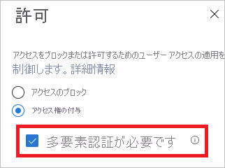

# Azure AD におけるサインイン診断とは

Azure AD には、ユーザーが管理対象リソースに対してどの操作を実行できるかを制御するための柔軟なセキュリティ モデルが用意されています。 これらのリソースへのアクセスは、**だれ** がアクセスするかだけでなく、**どのように** アクセスするかによっても制御されます。 通常、柔軟性にはある程度の複雑さが伴います。構成オプションの数が多いことがその理由です。 複雑さにより、エラーのリスクが増す可能性があります。

IT 管理者には、問題が発生したときに簡単に診断して解決できるように、システム内のアクティビティに対する適切なレベルの分析情報を得るためのソリューションが必要です。 そのようなソリューションの例として、Azure AD のサインイン診断が挙げられます。 この診断を使用して、サインイン中に何が起きたかと、Microsoft のサポートを必要とせずに問題を解決するためにどのようなアクションを実行できるかを分析します。

この記事では、ソリューションの機能とその使用方法の概要を説明します。

## 必要条件

サインイン診断は、Azure AD のすべてのエディションで使用できます。  使用するには、Azure AD のグローバル管理者である必要があります。

## しくみ

Azure AD では、サインインの試行に対する応答は、それが **だれ** であるかと、**どのように** テナントにアクセスするかに関連付けられています。 たとえば、管理者は、企業ネットワークからサインインするときに、通常はテナントのすべての要素を構成できます。 ただし、信頼されていないネットワークから同じアカウントを使用してサインインした場合は、ブロックされることもあります。
 
サインインの試行に応答するシステムの柔軟性が高いことから、最終的に、サインインのトラブルシューティングが必要なシナリオに行き着く可能性があります。サインイン診断とは、次のことを行う機能です。

- サインインのデータを分析する。 

- 何が起きたかと、問題の解決方法に関する推奨事項を表示する。 

Azure AD のサインイン診断は、サインイン エラーの自己診断が有効になるように設計されています。 診断プロセスを完了するには、以下の操作が必要です。

 
1. 対象となるサインイン イベントのスコープを **定義** します

2. 確認するサインインを **選択** します

3. 診断結果を **確認** します

4. 対処を **実行** します

 
### スコープの定義

この手順の目的は、調査対象のサインインのスコープを定義することです。 スコープは、ユーザーまたは識別子 (correlationId、requestId) と時間範囲に基づいています。 スコープをさらに絞り込むために、アプリ名も指定できます。 Azure AD は、スコープ情報を使用して適切なイベントを見つけます。  

### サインインの選択  

Azure AD によって、検索条件に基づいて一致するすべてのサインインが取得され、認証の概要のリスト ビューに表示されます。 

 
このビューに表示される列をカスタマイズできます。

### 診断の確認 

選択したサインイン イベントについては、Azure AD によって診断結果が表示されます。 

 
結果は評価から始まります。 評価では、何が起きたかについて、いくつかの文で説明されます。 この説明は、システムの挙動を理解するために役立ちます。 

次の手順として、選択したサインインに適用された、関係する条件付きアクセス ポリシーの概要を取得します。 この部分は、問題を解決するために推奨される修復手順によって完了します。 必ずしも追加の支援なしで問題を解決できるとは限らないため、サポート チケットを開くことが推奨される場合もあります。 

### アクションの実行 
この時点で、問題の解決に必要な情報が得られているものと思われます。

## シナリオ

このセクションでは、対象となる診断シナリオの概要について説明します。 以下のシナリオが実装されています。 
 
- 条件付きアクセスによってブロック

- 条件付きアクセスに失敗

- 条件付きアクセスからの MFA

- その他の要件からの MFA

- MFA プルーフアップが必要

- MFA プルーフアップが必要だが、ユーザーのサインイン試行は安全な場所からではない

- サインインに成功

### 条件付きアクセスによってブロック

このシナリオは、条件付きアクセス ポリシーによってブロックされたサインインに基づいています。

このシナリオの診断セクションには、ユーザーのサインインと適用されているポリシーに関する詳細が表示されます。

### 条件付きアクセスに失敗

このシナリオは、通常、条件付きアクセス ポリシーの要件が満たされていなかったために失敗したサインインの結果です。 一般的な例を次に示します。

- ハイブリッド Azure AD 参加済みのデバイスを必要とする

- 承認済みクライアント アプリを必須にする

- アプリの保護ポリシーを必須にする   

このシナリオの診断セクションには、ユーザーのサインインと適用されているポリシーに関する詳細が表示されます。

### 条件付きアクセスからの MFA

このシナリオは、多要素認証セットを使用してサインインするという要件がある条件付きアクセス ポリシーに基づいています。

このシナリオの診断セクションには、ユーザーのサインインと適用されているポリシーに関する詳細が表示されます。

### その他の要件からの MFA

このシナリオは、条件付きアクセス ポリシーによって適用されたのではない多要素認証の要件に基づいています。 たとえば、ユーザーごとの多要素認証です。

この診断シナリオの目的は、以下に関する詳細情報をさらに提供することです。

- 多要素認証の割り込みのソース。 
- クライアントとの対話の結果。

また、このセクションでは、ユーザーのサインイン試行に関するすべての詳細情報も提供します。 

### MFA プルーフアップが必要

このシナリオは、多要素認証を設定する要求によって割り込まれたサインインに基づいています。 この設定は "プルーフアップ" とも呼ばれます。

多要素認証のプルーフアップは、ユーザーが多要素認証の使用を要求されているにもかかわらず、まだそれを構成していないか、ユーザーによって構成されるように管理者が構成してある場合に発生します。

この診断シナリオの目的は、多要素認証の割り込みが、その設定を行い、ユーザーにプルーフアップの完了を推奨するためのものであったという分析情報を提供することです。

### 危険なサインインからの MFA プルーフアップが必要

このシナリオは、危険なサインオンからの、多要素認証を設定するための要求によって割り込まれたサインインの結果です。 

この診断シナリオの目的は、多要素認証の割り込みが、その設定を行い、ユーザーにプルーフアップの完了を推奨するものの、危険とは思われないネットワークの場所でそれを行うためのものであったという分析情報を提供することです。 たとえば、企業ネットワークが名前付きの場所として定義されている場合は、代わりに企業ネットワークからのプルーフアップを試みます。

### サインインに成功

このシナリオは、条件付きアクセスまたは多要素認証によって割り込まれなかったサインインに基づいています。

この診断シナリオの目的は、適用されると予想された条件付きアクセス ポリシーがあったか、ユーザー サインインに割り込むと予想された構成済み多要素認証があった場合に、サインイン中にユーザーが何を指定したかについての分析情報を提供することです。

## 次のステップ

* [Azure Active Directory レポートの概要](overview-reports.md)
* [Azure Active Directory の監視とは](overview-monitoring.md)
