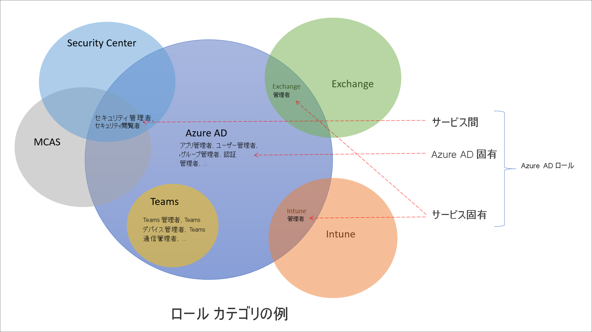

# Azure Active Directory のロールについて

Azure Active Directory (Azure AD) には 60 種の組み込みロールがあります。これらは、ロールのアクセス許可がセットとして固定されたロールです。 組み込みロールを補完するため、Azure AD ではカスタム ロールもサポートされています。 カスタム ロールを使用して、必要なアクセス許可をロールに選択できます。 たとえば、アプリケーションやサービス プリンシパルなど、特定の Azure AD リソースを管理するために作成することが可能です。

この記事では、Azure AD ロールの概要と、その使用方法について説明します。

## Azure AD ロールとその他の Microsoft 365 ロールとの違い

Microsoft 365 には、Azure AD や Intune といったさまざまなサービスがあります。 これらのサービスの一部は、独自のロールベースのアクセス制御システムを備えています。具体的には次のとおりです。

- Azure AD
- Exchange
- Intune
- Security Center
- コンプライアンス センター
- Microsoft Cloud App Security
- コマース

Teams、SharePoint、マネージド デスクトップなど、他のサービスには個別のロールベースのアクセス制御システムがありません。 これらでは、管理アクセスに Azure AD ロールが使用されます。 Azure には、Azure リソース (仮想マシンなど) 用の独自のロールベースのアクセス制御システムがあり、このシステムは Azure AD ロールとは異なります。

個別のロールベースのアクセス制御システムと言った場合、 それはロールの定義とロールの割り当てが格納されている別のデータ ストアが存在することを意味します。 同様に、アクセス確認が行われるポリシー決定ポイントも別にあります。 詳細については、[Azure AD での Microsoft 365 サービスのロール](m365-workload-docs.md)に関するページと「[従来のサブスクリプション管理者ロール、Azure ロール、および Azure AD ロール](../../role-based-access-control/rbac-and-directory-admin-roles.md)」を参照してください。

## その他のサービスで一部の Azure AD ロールが使用される理由

Microsoft 365 には、これまで個別に開発されてきたロールベースのアクセス制御システムが多数あり、それぞれに独自のサービス ポータルが用意されています。 Microsoft 365 全体での ID 管理を Azure AD ポータルから便利に行えるように、Microsoft はサービス固有の組み込みロールをいくつか追加しました。これらでは、それぞれの Microsoft 365 サービスへの管理アクセス権が付与されます。 この追加の一例として、Azure AD の Exchange 管理者ロールがあります。 このロールは Exchange のロールベースのアクセス制御システムにおける[組織管理用ロール グループ](/exchange/organization-management-exchange-2013-help)と同等であり、Exchange のあらゆる側面を管理できます。 同様に、Intune 管理者ロール、Teams 管理者、SharePoint 管理者なども追加されました。 サービス固有のロールは、次のセクションに出てくる Azure AD 組み込みロールのカテゴリの 1 つです。

## Azure AD ロールのカテゴリ

Azure AD 組み込みロールには、使用される場所によってさまざまなものが存在し、次の 3 つのカテゴリに大別されます。

- **Azure AD 固有のロール**: これらのロールでは、Azure AD 内のリソースだけを管理するアクセス許可が付与されます。 たとえば、ユーザー管理者、アプリケーション管理者、グループ管理者では、そのどれにおいても Azure AD 内にあるリソースを管理するためのアクセス許可が付与されます。
- **サービス固有のロール**: 主要な Microsoft 365 サービス (Azure AD 以外) では、サービス内のすべての機能を管理するためのアクセス許可を付与するサービス固有のロールが構築してあります。  たとえば、Exchange 管理者、Intune 管理者、SharePoint 管理者、および Teams 管理者ロールでは、それぞれのサービスを使用して機能を管理できます。 Exchange 管理者はメールボックスを管理でき、Intune 管理者はデバイス ポリシーを管理でき、SharePoint 管理者はサイト コレクションを管理でき、Teams 管理者は通話の品質を管理できます。
- **サービス間のロール**: 複数のサービスにわたるロールがいくつかあります。 グローバルなロールとしては、グローバル管理者とグローバル閲覧者の 2 つがあります。 これら 2 つのロールはすべての Microsoft 365 サービスに対して有効です。 また、セキュリティ管理者やセキュリティ閲覧者など、Microsoft 365 内の複数のセキュリティ サービスに対するアクセス権を付与するセキュリティ関連のロールもあります。 たとえば、Azure AD でセキュリティ管理者ロールを使用すると、Microsoft 365 Security Center、Microsoft Defender Advanced Threat Protection、Microsoft Cloud App Security を管理できます。 同様に、コンプライアンス管理者ロールでは、コンプライアンス関連の設定を Microsoft 365 コンプライアンス センターや Exchange などで管理できます。

これらのロール カテゴリの理解に、次の表を役立ててください。 カテゴリの名前は任意で付けられており、[ドキュメントに記載されているロールのアクセス許可](permissions-reference.md)を超える他の機能があることを示すものではありません。

カテゴリ | Role
---- | ----
Azure AD 固有のロール | アプリケーション管理者 アプリケーション開発者 認証管理者 B2C IEF キーセット管理者 B2C IEF ポリシー管理者 クラウド アプリケーション管理者 クラウド デバイス管理者 条件付きアクセス管理者 デバイス管理者 ディレクトリ リーダー ディレクトリ同期アカウント ディレクトリ ライター 外部 ID ユーザー フロー管理者 外部 ID ユーザー フロー属性管理者 外部 ID プロバイダー管理者 グループ管理者 ゲスト招待元 ヘルプデスク管理者 ハイブリッド ID の管理者 ライセンス管理者 パートナー レベル 1 のサポート パートナー レベル 2 のサポート パスワード管理者 特権認証管理者 特権ロール管理者 レポート閲覧者 ユーザー アカウント管理者
サービス間のロール | 会社の管理者 コンプライアンス管理者 コンプライアンス データ管理者 グローバル閲覧者 セキュリティ管理者 セキュリティ オペレーター セキュリティ閲覧者 サービス サポート管理者
サービス固有のロール | Azure DevOps 管理者 Azure Information Protection 管理者 課金管理者 CRM サービス管理者 カスタマー ロックボックスのアクセス承認者 デスクトップ Analytics 管理者 Exchange サービス管理者 Insights 管理者 Insights ビジネス リーダー Intune サービス管理者 Kaizala 管理者 Lync サービス管理者 メッセージ センターのプライバシー閲覧者 メッセージ センター閲覧者 Modern Commerce ユーザー ネットワーク管理者 Office アプリ管理者 Power BI サービス管理者 Power Platform 管理者 プリンター管理者 プリンター技術者 Search 管理者 Search エディター SharePoint サービス管理者 Teams 通信管理者 Teams 通信サポート エンジニア Teams 通信サポート スペシャリスト Teams デバイス管理者 Teams サービス管理者

## 次のステップ

- [Azure AD ロールベースのアクセス制御の概要](custom-overview.md)
- [Azure portal、Azure AD PowerShell、および Graph API](custom-create.md) を使用してロールの割り当てを作成する
- [ロールの割り当てを表示する](custom-view-assignments.md)
