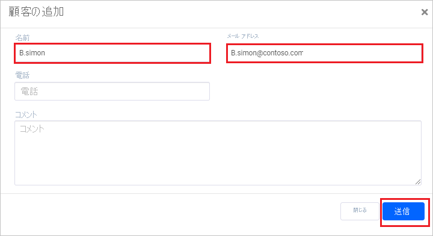

# チュートリアル:Azure Active Directory シングル サインオン (SSO) と AcquireIO の統合

このチュートリアルでは、AcquireIO と Azure Active Directory (Azure AD) を統合する方法について説明します。 Azure AD と AcquireIO を統合すると、次のことができます。

* AcquireIO にアクセスできるユーザーを Azure AD で制御できます。
* ユーザーが自分の Azure AD アカウントを使用して AcquireIO に自動的にサインインするように設定できます。
* 1 つの中央サイト (Azure Portal) で自分のアカウントを管理します。

## 前提条件

開始するには、次が必要です。

* Azure AD サブスクリプション。 サブスクリプションがない場合は、[無料アカウント](https://azure.microsoft.com/free/)を取得できます。
* AcquireIO でのシングル サインオン (SSO) が有効なサブスクリプション。

## シナリオの説明

このチュートリアルでは、テスト環境で Azure AD の SSO を構成してテストします。

* AcquireIO では、**IDP** によって開始される SSO がサポートされます。

> [!NOTE]
> このアプリケーションの識別子は固定文字列値であるため、1 つのテナントで構成できるインスタンスは 1 つだけです。

## ギャラリーからの AcquireIO の追加

Azure AD への AcquireIO の統合を構成するには、ギャラリーから管理対象 SaaS アプリの一覧に AcquireIO を追加する必要があります。

1. 職場または学校アカウントか、個人の Microsoft アカウントを使用して、Azure portal にサインインします。
1. 左のナビゲーション ウィンドウで **[Azure Active Directory]** サービスを選択します。
1. **[エンタープライズ アプリケーション]** に移動し、 **[すべてのアプリケーション]** を選択します。
1. 新しいアプリケーションを追加するには、 **[新しいアプリケーション]** を選択します。
1. **[ギャラリーから追加する]** セクションで、検索ボックスに「**AcquireIO**」と入力します。
1. 結果のパネルから **[AcquireIO]** を選択し、アプリを追加します。 お使いのテナントにアプリが追加されるのを数秒待機します。

## AcquireIO のための Azure AD SSO の構成とテスト

**B.Simon** というテスト ユーザーを使用して、AcquireIO に対する Azure AD SSO を構成してテストします。 SSO を機能させるために、Azure AD ユーザーと AcquireIO の関連ユーザーとの間にリンク関係を確立する必要があります。

AcquireIO 用に Azure AD SSO を構成してテストするには、次の手順を実行します。

1. **[Azure AD SSO の構成](#configure-azure-ad-sso)** - ユーザーがこの機能を使用できるようにします。
    1. **[Azure AD のテスト ユーザーの作成](#create-an-azure-ad-test-user)** - B.Simon で Azure AD のシングル サインオンをテストします。
    1. **[Azure AD テスト ユーザーの割り当て](#assign-the-azure-ad-test-user)** - B.Simon が Azure AD シングル サインオンを使用できるようにします。
1. **[AcquireIO SSO の構成](#configure-acquireio-sso)** - アプリケーション側でシングル サインオン設定を構成します。
    1. **[AcquireIO テスト ユーザーの作成](#create-acquireio-test-user)** - AcquireIO で B.Simon に対応するユーザーを作成し、Azure AD のこのユーザーにリンクさせます。
1. **[SSO のテスト](#test-sso)** - 構成が機能するかどうかを確認します。

## Azure AD SSO の構成

これらの手順に従って、Azure portal で Azure AD SSO を有効にします。

1. Azure portal の **AcquireIO** アプリケーション統合ページで、 **[管理]** セクションを探して、 **[シングル サインオン]** を選択します。
1. **[シングル サインオン方式の選択]** ページで、 **[SAML]** を選択します。
1. **[SAML によるシングル サインオンのセットアップ]** ページで、 **[基本的な SAML 構成]** の鉛筆アイコンをクリックして設定を編集します。

    

1. **[基本的な SAML 構成]** セクションで、次の手順を実行します。

    **[応答 URL]** ボックスに、`https://app.acquire.io/ad/<acquire_account_uid>` のパターンを使用して URL を入力します

    > [!NOTE]
    > この値は実際のものではありません。 実際の応答 URL を取得します。実際の値については、このチュートリアルの「**AcquireIO の構成**」セクションで説明します。 Azure portal の **[基本的な SAML 構成]** セクションに示されているパターンを参照することもできます。

1. **[SAML でシングル サインオンをセットアップします]** ページの **[SAML 署名証明書]** セクションで、 **[証明書 (Base64)]** を見つけて、 **[ダウンロード]** を選択し、証明書をダウンロードして、お使いのコンピューターに保存します。

    

1. **[Set up AcquireIO]\(AcquireIO の設定\)** セクションで、要件に基づいて適切な URL をコピーします。

    

### Azure AD のテスト ユーザーの作成

このセクションでは、Azure portal 内で B.Simon というテスト ユーザーを作成します。

1. Azure portal の左側のウィンドウから、 **[Azure Active Directory]** 、 **[ユーザー]** 、 **[すべてのユーザー]** の順に選択します。
1. 画面の上部にある **[新しいユーザー]** を選択します。
1. **[ユーザー]** プロパティで、以下の手順を実行します。
   1. **[名前]** フィールドに「`B.Simon`」と入力します。  
   1. **[ユーザー名]** フィールドに「username@companydomain.extension」と入力します。 たとえば、「 `B.Simon@contoso.com` 」のように入力します。
   1. **[パスワードを表示]** チェック ボックスをオンにし、 **[パスワード]** ボックスに表示された値を書き留めます。
   1. **Create** をクリックしてください。

### Azure AD テスト ユーザーの割り当て

このセクションでは、B. Simon に AcquireIO へのアクセスを許可することで、このユーザーが Azure シングル サインオンを使用できるようにします。

1. Azure portal で **[エンタープライズ アプリケーション]** を選択し、 **[すべてのアプリケーション]** を選択します。
1. アプリケーションの一覧で **[AcquireIO]** を選択します。
1. アプリの概要ページで、 **[管理]** セクションを見つけて、 **[ユーザーとグループ]** を選択します。
1. **[ユーザーの追加]** を選択し、 **[割り当ての追加]** ダイアログで **[ユーザーとグループ]** を選択します。
1. **[ユーザーとグループ]** ダイアログの [ユーザー] の一覧から **[B.Simon]** を選択し、画面の下部にある **[選択]** ボタンをクリックします。
1. SAML アサーション内に任意のロール値が必要な場合、 **[ロールの選択]** ダイアログでユーザーに適したロールを一覧から選択し、画面の下部にある **[選択]** をクリックします。
1. **[割り当ての追加]** ダイアログで、 **[割り当て]** をクリックします。

## AcquireIO SSO の構成

1. AcquireIO 内での構成を自動化するには、 **[拡張機能のインストール]** をクリックして **My Apps Secure Sign-in ブラウザー拡張機能** をインストールする必要があります。

    

1. ブラウザーに拡張機能を追加した後、 **[AcquireIO のセットアップ]** をクリックすると、AcquireIO アプリケーションに移動します。 そこから、管理者の資格情報を入力して AcquireIO にサインインします。 ブラウザー拡張機能によりアプリケーションが自動的に構成され、手順 3 ～ 6 が自動化されます。

    

1. AcquireIO を手動で設定するには、別の Web ブラウザー ウィンドウで、管理者として AcquireIO にサインインします。

1. メニューの左側から **[App Store]\(アプリ ストア\)** をクリックします。

    ![[App Store]\(アプリ ストア\) が強調表示されているスクリーンショット。](./media/acquireio-tutorial/menu.png)

1. **[Active Directory]** まで下にスクロールして、 **[インストール]** をクリックします。

    ![[Active Directory] セクションと [インストール] ボタンが強調表示されているスクリーンショット。](./media/acquireio-tutorial/install-button.png)

1. [Active Directory] ポップアップで、次の手順に従います。

    ![[Active Directory] 画面が表示されているスクリーンショット。](./media/acquireio-tutorial/configuration.png)

    a. **[コピー]** をクリックして、インスタンスの応答 URL をコピーし、Azure portal の **[基本的な SAML 構成]** セクションの **[応答 URL]** ボックスに貼り付けます。

    b. **[ログイン URL]** ボックスに、Azure portal からコピーした **ログイン URL** の値を貼り付けます。

    c. Base64 でエンコードされた証明書をメモ帳で開き、その内容をコピーして **[X.509 証明書]** ボックスに貼り付けます。

    d. **[Connect Now]\(今すぐ接続\)** をクリックします。

### AcquireIO のテスト ユーザーの作成

Azure AD ユーザーが AcquireIO にサインインできるようにするには、そのユーザーを AcquireIO にプロビジョニングする必要があります。 AcquireIO では、プロビジョニングは手動のタスクです。

**ユーザー アカウントをプロビジョニングするには、次の手順に従います。**

1. 別の Web ブラウザー ウィンドウで、管理者として AcquireIO にサインインします。

1. メニューの左側で **[プロファイル]** をクリックして、 **[プロファイルの追加]** をクリックします。

    ![画面の左側にあるメニューの [プロファイル] と [プロファイルの追加] オプションが強調表示されているスクリーンショット。](./media/acquireio-tutorial/profile.png)

1. **[顧客の追加]** ポップアップで、次の手順に従います。

    

    a. **[Name]\(名前\)** ボックスに、ユーザーの氏名を入力します (例: **B.simon**)。

    b. **[Email]\(電子メール\)** ボックスに、ユーザーのメール アドレスを入力します (例: **B.simon@contoso.com** )。

    c. **[送信]** をクリックします。

## SSO のテスト 

このセクションでは、次のオプションを使用して Azure AD のシングル サインオン構成をテストします。

* Azure portal で [このアプリケーションをテストします] をクリックすると、SSO を設定した AcquireIO に自動的にサインインされます。

* Microsoft マイ アプリを使用することができます。 マイ アプリで [AcquireIO ] タイルをクリックすると、SSO を設定した AcquireIO に自動的にサインインされます。 マイ アプリの詳細については、[マイ アプリの概要](https://support.microsoft.com/account-billing/sign-in-and-start-apps-from-the-my-apps-portal-2f3b1bae-0e5a-4a86-a33e-876fbd2a4510)に関するページを参照してください。

## 次のステップ

AcquireIO を構成したら、組織の機密データを流出と侵入からリアルタイムで保護するセッション制御を適用することができます。 セッション制御は、条件付きアクセスを拡張したものです。 [Microsoft Cloud App Security でセッション制御を強制する方法](/cloud-app-security/proxy-deployment-aad)をご覧ください。