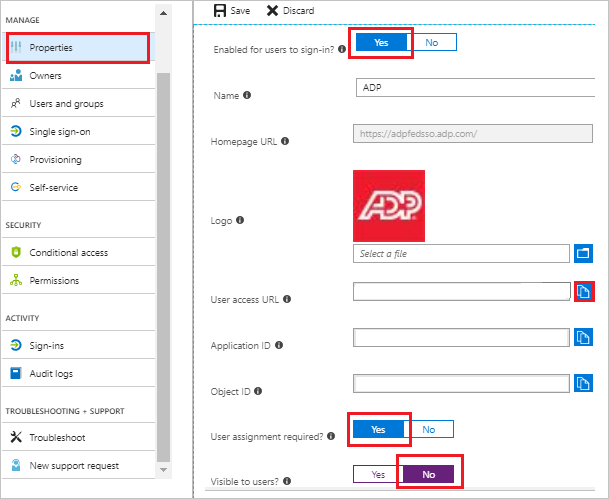

# チュートリアル: Azure AD SSO と ADP の統合

このチュートリアルでは、ADP と Azure Active Directory (Azure AD) を統合する方法について説明します。 Azure AD と ADP を統合すると、次のことができます。

* ADP にアクセスするユーザーを Azure AD 内で制御できます。
* ユーザーが自分の Azure AD アカウントを使用して ADP に自動的にサインインできるように設定できます。
* 1 つの中央サイト (Azure Portal) で自分のアカウントを管理します。

## 前提条件

開始するには、次が必要です。

* Azure AD サブスクリプション。 サブスクリプションがない場合は、[無料アカウント](https://azure.microsoft.com/free/)を取得できます。
* ADP でのシングル サインオン (SSO) が有効なサブスクリプション。

> [!NOTE]
> この統合は、Azure AD 米国政府クラウド環境から利用することもできます。 このアプリケーションは、Azure AD 米国政府クラウドのアプリケーション ギャラリーにあります。パブリック クラウドの場合と同じように構成してください。

## シナリオの説明

このチュートリアルでは、テスト環境で Azure AD の SSO を構成してテストします。

* ADP では、**IDP** Initiated SSO がサポートされます。

> [!NOTE]
> このアプリケーションの識別子は固定文字列値であるため、1 つのテナントで構成できるインスタンスは 1 つだけです。

## ギャラリーから ADP を追加する

Azure AD への ADP の統合を構成するには、ギャラリーから管理対象 SaaS アプリの一覧に ADP を追加する必要があります。

1. 職場または学校アカウントか、個人の Microsoft アカウントを使用して、Azure portal にサインインします。
1. 左のナビゲーション ウィンドウで **[Azure Active Directory]** サービスを選択します。
1. **[エンタープライズ アプリケーション]** に移動し、 **[すべてのアプリケーション]** を選択します。
1. 新しいアプリケーションを追加するには、 **[新しいアプリケーション]** を選択します。
1. **[ギャラリーから追加する]** セクションで、検索ボックスに「**ADP**」と入力します。
1. 結果のパネルから **[ADP]** を選択し、アプリを追加します。 お使いのテナントにアプリが追加されるのを数秒待機します。

## ADP の Azure AD SSO の構成とテスト

**B.Simon** というテスト ユーザーを使用して、ADP に対する Azure AD SSO を構成してテストします。 SSO を機能させるために、Azure AD ユーザーと ADP の関連ユーザーとの間にリンク関係を確立する必要があります。

ADP に対する Azure AD SSO を構成してテストするには、次の手順を行います。

1. **[Azure AD SSO の構成](#configure-azure-ad-sso)** - ユーザーがこの機能を使用できるようにします。
    1. **[Azure AD のテスト ユーザーの作成](#create-an-azure-ad-test-user)** - B.Simon で Azure AD のシングル サインオンをテストします。
    1. **[Azure AD テスト ユーザーの割り当て](#assign-the-azure-ad-test-user)** - B.Simon が Azure AD シングル サインオンを使用できるようにします。
2. **[ADP SSO の構成](#configure-adp-sso)** - アプリケーション側でシングル サインオン設定を構成します。
    1. **[ADP のテスト ユーザーの作成](#create-adp-test-user)** - ADP で B.Simon に対応するユーザーを作成し、Azure AD の B.Simon にリンクさせます。
3. **[SSO のテスト](#test-sso)** - 構成が機能するかどうかを確認します。

## Azure AD SSO の構成

これらの手順に従って、Azure portal で Azure AD SSO を有効にします。

1. Azure Portal の **ADP** アプリケーション統合ページで、**[プロパティ]** タブをクリックし、次の手順を実行します。 

    

    a. **[ユーザーのサインインが有効になっていますか?]** フィールドの値を **[はい]** に設定します。

    b. **[ユーザーのアクセス URL]** をコピーします。これを **[サインオン URL の構成]** セクションに貼り付ける必要がありますが、この操作については、このチュートリアルの後半で説明します。

    c. **[ユーザーの割り当てが必要]** フィールドの値を **[はい]** に設定します。

    d. **[ユーザーに表示しますか?]** フィールドの値を **[いいえ]** に設定します。

1. Azure portal の **ADP** アプリケーション統合ページで、 **[管理]** セクションを探して、 **[シングル サインオン]** を選択します。
1. **[シングル サインオン方式の選択]** ページで、 **[SAML]** を選択します。
1. **[SAML によるシングル サインオンのセットアップ]** ページで、 **[基本的な SAML 構成]** の鉛筆アイコンをクリックして設定を編集します。

   

1. **[基本的な SAML 構成]** セクションで、次の手順を実行します。

    **[識別子 (エンティティ ID)]** テキスト ボックスに、`https://fed.adp.com` という URL を入力します。

1. **[SAML でシングル サインオンをセットアップします]** ページの **[SAML 署名証明書]** セクションで、 **[フェデレーション メタデータ XML]** を探して **[ダウンロード]** を選択し、証明書をダウンロードして、お使いのコンピューターに保存します。

    

1. **[ADP のセットアップ]** セクションで、ご自分の要件に基づいて適切な URL をコピーします。

    

### Azure AD のテスト ユーザーの作成

このセクションでは、Azure portal 内で B.Simon というテスト ユーザーを作成します。

1. Azure portal の左側のウィンドウから、 **[Azure Active Directory]** 、 **[ユーザー]** 、 **[すべてのユーザー]** の順に選択します。
1. 画面の上部にある **[新しいユーザー]** を選択します。
1. **[ユーザー]** プロパティで、以下の手順を実行します。
   1. **[名前]** フィールドに「`B.Simon`」と入力します。  
   1. **[ユーザー名]** フィールドに「username@companydomain.extension」と入力します。 たとえば、「 `B.Simon@contoso.com` 」のように入力します。
   1. **[パスワードを表示]** チェック ボックスをオンにし、 **[パスワード]** ボックスに表示された値を書き留めます。
   1. **Create** をクリックしてください。

### Azure AD テスト ユーザーの割り当て

このセクションでは、B.Simon に ADP へのアクセスを許可することで、このユーザーが Azure シングル サインオンを使用できるようにします。

1. Azure portal で **[エンタープライズ アプリケーション]** を選択し、 **[すべてのアプリケーション]** を選択します。
1. アプリケーションの一覧で **[ADP]** を選択します。
1. アプリの概要ページで、 **[管理]** セクションを見つけて、 **[ユーザーとグループ]** を選択します。
1. **[ユーザーの追加]** を選択し、 **[割り当ての追加]** ダイアログで **[ユーザーとグループ]** を選択します。
1. **[ユーザーとグループ]** ダイアログの [ユーザー] の一覧から **[B.Simon]** を選択し、画面の下部にある **[選択]** ボタンをクリックします。
1. ユーザーにロールが割り当てられることが想定される場合は、 **[ロールの選択]** ドロップダウンからそれを選択できます。 このアプリに対してロールが設定されていない場合は、[既定のアクセス] ロールが選択されていることを確認します。
1. **[割り当ての追加]** ダイアログで、 **[割り当て]** をクリックします。

## ADP SSO の構成

**ADP** 側にシングル サインオンを構成するには、ダウンロードした **メタデータ XML** を [ADP の Web サイト](https://adpfedsso.adp.com/public/login/index.fcc)にアップロードする必要があります。

> [!NOTE]  
> このプロセスは数日かかることがあります。

### フェデレーション アクセスのために ADP サービスを構成する

>[!Important]
> ADP サービスへのフェデレーション アクセスが必要な従業員を ADP サービス アプリに割り当て、その後、ユーザーを特定の ADP サービスに再割り当てする必要があります。
ADP 担当者から送信される確認の電子メールを受信したら、ADP サービスを構成し、ユーザーの割り当てまたは管理によって、特定の ADP サービスへのユーザー アクセスを制御します。

1. 職場または学校アカウントか、個人の Microsoft アカウントを使用して、Azure portal にサインインします。
1. 左のナビゲーション ウィンドウで **[Azure Active Directory]** サービスを選択します。
1. **[エンタープライズ アプリケーション]** に移動し、 **[すべてのアプリケーション]** を選択します。
1. 新しいアプリケーションを追加するには、 **[新しいアプリケーション]** を選択します。
1. **[ギャラリーから追加する]** セクションで、検索ボックスに「**ADP**」と入力します。
1. 結果のパネルから **[ADP]** を選択し、アプリを追加します。 お使いのテナントにアプリが追加されるのを数秒待機します。
1. Azure Portal の **ADP** アプリケーション統合ページで、**[プロパティ]** タブをクリックし、次の手順を実行します。  

    

    1. **[ユーザーのサインインが有効になっていますか?]** フィールドの値を **[はい]** に設定します。

    1. **[ユーザーの割り当てが必要]** フィールドの値を **[はい]** に設定します。

    1. **[ユーザーに表示しますか?]** フィールドの値を **[はい]** に設定します。

1. Azure portal の **ADP** アプリケーション統合ページで、 **[管理]** セクションを探して、 **[シングル サインオン]** を選択します。

1. **[シングル サインオン方式の選択]** ダイアログで、**[モード]** として **[リンク]** を選択します。 アプリケーションを **ADP** にリンクさせます。

    

1. **[サインオン URL の構成]** セクションに移動し、次の手順を実行します。

    

    1. 上記の **[プロパティ]** タブ (メインの ADP アプリケーション) からコピーした、**ユーザーのアクセス URL** を貼り付けます。

    1. 次の 5 つのアプリは、異なる **リレー状態 URL** をサポートしています。 特定のアプリケーションの適切な **リレー状態 URL** の値を、**ユーザーのアクセス URL** に手動で追加する必要があります。

        * **ADP Workforce Now**

            `<User access URL>&relaystate=https://fed.adp.com/saml/fedlanding.html?WFN`

        * **ADP Workforce Now Enhanced Time**

            `<User access URL>&relaystate=https://fed.adp.com/saml/fedlanding.html?EETDC2`

        * **ADP Vantage HCM**

            `<User access URL>&relaystate=https://fed.adp.com/saml/fedlanding.html?ADPVANTAGE`

        * **ADP Enterprise HR**

            `<User access URL>&relaystate=https://fed.adp.com/saml/fedlanding.html?PORTAL`

        * **MyADP**

            `<User access URL>&relaystate=https://fed.adp.com/saml/fedlanding.html?REDBOX`

1. 変更内容を **保存** します。

1. ADP の担当者から確認の電子メールを受信したら、1 人または 2 人のユーザーでテストを開始します。

    1. 数名のユーザーを ADP サービス アプリに割り当てて、フェデレーション アクセスをテストします。

    1. ユーザーがギャラリーの ADP サービス アプリにアクセスして ADP サービスにアクセスできると、テストは成功です。

1. テストの性行を確認したら、個々のユーザーまたはユーザー グループにフェデレーション ADP サービスを割り当てます。これについてはこのチュートリアルで後ほど説明しますので、従業員にロールアウトしてください。

### ADP のテスト ユーザーの作成

このセクションの目的は、ADP で B.Simon というユーザーを作成することです。 [ADP サポート チーム](https://www.adp.com/contact-us/overview.aspx)と協力して、ADP アカウントにユーザーを追加します。 

## SSO のテスト 

このセクションでは、次のオプションを使用して Azure AD のシングル サインオン構成をテストします。

* Azure portal で [このアプリケーションをテストします] をクリックすると、SSO を設定した ADP に自動的にサインインされます。

* Microsoft マイ アプリを使用することができます。 マイ アプリで [ADP] タイルをクリックすると、SSO を設定した ADP に自動的にサインインされます。 マイ アプリの詳細については、[マイ アプリの概要](https://support.microsoft.com/account-billing/sign-in-and-start-apps-from-the-my-apps-portal-2f3b1bae-0e5a-4a86-a33e-876fbd2a4510)に関するページを参照してください。

## 次のステップ

ADP を構成したら、組織の機密データを流出と侵入からリアルタイムで保護するセッション制御を適用できます。 セッション制御は、条件付きアクセスを拡張したものです。 [Microsoft Cloud App Security でセッション制御を強制する方法](/cloud-app-security/proxy-deployment-any-app)をご覧ください。