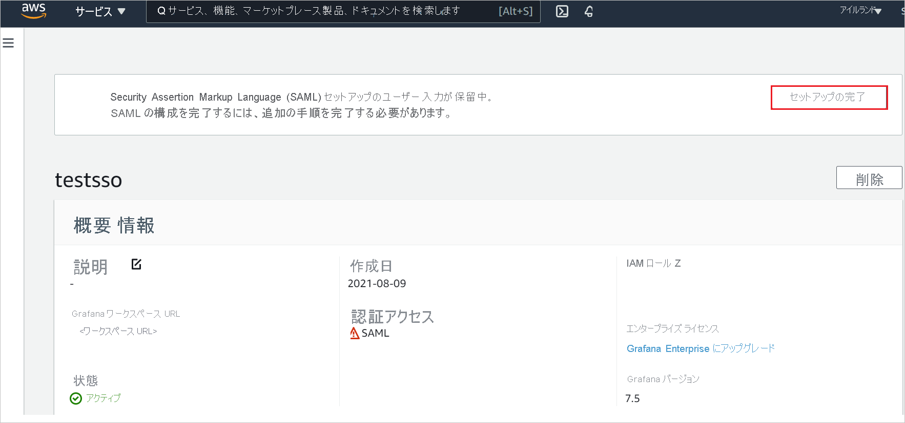

# チュートリアル: Azure Active Directory シングル サインオン (SSO) と Amazon Managed Grafana の統合

このチュートリアルでは、Amazon Managed Grafana と Azure Active Directory (Azure AD) を統合する方法について説明します。 Amazon Managed Grafana と Azure AD を統合すると、次のことが可能になります。

* Amazon Managed Grafana にアクセスできるユーザーを Azure AD で制御できます。
* ユーザーが自分の Azure AD アカウントを使用して Amazon Managed Grafana に自動的にサインインできるように設定できます。
* 1 つの中央サイト (Azure Portal) で自分のアカウントを管理します。

## 前提条件

開始するには、次が必要です。

* Azure AD サブスクリプション。 サブスクリプションがない場合は、[無料アカウント](https://azure.microsoft.com/free/)を取得できます。
* アマゾン ウェブ サービス (AWS) の[無料アカウント](https://aws.amazon.com/free/)。
* Amazon Managed Grafana でのシングル サインオン (SSO) が有効なサブスクリプション。

## シナリオの説明

このチュートリアルでは、テスト環境で Azure AD の SSO を構成してテストします。

* Amazon Managed Grafana では、**SP** によって開始される SSO がサポートされます。
* Amazon Managed Grafana では、**Just In Time** ユーザー プロビジョニングがサポートされます。

## ギャラリーから Amazon Managed Grafana を追加する

Azure AD への Amazon Managed Grafana の統合を構成するには、ギャラリーからマネージド SaaS アプリの一覧に Amazon Managed Grafana を追加する必要があります。

1. 職場または学校アカウントか、個人の Microsoft アカウントを使用して、Azure portal にサインインします。
1. 左のナビゲーション ウィンドウで **[Azure Active Directory]** サービスを選択します。
1. **[エンタープライズ アプリケーション]** に移動し、 **[すべてのアプリケーション]** を選択します。
1. 新しいアプリケーションを追加するには、 **[新しいアプリケーション]** を選択します。
1. **[ギャラリーから追加する]** セクションで、検索ボックスに「**Amazon Managed Grafana**」と入力します。
1. 結果パネルから **[Amazon Managed Grafana]** を選択し、そのアプリを追加します。 お使いのテナントにアプリが追加されるのを数秒待機します。

## Amazon Managed Grafana に対する Azure AD SSO の構成とテスト

**B.Simon** というテスト ユーザーを使用して、Amazon Managed Grafana に対して Azure AD SSO を構成してテストします。 SSO を機能させるために、Azure AD ユーザーと Amazon Managed Grafana の関連ユーザーの間にリンク関係を確立する必要があります。

Amazon Managed Grafana に対して Azure AD SSO を構成してテストするには、次の手順を実行します。

1. **[Azure AD SSO の構成](#configure-azure-ad-sso)** - ユーザーがこの機能を使用できるようにします。
    1. **[Azure AD のテスト ユーザーの作成](#create-an-azure-ad-test-user)** - B.Simon で Azure AD のシングル サインオンをテストします。
    1. **[Azure AD テスト ユーザーの割り当て](#assign-the-azure-ad-test-user)** - B.Simon が Azure AD シングル サインオンを使用できるようにします。
1. **[Amazon Managed Grafana SSO の構成](#configure-amazon-managed-grafana-sso)** - アプリケーション側でシングル サインオン設定を構成します。
    1. **[Amazon Managed Grafana のテスト ユーザーの作成](#create-amazon-managed-grafana-test-user)** - Amazon Managed Grafana で B.Simon に対応するユーザーを作成し、Azure AD の B.Simon にリンクさせます。
1. **[SSO のテスト](#test-sso)** - 構成が機能するかどうかを確認します。

## Azure AD SSO の構成

これらの手順に従って、Azure portal で Azure AD SSO を有効にします。

1. Azure portal の **Amazon Managed Grafana** アプリケーション統合ページで、 **[管理]** セクションを見つけ、 **[シングル サインオン]** を選択します。
1. **[シングル サインオン方式の選択]** ページで、 **[SAML]** を選択します。
1. **[SAML によるシングル サインオンのセットアップ]** ページで、 **[基本的な SAML 構成]** の鉛筆アイコンをクリックして設定を編集します。

   

1. **[基本的な SAML 構成]** セクションで、次の手順を実行します。

    a. **[識別子 (エンティティ ID)]** ボックスに、次のパターンを使用して URL を入力します。`https://<namespace>.grafana-workspace.<region>.amazonaws.com/saml/metadata`

    b. **[サインオン URL]** ボックスに、次のパターンを使用して URL を入力します。`https://<namespace>.grafana-workspace.<region>.amazonaws.com/login/saml`

    > [!NOTE]
    > これらは実際の値ではありません。 これらの値を実際の識別子とサインオン URL で更新してください。 これらの値を取得するには、[Amazon Managed Grafana クライアント サポート チーム](https://aws.amazon.com/contact-us/)にお問い合わせください。 Azure portal の **[基本的な SAML 構成]** セクションに示されているパターンを参照することもできます。

1. Amazon Managed Grafana アプリケーションでは、特定の形式の SAML アサーションが使用されるため、カスタム属性のマッピングを SAML トークン属性の構成に追加する必要があります。 次のスクリーンショットには、既定の属性一覧が示されています。

    

1. その他に、Amazon Managed Grafana アプリケーションでは、いくつかの属性が SAML 応答で返されることが想定されています。それらの属性を下記に示します。 これらの属性も値が事前に設定されますが、要件に従ってそれらの値を確認することができます。
    
    | 名前 | ソース属性 |
    | ----------| --------- |
    | displayName | user.displayname |
    | mail | user.userprincipalname |

1. **[SAML でシングル サインオンをセットアップします]** ページの **[SAML 署名証明書]** セクションで、 **[フェデレーション メタデータ XML]** を探して **[ダウンロード]** を選択し、証明書をダウンロードして、お使いのコンピューターに保存します。

    

1. **[Set up Amazon Managed Grafana]\(Amazon Managed Grafana のセットアップ\)** セクションで、各自の要件に基づいて適切な URL をコピーします。

    

### Azure AD のテスト ユーザーの作成

このセクションでは、Azure portal 内で B.Simon というテスト ユーザーを作成します。

1. Azure portal の左側のウィンドウから、 **[Azure Active Directory]** 、 **[ユーザー]** 、 **[すべてのユーザー]** の順に選択します。
1. 画面の上部にある **[新しいユーザー]** を選択します。
1. **[ユーザー]** プロパティで、以下の手順を実行します。
   1. **[名前]** フィールドに「`B.Simon`」と入力します。  
   1. **[ユーザー名]** フィールドに「username@companydomain.extension」と入力します。 たとえば、「 `B.Simon@contoso.com` 」のように入力します。
   1. **[パスワードを表示]** チェック ボックスをオンにし、 **[パスワード]** ボックスに表示された値を書き留めます。
   1. **Create** をクリックしてください。

### Azure AD テスト ユーザーの割り当て

このセクションでは、B.Simon に Amazon Managed Grafana のアクセスを許可することで、このユーザーが Azure シングル サインオンを使用できるようにします。

1. Azure portal で **[エンタープライズ アプリケーション]** を選択し、 **[すべてのアプリケーション]** を選択します。
1. アプリケーションの一覧で、 **[Amazon Managed Grafana]** を選択します。
1. アプリの概要ページで、 **[管理]** セクションを見つけて、 **[ユーザーとグループ]** を選択します。
1. **[ユーザーの追加]** を選択し、 **[割り当ての追加]** ダイアログで **[ユーザーとグループ]** を選択します。
1. **[ユーザーとグループ]** ダイアログの [ユーザー] の一覧から **[B.Simon]** を選択し、画面の下部にある **[選択]** ボタンをクリックします。
1. ユーザーにロールが割り当てられることが想定される場合は、 **[ロールの選択]** ドロップダウンからそれを選択できます。 このアプリに対してロールが設定されていない場合は、[既定のアクセス] ロールが選択されていることを確認します。
1. **[割り当ての追加]** ダイアログで、 **[割り当て]** をクリックします。

## Amazon Managed Grafana SSO の構成

1. Amazon Managed Grafana コンソールに管理者としてログインします。

1. **[ワークスペースの作成]** をクリックします。 

    

1. **[Specify workspace details]\(ワークスペースの詳細の指定\)** ページで、一意の **ワークスペース名** を入力し、 **[次へ]** をクリックします。

    

1. **[設定の構成]** ページで、 **[Security Assertion Markup Language (SAML)]** チェックボックスを選択し、アクセス許可の種類として **[Service managed]\(サービス マネージド\)** を有効にし、 **[次へ]** をクリックします。

    

1. **[Service managed permission settings]\(サービス マネージド アクセス許可の設定\)** で、 **[Current account]\(現在のアカウント\)** を選択し、 **[次へ]** をクリックします。

    

1. **[確認と作成]** ページで、ワークスペースのすべての詳細を確認し、 **[ワークスペースの作成]** をクリックします。

    ![[確認と作成] ページを示すスクリーンショット。](./media/amazon-managed-grafana-tutorial/review-workspace.png "ワークスペースを作成する")

1. ワークスペースを作成した後、 **[セットアップの完了]** をクリックして SAML 構成を完了します。

    

1. **[Security Assertion Markup Language (SAML)]** ページで、次の手順を実行します。

    

    1. **[Service provider identifier(Entity ID)]\(サービス プロバイダー ID (エンティティ ID)\)** の値をコピーし、この値を、Azure portal の **[基本的な SAML 構成]** セクションの **[ID]** テキスト ボックスに貼り付けます。

    1. **[Service provider reply URL(Assertion consumer service URL)]\(サービス プロバイダー応答 URL (Assertion Consumer Service URL)\)** の値をコピーし、この値を、Azure portal の **[基本的な SAML 構成]** セクションの **[応答 URL]** テキスト ボックスに貼り付けます。

    1. **[Service provider login URL]\(サービス プロバイダー ログイン URL\)** の値をコピーし、この値を Azure portal の **[基本的な SAML 構成]** セクションの **[サインオン URL]** テキスト ボックスに貼り付けます。

    1. Azure portal からダウンロードした **フェデレーション メタデータ XML** をメモ帳で開き、 **[ファイルの選択]** オプションをクリックしてその XML ファイルをアップロードします。

    1. **[Assertion mapping]\(アサーション マッピング\)** セクションで、要件に従い必要な値を入力します。

    1. **[Save SAML configuration]\(SAML 構成の保存\)** をクリックします。

### Amazon Managed Grafana のテスト ユーザーの作成

このセクションでは、Britta Simon というユーザーを Amazon Managed Grafana に作成します。 Amazon Managed Grafana では、Just-In-Time ユーザー プロビジョニングがサポートされています。これは既定で有効になっています。 このセクションでは、ユーザー側で必要な操作はありません。 Amazon Managed Grafana にユーザーがまだ存在していない場合は、認証後に新しく作成されます。

## SSO のテスト 

このセクションでは、次のオプションを使用して Azure AD のシングル サインオン構成をテストします。 

* Azure portal で **[このアプリケーションをテストします]** をクリックします。 これにより、ログイン フローを開始できる Amazon Managed Grafana のサインオン URL にリダイレクトされます。 

* Amazon Managed Grafana のサインオン URL に直接移動し、そこからログイン フローを開始します。

* Microsoft マイ アプリを使用することができます。 マイ アプリで [Amazon Managed Grafana] タイルをクリックすると、Amazon Managed Grafana のサインオン URL にリダイレクトされます。 マイ アプリの詳細については、[マイ アプリの概要](https://support.microsoft.com/account-billing/sign-in-and-start-apps-from-the-my-apps-portal-2f3b1bae-0e5a-4a86-a33e-876fbd2a4510)に関するページを参照してください。

## 次のステップ

Amazon Managed Grafana を構成した後、組織の機密データの流出と侵入をリアルタイムで防止するセッション制御を強制できます。 セッション制御は、条件付きアクセスを拡張したものです。 [Microsoft Cloud App Security でセッション制御を強制する方法](/cloud-app-security/proxy-deployment-aad)をご覧ください。