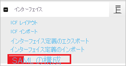
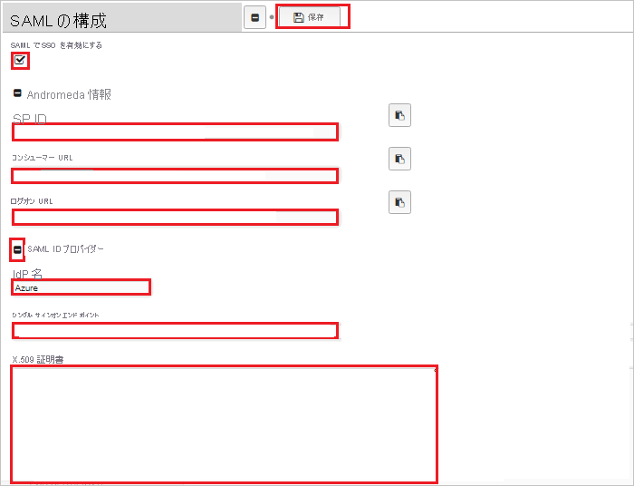

# チュートリアル: Azure Active Directory と Andromeda の統合

このチュートリアルでは、Andromeda と Azure Active Directory (Azure AD) を統合する方法について説明します。 Azure AD と Andromeda を統合すると、次のことができます。

* Andromeda にアクセスできるユーザーを Azure AD で管理します。
* ユーザーが自分の Azure AD アカウントを使用して Andromeda に自動的にサインインできるようにします。
* 1 つの中央サイト (Azure Portal) で自分のアカウントを管理します。

## 前提条件

Andromeda と Azure AD の統合を構成するには、次のものが必要です。

* Azure AD サブスクリプション。 Azure AD の環境がない場合は、[無料アカウント](https://azure.microsoft.com/free/)を取得できます。
* Andromeda でのシングル サインオンが有効なサブスクリプション。

## シナリオの説明

このチュートリアルでは、テスト環境で Azure AD のシングル サインオンを構成してテストします。

* Andromeda では、**SP と IDP** によって開始される SSO がサポートされます。
* Andromeda では、**Just In Time** ユーザー プロビジョニングがサポートされます。

## ギャラリーからの Andromeda の追加

Azure AD への Andromeda の統合を構成するには、ギャラリーから管理対象 SaaS アプリの一覧に Andromeda を追加する必要があります。

1. 職場または学校アカウントか、個人の Microsoft アカウントを使用して、Azure portal にサインインします。
1. 左のナビゲーション ウィンドウで **[Azure Active Directory]** サービスを選択します。
1. **[エンタープライズ アプリケーション]** に移動し、 **[すべてのアプリケーション]** を選択します。
1. 新しいアプリケーションを追加するには、 **[新しいアプリケーション]** を選択します。
1. **[ギャラリーから追加する]** セクションで、検索ボックスに「**Andromeda**」と入力します。
1. 結果のパネルから **[Andromeda]** を選択し、アプリを追加します。 お使いのテナントにアプリが追加されるのを数秒待機します。

## Andromeda の Azure AD SSO の構成とテスト

**B. Simon** というテスト ユーザーを使用して、Andromeda に対する Azure AD SSO を構成してテストします。 SSO を機能させるために、Azure AD ユーザーと Andromeda の関連ユーザーとの間にリンク関係を確立する必要があります。

Andromeda に対して Azure AD SSO を構成してテストするには、次の手順を行います。

1. **[Azure AD SSO の構成](#configure-azure-ad-sso)** - ユーザーがこの機能を使用できるようにします。
   1. **[Azure AD のテスト ユーザーの作成](#create-an-azure-ad-test-user)** - Britta Simon で Azure AD のシングル サインオンをテストします。
   1. **[Azure AD テスト ユーザーの割り当て](#assign-the-azure-ad-test-user)** - Britta Simon が Azure AD シングル サインオンを使用できるようにします。
2. **[Andromeda の SSO の構成](#configure-andromeda-sso)** - アプリケーション側でシングル サインオン設定を構成します。
   1. **[Andromeda のテスト ユーザーの作成](#create-andromeda-test-user)** - Andromeda で Britta Simon に対応するユーザーを作成し、Azure AD の Britta Simon にリンクさせます。
3. **[SSO のテスト](#test-sso)** - 構成が機能するかどうかを確認します。

## Azure AD SSO の構成

これらの手順に従って、Azure portal で Azure AD SSO を有効にします。

1. Azure portal の **Andromeda** アプリケーション統合ページで、 **[管理]** セクションを探して、 **[シングル サインオン]** を選択します。
1. **[シングル サインオン方式の選択]** ページで、 **[SAML]** を選択します。
1. **[SAML によるシングル サインオンのセットアップ]** ページで、 **[基本的な SAML 構成]** の鉛筆アイコンをクリックして設定を編集します。

   

1. **[基本的な SAML 構成]** セクションで、アプリケーションを **IDP** 開始モードで構成する場合は、次の手順を実行します。 

   a. **[識別子]** ボックスに、`https://<tenantURL>.ngcxpress.com/` の形式で URL を入力します。

   b. **[応答 URL]** ボックスに、`https://<tenantURL>.ngcxpress.com/SAMLConsumer.aspx` のパターンを使用して URL を入力します

1. アプリケーションを **SP** 開始モードで構成する場合は、 **[追加の URL を設定します]** をクリックして次の手順を実行します。

   **[サインオン URL]** ボックスに、`https://<tenantURL>.ngcxpress.com/SAMLLogon.aspx` という形式で URL を入力します。

   > [!NOTE]
   > これらは実際の値ではありません。 実際の識別子、応答 URL、サインオン URL に値を置き換えます。実際の値については後で説明します。

1. Andromeda アプリケーションは、特定の形式で構成された SAML アサーションを受け入れます。 このアプリケーションには、次の要求を構成します。 これらの属性の値は、アプリケーション統合ページの **[ユーザー属性]** セクションで管理できます。 **[SAML でシングル サインオンをセットアップします]** ページで、 **[編集]** ボタンをクリックして **[ユーザー属性]** ダイアログを開きます。

   ![スクリーンショットは [ユーザー属性] を示しています。](common/edit-attribute.png)

   > [!NOTE]
   > これらの設定中に名前空間の定義をクリアします。

1. **[ユーザー属性]** ダイアログの **[ユーザーの要求]** セクションで、**編集アイコン** を使用して要求を編集するか、 **[新しい要求の追加]** を使用して要求を追加することで、上の図のように SAML トークン属性を構成し、次の手順を実行します。

   | 名前    | ソース属性  |
   | ------- | ----------------- |
   | ロール (role)    | アプリ固有のロール |
   | type    | アプリの種類          |
   | company | CompanyName       |

   > [!NOTE]
   > Andromeda では、アプリケーションに対してユーザーのロールが割り当てられていることを想定しています。 ユーザーに適切なロールを割り当てることができるように、Azure AD でこれらのロールを設定してください。 Azure AD でロールを構成する方法については、[こちら](../develop/howto-add-app-roles-in-azure-ad-apps.md#app-roles-ui)を参照してください。

   a. **[新しい要求の追加]** をクリックして **[ユーザー要求の管理]** ダイアログを開きます。

   ![[新しい要求の追加] と [保存] オプションが備わっている [ユーザー要求] のスクリーンショット。](common/new-save-attribute.png)

   ![スクリーンショットは、この手順で説明した値を入力できる [ユーザー要求の管理] を示しています。](common/new-attribute-details.png)

   b. **[名前]** ボックスに、その行に対して表示される属性名を入力します。

   c. **[名前空間]** は空白のままにします。

   d. [ソース] として **[属性]** を選択します。

   e. **[ソース属性]** の一覧から、その行に表示される属性値を入力します。

   f. **[OK]** をクリックします。

   g. **[保存]** をクリックします。

1. **[SAML でシングル サインオンをセットアップします]** ページの **[SAML 署名証明書]** セクションで、 **[ダウンロード]** をクリックして要件のとおりに指定したオプションからの **証明書 (Base64)** をダウンロードして、お使いのコンピューターに保存します。

   

1. **[Andromeda のセットアップ]** セクションで、要件に従って適切な URL をコピーします。

   

### Azure AD のテスト ユーザーの作成

このセクションでは、Azure portal 内で B.Simon というテスト ユーザーを作成します。

1. Azure portal の左側のウィンドウから、 **[Azure Active Directory]** 、 **[ユーザー]** 、 **[すべてのユーザー]** の順に選択します。
1. 画面の上部にある **[新しいユーザー]** を選択します。
1. **[ユーザー]** プロパティで、以下の手順を実行します。
   1. **[名前]** フィールドに「`B.Simon`」と入力します。
   1. **[ユーザー名]** フィールドに「username@companydomain.extension」と入力します。 たとえば、「 `B.Simon@contoso.com` 」のように入力します。
   1. **[パスワードを表示]** チェック ボックスをオンにし、 **[パスワード]** ボックスに表示された値を書き留めます。
   1. **Create** をクリックしてください。

### Azure AD テスト ユーザーの割り当て

このセクションでは、B. Simon に Andromeda へのアクセスを許可することで、このユーザーが Azure シングル サインオンを使用できるようにします。

1. Azure portal で **[エンタープライズ アプリケーション]** を選択し、 **[すべてのアプリケーション]** を選択します。
1. アプリケーションの一覧で **[Andromeda]** を選択します。
1. アプリの概要ページで、 **[管理]** セクションを見つけて、 **[ユーザーとグループ]** を選択します。
1. **[ユーザーの追加]** を選択し、 **[割り当ての追加]** ダイアログで **[ユーザーとグループ]** を選択します。
1. **[ユーザーとグループ]** ダイアログの [ユーザー] の一覧から **[B.Simon]** を選択し、画面の下部にある **[選択]** ボタンをクリックします。
1. 前述のロールを設定した場合、 **[ロールの選択]** ボックスの一覧からそれを選択できます。
1. **[割り当ての追加]** ダイアログで、 **[割り当て]** をクリックします。

### Andromeda の SSO の構成

1. Andromeda 企業サイトに管理者としてサインオンします。

2. メニュー バーの上部にある **[Admin]\(管理者\)** をクリックし、 **[Administration]\(管理\)** に移動します。

   

3. ツール バーの左側の **[Interfaces]\(インターフェイス\)** セクションで、 **[SAML Configuration]\(SAML の構成\)** をクリックします。

   

4. **[SAML Configuration]\(SAML の構成\)** セクション ページで、次の手順を実行します。

   

   a. **[Enable SSO with SAML]\(SAML で SSO を有効にする\)** をオンにします。

   b. **[Andromeda Information]\(Andromeda 情報\)** セクションで、 **[SP Identity]\(SP ID\)** の値をコピーして、 **[基本的な SAML 構成]** セクションの **[識別子]** ボックスに貼り付けます。

   c. **[Consumer URL]\(コンシューマー URL\)** の値をコピーし、 **[基本的な SAML 構成]** セクションの **[応答 URL]** ボックスに貼り付けます。

   d. **[Logon URL]\(ログオン URL\)** の値をコピーし、 **[基本的な SAML 構成]** セクションの **[サインオン URL]** ボックスに貼り付けます。

   e. **[SAML Identity Provider]\(SAML ID プロバイダー\)** セクションで、IDP 名を入力します。

   f. **[Single Sign On End Point]\(シングル サインオン エンドポイント\)** ボックスに、Azure portal からコピーした **[ログイン URL]** の値を貼り付けます。

   g. Azure Portal からダウンロードした **Base64 でエンコードされた証明書** をメモ帳で開き、 **[X.509 証明書]** ボックスに貼り付けます。

   h. 以下の属性を対応する値にマップし、Azure AD からの SSO ログインを容易にします。 **ユーザー ID** 属性はログインに必要です。 プロビジョニングの場合は、**電子メール**、**会社**、**ユーザーの種類**、**ロール** が必要です。 このセクションでは、Azure portal 内で定義されている値に関連付ける属性マッピング (名前と値) を定義します。

   

   i. **[保存]** をクリックします。

### Andromeda のテスト ユーザーの作成

このセクションでは、Britta Simon というユーザーを Andromeda に作成します。 Andromeda では、Just-In-Time ユーザー プロビジョニングがサポートされており、既定で有効になっています。 このセクションでは、ユーザー側で必要な操作はありません。 Andromeda にユーザーがまだ存在していない場合は、認証後に新しく作成されます。 ユーザーを手動で作成する必要がある場合は、[Andromeda クライアント サポート チーム](https://www.ngcsoftware.com/support/)にお問い合わせください。

## SSO のテスト

このセクションでは、次のオプションを使用して Azure AD のシングル サインオン構成をテストします。

#### SP Initiated:

* Azure portal で **[このアプリケーションをテストします]** をクリックします。 これにより、ログイン フローを開始できる Andromeda のサインオン URL にリダイレクトされます。

* Andromeda のサインオン URL に直接移動し、そこからログイン フローを開始します。

#### IDP Initiated:

* Azure portal で **[このアプリケーションをテストします]** をクリックすると、SSO を設定した Andromeda に自動的にサインインされます

* また、Microsoft マイ アプリを使用して、任意のモードでアプリケーションをテストすることもできます。 マイ アプリで [Andromeda] タイルをクリックすると、SP モードで構成されている場合は、ログイン フローを開始するためのアプリケーション サインオン ページにリダイレクトされます。IDP モードで構成されている場合は、SSO を設定した Andromeda に自動的にサインインされます。 マイ アプリの詳細については、[マイ アプリの概要](https://support.microsoft.com/account-billing/sign-in-and-start-apps-from-the-my-apps-portal-2f3b1bae-0e5a-4a86-a33e-876fbd2a4510)に関するページを参照してください。

## 次のステップ

Andromeda を構成したら、組織の機密データを流出と侵入からリアルタイムで保護するセッション制御を適用することができます。 セッション制御は、条件付きアクセスを拡張したものです。 [Microsoft Cloud App Security でセッション制御を強制する方法](/cloud-app-security/proxy-deployment-any-app)をご覧ください。