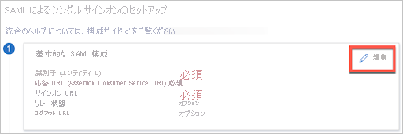
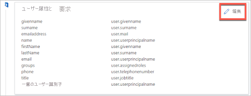

# チュートリアル:Azure Active Directory シングル サインオン (SSO) と AppNeta Performance Manager の統合

このチュートリアルでは、AppNeta Performance Manager と Azure Active Directory (Azure AD) を統合する方法について説明します。 Azure AD と AppNeta Performance Manager を統合すると、次のことができます。

- AppNeta Performance Manager にアクセスできるユーザーを Azure AD で管理できます。
- ユーザーが自分の Azure AD アカウントで自動的に AppNeta Performance Manager にサインインできるように設定できます。
- 1 つの中央サイト (Azure Portal) で自分のアカウントを管理します。

## 前提条件

開始するには、次が必要です。

- Azure AD サブスクリプション。 サブスクリプションがない場合は、[無料アカウント](https://azure.microsoft.com/free/)を取得できます。
- AppNeta Performance Manager でのシングル サインオン (SSO) が有効なサブスクリプション

## シナリオの説明

このチュートリアルでは、テスト環境で Azure AD の SSO を構成してテストします。

- AppNeta Performance Manager では、**SP** Initiated SSO がサポートされます
- AppNeta Performance Manager では、**Just-In-Time** ユーザー プロビジョニングがサポートされます

> [!NOTE]
> このアプリケーションの識別子は固定文字列値であるため、1 つのテナントで構成できるインスタンスは 1 つだけです。

## ギャラリーからの AppNeta Performance Manager の追加

Azure AD への AppNeta Performance Manager の統合を構成するには、ギャラリーからマネージド SaaS アプリの一覧に AppNeta Performance Manager を追加する必要があります。

1. 職場または学校アカウントか、個人の Microsoft アカウントを使用して、Azure portal にサインインします。
1. 左のナビゲーション ウィンドウで **[Azure Active Directory]** サービスを選択します。
1. **[エンタープライズ アプリケーション]** に移動し、 **[すべてのアプリケーション]** を選択します。
1. 新しいアプリケーションを追加するには、 **[新しいアプリケーション]** を選択します。
1. **[ギャラリーから追加する]** セクションで、検索ボックスに、「**AppNeta Performance Manager**」と入力します。
1. 結果のパネルから **AppNeta Performance Manager** を選択し、アプリを追加します。 お使いのテナントにアプリが追加されるのを数秒待機します。

## AppNeta Performance Manager の Azure AD SSO の構成とテスト

**B.Simon** というテスト ユーザーを使用して、AppNeta Performance Manager に対する Azure AD SSO を構成してテストします。 SSO を機能させるために、Azure AD ユーザーと AppNeta Performance Manager の関連ユーザーとの間にリンク関係を確立する必要があります。

AppNeta Performance Manager に対して Azure AD SSO を構成してテストするには、次の手順を行います。

1. **[Azure AD SSO の構成](#configure-azure-ad-sso)** - ユーザーがこの機能を使用できるようにします。
   1. **[Azure AD のテスト ユーザーの作成](#create-an-azure-ad-test-user)** - B.Simon で Azure AD のシングル サインオンをテストします。
   1. **[Azure AD テスト ユーザーの割り当て](#assign-the-azure-ad-test-user)** - B.Simon が Azure AD シングル サインオンを使用できるようにします。
1. **[AppNeta Performance Manager の SSO の構成](#configure-appneta-performance-manager-sso)** - アプリケーション側でシングル サインオン設定を構成します。
   1. **[AppNeta Performance Manager のテスト ユーザーの作成](#create-appneta-performance-manager-test-user)** - AppNeta Performance Manager で B.Simon に対応するユーザーを作成し、Azure AD の B.Simon にリンクさせます。
1. **[SSO のテスト](#test-sso)** - 構成が機能するかどうかを確認します。

## Azure AD SSO の構成

これらの手順に従って、Azure portal で Azure AD SSO を有効にします。

1. Azure portal の **AppNeta Performance Manager** アプリケーション統合ページで、 **[管理]** セクションを見つけて、 **[シングル サインオン]** を選択します。
1. **[シングル サインオン方式の選択]** ページで、 **[SAML]** を選択します。
1. **[SAML によるシングル サインオンのセットアップ]** ページで、 **[基本的な SAML 構成]** の鉛筆アイコンをクリックして設定を編集します。

   

1. **[基本的な SAML 構成]** セクションで、次のフィールドの値を入力します。

   a. **[サインオン URL]** ボックスに、次のパターンを使用して URL を入力します。`https://<subdomain>.pm.appneta.com`

   b. [応答 URL (Assertion Consumer Service URL)] フィールドに「`https://sso.connect.pingidentity.com/sso/sp/ACS.saml2`」と入力します。

   > [!NOTE]
   > 上記のサインオン URL の値は一例です。 実際のサインオン URL でこの値を更新してください。 [AppNeta Performance Manager のカスタマー サポート チーム](mailto:support@appneta.com)に問い合わせて、この値を入手します。 Azure portal の **[基本的な SAML 構成]** セクションに示されているパターンを参照することもできます。

1. AppNeta Performance Manager アプリケーションでは、特定の形式の SAML アサーションが求められます。そのため、SAML トークン属性の構成に、カスタム属性マッピングを追加する必要があります。 次のスクリーンショットには、既定の属性一覧が示されています。

   

1. その他に、AppNeta Performance Manager アプリケーションでは、いくつかの属性が SAML 応答で返されることが想定されています。それらの属性を下に示します。 これらの属性も値が事前に設定されますが、要件に従ってそれらの値を確認できます。

   | 名前      | ソース属性       |
   | --------- | ---------------------- |
   | firstName | User.givenname         |
   | lastName  | User.surname           |
   | email     | user.userprincipalname |
   | name      | user.userprincipalname |
   | groups    | user.assignedroles     |
   | phone     | user.telephonenumber   |
   | title     | user.jobtitle          |
   |           |                        |

1. "groups" SAML アサーションを適切に渡すには、アプリ ロールを構成し、AppNeta Performance Manager 内で設定されているロール マッピングと一致するように値を設定する必要があります。 **[Azure Active Directory]**  >  **[アプリの登録]**  >   **[すべてのアプリケーション]** で、 **[Appneta Performance Manager]** を選択します。
1. 左側のウィンドウで **[アプリ ロール]** をクリックします。
1. **[Create App role] \(アプリ ロールの作成)** をクリックします。
1. **[Create App role]\(アプリ ロールの作成\)** ウィンドウで、こちらの手順を実行します。
   1. **[表示名]** に、ロールの名前を入力します。
   1. **[Allowed member types]\(許可されるメンバーの種類\)** で、 **[ユーザー/グループ]** を選択します。
   1. **[値]** に、AppNeta Performance Manager のロール マッピングに設定されているセキュリティ グループの値を入力します。
   1. **[説明]** に、ロールの説明を入力します。
   1. **[適用]** をクリックします。

1. ロールを作成したら、それらのロールをユーザーとグループにマップする必要があります。 **[Azure Active Directory]**  >  **[エンタープライズ アプリケーション]**  >  **[Appneta Performance Manger]**  >  **[ユーザーとグループ]** にアクセスします。
1. ユーザーまたはグループを選択し、そのユーザーまたはグループの関連アプリ ロールを割り当てます。
1. アプリ ロールをマップした後、 **[Azure Active Directory]**  >  **[エンタープライズ アプリケーション]**  >  **[Appneta Performance Manager]**  >  **[シングル サインオン]** にアクセスします。
1. **[SAML によるシングル サインオンのセットアップ]** ウィンドウの **[SAML 署名証明書]** セクションで、 **[フェデレーション メタデータ XML]** を探して **[ダウンロード]** を選択し、証明書をダウンロードして、お使いのコンピューターに保存します。

   

### Azure AD のテスト ユーザーの作成

このセクションでは、Azure portal 内で B.Simon というテスト ユーザーを作成します。

1. Azure portal の左側のウィンドウから、 **[Azure Active Directory]** 、 **[ユーザー]** 、 **[すべてのユーザー]** の順に選択します。
1. 画面の上部にある **[新しいユーザー]** を選択します。
1. **[ユーザー]** プロパティで、以下の手順を実行します。
   1. **[名前]** フィールドに「`B.Simon`」と入力します。
   1. **[ユーザー名]** フィールドに「username@companydomain.extension」と入力します。 たとえば、「 `B.Simon@contoso.com` 」のように入力します。
   1. **[パスワードを表示]** チェック ボックスをオンにし、 **[パスワード]** ボックスに表示された値を書き留めます。
   1. **Create** をクリックしてください。

### Azure AD テスト ユーザーの割り当て

このセクションでは、AppNeta Performance Manager へのアクセスを許可することで、B.Simon が Azure シングル サインオンを使用できるようにします。

1. Azure portal で **[エンタープライズ アプリケーション]** を選択し、 **[すべてのアプリケーション]** を選択します。
1. アプリケーションの一覧で **[AppNeta Performance Manager]** を選択します。
1. アプリの概要ページで、 **[管理]** セクションを見つけて、 **[ユーザーとグループ]** を選択します。
1. **[ユーザーの追加]** を選択し、 **[割り当ての追加]** ダイアログで **[ユーザーとグループ]** を選択します。
1. **[ユーザーとグループ]** ダイアログの [ユーザー] の一覧から **[B.Simon]** を選択し、画面の下部にある **[選択]** ボタンをクリックします。
1. 前述のロールを設定した場合、 **[ロールの選択]** ドロップダウンからそれを選択できます。
1. **[割り当ての追加]** ダイアログで、 **[割り当て]** をクリックします。

   > [!NOTE]
   > 実際には、個々のユーザーではなく、アプリケーションにグループを追加します。

## AppNeta Performance Manager の SSO の構成

**AppNeta Performance Manager** 側でシングル サインオンを構成するには、ダウンロードした **フェデレーション メタデータ XML** を [AppNeta Performance Manager のサポート チーム](mailto:support@appneta.com)に送信する必要があります。 サポート チームはこれを設定して、SAML SSO 接続が両方の側で正しく設定されるようにします。

### AppNeta Performance Manager のテスト ユーザーの作成

このセクションでは、B.Simon というユーザーを AppNeta Performance Manager に作成します。 AppNeta Performance Manager では、Just-In-Time ユーザー プロビジョニングがサポートされています。この設定は、既定で有効になっています。 このセクションでは、ユーザー側で必要な操作はありません。 AppNeta Performance Manager にユーザーがまだ存在していない場合は、認証後に新規に作成されます。

> [!Note]
> ユーザーを手動で作成する必要がある場合は、[AppNeta Performance Manager サポート チーム](mailto:support@appneta.com)にお問い合わせください。

## SSO のテスト

このセクションでは、次のオプションを使用して Azure AD のシングル サインオン構成をテストします。

- Azure portal で、 **[このアプリケーションをテストします]** を選択します。 これにより、ログイン フローを開始できる AppNeta Performance Manager のサインオン URL にリダイレクトされます。

- AppNeta Performance Manager のサインオン URL に直接移動し、そこからログイン フローを開始します。

- Microsoft マイ アプリを使用することができます。 マイ アプリ ポータルで [AppNeta Performance Manager] タイルをクリックすると、AppNeta Performance Manager のサインオン URL にリダイレクトされます。 マイ アプリ ポータルの詳細については、[マイ アプリの概要](../user-help/my-apps-portal-end-user-access.md)に関するページを参照してください。

## 次の手順

AppNeta Performance Manager を構成したら、組織の機密データを流出と侵入からリアルタイムで保護するセッション制御を適用できます。 セッション制御は、条件付きアクセスを拡張したものです。 [Microsoft Cloud App Security でセッション制御を強制する方法](/cloud-app-security/proxy-deployment-any-app)をご覧ください。
