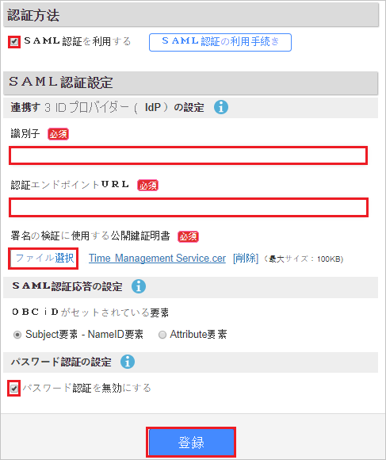
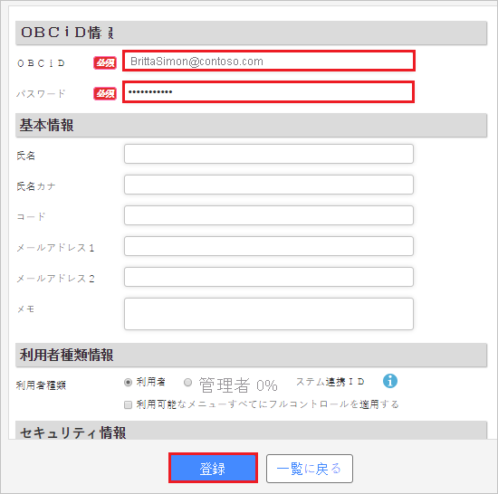

# チュートリアル: Azure Active Directory と Attendance Management Services の統合

このチュートリアルでは、Attendance Management Services と Azure Active Directory (Azure AD) を統合する方法について説明します。 Azure AD と Attendance Management Services を統合すると、次のことができます。

* Attendance Management Services にアクセスできるユーザーを Azure AD で制御できます。
* ユーザーが自分の Azure AD アカウントを使用して Attendance Management Services に自動的にサインインできるように設定できます。
* 1 つの中央サイト (Azure Portal) で自分のアカウントを管理します。

## 前提条件

Attendance Management Services と Azure AD の統合を構成するには、次のものが必要です。

* Azure AD サブスクリプション。 Azure AD の環境がない場合は、[無料アカウント](https://azure.microsoft.com/free/)を取得できます。
* Attendance Management Services でのシングル サインオンが有効なサブスクリプション。

## シナリオの説明

このチュートリアルでは、テスト環境で Azure AD のシングル サインオンを構成してテストします。

* Attendance Management Services では、**SP** Initiated SSO がサポートされます。

## ギャラリーからの Attendance Management Services の追加

Azure AD への Attendance Management Services の統合を構成するには、ギャラリーから管理対象 SaaS アプリの一覧に Attendance Management Services を追加する必要があります。

1. 職場または学校アカウントか、個人の Microsoft アカウントを使用して、Azure portal にサインインします。
1. 左のナビゲーション ウィンドウで **[Azure Active Directory]** サービスを選択します。
1. **[エンタープライズ アプリケーション]** に移動し、 **[すべてのアプリケーション]** を選択します。
1. 新しいアプリケーションを追加するには、 **[新しいアプリケーション]** を選択します。
1. **[ギャラリーから追加する]** セクションで、検索ボックスに **[Attendance Management Services]** と入力します。
1. 結果のパネルから **[Attendance Management Services]** を選択し、アプリを追加します。 お使いのテナントにアプリが追加されるのを数秒待機します。

## Attendance Management Services の Azure AD SSO の構成とテスト

**B.Simon** というテスト ユーザーを使用して、Attendance Management Services で Azure AD SSO を構成してテストします。 SSO が機能するためには、Azure AD ユーザーと Attendance Management Services の関連ユーザーとの間にリンク関係を確立する必要があります。

Attendance Management Services で Azure AD SSO を構成してテストするには、次の手順に従います。

1. **[Azure AD SSO の構成](#configure-azure-ad-sso)** - ユーザーがこの機能を使用できるようにします。
    1. **[Azure AD のテスト ユーザーの作成](#create-an-azure-ad-test-user)** - B.Simon で Azure AD のシングル サインオンをテストします。
    1. **[Azure AD テスト ユーザーの割り当て](#assign-the-azure-ad-test-user)** - B.Simon が Azure AD シングル サインオンを使用できるようにします。
1. **[Attendance Management Services SSO の構成](#configure-attendance-management-services-sso)** - アプリケーション側でシングル サインオン設定を構成します。
    1. **[Attendance Management Services テスト ユーザーの作成](#create-attendance-management-services-test-user)** - Attendance Management Services で B.Simon に対応するユーザーを作成し、Azure AD のこのユーザーにリンクさせます。
1. **[SSO のテスト](#test-sso)** - 構成が機能するかどうかを確認します。

## Azure AD SSO の構成

これらの手順に従って、Azure portal で Azure AD SSO を有効にします。

1. Azure portal の **Attendance Management Services** アプリケーション統合ページで、 **[管理]** セクションを探して、 **[シングル サインオン]** を選択します。
1. **[シングル サインオン方式の選択]** ページで、 **[SAML]** を選択します。
1. **[SAML によるシングル サインオンのセットアップ]** ページで、 **[基本的な SAML 構成]** の鉛筆アイコンをクリックして設定を編集します。

   

4. **[基本的な SAML 構成]** セクションで、次の手順を実行します。

    a. **[識別子 (エンティティ ID)]** ボックスに、次のパターンを使用して URL を入力します。`https://id.obc.jp/<TENANT_INFORMATION>/`

    b. **[サインオン URL]** ボックスに、次のパターンを使用して URL を入力します。`https://id.obc.jp/<TENANT_INFORMATION>/`

    > [!NOTE]
    > これらは実際の値ではありません。 これらの値を実際の識別子とサインオン URL で更新してください。 これらの値を取得するには、[Attendance Management Services クライアント サポート チーム](https://www.obcnet.jp/)に問い合わせてください。 Azure portal の **[基本的な SAML 構成]** セクションに示されているパターンを参照することもできます。

5. **[SAML でシングル サインオンをセットアップします]** ページの **[SAML 署名証明書]** セクションで、 **[ダウンロード]** をクリックして要件のとおりに指定したオプションからの **証明書 (Base64)** をダウンロードして、お使いのコンピューターに保存します。

    

6. **[Attendance Management Services のセットアップ]** セクションで、要件に従って適切な URL をコピーします。

    

### Azure AD のテスト ユーザーの作成

このセクションでは、Azure portal 内で B.Simon というテスト ユーザーを作成します。

1. Azure portal の左側のウィンドウから、 **[Azure Active Directory]** 、 **[ユーザー]** 、 **[すべてのユーザー]** の順に選択します。
1. 画面の上部にある **[新しいユーザー]** を選択します。
1. **[ユーザー]** プロパティで、以下の手順を実行します。
   1. **[名前]** フィールドに「`B.Simon`」と入力します。  
   1. **[ユーザー名]** フィールドに「username@companydomain.extension」と入力します。 たとえば、「 `B.Simon@contoso.com` 」のように入力します。
   1. **[パスワードを表示]** チェック ボックスをオンにし、 **[パスワード]** ボックスに表示された値を書き留めます。
   1. **Create** をクリックしてください。

### Azure AD テスト ユーザーの割り当て

このセクションでは、B.Simon に Attendance Management Services へのアクセスを許可することで、このユーザーが Azure シングル サインオンを使用できるようにします。

1. Azure portal で **[エンタープライズ アプリケーション]** を選択し、 **[すべてのアプリケーション]** を選択します。
1. アプリケーションの一覧で、 **[Attendance Management Services]** を選択します。
1. アプリの概要ページで、 **[管理]** セクションを見つけて、 **[ユーザーとグループ]** を選択します。
1. **[ユーザーの追加]** を選択し、 **[割り当ての追加]** ダイアログで **[ユーザーとグループ]** を選択します。
1. **[ユーザーとグループ]** ダイアログの [ユーザー] の一覧から **[B.Simon]** を選択し、画面の下部にある **[選択]** ボタンをクリックします。
1. ユーザーにロールが割り当てられることが想定される場合は、 **[ロールの選択]** ドロップダウンからそれを選択できます。 このアプリに対してロールが設定されていない場合は、[既定のアクセス] ロールが選択されていることを確認します。
1. **[割り当ての追加]** ダイアログで、 **[割り当て]** をクリックします。

## Attendance Management Services SSO の構成

1. 別の Web ブラウザーのウィンドウで、管理者として Attendance Management Services 企業サイトにサインオンします。

1. **[セキュリティ管理] セクション** の **[SAML 認証]** をクリックします。

    ![このスクリーンショットは、非ラテン文字が使用されたページで [SAML 認証] が選択されている状態を示しています。](./media/attendancemanagementservices-tutorial/security.png)

1. 次の手順に従います。

    

    a. **[SAML 認証を利用する]** を選択します。

    b. **[Identifier]\(識別子\)** ボックスに、Azure portal からコピーした **Azure AD 識別子** の値を貼り付けます。

    c. **[Authentication endpoint URL]\(認証エンドポイント URL\)** ボックスに、Azure portal からコピーした **ログイン URL** の値を貼り付けます。

    d. **[ファイル選択]** ボタンをクリックして、Azure AD からダウンロードした証明書をアップロードします。

    e. **[パスワード認証を無効する]** を選択します。

    f. **[登録]** をクリックします。

### Attendance Management Services テスト ユーザーの作成

Azure AD ユーザーが Attendance Management Services にサインインできるようにするには、ユーザーが Attendance Management Services にプロビジョニングされる必要があります。 Attendance Management Services の場合、プロビジョニングは手動のタスクです。

**ユーザー アカウントをプロビジョニングするには、次の手順に従います。**

1. 管理者として Attendance Management Services 企業サイトにサインインします。

1. **[セキュリティ管理] セクション** の **[利用者管理]** をクリックします。

    ![このスクリーンショットは、非ラテン文字が使用されたページで [利用者管理] が選択されている状態を示しています。](./media/attendancemanagementservices-tutorial/user.png)

1. **[新規登録]** をクリックします。

    

1. **[OBCiD 情報]** セクションで、次の手順を実行します。

    

    a. **[OBCiD]** ボックスに、ユーザーのメール アドレスを入力します (例: `BrittaSimon@contoso.com`)。

    b. **[Password]\(パスワード\)** ボックスに、ユーザーのパスワードを入力します。

    c. **[登録]** をクリックします

## SSO のテスト

このセクションでは、次のオプションを使用して Azure AD のシングル サインオン構成をテストします。 

* Azure portal で **[このアプリケーションをテストします]** をクリックします。 これにより、ログイン フローを開始できる Attendance Management Services のサインオン URL にリダイレクトされます。 

* Attendance Management Services のサインオン URL に直接移動し、そこからログイン フローを開始します。

* Microsoft マイ アプリを使用することができます。 マイ アプリで [Attendance Management Services] タイルをクリックすると、Attendance Management Services のサインオン URL にリダイレクトされます。 マイ アプリの詳細については、[マイ アプリの概要](../user-help/my-apps-portal-end-user-access.md)に関するページを参照してください。

## 次のステップ

Attendance Management Services を構成したら、組織の機密データを流出と侵入からリアルタイムで保護するセッション制御を適用することができます。 セッション制御は、条件付きアクセスを拡張したものです。 [Microsoft Cloud App Security でセッション制御を強制する方法](/cloud-app-security/proxy-deployment-aad)をご覧ください。
