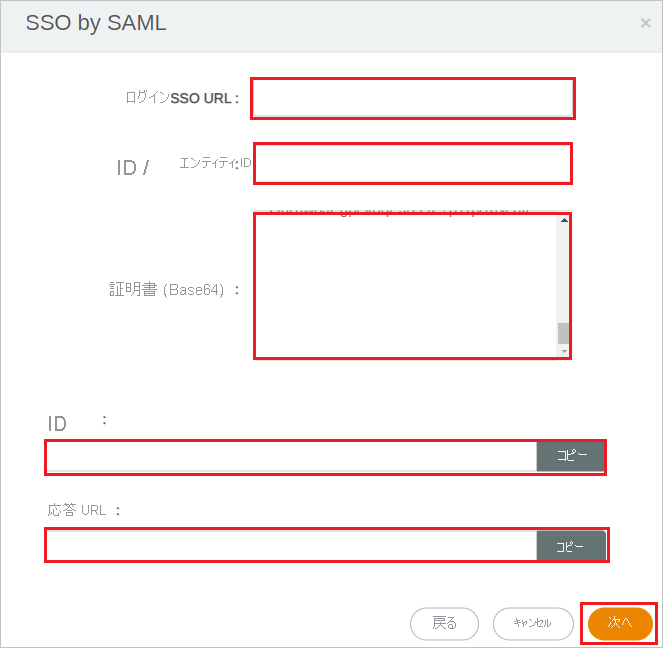

# チュートリアル: Azure AD SSO と BenQ IAM の統合

このチュートリアルでは、BenQ IAM と Azure Active Directory (Azure AD) を統合する方法について説明します。 Azure AD と BenQ IAM を統合すると、次のことができます。

* BenQ IAM にアクセスできるユーザーを Azure AD で制御します。
* ユーザーが自分の Azure AD アカウントを使用して BenQ IAM に自動的にサインインできるようにします。
* 1 つの中央サイト (Azure Portal) で自分のアカウントを管理します。

## 前提条件

開始するには、次が必要です。

* Azure AD サブスクリプション。 サブスクリプションがない場合は、[無料アカウント](https://azure.microsoft.com/free/)を取得できます。
* BenQ IAM でのシングル サインオン (SSO) が有効なサブスクリプション。

## シナリオの説明

このチュートリアルでは、テスト環境で Azure AD の SSO を構成してテストします。

* BenQ IAM では、**SP Initiated SSO と IDP Initiated SSO** がサポートされます。

## ギャラリーから BenQ IAM を追加する

Azure AD への BenQ IAM の統合を構成するには、ギャラリーからマネージド SaaS アプリの一覧に BenQ IAM を追加する必要があります。

1. 職場または学校アカウントか、個人の Microsoft アカウントを使用して、Azure portal にサインインします。
1. 左のナビゲーション ウィンドウで **[Azure Active Directory]** サービスを選択します。
1. **[エンタープライズ アプリケーション]** に移動し、 **[すべてのアプリケーション]** を選択します。
1. 新しいアプリケーションを追加するには、 **[新しいアプリケーション]** を選択します。
1. **[ギャラリーから追加する]** セクションで、検索ボックスに「**BenQ IAM**」と入力します。
1. 結果パネルから **[BenQ IAM]** を選択し、アプリを追加します。 お使いのテナントにアプリが追加されるのを数秒待機します。

## BenQ IAM の Azure AD SSO の構成とテスト

**B.Simon** というテスト ユーザーを使用して、BenQ IAM に対する Azure AD SSO を構成してテストします。 SSO を機能させるためには、Azure AD ユーザーと BenQ IAM の関連ユーザーとの間にリンク関係を確立する必要があります。

BenQ IAM に対して Azure AD SSO を構成してテストするには、次の手順を実行します。

1. **[Azure AD SSO の構成](#configure-azure-ad-sso)** - ユーザーがこの機能を使用できるようにします。
    1. **[Azure AD のテスト ユーザーの作成](#create-an-azure-ad-test-user)** - B.Simon で Azure AD のシングル サインオンをテストします。
    1. **[Azure AD テスト ユーザーの割り当て](#assign-the-azure-ad-test-user)** - B.Simon が Azure AD シングル サインオンを使用できるようにします。
1. **[BenQ IAM の SSO の構成](#configure-benq-iam-sso)** - アプリケーション側でシングル サインオン設定を構成します。
    1. **[BenQ IAM のテスト ユーザーの作成](#create-benq-iam-test-user)** - BenQ IAM で B.Simon に対応するユーザーを作成し、Azure AD の B.Simon にリンクさせます。
1. **[SSO のテスト](#test-sso)** - 構成が機能するかどうかを確認します。

## Azure AD SSO の構成

これらの手順に従って、Azure portal で Azure AD SSO を有効にします。

1. Azure portal の **BenQ IAM** アプリケーション統合ページで、 **[管理]** セクションを探して、 **[シングル サインオン]** を選択します。
1. **[シングル サインオン方式の選択]** ページで、 **[SAML]** を選択します。
1. **[SAML によるシングル サインオンのセットアップ]** ページで、 **[基本的な SAML 構成]** の鉛筆アイコンをクリックして設定を編集します。

   

1. **[基本的な SAML 構成]** セクションで、アプリケーションを **IDP** 開始モードで構成する場合は、次の手順を実行します。

    a. **[識別子]** ボックスに、`https://service-portal.benq.com/saml/init/<ID>` の形式で URL を入力します。

    b. **[応答 URL]** ボックスに、`https://service-portal.benq.com/saml/consume/<ID>` のパターンを使用して URL を入力します

1. アプリケーションを **SP** 開始モードで構成する場合は、 **[追加の URL を設定します]** をクリックして次の手順を実行します。

    **[サインオン URL]** テキスト ボックスに、URL として「`https://service-portal.benq.com/login`」と入力します。

    > [!NOTE]
    > これらは実際の値ではありません。 実際の識別子と応答 URL でこれらの値を更新します。 これらの値を取得するには、[BenQ IAM クライアント サポート チーム](mailto:benqcare.us@benq.com)にお問い合わせください。 Azure portal の **[基本的な SAML 構成]** セクションに示されているパターンを参照することもできます。

1. BenQ IAM アプリケーションは、特定の形式の SAML アサーションを使用するため、カスタム属性のマッピングを SAML トークンの属性の構成に追加する必要があります。 次のスクリーンショットには、既定の属性一覧が示されています。

    

1. その他に、BenQ IAM アプリケーションでは、いくつかの属性が SAML 応答で返されることが想定されています。それらを次に示します。 これらの属性も値が事前に設定されますが、要件に従ってそれらの値を確認することができます。
    
    | 名前 | ソース属性 |
    | ------| --------- |
    | displayName | user.displayname |
    | externalId | user.objectid |

1. **[SAML でシングル サインオンをセットアップします]** ページの **[SAML 署名証明書]** セクションで、 **[証明書 (Base64)]** を見つけて、 **[ダウンロード]** を選択し、証明書をダウンロードして、お使いのコンピューターに保存します。

    

1. **[BenQ IAM のセットアップ]** セクションで、要件に基づいて適切な URL をコピーします。

    

### Azure AD のテスト ユーザーの作成

このセクションでは、Azure portal 内で B.Simon というテスト ユーザーを作成します。

1. Azure portal の左側のウィンドウから、 **[Azure Active Directory]** 、 **[ユーザー]** 、 **[すべてのユーザー]** の順に選択します。
1. 画面の上部にある **[新しいユーザー]** を選択します。
1. **[ユーザー]** プロパティで、以下の手順を実行します。
   1. **[名前]** フィールドに「`B.Simon`」と入力します。  
   1. **[ユーザー名]** フィールドに「username@companydomain.extension」と入力します。 たとえば、「 `B.Simon@contoso.com` 」のように入力します。
   1. **[パスワードを表示]** チェック ボックスをオンにし、 **[パスワード]** ボックスに表示された値を書き留めます。
   1. **Create** をクリックしてください。

### Azure AD テスト ユーザーの割り当て

このセクションでは、B.Simon に BenQ IAM へのアクセスを許可することで、Azure シングル サインオンを使用できるようにします。

1. Azure portal で **[エンタープライズ アプリケーション]** を選択し、 **[すべてのアプリケーション]** を選択します。
1. アプリケーションの一覧で **[BenQ IAM]** を選択します。
1. アプリの概要ページで、 **[管理]** セクションを見つけて、 **[ユーザーとグループ]** を選択します。
1. **[ユーザーの追加]** を選択し、 **[割り当ての追加]** ダイアログで **[ユーザーとグループ]** を選択します。
1. **[ユーザーとグループ]** ダイアログの [ユーザー] の一覧から **[B.Simon]** を選択し、画面の下部にある **[選択]** ボタンをクリックします。
1. ユーザーにロールが割り当てられることが想定される場合は、 **[ロールの選択]** ドロップダウンからそれを選択できます。 このアプリに対してロールが設定されていない場合は、[既定のアクセス] ロールが選択されていることを確認します。
1. **[割り当ての追加]** ダイアログで、 **[割り当て]** をクリックします。

## BenQ IAM の SSO の構成

1. BenQ 管理者アカウントで BenQ IAM にログインし、[アカウント管理] セクションで **[SSO 設定]** をクリックします。

    ![[SSO 設定] のスクリーンショット](./media/benq-iam-tutorial/sso-setting.png)

1. ポップアップで SSO 設定として **[SSO by SAML]\(SAML による SSO\)** を選択し、 **[次へ]** をクリックします。

    

1. **[SSO 設定]** ページで次の手順を実行します。

    

    a. **[ログイン/SSO URL]** テキスト ボックスに、Azure portal からコピーした **ログイン URL** の値を貼り付けます。

    b. **[Identifier/Entity ID]\(識別子/エンティティ ID\)** テキストボックスに、Azure portal からコピーした **ID** の値を貼り付けます。

    c. Azure portal からダウンロードした **証明書 (Base64)** をメモ帳で開き、その内容を **[証明書 (Base64)]** テキスト ボックスに貼り付けます。

    d. **[Identifier]\(識別子\)** の値をコピーし、Azure portal の **[基本的な SAML 構成]** セクションの **[識別子]** テキスト ボックスに貼り付けます。

    e. **[Reply URL]\(応答 URL\)** の値をコピーし、Azure portal の **[基本的な SAML 構成]** セクションの **[応答 URL]** テキスト ボックスにこの値を貼り付けます。

    f. **[次へ]** をクリックします。

### BenQ IAM のテスト ユーザーの作成

このセクションでは、BenQ IAM で Britta Simon というユーザーを作成します。 [BenQ IAM サポート チーム](mailto:benqcare.us@benq.com)と連携して、BenQ IAM プラットフォームにユーザーを追加してください。 シングル サインオンを使用する前に、ユーザーを作成し、有効化する必要があります。

## SSO のテスト

このセクションでは、次のオプションを使用して Azure AD のシングル サインオン構成をテストします。 

#### SP Initiated:

* Azure portal で **[このアプリケーションをテストします]** をクリックします。 これにより、ログイン フローを開始できる BenQ IAM のサインオン URL にリダイレクトされます。  

* BenQ IAM のサインオン URL に直接移動し、そこからログイン フローを開始します。

#### IDP Initiated:

* Azure portal で **[このアプリケーションをテストします]** をクリックすると、SSO を設定した BenQ IAM に自動的にサインインされます。 

また、Microsoft マイ アプリを使用して、任意のモードでアプリケーションをテストすることもできます。 マイ アプリで [BenQ IAM] タイルをクリックすると、SP モードで構成されている場合は、ログイン フローを開始するためのアプリケーション サインオン ページにリダイレクトされます。IDP モードで構成されている場合は、SSO を設定した BenQ IAM に自動的にサインインされます。 マイ アプリの詳細については、[マイ アプリの概要](https://support.microsoft.com/account-billing/sign-in-and-start-apps-from-the-my-apps-portal-2f3b1bae-0e5a-4a86-a33e-876fbd2a4510)に関するページを参照してください。

## 次のステップ

BenQ IAM を構成したら、組織の機密データを流出と侵入からリアルタイムで保護するセッション制御を適用できます。 セッション制御は、条件付きアクセスを拡張したものです。 [Microsoft Cloud App Security でセッション制御を強制する方法](/cloud-app-security/proxy-deployment-aad)をご覧ください。
