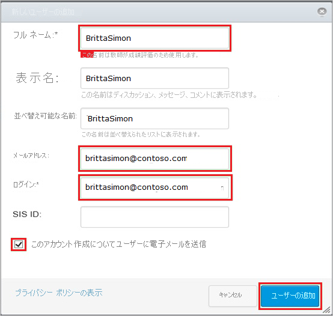

# チュートリアル: Azure AD SSO と Canvas の統合

このチュートリアルでは、Canvas と Azure Active Directory (Azure AD) を統合する方法について説明します。 Azure AD と Canvas を統合すると、次のことができます。

* Canvas にアクセスできるユーザーを Azure AD で制御する。
* ユーザーが自分の Azure AD アカウントを使用して Canvas に自動的にサインインできるように設定する。
* 1 つの中央サイト (Azure Portal) で自分のアカウントを管理します。

## 前提条件

開始するには、次が必要です。
 
* Azure AD サブスクリプション。 サブスクリプションがない場合は、[無料アカウント](https://azure.microsoft.com/free/)を取得できます。
* Canvas でのシングル サインオン (SSO) が有効なサブスクリプション。

## シナリオの説明

このチュートリアルでは、テスト環境で Azure AD のシングル サインオンを構成してテストします。

* Canvas では、**SP** Initiated SSO がサポートされます。

## ギャラリーからの Canvas の追加

Canvas の Azure AD への統合を構成するには、Canvas をギャラリーから管理対象 SaaS アプリの一覧に追加する必要があります。

1. 職場または学校アカウントか、個人の Microsoft アカウントを使用して、Azure portal にサインインします。
1. 左のナビゲーション ウィンドウで **[Azure Active Directory]** サービスを選択します。
1. **[エンタープライズ アプリケーション]** に移動し、 **[すべてのアプリケーション]** を選択します。
1. 新しいアプリケーションを追加するには、 **[新しいアプリケーション]** を選択します。
1. **[ギャラリーから追加する]** セクションで、検索ボックスに「**Canvas**」と入力します。
1. 結果のパネルから **[Canvas]** を選択し、アプリを追加します。 お使いのテナントにアプリが追加されるのを数秒待機します。

## Canvas の Azure AD SSO の構成とテスト

**B.Simon** というテスト ユーザーを使用して、Canvas に対する Azure AD SSO を構成してテストします。 SSO を機能させるために、Azure AD ユーザーと Canvas の関連ユーザーとの間にリンク関係を確立する必要があります。

Canvas に対する Azure AD SSO を構成してテストするには、次の手順を行います。

1. **[Azure AD SSO の構成](#configure-azure-ad-sso)** - ユーザーがこの機能を使用できるようにします。
    1. **[Azure AD のテスト ユーザーの作成](#create-an-azure-ad-test-user)** - B.Simon で Azure AD のシングル サインオンをテストします。
    1. **[Azure AD テスト ユーザーの割り当て](#assign-the-azure-ad-test-user)** - B.Simon が Azure AD シングル サインオンを使用できるようにします。
1. **[Canvas SSO の構成](#configure-canvas-sso)** - アプリケーション側でシングル サインオン設定を構成します。
    1. **[Canvas のテスト ユーザーの作成](#create-canvas-test-user)** - Canvas で B.Simon に対応するユーザーを作成し、Azure AD の B.Simon にリンクさせます。
1. **[SSO のテスト](#test-sso)** - 構成が機能するかどうかを確認します。

## Azure AD SSO の構成

これらの手順に従って、Azure portal で Azure AD SSO を有効にします。

1. Azure portal の **Canvas** アプリケーション統合ページで、 **[管理]** セクションを見つけて、 **[シングル サインオン]** を選択します。
1. **[シングル サインオン方式の選択]** ページで、 **[SAML]** を選択します。
1. **[SAML によるシングル サインオンのセットアップ]** ページで、 **[基本的な SAML 構成]** の鉛筆アイコンをクリックして設定を編集します。

   

4. **[基本的な SAML 構成]** セクションで、次の手順を実行します。

    b. **[サインオン URL]** ボックスに、次のパターンを使用して URL を入力します。`https://<tenant-name>.instructure.com`

    a. **[識別子 (エンティティ ID)]** ボックスに、次のパターンを使用して URL を入力します。`https://<tenant-name>.instructure.com/saml2`

    > [!NOTE]
    > これらは実際の値ではありません。 これらの値を実際の識別子とサインオン URL で更新してください。 これらの値を取得するには、[Canvas クライアント サポート チーム](https://community.canvaslms.com/community/help)に問い合わせてください。 Azure portal の **[基本的な SAML 構成]** セクションに示されているパターンを参照することもできます。

5. **[SAML 署名証明書]** セクションで **[編集]** ボタンをクリックして、 **[SAML 署名証明書]** ダイアログを開きます。

    

6. **[SAML 署名証明書]** セクションで **[THUMBPRINT]\(拇印\)** をコピーし、お使いのコンピューターに保存します。

    ![[Thumbprint]\(拇印\) の値をコピーする](common/copy-thumbprint.png)

7. **[Canvas のセットアップ]** セクションで、要件に従って適切な URL をコピーします。

    

### Azure AD のテスト ユーザーの作成

このセクションでは、Azure portal 内で B.Simon というテスト ユーザーを作成します。

1. Azure portal の左側のウィンドウから、 **[Azure Active Directory]** 、 **[ユーザー]** 、 **[すべてのユーザー]** の順に選択します。
1. 画面の上部にある **[新しいユーザー]** を選択します。
1. **[ユーザー]** プロパティで、以下の手順を実行します。
   1. **[名前]** フィールドに「`B.Simon`」と入力します。  
   1. **[ユーザー名]** フィールドに「username@companydomain.extension」と入力します。 たとえば、「 `B.Simon@contoso.com` 」のように入力します。
   1. **[パスワードを表示]** チェック ボックスをオンにし、 **[パスワード]** ボックスに表示された値を書き留めます。
   1. **Create** をクリックしてください。

### Azure AD テスト ユーザーの割り当て

このセクションでは、B.Simon に Canvas へのアクセスを許可することで、このユーザーが Azure シングル サインオンを使用できるようにします。

1. Azure portal で **[エンタープライズ アプリケーション]** を選択し、 **[すべてのアプリケーション]** を選択します。
1. アプリケーションの一覧で、 **[Canvas]** を選択します。
1. アプリの概要ページで、 **[管理]** セクションを見つけて、 **[ユーザーとグループ]** を選択します。
1. **[ユーザーの追加]** を選択し、 **[割り当ての追加]** ダイアログで **[ユーザーとグループ]** を選択します。
1. **[ユーザーとグループ]** ダイアログの [ユーザー] の一覧から **[B.Simon]** を選択し、画面の下部にある **[選択]** ボタンをクリックします。
1. ユーザーにロールが割り当てられることが想定される場合は、 **[ロールの選択]** ドロップダウンからそれを選択できます。 このアプリに対してロールが設定されていない場合は、[既定のアクセス] ロールが選択されていることを確認します。
1. **[割り当ての追加]** ダイアログで、 **[割り当て]** をクリックします。

## Canvas の SSO の構成

1. 別の Web ブラウザー ウィンドウで、Canvas 企業サイトに管理者としてログインします。

2. **[コース] \> [管理アカウント] \> [Microsoft]** の順にクリックします。

    

3. 左側のナビゲーション ウィンドウで **[認証]** を選択し、 **[新しい SAML 構成を追加]** をクリックします。

    

4. [現在の統合] ページで、次の手順を実行します。

    

    a. **[IdP Entity ID]\(IdP エンティティ ID\)** ボックスに、Azure portal からコピーした **Azure AD ID** の値を貼り付けます。

    b. **[Log On URL]\(ログオン URL\)** ボックスに、Azure portal からコピーした **[ログイン URL]** の値を貼り付けます。

    c. **[Log Out URL]\(ログアウト URL\)** ボックスに、Azure portal からコピーした **[ログアウト URL]** の値を貼り付けます。

    d. **[Change Password Link] \(パスワードの変更リンク)** テキスト ボックスに、Azure Portal からコピーした **パスワードの変更 URL** の値を貼り付けます。

    e. **[Certificate Fingerprint] \(証明書のフィンガープリント)** テキスト ボックスに、Azure Portal からコピーした証明書の **THUMBPRINT** 値を貼り付けます。

    f. **[ログイン属性]** の一覧で、 **[NameID]** を選択します。

    g. **[識別子の形式]** の一覧で、 **[emailAddress]** を選択します。

    h. **[認証設定の保存]** をクリックします。

### Canvas のテスト ユーザーの作成

Azure AD ユーザーが Canvas にログインできるようにするには、そのユーザーを Canvas にプロビジョニングする必要があります。 Canvas の場合、ユーザー プロビジョニングは手動のタスクです。

**ユーザー アカウントをプロビジョニングするには、次の手順に従います。**

1. **Canvas** テナントにログインします。

2. **[コース] \> [管理アカウント] \> [Microsoft]** の順にクリックします。

   

3. **[ユーザー]** をクリックします。

   ![スクリーンショットは、[ユーザー] が選択されている [Canvas] メニューを示しています。](./media/canvas-lms-tutorial/user.png "ユーザー")

4. **[新しいユーザーの追加]** をクリックします。

   ![スクリーンショットは、[新しいユーザーの追加] ボタンを示しています。](./media/canvas-lms-tutorial/add-user.png "ユーザー")

5. [新しいユーザーの追加] ダイアログ ページで、次の手順を実行します。

   

   a. **[Full Name] \(フルネーム)** テキスト ボックスに、ユーザーの名前 (**BrittaSimon** など) を入力します。

   b. **[Email]\(電子メール\)** テキスト ボックスに、ユーザーのメール アドレス (**brittasimon\@contoso.com** など) を入力します。

   c. **[Login]\(ログイン\)** テキスト ボックスに、ユーザーの Azure AD 電子メール アドレス (**brittasimon\@contoso.com** など) を入力します。

   d. **[このアカウント作成についてユーザーに電子メールを送信]** を選択します。

   e. **[ユーザーの追加]** をクリックします。

> [!NOTE]
> 他の Canvas ユーザー アカウント作成ツールや、Canvas から提供されている API を使用して、Azure AD ユーザー アカウントをプロビジョニングできます。

## SSO のテスト

このセクションでは、次のオプションを使用して Azure AD のシングル サインオン構成をテストします。 

* Azure portal で **[このアプリケーションをテストします]** をクリックします。 これにより、ログイン フローを開始できる Canvas のサインオン URL にリダイレクトされます。 

* Canvas のサインオン URL に直接移動し、そこからログイン フローを開始します。

* Microsoft マイ アプリを使用することができます。 マイ アプリで [Canvas] タイルをクリックすると、SSO を設定した Canvas に自動的にサインインします。 マイ アプリの詳細については、[マイ アプリの概要](https://support.microsoft.com/account-billing/sign-in-and-start-apps-from-the-my-apps-portal-2f3b1bae-0e5a-4a86-a33e-876fbd2a4510)に関するページを参照してください。

## 次のステップ

Canvas を構成すると、組織の機密データを流出と侵入からリアルタイムで保護するセッション制御を適用することができます。 セッション制御は、条件付きアクセスを拡張したものです。 [Microsoft Cloud App Security でセッション制御を強制する方法](/cloud-app-security/proxy-deployment-any-app)をご覧ください。