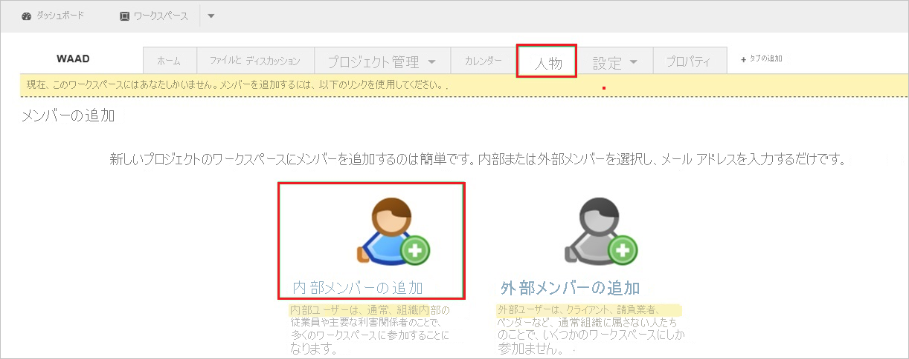

# チュートリアル: Azure Active Directory と Central Desktop の統合

このチュートリアルでは、Central Desktop と Azure Active Directory (Azure AD) を統合する方法について説明します。 Central Desktop と Azure AD を統合すると、次のことができます。

* Central Desktop にアクセスするユーザーを Azure AD で管理します。
* ユーザーが自分の Azure AD アカウントを使用して Central Desktop に自動的にサインインできるように設定します。
* 1 つの中央サイト (Azure Portal) で自分のアカウントを管理します。

## 前提条件

開始するには、次が必要です。

* Azure AD サブスクリプション。 サブスクリプションがない場合は、[無料アカウント](https://azure.microsoft.com/free/)を取得できます。
* Central Desktop でのシングル サインオン (SSO) が有効なサブスクリプション。

## シナリオの説明

このチュートリアルでは、テスト環境で Azure AD のシングル サインオンを構成してテストします。

* Central Desktop では、**SP** Initiated SSO がサポートされます。

## ギャラリーから Central Desktop を追加する

Azure AD への Central Desktop の統合を構成するには、ギャラリーから管理対象 SaaS アプリの一覧に Central Desktop を追加する必要があります。

1. 職場または学校アカウントか、個人の Microsoft アカウントを使用して、Azure portal にサインインします。
1. 左のナビゲーション ウィンドウで **[Azure Active Directory]** サービスを選択します。
1. **[エンタープライズ アプリケーション]** に移動し、 **[すべてのアプリケーション]** を選択します。
1. 新しいアプリケーションを追加するには、 **[新しいアプリケーション]** を選択します。
1. **[ギャラリーから追加する]** セクションで、検索ボックスに「**Central Desktop**」と入力します。
1. 結果パネルで **[Central Desktop]** を選択し、アプリを追加します。 お使いのテナントにアプリが追加されるのを数秒待機します。

## Central Desktop のための Azure AD SSO の構成とテスト

**B.Simon** というテスト ユーザーを使用して、Central Desktop 用に Azure AD SSO を構成してテストします。 SSO が機能するために、Azure AD ユーザーと Central Desktop の関連ユーザーとの間にリンク関係を確立する必要があります。

Central Desktop 用に Azure AD SSO を構成してテストするには、次の手順を行います。

1. **[Azure AD SSO の構成](#configure-azure-ad-sso)** - ユーザーがこの機能を使用できるようにします。
    1. **[Azure AD のテスト ユーザーの作成](#create-an-azure-ad-test-user)** - B.Simon で Azure AD のシングル サインオンをテストします。
    1. **[Azure AD テスト ユーザーの割り当て](#assign-the-azure-ad-test-user)** - B.Simon が Azure AD シングル サインオンを使用できるようにします。
1. **[Central Desktop の SSO の構成](#configure-central-desktop-sso)** - アプリケーション側でシングル サインオン設定を構成します。
    1. **[Central Desktop のテスト ユーザーの作成](#create-central-desktop-test-user)** - Central Desktop で B.Simon に対応するユーザーを作成し、Azure AD のこのユーザーにリンクさせます。
1. **[SSO のテスト](#test-sso)** - 構成が機能するかどうかを確認します。

## Azure AD SSO の構成

これらの手順に従って、Azure portal で Azure AD SSO を有効にします。

1. Azure portal の **Central Desktop** アプリケーション統合ページで、 **[管理]** セクションを見つけて、 **[シングル サインオン]** を選択します。
1. **[シングル サインオン方式の選択]** ページで、 **[SAML]** を選択します。
1. **[SAML によるシングル サインオンのセットアップ]** ページで、 **[基本的な SAML 構成]** の鉛筆アイコンをクリックして設定を編集します。

   

4. **[基本的な SAML 構成]** セクションで、次の手順を実行します。

    a. **[識別子]** ボックスに、次のいずれかのパターンを使用して URL を入力します。

    | **Identifier** |
    |-------|
    | `https://<companyname>.centraldesktop.com/saml2-metadata.php` |
    | `https://<companyname>.imeetcentral.com/saml2-metadata.php` |

    b. **[応答 URL]** ボックスに、`https://<companyname>.centraldesktop.com/saml2-assertion.php` のパターンを使用して URL を入力します

    c. **[サインオン URL]** ボックスに、`https://<companyname>.centraldesktop.com` という形式で URL を入力します。

    > [!NOTE]
    > これらは実際の値ではありません。 実際の識別子、応答 URL、サインオン URL でこれらの値を更新します。 これらの値を取得するには、[Central Desktop クライアント サポート チーム](https://imeetcentral.com/contact-us)に問い合わせてください。 Azure portal の **[基本的な SAML 構成]** セクションに示されているパターンを参照することもできます。

5. **[SAML でシングル サインオンをセットアップします]** ページの **[SAML 署名証明書]** セクションで、 **[ダウンロード]** をクリックして要件のとおりに指定したオプションからの **証明書 (未加工)** をダウンロードして、お使いのコンピューターに保存します。

    

6. **[Central Desktop のセットアップ]** セクションで、要件に従って適切な URL をコピーします。

    

### Azure AD のテスト ユーザーの作成

このセクションでは、Azure portal 内で B.Simon というテスト ユーザーを作成します。

1. Azure portal の左側のウィンドウから、 **[Azure Active Directory]** 、 **[ユーザー]** 、 **[すべてのユーザー]** の順に選択します。
1. 画面の上部にある **[新しいユーザー]** を選択します。
1. **[ユーザー]** プロパティで、以下の手順を実行します。
   1. **[名前]** フィールドに「`B.Simon`」と入力します。  
   1. **[ユーザー名]** フィールドに「username@companydomain.extension」と入力します。 たとえば、「 `B.Simon@contoso.com` 」のように入力します。
   1. **[パスワードを表示]** チェック ボックスをオンにし、 **[パスワード]** ボックスに表示された値を書き留めます。
   1. **Create** をクリックしてください。

### Azure AD テスト ユーザーの割り当て

このセクションでは、B.Simon に Central Desktop へのアクセスを許可することで、このユーザーが Azure シングル サインオンを使用できるようにします。

1. Azure portal で **[エンタープライズ アプリケーション]** を選択し、 **[すべてのアプリケーション]** を選択します。
1. アプリケーションの一覧で **[Central Desktop]** を選択します。
1. アプリの概要ページで、 **[管理]** セクションを見つけて、 **[ユーザーとグループ]** を選択します。
1. **[ユーザーの追加]** を選択し、 **[割り当ての追加]** ダイアログで **[ユーザーとグループ]** を選択します。
1. **[ユーザーとグループ]** ダイアログの [ユーザー] の一覧から **[B.Simon]** を選択し、画面の下部にある **[選択]** ボタンをクリックします。
1. ユーザーにロールが割り当てられることが想定される場合は、 **[ロールの選択]** ドロップダウンからそれを選択できます。 このアプリに対してロールが設定されていない場合は、[既定のアクセス] ロールが選択されていることを確認します。
1. **[割り当ての追加]** ダイアログで、 **[割り当て]** をクリックします。

## Central Desktop の SSO の構成

1. **Central Desktop** テナントにサインインします。

2. **[設定]** に移動します。 **[Advanced]\(詳細\)** を選び、**[Single Sign On]\(シングル サインオン\)** を選びます。

    

3. **[Single Sign On Settings]** ページで、以下の手順を実行します。

    

    a. **[Enable SAML v2 Single Sign On]** を選択します。

    b. **[SSO URL]** ボックスに、Azure portal からコピーした **[Azure AD 識別子]** の値を貼り付けます。

    c. **[SSO Login URL]\(SSO ログイン URL\)** ボックスに、Azure portal からコピーした **[ログイン URL]** の値を貼り付けます。

    d. **[SSO Logout URL]\(SSO ログアウト URL\)** ボックスに、Azure portal からコピーした **[ログアウト URL]** の値を貼り付けます。

4. **[Message Signature Verification Method]** セクションで、次の手順を実行します。

    ![[Message Signature Verification Method]\(メッセージ署名検証方法\)](./media/central-desktop-tutorial/certificate.png "[Message Signature Verification Method]")

    a. **[Certificate]** を選択します。

    b. **[SSO Certificate]\(SSO 証明書\)** ボックスの一覧で、**[RSH SHA256]** を選びます。

    c. ダウンロードした証明書をメモ帳で開きます。 証明書の内容をコピーして、**[SSO Certificate]\(SSO 証明書\)** フィールドに貼り付けます。

    d. **[Display a link to your SAMLv2 login page]** を選択します。

    e. **[Update]\(更新\)** を選択します。

### Central Desktop のテスト ユーザーの作成

Azure AD ユーザーがサインインできるようにするには、ユーザーを Central Desktop アプリケーションにプロビジョニングする必要があります。 このセクションでは、Central Desktop で Azure AD ユーザー アカウントを作成する方法について説明します。

> [!NOTE]
> Azure AD ユーザー アカウントをプロビジョニングするには、Central Desktop から提供されている他の Central Desktop ユーザー アカウント作成ツールまたは API を使います。

**Central Desktop にユーザー アカウントをプロビジョニングするには:**

1. Central Desktop テナントにサインインします。

2. **[People]\(ユーザー\)** を選択し、**[Add Internal Members]\(内部メンバーの追加\)** を選択します。

    

3. **[Email Address of New Members]\(新しいメンバーの電子メール アドレス\)** ボックスにプロビジョニングする Azure AD アカウントを入力し、**[Next]\(次へ\)** を選びます。

    

4. **[Add Internal member(s)]\(内部メンバーの追加\)** を選びます。

    

   > [!NOTE]
   > 追加したユーザーが、アカウント アクティブ化のための確認リンクを含むメールを受け取ります。

## SSO のテスト

このセクションでは、次のオプションを使用して Azure AD のシングル サインオン構成をテストします。 

* Azure portal で **[このアプリケーションをテストします]** をクリックします。 これにより、ログイン フローを開始できる Central Desktop のサインオン URL にリダイレクトされます。 

* Central Desktop のサインオン URL に直接移動し、そこからログイン フローを開始します。

* Microsoft マイ アプリを使用することができます。 マイ アプリで [Central Desktop] タイルをクリックすると、Central Desktop のサインオン URL にリダイレクトされます。 マイ アプリの詳細については、[マイ アプリの概要](https://support.microsoft.com/account-billing/sign-in-and-start-apps-from-the-my-apps-portal-2f3b1bae-0e5a-4a86-a33e-876fbd2a4510)に関するページを参照してください。

## 次のステップ

Central Desktop を構成したら、組織の機密データを流出と侵入からリアルタイムで保護するセッション制御を適用することができます。 セッション制御は、条件付きアクセスを拡張したものです。 [Microsoft Cloud App Security でセッション制御を強制する方法](/cloud-app-security/proxy-deployment-aad)をご覧ください。