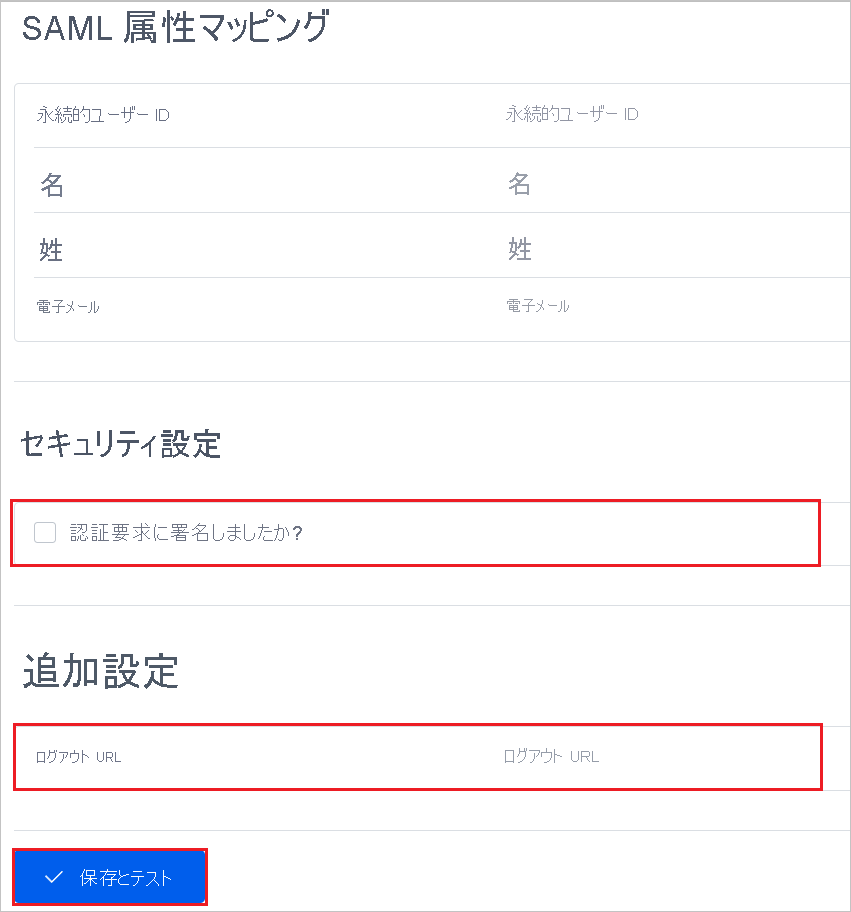

# チュートリアル:Azure Active Directory シングル サインオンと Cloud Academy - SSO の統合

このチュートリアルでは、Cloud Academy - SSO と Azure Active Directory (Azure AD) を統合する方法について説明します。 Cloud Academy - SSO と Azure AD を統合すると、次のことができます。

* Azure AD を使用して、Cloud Academy - SSO にアクセスできるユーザーを制御します。
* ユーザーが自分の Azure AD アカウントを使用して Cloud Academy - SSO に自動的にサインインするように設定できます。
* 1 つの中央サイト (Azure Portal) でアカウントを管理できます。

## 前提条件

開始するには、次が必要です。

* Azure AD サブスクリプション。 サブスクリプションがない場合は、[無料アカウント](https://azure.microsoft.com/free/)を取得できます。
* シングル サインオン (SSO) が有効な Cloud Academy - SSO サブスクリプション。

## チュートリアルの説明

このチュートリアルでは、テスト環境で Azure AD の SSO を構成してテストします。

* Cloud Academy - SSO では、**SP** によって開始される SSO がサポートされます。
* Cloud Academy - SSO では、**Just In Time** ユーザー プロビジョニングがサポートされます。
* Cloud Academy - SSO では、[自動化されたユーザー プロビジョニング](cloud-academy-sso-provisioning-tutorial.md)がサポートされます。

## ギャラリーからの Cloud Academy - SSO の追加

Azure AD への Cloud Academy - SSO の統合を構成するには、ギャラリーからマネージド SaaS アプリの一覧に Cloud Academy - SSO を追加する必要があります。

1. 職場または学校アカウントか、個人の Microsoft アカウントを使用して、Azure portal にサインインします。
1. 左ウィンドウで、 **[Azure Active Directory]** を選択します。
1. **[エンタープライズ アプリケーション]** に移動し、 **[すべてのアプリケーション]** を選択します。
1. アプリケーションを追加するには、 **[新しいアプリケーション]** を選択します。
1. **[ギャラリーから追加する]** セクションで、検索ボックスに、「**Cloud Academy - SSO**」と入力します。
1. 結果のパネルから **[Cloud Academy - SSO]** を選択し、アプリを追加します。 お使いのテナントにアプリが追加されるのを数秒待機します。

## Cloud Academy - SSO の Azure AD SSO の構成とテスト

**B.Simon** というテスト ユーザーを使用して、Cloud Academy - SSO に対する Azure AD SSO を構成してテストします。 SSO を機能させるために、Azure AD ユーザーと Cloud Academy - SSO の関連ユーザーとの間にリンク関係を確立する必要があります。

Cloud Academy - SSO で Azure AD SSO を構成してテストするには、次の大まかな手順に従います。

1. **[Azure AD SSO を構成](#configure-azure-ad-sso)** して、ユーザーがこの機能を使用できるようにします。
    1. Azure AD のシングル サインオンをテストするための **[Azure AD テスト ユーザーを作成](#create-an-azure-ad-test-user)** します。
    1. **[テスト ユーザーにアクセス権を付与](#grant-access-to-the-test-user)** して、Azure AD シングル サインオンをユーザーが使用できるようにします。
1. アプリケーション側で **[Cloud Academy - SSO のシングル サインオンを構成します](#configure-single-sign-on-for-cloud-academy)** 。
    1. Azure AD のユーザーに対応するユーザーとして、 **[Cloud Academy - SSO テスト ユーザーを作成します](#create-a-cloud-academy-test-user)** 。
1. **[SSO をテスト](#test-sso)** して、構成が正しく機能することを確認します。

## Azure AD SSO の構成

これらの手順に従って、Azure portal で Azure AD SSO を有効にします。

1. Azure portal の **Cloud Academy - SSO** アプリケーション統合ページの **[管理]** セクションで、 **[シングル サインオン]** を選択します。
1. **[シングル サインオン方式の選択]** ページで、 **[SAML]** を選択します。
1. **[SAML でシングル サインオンをセットアップします]** ページで、 **[基本的な SAML 構成]** の鉛筆ボタンを選択して設定を編集します。

   

1. **[基本的な SAML 構成]** セクションで、次の手順を実行します。

    a. **[サインオン URL]** ボックスに、次のいずれかの URL を入力します。
    
    | [サインオン URL] |
    |--------------|
    | `https://cloudacademy.com/login/enterprise/` |
    | `https://app.qa.com/login/enterprise/` |
    |
    
    b. **[応答 URL]** ボックスに、次のいずれかの URL を入力します。
    
    | [応答 URL] |
    |--------------|
    | `https://cloudacademy.com/labs/social/complete/saml/` |
    | `https://app.qa.com/labs/social/complete/saml/` |
    |
1. **[SAML でシングル サインオンを設定します]** ページの **[SAML 署名証明書]** セクションで、コピー ボタンを選択して **[アプリのフェデレーション メタデータ URL]** をコピーします。 URL を保存します。

    

### Azure AD のテスト ユーザーの作成

このセクションでは、Azure portal 内で B.Simon というテスト ユーザーを作成します。

1. Azure portal の左ペインで、 **[Azure Active Directory]** を選択します。 **[ユーザー]** を選択し、 **[すべてのユーザー]** を選択します。
1. 画面の上部にある **[新しいユーザー]** を選択します。
1. **[ユーザー]** プロパティで、次の手順を実行します。
   1. **[名前]** ボックスに「**B.Simon**」と入力します。  
   1. **[ユーザー名]** ボックスに「\<username>@\<companydomain>.\<extension>」と入力します。 たとえば、「 `B.Simon@contoso.com` 」のように入力します。
   1. **[パスワードを表示]** をオンにし、 **[パスワード]** ボックスに表示された値を書き留めます。
   1. **［作成］** を選択します

### テスト ユーザーへのアクセス権の付与

このセクションでは、B. Simon に Cloud Academy - SSO へのアクセスを許可することで、このユーザーが Azure シングル サインオンを使用できるようにします。

1. Azure portal で **[エンタープライズ アプリケーション]** を選択し、 **[すべてのアプリケーション]** を選択します。
1. アプリケーションの一覧で **[Cloud Academy - SSO]** を選択します。
1. アプリの概要ページの **[管理]** セクションで、 **[ユーザーとグループ]** を選択します。
1. **[ユーザーの追加]** を選択し、 **[割り当ての追加]** ダイアログ ボックスで **[ユーザーとグループ]** を選択します。
1. **[ユーザーとグループ]** ダイアログ ボックスで、**ユーザー** の一覧で **[B.Simon]** を選択し、画面の下部にある **[選択]** ボタンをクリックします。
1. ユーザーにロールが割り当てられることが想定される場合は、 **[ロールの選択]** ドロップダウンからそれを選択できます。 このアプリに対してロールが設定されていない場合は、[既定のアクセス] ロールが選択されていることを確認します。
1. **[割り当ての追加]** ダイアログ ボックスで **[割り当て]** を選びます。

## Cloud Academy のシングル サインオンを構成する

1. 別のブラウザー ウィンドウで、Cloud Academy - SSO 企業サイトに管理者としてサインインします。

1. ホーム ページの **[Azure Integration Team]\(Azure 統合チーム\)** アイコンをクリックしてから、左側のメニューに表示されている **[Settings]\(設定\)** を選択します。

1. **[INTEGRATIONS]\(統合\)** タブで **[SSO]** カードを選択します。

    ![[Settings & Integrations]\(設定と統合\) オプションを示すスクリーンショット。](./media/cloud-academy-sso-tutorial/integrations.png)

1. **[Start Configuring]\(構成を開始する\)** をクリックして SSO を設定します。

    ![[Integrations]\(統合\) > [SSO] ページを示すスクリーンショット。](./media/cloud-academy-sso-tutorial/start-configuring.png)

1. [General Settings]\(全般設定\) ページで以下の項目を設定します。

    

    a. **[SSO URL (Location)]\(SSO URL (場所)\)** ボックスに、Azure portal からコピーしたログイン URL の値を貼り付けます。

    c. Azure portal からダウンロードした Base64 証明書をメモ帳で開きます。 その内容を **[Certificate]\(証明書\)** ボックスに貼り付けます。

    d. **[Email Domains]\(メール ドメイン\)** ボックスに、会社のユーザー メールに使用されているすべてのドメインの値を入力します。

1. 次のページで以下の手順を実行します。

    

    a. **[SAML Attributes Mapping]\(SAML 属性マッピング\)** セクションで、必要なフィールドにソース属性値を入力します。

    b. **[Security Settings]\(セキュリティ設定\)** セクションの **[Authentication Requests Signed?]\(認証要求に署名しましたか?\)** チェック ボックスをオンにして、この値を **True** に設定します。

    c. **[Extra Settings (Optional)]\(追加設定 (省略可能)\)** セクションの **[Logout URL]\(ログアウト URL\)** ボックスに、Azure portal からコピーしたログアウト URL の値を貼り付けます。

1. **[Save and Test]\(保存してテスト\)** をクリックします。

> [!NOTE]
> Cloud Academy-SSO の構成方法の詳細については、「[Setting Up Single Sign-On](https://support.cloudacademy.com/hc/articles/360043908452-Setting-Up-Single-Sign-On)」 (シングル サインオンを設定する) を参照してください。

### Cloud Academy テスト ユーザーを作成する

このセクションでは、Britta Simon というユーザーを Cloud Academy - SSO に作成します。 Cloud Academy - SSO では、Just-In-Time ユーザー プロビジョニングがサポートされています。この設定は既定で有効になっています。 このセクションでは、ユーザー側で必要な操作はありません。 Cloud Academy - SSO にユーザーがまだ存在していない場合は、認証後に新規に作成されます。

Cloud Academy - SSO では、自動ユーザー プロビジョニングもサポートされます。自動ユーザー プロビジョニングの構成方法について詳しくは、[こちら](./cloud-academy-sso-provisioning-tutorial.md)をご覧ください。

## SSO のテスト 

このセクションでは、次のオプションを使用して Azure AD のシングル サインオン構成をテストします。 

* Azure portal で **[このアプリケーションをテストします]** をクリックします。 これにより、ログイン フローを開始できる Cloud Academy - SSO のサインオン URL にリダイレクトされます。 

* Cloud Academy - SSO のサインオン URL に直接移動し、そこからログイン フローを開始します。

* Microsoft マイ アプリを使用することができます。 マイ アプリで [Cloud Academy - SSO] タイルをクリックすると、Cloud Academy - SSO サインオン URL にリダイレクトされます。 マイ アプリの詳細については、[マイ アプリの概要](https://support.microsoft.com/account-billing/sign-in-and-start-apps-from-the-my-apps-portal-2f3b1bae-0e5a-4a86-a33e-876fbd2a4510)に関するページを参照してください。

## 次のステップ

Cloud Academy - SSO を構成したら、ご自分の組織の機密データを流出と侵入からリアルタイムで保護するセッション制御を適用できます。 セッション制御は、条件付きアクセスを拡張したものです。 [Microsoft Cloud App Security でセッション制御を強制する方法](/cloud-app-security/proxy-deployment-any-app)をご覧ください。
