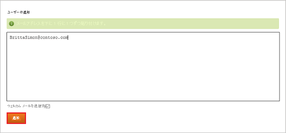

# チュートリアル: Azure Active Directory と Datahug の統合

このチュートリアルでは、Datahug と Azure Active Directory (Azure AD) を統合する方法について説明します。 Datahug を Azure AD に統合すると、次のことができます。

* Datahug にアクセスできる Azure AD ユーザーで制御します。
* ユーザーが自分の Azure AD アカウントを使用して Datahug に自動的にサインインするように設定できます。
* 1 つの中央サイト (Azure Portal) で自分のアカウントを管理します。

## 前提条件

開始するには、次が必要です。

* Azure AD サブスクリプション。 サブスクリプションがない場合は、[無料アカウント](https://azure.microsoft.com/free/)を取得できます。
* Datahug でのシングル サインオン (SSO) が有効なサブスクリプション。

## シナリオの説明

このチュートリアルでは、テスト環境で Azure AD のシングル サインオンを構成してテストします。

* Datahug では、**SP** と **IDP** によって開始される SSO がサポートされます。

## ギャラリーからの Datahug の追加

Azure AD への Datahug の統合を構成するには、ギャラリーから管理対象 SaaS アプリの一覧に Datahug を追加する必要があります。

1. 職場または学校アカウントか、個人の Microsoft アカウントを使用して、Azure portal にサインインします。
1. 左のナビゲーション ウィンドウで **[Azure Active Directory]** サービスを選択します。
1. **[エンタープライズ アプリケーション]** に移動し、 **[すべてのアプリケーション]** を選択します。
1. 新しいアプリケーションを追加するには、 **[新しいアプリケーション]** を選択します。
1. **[ギャラリーから追加する]** セクションで、検索ボックスに「**Datahug**」と入力します。
1. 結果のパネルから **[Datahug]** を選択し、アプリを追加します。 お使いのテナントにアプリが追加されるのを数秒待機します。

## Datahug の Azure AD SSO の構成とテスト

**B.Simon** というテスト ユーザーを使用して、Datahug に対する Azure AD SSO を構成してテストします。 SSO が機能するためには、Azure AD ユーザーと Datahug の関連ユーザーとの間にリンク関係を確立する必要があります。

Datahug で Azure AD SSO を構成してテストするには、次の手順を実行します。

1. **[Azure AD SSO の構成](#configure-azure-ad-sso)** - ユーザーがこの機能を使用できるようにします。
    1. **[Azure AD のテスト ユーザーの作成](#create-an-azure-ad-test-user)** - B.Simon で Azure AD のシングル サインオンをテストします。
    1. **[Azure AD テスト ユーザーの割り当て](#assign-the-azure-ad-test-user)** - B.Simon が Azure AD シングル サインオンを使用できるようにします。
1. **[Datahug の SSO の構成](#configure-datahug-sso)** - アプリケーション側でシングル サインオン設定を構成します。
    1. **[Datahug テスト ユーザーの作成](#create-datahug-test-user)** - Datahug で B.Simon に対応するユーザーを作成し、Azure AD の B.Simon にリンクさせます。
1. **[SSO のテスト](#test-sso)** - 構成が機能するかどうかを確認します。

## Azure AD SSO の構成

これらの手順に従って、Azure portal で Azure AD SSO を有効にします。

1. Azure portal の **Datahug** アプリケーション統合ページで、 **[管理]** セクションを見つけて、 **[シングル サインオン]** を選択します。
1. **[シングル サインオン方式の選択]** ページで、 **[SAML]** を選択します。
1. **[SAML によるシングル サインオンのセットアップ]** ページで、 **[基本的な SAML 構成]** の鉛筆アイコンをクリックして設定を編集します。

   

4. **[基本的な SAML 構成]** セクションで、アプリケーションを **IDP** 開始モードで構成する場合は、次の手順を実行します。

    a. **[識別子]** ボックスに、`https://apps.datahug.com/identity/<uniqueID>` の形式で URL を入力します。

    b. **[応答 URL]** ボックスに、`https://apps.datahug.com/identity/<uniqueID>/acs` のパターンを使用して URL を入力します

5. アプリケーションを **SP** 開始モードで構成する場合は、 **[追加の URL を設定します]** をクリックして次の手順を実行します。

    **[サインオン URL]** テキスト ボックスに、URL として「`https://apps.datahug.com/`」と入力します。

    > [!NOTE]
    > これらは実際の値ではありません。 実際の識別子と応答 URL でこれらの値を更新します。 これらの値を取得するには、[Datahug クライアント サポート チーム](https://www.sap.com/corporate/en/company/office-locations.html)に連絡してください。 Azure portal の **[基本的な SAML 構成]** セクションに示されているパターンを参照することもできます。

6. **[SAML でシングル サインオンをセットアップします]** ページの **[SAML 署名証明書]** セクションで、 **[ダウンロード]** をクリックして、要件のとおりに指定したオプションから **フェデレーション メタデータ XML** をダウンロードして、お使いのコンピューターに保存します。

    

7. **[SAML 署名証明書]** セクションで **[編集]** ボタンをクリックし、 **[SAML 署名証明書]** ダイアログを開いて、次の手順を実行します。

    

    a. **[署名オプション]** で **[SAML アサーションへの署名]** を選択します。

    b. **[署名アルゴリズム]** で **[SHA-1]** を選択します。
    
    c. **[保存]** をクリックします。

8. **[Datahug のセットアップ]** セクションで、要件に従って適切な URL をコピーします。

    

### Azure AD のテスト ユーザーの作成 

このセクションでは、Azure portal 内で B.Simon というテスト ユーザーを作成します。

1. Azure portal の左側のウィンドウから、 **[Azure Active Directory]** 、 **[ユーザー]** 、 **[すべてのユーザー]** の順に選択します。
1. 画面の上部にある **[新しいユーザー]** を選択します。
1. **[ユーザー]** プロパティで、以下の手順を実行します。
   1. **[名前]** フィールドに「`B.Simon`」と入力します。  
   1. **[ユーザー名]** フィールドに「username@companydomain.extension」と入力します。 たとえば、「 `B.Simon@contoso.com` 」のように入力します。
   1. **[パスワードを表示]** チェック ボックスをオンにし、 **[パスワード]** ボックスに表示された値を書き留めます。
   1. **Create** をクリックしてください。

### Azure AD テスト ユーザーの割り当て

このセクションでは、B.Simon に Datahug へのアクセスを許可して、このユーザーが Azure シングル サインオンを使用できるようにします。

1. Azure portal で **[エンタープライズ アプリケーション]** を選択し、 **[すべてのアプリケーション]** を選択します。
1. アプリケーションの一覧で **[Datahug]** を選択します。
1. アプリの概要ページで、 **[管理]** セクションを見つけて、 **[ユーザーとグループ]** を選択します。
1. **[ユーザーの追加]** を選択し、 **[割り当ての追加]** ダイアログで **[ユーザーとグループ]** を選択します。
1. **[ユーザーとグループ]** ダイアログの [ユーザー] の一覧から **[B.Simon]** を選択し、画面の下部にある **[選択]** ボタンをクリックします。
1. ユーザーにロールが割り当てられることが想定される場合は、 **[ロールの選択]** ドロップダウンからそれを選択できます。 このアプリに対してロールが設定されていない場合は、[既定のアクセス] ロールが選択されていることを確認します。
1. **[割り当ての追加]** ダイアログで、 **[割り当て]** をクリックします。

## Datahug SSO の構成

**Datahug** 側でシングル サインオンを構成するには、ダウンロードした **フェデレーション メタデータ XML** と Azure portal からコピーした適切な URL を [Datahug サポート チーム](https://www.sap.com/corporate/en/company/office-locations.html)に送信する必要があります。 サポート チームはこれを設定して、SAML SSO 接続が両方の側で正しく設定されるようにします。

### Datahug テスト ユーザーの作成

Azure AD ユーザーが Datahug にサインインできるようにするには、ユーザーを Datahug にプロビジョニングする必要があります。  
Datahug の場合、プロビジョニングは手動で行います。

**ユーザー アカウントをプロビジョニングするには、次の手順に従います。**

1. Datahug 企業サイトに管理者としてサインインします。

2. 右上隅の **歯車** をポイントし、 **[Settings]\(設定\)** をクリックします。
   
    !["歯車" アイコンが選択され、ドロップダウン メニューで [Settings]\(設定\) が選択されている "Datahug" ホームページを示すスクリーンショット。](./media/datahug-tutorial/settings.png)

3. **[People]\(ユーザー\)** を選択し、 **[Add Users]\(ユーザーの追加\)** タブをクリックします。

    ![[People]\(ユーザー\) タブと [Add Users]\(ユーザーの追加\) が選択されている [Settings]\(設定\) ページを示すスクリーンショット。](./media/datahug-tutorial/users.png)

4. アカウントを作成するユーザーの電子メール アドレスを入力し、 **[Add]** をクリックします。

    

    > [!NOTE] 
    > **[Send welcome email]** チェック ボックスをオンにすると、ユーザーに登録メールを送信できます。  
    > Salesforce のアカウントを作成する場合は、ウェルカム メールを送信しないでください。

## SSO のテスト

このセクションでは、次のオプションを使用して Azure AD のシングル サインオン構成をテストします。 

#### SP Initiated:

* Azure portal で **[このアプリケーションをテストします]** をクリックします。 これにより、ログイン フローを開始できる Datahug のサインオン URL にリダイレクトされます。  

* Datahug のサインオン URL に直接移動し、そこからログイン フローを開始します。

#### IDP Initiated:

* Azure portal で **[このアプリケーションをテストします]** をクリックすると、SSO を設定した Datahug に自動的にサインインされます。 

また、Microsoft マイ アプリを使用して、任意のモードでアプリケーションをテストすることもできます。 マイ アプリで [Datahug] タイルをクリックすると、SP モードで構成されている場合は、ログイン フローを開始するためのアプリケーション サインオン ページにリダイレクトされます。IDP モードで構成されている場合は、SSO を設定した Datadog に自動的にサインインされます。 マイ アプリの詳細については、[マイ アプリの概要](../user-help/my-apps-portal-end-user-access.md)に関するページを参照してください。

## 次のステップ

Datahug を構成したら、ご自分の組織の機密データの流出と侵入をリアルタイムで保護するセッション制御を適用することができます。 セッション制御は、条件付きアクセスを拡張したものです。 [Microsoft Cloud App Security でセッション制御を強制する方法](/cloud-app-security/proxy-deployment-aad)をご覧ください。