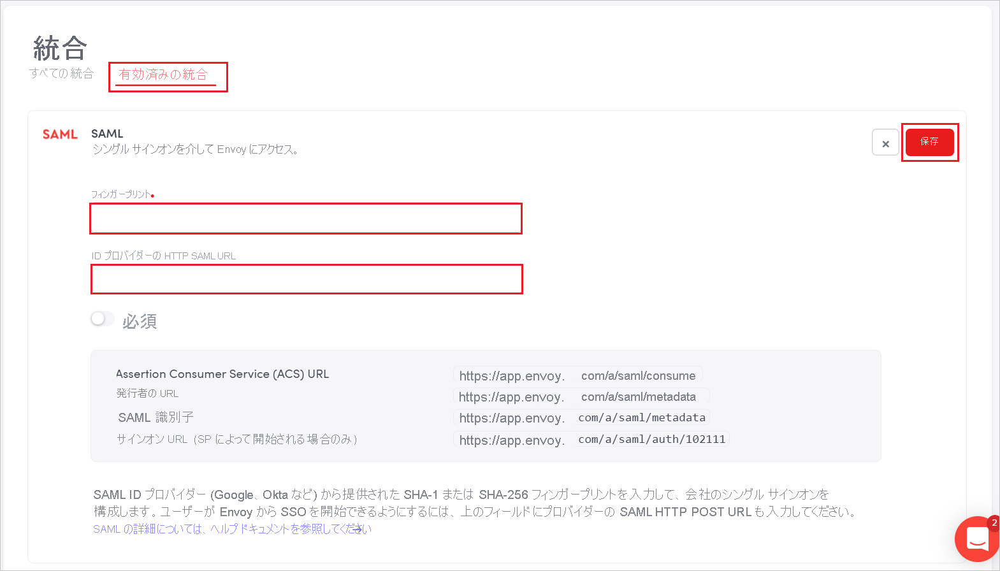

# チュートリアル: Azure Active Directory シングル サインオン (SSO) と Envoy の統合

このチュートリアルでは、Envoy と Azure Active Directory (Azure AD) を統合する方法について説明します。 Azure AD と Envoy を統合すると、次のことができます。

* Envoy にアクセスできるユーザーを Azure AD で制御できます。
* ユーザーが自分の Azure AD アカウントを使用して Envoy に自動的にサインインするようにすることができます。
* 1 つの中央サイト (Azure Portal) で自分のアカウントを管理します。

## 前提条件

開始するには、次が必要です。

* Azure AD サブスクリプション。 サブスクリプションがない場合は、[無料アカウント](https://azure.microsoft.com/free/)を取得できます。
* Envoy でのシングル サインオン (SSO) が有効なサブスクリプション。

## シナリオの説明

このチュートリアルでは、テスト環境で Azure AD の SSO を構成してテストします。

* Envoy では、**SP** Initiated SSO がサポートされます。

* Envoy では、**Just-In-Time** ユーザー プロビジョニングがサポートされます。

* Envoy では、[自動化されたユーザー プロビジョニング](envoy-provisioning-tutorial.md)がサポートされます。

> [!NOTE]
> このアプリケーションの識別子は固定文字列値であるため、1 つのテナントで構成できるインスタンスは 1 つだけです。

## ギャラリーから Envoy を追加する

Azure AD への Envoy の統合を構成するには、ギャラリーから管理対象 SaaS アプリの一覧に Envoy を追加する必要があります。

1. 職場または学校アカウントか、個人の Microsoft アカウントを使用して、Azure portal にサインインします。
1. 左のナビゲーション ウィンドウで **[Azure Active Directory]** サービスを選択します。
1. **[エンタープライズ アプリケーション]** に移動し、 **[すべてのアプリケーション]** を選択します。
1. 新しいアプリケーションを追加するには、 **[新しいアプリケーション]** を選択します。
1. **[ギャラリーから追加する]** セクションで、検索ボックスに「**Envoy**」と入力します。
1. 結果のパネルから **Envoy** を選択し、アプリを追加します。 お使いのテナントにアプリが追加されるのを数秒待機します。

## Envoy の Azure AD SSO の構成とテスト

**B.Simon** というテスト ユーザーを使用して、Envoy に対する Azure AD SSO を構成してテストします。 SSO を機能させるには、Azure AD ユーザーと Envoy の関連ユーザーとの間にリンク関係を確立する必要があります。

Envoy に対して Azure AD SSO を構成してテストするには、次の手順を行います。

1. **[Azure AD SSO の構成](#configure-azure-ad-sso)** - ユーザーがこの機能を使用できるようにします。
    1. **[Azure AD のテスト ユーザーの作成](#create-an-azure-ad-test-user)** - B.Simon で Azure AD のシングル サインオンをテストします。
    1. **[Azure AD テスト ユーザーの割り当て](#assign-the-azure-ad-test-user)** - B.Simon が Azure AD シングル サインオンを使用できるようにします。
1. **[Envoy SSO の構成](#configure-envoy-sso)** - アプリケーション側でシングル サインオン設定を構成します。
    1. **[Envoy テスト ユーザーの作成](#create-envoy-test-user)** - Envoy で B.Simon に対応するユーザーを作成し、Azure AD の B.Simon にリンクさせます。
1. **[SSO のテスト](#test-sso)** - 構成が機能するかどうかを確認します。

## Azure AD SSO の構成

これらの手順に従って、Azure portal で Azure AD SSO を有効にします。

1. Azure portal の **Envoy** アプリケーション統合ページで、 **[管理]** セクションを探して、 **[シングル サインオン]** を選択します。
1. **[シングル サインオン方式の選択]** ページで、 **[SAML]** を選択します。
1. **[SAML によるシングル サインオンのセットアップ]** ページで、 **[基本的な SAML 構成]** の鉛筆アイコンをクリックして設定を編集します。

   

1. **[基本的な SAML 構成]** セクションで、次の手順を実行します。

    **[サインオン URL]** ボックスに、`https://app.envoy.com/a/saml/auth/<company-ID-from-Envoy>` という形式で URL を入力します。

    > [!NOTE]
    > この値は実際のものではありません。 実際のサインオン URL でこの値を更新してください。 値を取得するには、[Envoy クライアント サポート チーム](https://envoy.com/contact/)に問い合わせてください。 Azure portal の **[基本的な SAML 構成]** セクションに示されているパターンを参照することもできます。

1. **[SAML 署名証明書]** セクションで **[編集]** ボタンをクリックして、 **[SAML 署名証明書]** ダイアログを開きます。

    

1. **[SAML 署名証明書]** セクションで **[Thumbprint Value]\(拇印の値\)** をコピーし、お使いのコンピューターに保存します。

    ![[Thumbprint]\(拇印\) の値をコピーする](common/copy-thumbprint.png)

1. **[Envoy のセットアップ]** セクションで、要件に基づいて適切な URL をコピーします。

    

### Azure AD のテスト ユーザーの作成

このセクションでは、Azure portal 内で B.Simon というテスト ユーザーを作成します。

1. Azure portal の左側のウィンドウから、 **[Azure Active Directory]** 、 **[ユーザー]** 、 **[すべてのユーザー]** の順に選択します。
1. 画面の上部にある **[新しいユーザー]** を選択します。
1. **[ユーザー]** プロパティで、以下の手順を実行します。
   1. **[名前]** フィールドに「`B.Simon`」と入力します。  
   1. **[ユーザー名]** フィールドに「username@companydomain.extension」と入力します。 たとえば、「 `B.Simon@contoso.com` 」のように入力します。
   1. **[パスワードを表示]** チェック ボックスをオンにし、 **[パスワード]** ボックスに表示された値を書き留めます。
   1. **Create** をクリックしてください。

### Azure AD テスト ユーザーの割り当て

このセクションでは、B.Simon に Envoy へのアクセスを許可することで、このユーザーが Azure シングル サインオンを使用できるようにします。

1. Azure portal で **[エンタープライズ アプリケーション]** を選択し、 **[すべてのアプリケーション]** を選択します。
1. アプリケーションの一覧で **[Envoy]** を選択します。
1. アプリの概要ページで、 **[管理]** セクションを見つけて、 **[ユーザーとグループ]** を選択します。
1. **[ユーザーの追加]** を選択し、 **[割り当ての追加]** ダイアログで **[ユーザーとグループ]** を選択します。
1. **[ユーザーとグループ]** ダイアログの [ユーザー] の一覧から **[B.Simon]** を選択し、画面の下部にある **[選択]** ボタンをクリックします。
1. ユーザーにロールが割り当てられることが想定される場合は、 **[ロールの選択]** ドロップダウンからそれを選択できます。 このアプリに対してロールが設定されていない場合は、[既定のアクセス] ロールが選択されていることを確認します。
1. **[割り当ての追加]** ダイアログで、 **[割り当て]** をクリックします。

## Envoy SSO の構成

1. Envoy 内での構成を自動化するには、**[拡張機能のインストール]** をクリックして **My Apps Secure Sign-in ブラウザー拡張機能** をインストールする必要があります。

    

2. ブラウザーに拡張機能を追加した後、**[Envoy のセットアップ]** をクリックすると、Envoy アプリケーションに移動します。 そこから、管理者の資格情報を入力して Envoy にサインインします。 ブラウザー拡張機能によりアプリケーションが自動的に構成され、手順 3 から 5 が自動化されます。

    

3. Envoy を手動でセットアップする場合は、新しい Web ブラウザー ウィンドウを開き、管理者として Envoy 企業サイトにサインインして、次の手順を実行します。

4. **[Integrations]\(統合\)**  >  **[All integrations]\(すべての統合\)** に移動し、 **[Single sign-on]\(シングル サインオン\)** の SAML の **[Install]\(インストール\)** をクリックします。

    

5. **[Enabled integrations]\(有効な組み込み\)** セクションに移動し、次の手順を実行します。

    
    
    >[!NOTE]
    >[HQ 場所 ID] の値は、アプリケーションによって自動的に生成されます。
    
    a. **[Fingerprint]\(フィンガープリント\)** ボックスに、Azure Portal からコピーした証明書の **Thumbprint (拇印)** 値を貼り付けます。
    
    b. Azure portal からコピーした **ログイン URL** を **[IDENTITY PROVIDER HTTP SAML URL]\(ID プロバイダーの HTTP SAML URL\)** ボックスに貼り付けます。
    
    c. **[保存]** をクリックします。

### Envoy テスト ユーザーの作成

このセクションでは、Britta Simon というユーザーを Envoy に作成します。 Envoy では、Just-In-Time ユーザー プロビジョニングがサポートされており、既定で有効になっています。 このセクションでは、ユーザー側で必要な操作はありません。 Envoy にユーザーがまだ存在していない場合は、認証後に新しく作成されます。

Envoy では、自動ユーザー プロビジョニングもサポートされます。自動ユーザー プロビジョニングの構成方法について詳しくは、[こちら](./envoy-provisioning-tutorial.md)をご覧ください。

## SSO のテスト 

このセクションでは、次のオプションを使用して Azure AD のシングル サインオン構成をテストします。 

* Azure portal で **[このアプリケーションをテストします]** をクリックします。 これにより、ログイン フローを開始できる Envoy のサインオン URL にリダイレクトされます。 

* Envoy のサインオン URL に直接移動し、そこからログイン フローを開始します。

* Microsoft マイ アプリを使用することができます。 マイ アプリで [Envoy] タイルをクリックすると、Envoy のサインオン URL にリダイレクトされます。 マイ アプリの詳細については、[マイ アプリの概要](https://support.microsoft.com/account-billing/sign-in-and-start-apps-from-the-my-apps-portal-2f3b1bae-0e5a-4a86-a33e-876fbd2a4510)に関するページを参照してください。

## 次のステップ

Envoy を構成したら、組織の機密データを流出と侵入からリアルタイムで保護するセッション制御を適用することができます。 セッション制御は、条件付きアクセスを拡張したものです。 [Microsoft Cloud App Security でセッション制御を強制する方法](/cloud-app-security/proxy-deployment-any-app)をご覧ください。