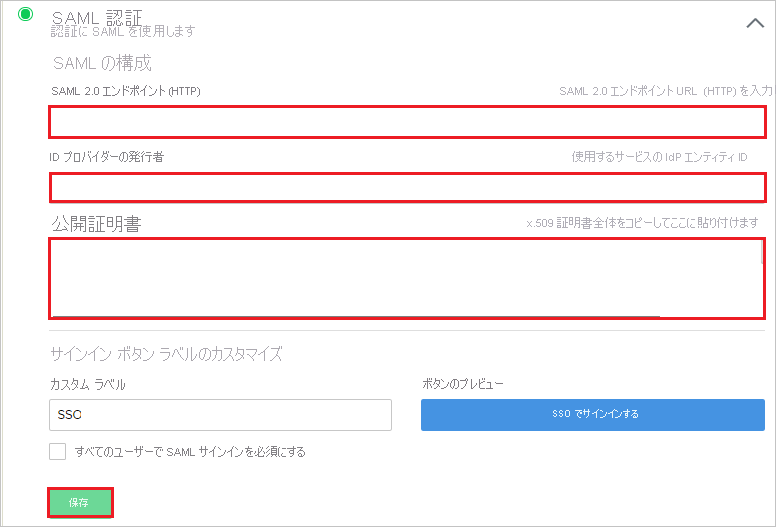
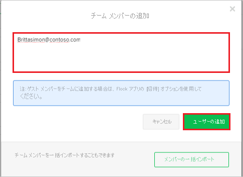

# チュートリアル: Azure Active Directory と Flock の統合

このチュートリアルでは、Flock と Azure Active Directory (Azure AD) を統合する方法について説明します。 Azure AD と Flock を統合すると、次のことが可能になります。

* Flock にアクセスできるユーザーを Azure AD で制御します。
* ユーザーが自分の Azure AD アカウントを使用して Flock に自動的にサインインするように設定できます。
* 1 つの中央サイト (Azure Portal) で自分のアカウントを管理します。

## 前提条件

開始するには、次が必要です。

* Azure AD サブスクリプション。 サブスクリプションがない場合は、[無料アカウント](https://azure.microsoft.com/free/)を取得できます。
* Flock でのシングル サインオン (SSO) が有効なサブスクリプション。

## シナリオの説明

このチュートリアルでは、テスト環境で Azure AD のシングル サインオンを構成してテストします。

* Flock では、**SP** Initiated SSO がサポートされます。
* Flock では、[自動化されたユーザー プロビジョニング](flock-provisioning-tutorial.md)がサポートされます

## ギャラリーからの Flock の追加

Azure AD への Flock の統合を構成するには、ギャラリーからマネージド SaaS アプリの一覧に Flock を追加する必要があります。

1. 職場または学校アカウントか、個人の Microsoft アカウントを使用して、Azure portal にサインインします。
1. 左のナビゲーション ウィンドウで **[Azure Active Directory]** サービスを選択します。
1. **[エンタープライズ アプリケーション]** に移動し、 **[すべてのアプリケーション]** を選択します。
1. 新しいアプリケーションを追加するには、 **[新しいアプリケーション]** を選択します。
1. **[ギャラリーから追加する]** セクションで、検索ボックスに「**Flock**」と入力します。
1. 結果パネルから **[Flock]** を選択し、アプリを追加します。 お使いのテナントにアプリが追加されるのを数秒待機します。

## Flock の Azure AD SSO の構成とテスト

**B.Simon** というテスト ユーザーを使用して、Flock に対する Azure AD SSO を構成してテストします。 SSO を機能させるためには、Azure AD ユーザーと Flock の関連ユーザーとの間にリンク関係を確立する必要があります。

Flock に対して Azure AD SSO を構成してテストするには、次の手順を実行します。

1. **[Azure AD SSO の構成](#configure-azure-ad-sso)** - ユーザーがこの機能を使用できるようにします。
    1. **[Azure AD のテスト ユーザーの作成](#create-an-azure-ad-test-user)** - Britta Simon で Azure AD のシングル サインオンをテストします。
    1. **[Azure AD テスト ユーザーの割り当て](#assign-the-azure-ad-test-user)** - Britta Simon が Azure AD シングル サインオンを使用できるようにします。
2. **[Flock SSO の構成](#configure-flock-sso)** - アプリケーション側でシングル サインオン設定を構成します。
    1. **[Flock テスト ユーザーの作成](#create-flock-test-user)** - Azure AD の Britta Simon にリンクさせるために、対応するユーザーを Flock で作成します。
1. **[SSO のテスト](#test-sso)** - 構成が機能するかどうかを確認します。

## Azure AD SSO の構成

これらの手順に従って、Azure portal で Azure AD SSO を有効にします。

1. Azure portal の **Flock** アプリケーション統合ページで **[管理]** セクションを探して、 **[シングル サインオン]** を選択します。
1. **[シングル サインオン方式の選択]** ページで、 **[SAML]** を選択します。
1. **[SAML によるシングル サインオンのセットアップ]** ページで、 **[基本的な SAML 構成]** の鉛筆アイコンをクリックして設定を編集します。

   

4. **[基本的な SAML 構成]** セクションで、次の手順を実行します。

    a. **[サインオン URL]** ボックスに、次のパターンを使用して URL を入力します。`https://<subdomain>.flock.com/`

    b. **[識別子 (エンティティ ID)]** ボックスに、次のパターンを使用して URL を入力します。`https://<subdomain>.flock.com/`

    > [!NOTE]
    > これらは実際の値ではありません。 実際のサインオン URL と識別子でこれらの値を更新します。 この値を取得するには、[Flock クライアント サポート チーム](mailto:support@flock.com)にお問い合わせください。 Azure portal の **[基本的な SAML 構成]** セクションに示されているパターンを参照することもできます。

4. **[SAML でシングル サインオンをセットアップします]** ページの **[SAML 署名証明書]** セクションで、 **[ダウンロード]** をクリックして要件のとおりに指定したオプションからの **証明書 (Base64)** をダウンロードして、お使いのコンピューターに保存します。

    

6. **[Flock のセットアップ]** セクションで、要件に従って適切な URL をコピーします。

    

### Azure AD のテスト ユーザーの作成

このセクションでは、Azure portal 内で B.Simon というテスト ユーザーを作成します。

1. Azure portal の左側のウィンドウから、 **[Azure Active Directory]** 、 **[ユーザー]** 、 **[すべてのユーザー]** の順に選択します。
1. 画面の上部にある **[新しいユーザー]** を選択します。
1. **[ユーザー]** プロパティで、以下の手順を実行します。
   1. **[名前]** フィールドに「`B.Simon`」と入力します。  
   1. **[ユーザー名]** フィールドに「username@companydomain.extension」と入力します。 たとえば、「 `B.Simon@contoso.com` 」のように入力します。
   1. **[パスワードを表示]** チェック ボックスをオンにし、 **[パスワード]** ボックスに表示された値を書き留めます。
   1. **Create** をクリックしてください。

### Azure AD テスト ユーザーの割り当て

このセクションでは、B.Simon に Flock へのアクセスを許可することで、このユーザーが Azure シングル サインオンを使用できるようにします。

1. Azure portal で **[エンタープライズ アプリケーション]** を選択し、 **[すべてのアプリケーション]** を選択します。
1. アプリケーションの一覧で **[Flock]** を選択します。
1. アプリの概要ページで、 **[管理]** セクションを見つけて、 **[ユーザーとグループ]** を選択します。
1. **[ユーザーの追加]** を選択し、 **[割り当ての追加]** ダイアログで **[ユーザーとグループ]** を選択します。
1. **[ユーザーとグループ]** ダイアログの [ユーザー] の一覧から **[B.Simon]** を選択し、画面の下部にある **[選択]** ボタンをクリックします。
1. ユーザーにロールが割り当てられることが想定される場合は、 **[ロールの選択]** ドロップダウンからそれを選択できます。 このアプリに対してロールが設定されていない場合は、[既定のアクセス] ロールが選択されていることを確認します。
1. **[割り当ての追加]** ダイアログで、 **[割り当て]** をクリックします。

## Flock SSO の構成

1. 別の Web ブラウザー ウィンドウで、Flock 企業サイトに管理者としてログインします。

2. 左側のナビゲーション パネルで **[Authentication]\(認証\)** タブを選択し、 **[SAML Authentication]\(SAML 認証\)** を選択します。

    ![[S A M L Authentication]\(S A M L 認証\) が選択されている [Authentication]\(認証\) タブを示すスクリーンショット。](./media/flock-tutorial/authentication.png)

3. **[SAML Authentication]** セクションで、次の手順に従います。

    

    a. **[SAML 2.0 Endpoint(HTTP)]\(SAML 2.0 エンドポイント (HTTP)\)** ボックスに、Azure portal からコピーした **ログイン URL** の値を貼り付けます。

    b. **[ID プロバイダーの発行者]** ボックスに、Azure portal からコピーした **Azure AD 識別子** の値を貼り付けます。

    c. Azure portal からダウンロードした **証明書 (Base64)** をメモ帳で開き、その内容を **[Public Certificate]\(公開証明書\)** ボックスに貼り付けます。

    d. **[保存]** をクリックします。

### Flock テスト ユーザーの作成

Azure AD ユーザーが Flock にログインできるようにするには、ユーザーを Flock にプロビジョニングする必要があります。 Flock の場合、プロビジョニングは手動で行います。

**ユーザー アカウントをプロビジョニングするには、次の手順に従います。**

1. Flock 企業サイトに管理者としてログインします。

2. 左側のナビゲーション パネルで **[Manage Team]\(チームの管理\)** をクリックします。

    ![選択されている [Manage Team]\(チームの管理\) を示すスクリーンショット。](./media/flock-tutorial/user-1.png)

3. **[Add Member]\(メンバーの追加\)** タブをクリックし、 **[Team Members]\(チーム メンバー\)** を選択します。

    ![[Add Member]\(メンバーの追加\) タブと選択されている [Team Members]\(チーム メンバー\) を示すスクリーンショット。](./media/flock-tutorial/user-2.png)

4. **Brittasimon\@contoso.com** のようなユーザーのメール アドレスを入力し、 **[Add Users]\(ユーザーの追加\)** を選択します。

    

> [!NOTE]
>また、Flock は自動ユーザー プロビジョニングをサポートしています。自動ユーザー プロビジョニングの構成方法の詳細については、[こちら](./flock-provisioning-tutorial.md)を参照してください。

## SSO のテスト 

このセクションでは、次のオプションを使用して Azure AD のシングル サインオン構成をテストします。 

* Azure portal で **[このアプリケーションをテストします]** をクリックします。 これにより、ログイン フローを開始できる Flock のサインオン URL にリダイレクトされます。 

* Flock のサインオン URL に直接移動し、そこからログイン フローを開始します。

* Microsoft マイ アプリを使用することができます。 マイ アプリの [Flock] タイルをクリックすると、Flock のサインオン URL にリダイレクトされます。 マイ アプリの詳細については、[マイ アプリの概要](../user-help/my-apps-portal-end-user-access.md)に関するページを参照してください。

## 次のステップ

Flock を構成すると、組織の機密データを流出と侵入からリアルタイムで保護するセッション制御を適用することができます。 セッション制御は、条件付きアクセスを拡張したものです。 [Microsoft Cloud App Security でセッション制御を強制する方法](/cloud-app-security/proxy-deployment-any-app)をご覧ください。