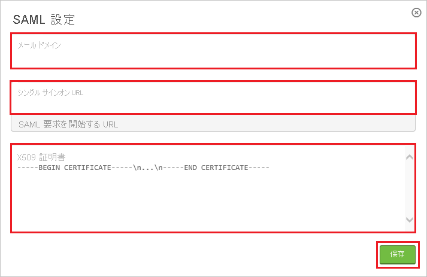
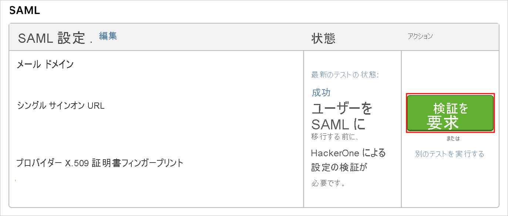
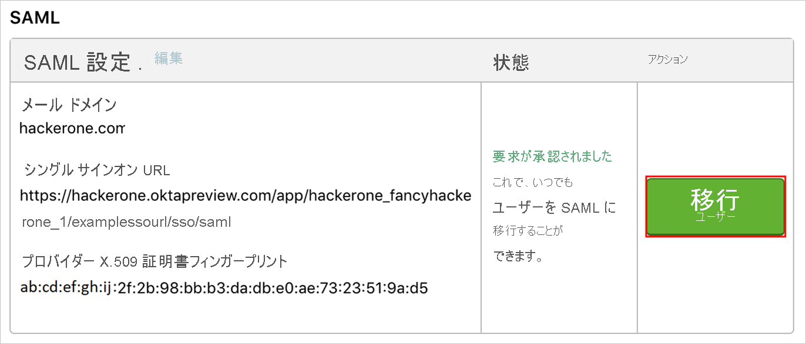

# チュートリアル: Azure Active Directory と HackerOne の統合

このチュートリアルでは、HackerOne と Azure Active Directory (Azure AD) を統合する方法について説明します。 HackerOne と Azure AD を統合すると、次のことができます。

* HackerOne にアクセスできるユーザーを Azure AD で制御できます。
* ユーザーが自分の Azure AD アカウントを使用して HackerOne に自動的にサインインできるように設定できます。
* 1 つの中央サイト (Azure Portal) で自分のアカウントを管理します。

## 前提条件

開始するには、次が必要です。

* Azure AD サブスクリプション。 サブスクリプションがない場合は、[無料アカウント](https://azure.microsoft.com/free/)を取得できます。
* シングル サインオン (SSO) が有効な HackerOne サブスクリプション。

## シナリオの説明

このチュートリアルでは、テスト環境で Azure AD のシングル サインオンを構成してテストします。

* HackerOne では、**SP** Initiated SSO がサポートされます。
* HackerOne では、**Just-In-Time** ユーザー プロビジョニングがサポートされます。

> [!NOTE]
> このアプリケーションの識別子は固定文字列値であるため、1 つのテナントで構成できるインスタンスは 1 つだけです。

## ギャラリーからの HackerOne の追加

Azure AD への HackerOne の統合を構成するには、ギャラリーから管理対象 SaaS アプリの一覧に HackerOne を追加する必要があります。

1. 職場または学校アカウントか、個人の Microsoft アカウントを使用して、Azure portal にサインインします。
1. 左のナビゲーション ウィンドウで **[Azure Active Directory]** サービスを選択します。
1. **[エンタープライズ アプリケーション]** に移動し、 **[すべてのアプリケーション]** を選択します。
1. 新しいアプリケーションを追加するには、 **[新しいアプリケーション]** を選択します。
1. **[ギャラリーから追加する]** セクションで、検索ボックスに「**HackerOne**」と入力します。
1. 結果パネルで **[HackerOne]** を選択し、アプリを追加します。 お使いのテナントにアプリが追加されるのを数秒待機します。

## HackerOne の Azure AD SSO の構成とテスト

**B. Simon** というテスト ユーザーを使用して、HackerOne に対する Azure AD SSO を構成してテストします。 SSO を機能させるためには、Azure AD ユーザーと HackerOne の関連ユーザーとの間にリンク関係を確立する必要があります。

HackerOne に対する Azure AD SSO を構成してテストするには、次の手順を実行します。

1. **[Azure AD SSO の構成](#configure-azure-ad-sso)** - ユーザーがこの機能を使用できるようにします。
    1. **[Azure AD のテスト ユーザーの作成](#create-an-azure-ad-test-user)** - B.Simon で Azure AD のシングル サインオンをテストします。
    1. **[Azure AD テスト ユーザーの割り当て](#assign-the-azure-ad-test-user)** - B.Simon が Azure AD シングル サインオンを使用できるようにします。
1. **[HackerOne の SSO の構成](#configure-hackerone-sso)** - アプリケーション側でシングル サインオン設定を構成します。
    1. **[HackerOne のテスト ユーザーの作成](#create-hackerone-test-user)** - HackerOne で B.Simon に対応するユーザーを作成し、Azure AD の B.Simon にリンクさせます。
1. **[SSO のテスト](#test-sso)** - 構成が機能するかどうかを確認します。

## Azure AD SSO の構成

これらの手順に従って、Azure portal で Azure AD SSO を有効にします。

1. Azure portal の **HackerOne** アプリケーション統合ページで、 **[管理]** セクションを見つけて、 **[シングル サインオン]** を選択します。
1. **[シングル サインオン方式の選択]** ページで、 **[SAML]** を選択します。
1. **[SAML によるシングル サインオンのセットアップ]** ページで、 **[基本的な SAML 構成]** の鉛筆アイコンをクリックして設定を編集します。

   

4. **[基本的な SAML 構成]** セクションで、次の手順を実行します。

    a. **[識別子 (エンティティ ID)]** ボックスに、`hackerone.com` という値を入力します。

    b. **[サインオン URL]** ボックスに、次のパターンを使用して URL を入力します。`https://hackerone.com/users/saml/sign_in?email=<CONFIGURED_DOMAIN>`

    > [!Note]
    > サインオン URL は実際の値ではありません。 この値を実際のサインオン URL で更新してください。Azure portal の **[基本的な SAML 構成]** セクションに示されているパターンを参照することもできます。

5. **[SAML でシングル サインオンをセットアップします]** ページの **[SAML 署名証明書]** セクションで、 **[ダウンロード]** をクリックして要件のとおりに指定したオプションからの **証明書 (Base64)** をダウンロードして、お使いのコンピューターに保存します。

    

6. **[HackerOne のセットアップ]** セクションで、要件に従って適切な URL をコピーします。

    

### Azure AD のテスト ユーザーの作成

このセクションでは、Azure portal 内で B.Simon というテスト ユーザーを作成します。

1. Azure portal の左側のウィンドウから、 **[Azure Active Directory]** 、 **[ユーザー]** 、 **[すべてのユーザー]** の順に選択します。
1. 画面の上部にある **[新しいユーザー]** を選択します。
1. **[ユーザー]** プロパティで、以下の手順を実行します。
   1. **[名前]** フィールドに「`B.Simon`」と入力します。  
   1. **[ユーザー名]** フィールドに「username@companydomain.extension」と入力します。 たとえば、「 `B.Simon@contoso.com` 」のように入力します。
   1. **[パスワードを表示]** チェック ボックスをオンにし、 **[パスワード]** ボックスに表示された値を書き留めます。
   1. **Create** をクリックしてください。

### Azure AD テスト ユーザーの割り当て

このセクションでは、B.Simon に HackerOne へのアクセスを許可することで、このユーザーが Azure シングル サインオンを使用できるようにします。

1. Azure portal で **[エンタープライズ アプリケーション]** を選択し、 **[すべてのアプリケーション]** を選択します。
1. アプリケーションの一覧で **[HackerOne]** を選択します。
1. アプリの概要ページで、 **[管理]** セクションを見つけて、 **[ユーザーとグループ]** を選択します。
1. **[ユーザーの追加]** を選択し、 **[割り当ての追加]** ダイアログで **[ユーザーとグループ]** を選択します。
1. **[ユーザーとグループ]** ダイアログの [ユーザー] の一覧から **[B.Simon]** を選択し、画面の下部にある **[選択]** ボタンをクリックします。
1. ユーザーにロールが割り当てられることが想定される場合は、 **[ロールの選択]** ドロップダウンからそれを選択できます。 このアプリに対してロールが設定されていない場合は、[既定のアクセス] ロールが選択されていることを確認します。
1. **[割り当ての追加]** ダイアログで、 **[割り当て]** をクリックします。

## HackerOne の SSO の構成

1. HackerOne テナントに管理者としてサインオンします。

2. 上部のメニューで **[Settings]** をクリックします。

    ![メニューで [Settings]\(設定\) が選択されているスクリーンショット。](./media/hackerone-tutorial/menu.png)

3. **[Authentication]\(認証\)** に移動し、 **[Add SAML settings]\(SAML 設定の追加\)** をクリックします。

    ![[Add SAML settings]\(SAML 設定の追加\) ボタンが選択されている [Authentication Settings]\(認証設定\) ページを示すスクリーンショット。](./media/hackerone-tutorial/settings.png)

4. **[SAML Settings (SAML の設定)]** ダイアログで、次の手順を実行します。

    

    a. 登録されているドメインを **[電子メール ドメイン]** ボックスに入力します。

    b. **[Single Sign-On URL]\(シングル サインオン URL\)** ボックスに、Azure portal からコピーした **[ログイン URL]** の値を貼り付けます。

    c. Azure portal からダウンロードした **証明書ファイル** をメモ帳で開き、その内容をクリップボードにコピーしてから、それを **[X509 Certificate]\(X509 証明書\)** ボックスに貼り付けます。

    d. **[保存]** をクリックします。

5. [Authentication Settings] ダイアログで、次の手順を実行します。

    ![[Run test]\(テストの実行\) ボタンが選択されている [Authentication Settings]\(認証設定\) ダイアログを示すスクリーンショット。](./media/hackerone-tutorial/test.png)

    a. **[テストの実行]** をクリックします。

6. テストが正常に完了し、 **[Status]\(状態\)** フィールドに **[Last test status: success]\(最新のテスト状態: 成功\)** と表示されている場合は、 **[Request Verification]\(確認の要求\)** ボタンを選択して HackerOne に承認を求めます。

    

7. HackerOne によって設定が承認されたら、 **[Migrate Users]\(ユーザーを移行する\)** ボタンを選択して、すべてのユーザーに SSO 認証を要求することができます。

    

### HackerOne のテスト ユーザーの作成

このセクションでは、Britta Simon というユーザーを HackerOne に作成します。 HackerOne では、Just-In-Time ユーザー プロビジョニングがサポートされています。この設定は既定で有効になっています。 このセクションでは、ユーザー側で必要な操作はありません。 HackerOne にユーザーがまだ存在していない場合は、認証後に新規に作成されます。

## SSO のテスト

このセクションでは、次のオプションを使用して Azure AD のシングル サインオン構成をテストします。 

* Azure portal で **[このアプリケーションをテストします]** をクリックします。 これにより、ログイン フローを開始できる HackerOne のサインオン URL にリダイレクトされます。 

* HackerOne のサインオン URL に直接移動し、そこからログイン フローを開始します。

* Microsoft マイ アプリを使用することができます。 マイ アプリで [HackerOne] タイルをクリックすると、HackerOne のサインオン URL にリダイレクトされます。 マイ アプリの詳細については、[マイ アプリの概要](../user-help/my-apps-portal-end-user-access.md)に関するページを参照してください。

## 次のステップ

HackerOne を構成したら、組織の機密データを流出と侵入からリアルタイムで保護するセッション制御を適用できます。 セッション制御は、条件付きアクセスを拡張したものです。 [Microsoft Cloud App Security でセッション制御を強制する方法](/cloud-app-security/proxy-deployment-aad)をご覧ください。
