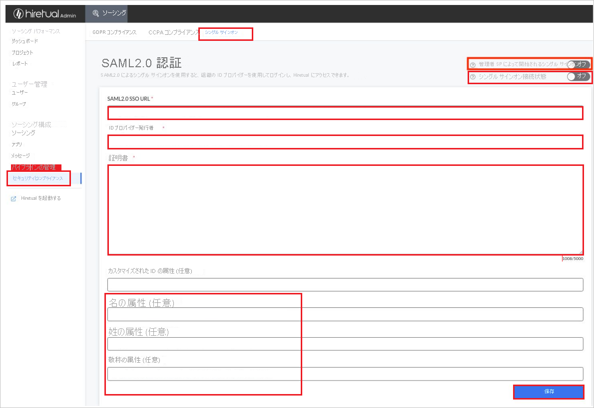

# チュートリアル: Azure AD SSO と Hiretual-SSO の統合

このチュートリアルでは、Hiretual-SSO と Azure Active Directory (Azure AD) を統合する方法について説明します。 Hiretual-SSO と Azure AD を統合すると、次のことができるようになります。

* Hiretual-SSO にアクセスできるユーザーを Azure AD で制御する。
* ユーザーが自分の Azure AD アカウントを使用して Hiretual-SSO に自動的にサインインできるようにする。
* 1 つの中央サイト (Azure Portal) で自分のアカウントを管理します。

## 前提条件

開始するには、次が必要です。

* Azure AD サブスクリプション。 サブスクリプションがない場合は、[無料アカウント](https://azure.microsoft.com/free/)を取得できます。
* Hiretual-SSO でのシングル サインオン (SSO) が有効なサブスクリプション。

## シナリオの説明

このチュートリアルでは、テスト環境で Azure AD の SSO を構成してテストします。

* Hiretual-SSO では、**SP と IDP** によって開始される SSO がサポートされます。

> [!NOTE]
> このアプリケーションの識別子は固定文字列値であるため、1 つのテナントで構成できるインスタンスは 1 つだけです。

## ギャラリーからの Hiretual-SSO の追加

Azure AD への Hiretual-SSO の統合を構成するには、ギャラリーからマネージド SaaS アプリの一覧に Hiretual-SSO を追加する必要があります。

1. 職場または学校アカウントか、個人の Microsoft アカウントを使用して、Azure portal にサインインします。
1. 左のナビゲーション ウィンドウで **[Azure Active Directory]** サービスを選択します。
1. **[エンタープライズ アプリケーション]** に移動し、 **[すべてのアプリケーション]** を選択します。
1. 新しいアプリケーションを追加するには、 **[新しいアプリケーション]** を選択します。
1. **[ギャラリーから追加する]** セクションで、検索ボックスに「**Hiretual-SSO**」と入力します。
1. 結果のパネルから **[Hiretual-SSO]** を選択し、アプリを追加します。 お使いのテナントにアプリが追加されるのを数秒待機します。

## Hiretual-SSO のための Azure AD SSO の構成とテスト

**B.Simon** というテスト ユーザーを使用して、Hiretual-SSO 用に Azure AD SSO を構成してテストします。 SSO が機能するためには、Azure AD ユーザーと Hiretual-SSO の関連ユーザーとの間にリンク関係を確立する必要があります。

Hiretual-SSO 用に Azure AD SSO を構成してテストするには、次の手順を実行します。

1. **[Azure AD SSO の構成](#configure-azure-ad-sso)** - ユーザーがこの機能を使用できるようにします。
    1. **[Azure AD のテスト ユーザーの作成](#create-an-azure-ad-test-user)** - B.Simon で Azure AD のシングル サインオンをテストします。
    1. **[Azure AD テスト ユーザーの割り当て](#assign-the-azure-ad-test-user)** - B.Simon が Azure AD シングル サインオンを使用できるようにします。
1. **[Hiretual-SSO の構成](#configure-hiretual-sso)** - アプリケーション側でシングル サインオン設定を構成します。
    1. **[Hiretual-SSO のテスト ユーザーの作成](#create-hiretual-sso-test-user)** - Hiretual-SSO で B.Simon に対応するユーザーを作成し、Azure AD のこのユーザーにリンクさせます。
1. **[SSO のテスト](#test-sso)** - 構成が機能するかどうかを確認します。

## Azure AD SSO の構成

これらの手順に従って、Azure portal で Azure AD SSO を有効にします。

1. Azure portal の **Hiretual-SSO** アプリケーション統合ページで、 **[管理]** セクションを見つけて、 **[シングル サインオン]** を選択します。
1. **[シングル サインオン方式の選択]** ページで、 **[SAML]** を選択します。
1. **[SAML によるシングル サインオンのセットアップ]** ページで、 **[基本的な SAML 構成]** の鉛筆アイコンをクリックして設定を編集します。

   

1. **[基本的な SAML 構成]** セクションで、アプリケーションを **IDP** 開始モードで構成する場合は、次の手順を実行します。

    a. **[応答 URL]** ボックスに、`https://api.hiretual.com/v1/users/saml/login/<teamId>` のパターンを使用して URL を入力します

1. アプリケーションを **SP** 開始モードで構成する場合は、 **[追加の URL を設定します]** をクリックして次の手順を実行します。

    **[サインオン URL]** テキスト ボックスに、URL として「`https://app.hiretual.com/`」と入力します。

    > [!NOTE]
    > これは実際の値ではありません。 実際の応答 URL でこの値を更新します。 この値を取得するには、[Hiretual-SSO クライアント サポート チーム](mailto:support@hiretual.com)にお問い合わせください。 Azure portal の **[基本的な SAML 構成]** セクションに示されているパターンを参照することもできます。

1. Hiretual-SSO アプリケーションは、特定の形式の SAML アサーションを使用するため、カスタム属性マッピングをご自分の SAML トークンの属性の構成に追加する必要があります。 次のスクリーンショットには、既定の属性一覧が示されています。

    

1. その他に、Hiretual-SSO アプリケーションでは、いくつかの属性が SAML 応答で返されることが想定されています。それらを次に示します。 これらの属性も値が事前に設定されますが、要件に従ってそれらの値を確認することができます。
    
    | 名前 | ソース属性 |
    | ---------- | --------- |
    | firstName | User.givenname |
    | title | user.jobtitle |
    | lastName | User.surname |

1. **[Set up single sign-on with SAML]\(SAML でシングル サインオンをセットアップします\)** ページの **[SAML 署名証明書]** セクションで、コピー ボタンをクリックして **[アプリのフェデレーション メタデータ URL]** をコピーして、お使いのコンピューターに保存します。

    

### Azure AD のテスト ユーザーの作成

このセクションでは、Azure portal 内で B.Simon というテスト ユーザーを作成します。

1. Azure portal の左側のウィンドウから、 **[Azure Active Directory]** 、 **[ユーザー]** 、 **[すべてのユーザー]** の順に選択します。
1. 画面の上部にある **[新しいユーザー]** を選択します。
1. **[ユーザー]** プロパティで、以下の手順を実行します。
   1. **[名前]** フィールドに「`B.Simon`」と入力します。  
   1. **[ユーザー名]** フィールドに「username@companydomain.extension」と入力します。 たとえば、「 `B.Simon@contoso.com` 」のように入力します。
   1. **[パスワードを表示]** チェック ボックスをオンにし、 **[パスワード]** ボックスに表示された値を書き留めます。
   1. **Create** をクリックしてください。

### Azure AD テスト ユーザーの割り当て

このセクションでは、B.Simon に Hiretual-SSO へのアクセスを許可することで、Azure シングル サインオンを使用できるようにします。

1. Azure portal で **[エンタープライズ アプリケーション]** を選択し、 **[すべてのアプリケーション]** を選択します。
1. アプリケーションの一覧で **[Hiretual-SSO]** を選択します。
1. アプリの概要ページで、 **[管理]** セクションを見つけて、 **[ユーザーとグループ]** を選択します。
1. **[ユーザーの追加]** を選択し、 **[割り当ての追加]** ダイアログで **[ユーザーとグループ]** を選択します。
1. **[ユーザーとグループ]** ダイアログの [ユーザー] の一覧から **[B.Simon]** を選択し、画面の下部にある **[選択]** ボタンをクリックします。
1. ユーザーにロールが割り当てられることが想定される場合は、 **[ロールの選択]** ドロップダウンからそれを選択できます。 このアプリに対してロールが設定されていない場合は、[既定のアクセス] ロールが選択されていることを確認します。
1. **[割り当ての追加]** ダイアログで、 **[割り当て]** をクリックします。

## Hiretual-SSO の構成

1. Hiretual-SSO の企業サイトに管理者としてログインします。

1. **[Security & Compliance]\(セキュリティとコンプライアンス\)**  >  **[Single Sign-On]\(シングル サインオン\)** にアクセスします。

1. **[SAML2.0 Authentication]\(SAML2.0 認証\)** ページで、次の手順を実行します。

    

    1. **[SAML2.O SSO URL]** ボックスに、Azure portal からコピーした **[ユーザーのアクセス URL]** の値を貼り付けます。

    1. メタデータ ファイルから **Entity ID** の値をコピーし、 **[Identity Provider Issuer]\(ID プロバイダーの発行者\)** ボックスに貼り付けます。

    1. メタデータ ファイルから **X509 Certificate** をコピーし、 **[Certificate]\(証明書\)** ボックスに内容を貼り付けます。

    1. 要件に応じて必要な属性を手動で入力し、 **[Save]\(保存\)** をクリックします。

    1. **[Single Sign-On Connection Status]\(シングル サインオン接続状態\)** ボタンを有効にします。

    1. 最初にシングル サインオン統合をテストしてから、 **[Admin SP-Initiated Single Sign-On]\(管理 SP によって開始されるシングル サインオン\)** ボタンを有効にします。 

    > [!NOTE]
    > シングル サインオン構成でエラーが発生した場合、または管理 SP によって開始されるシングルサインオンに接続した後に Hiretual-SSO Web アプリ/拡張機能にログインできない場合は、[Hiretual-SSO サポート チーム](mailto:support@hiretual.com)にお問い合わせください。
    
### Hiretual-SSO テストユーザーの作成

このセクションでは、Hiretual-SSO で Britta Simon というユーザーを作成します。 [Hiretual-SSO サポート チーム](mailto:support@hiretual.com)と連携して、Hiretual-SSO プラットフォームにユーザーを追加してください。 シングル サインオンを使用する前に、ユーザーを作成し、有効化する必要があります。

## SSO のテスト 

このセクションでは、次のオプションを使用して Azure AD のシングル サインオン構成をテストします。 

#### SP Initiated:

* Azure portal で **[このアプリケーションをテストします]** をクリックします。 これにより、ログイン フローを開始できる Hiretual-SSO のサインオン URL にリダイレクトされます。  

* Hiretual-SSO のサインオン URL に直接移動し、そこからログイン フローを開始します。

#### IDP Initiated:

* Azure portal で **[このアプリケーションをテストします]** をクリックすると、SSO を設定した Hiretual-SSO に自動的にサインインします。 

また、Microsoft マイ アプリを使用して、任意のモードでアプリケーションをテストすることもできます。 マイ アプリで Hiretual-SSO タイルをクリックすると、SP モードで構成されている場合は、ログイン フローを開始するためのアプリケーション サインオン ページにリダイレクトされます。IDP モードで構成されている場合は、SSO を設定した Hiretual-SSO に自動的にサインインされます。 マイ アプリの詳細については、[マイ アプリの概要](../user-help/my-apps-portal-end-user-access.md)に関するページを参照してください。

## 次のステップ

Hiretual-SSO を構成した後、組織の機密データを流出と侵入からリアルタイムで保護するセッション制御を適用できます。 セッション制御は、条件付きアクセスを拡張したものです。 [Microsoft Cloud App Security でセッション制御を強制する方法](/cloud-app-security/proxy-deployment-aad)をご覧ください。