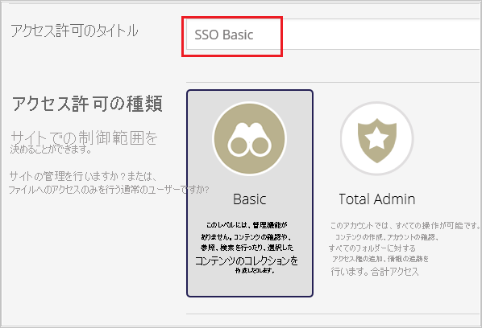

# チュートリアル: Azure Active Directory と Image Relay の統合

このチュートリアルでは、Image Relay と Azure Active Directory (Azure AD) を統合する方法について説明します。 Image Relay を Azure AD と統合すると、次のことが可能になります。

* Image Relay にアクセスする Azure AD ユーザーを制御します。
* ユーザーが自分の Azure AD アカウントを使用して Image Relay に自動的にサインインできるようにします。
* 1 つの中央サイト (Azure Portal) で自分のアカウントを管理します。

## 前提条件

開始するには、次が必要です。

* Azure AD サブスクリプション。 サブスクリプションがない場合は、[無料アカウント](https://azure.microsoft.com/free/)を取得できます。
* Image Relay でのシングル サインオン (SSO) が有効なサブスクリプション。

## シナリオの説明

このチュートリアルでは、テスト環境で Azure AD のシングル サインオンを構成してテストします。

* Image Relay では、**SP** によって開始される SSO がサポートされます。

## ギャラリーから Image Relay を追加する

Azure AD への Image Relay の統合を構成するには、ギャラリーから管理対象 SaaS アプリの一覧に Image Relay を追加する必要があります。

1. 職場または学校アカウントか、個人の Microsoft アカウントを使用して、Azure portal にサインインします。
1. 左のナビゲーション ウィンドウで **[Azure Active Directory]** サービスを選択します。
1. **[エンタープライズ アプリケーション]** に移動し、 **[すべてのアプリケーション]** を選択します。
1. 新しいアプリケーションを追加するには、 **[新しいアプリケーション]** を選択します。
1. **[ギャラリーから追加する]** セクションで、検索ボックスに「**Image Relay**」と入力します。
1. 結果パネルから **[Image Relay]** を選択し、そのアプリを追加します。 お使いのテナントにアプリが追加されるのを数秒待機します。

## Image Relay の Azure AD SSO の構成とテスト

**B.Simon** というテスト ユーザーを使用して、Image Relay に対する Azure AD SSO を構成してテストします。 SSO が機能するためには、Azure AD ユーザーと Image Relay の関連ユーザーとの間にリンク関係を確立する必要があります。

Image Relay に対して Azure AD SSO を構成してテストするには、次の手順を実行します。

1. **[Azure AD SSO の構成](#configure-azure-ad-sso)** - ユーザーがこの機能を使用できるようにします。
    1. **[Azure AD のテスト ユーザーの作成](#create-an-azure-ad-test-user)** - B.Simon で Azure AD のシングル サインオンをテストします。
    1. **[Azure AD テスト ユーザーの割り当て](#assign-the-azure-ad-test-user)** - B.Simon が Azure AD シングル サインオンを使用できるようにします。
1. **[Image Relay の SSO の構成](#configure-image-relay-sso)** - アプリケーション側でシングル サインオン設定を構成します。
    1. **[Image Relay のテスト ユーザーの作成](#create-image-relay-test-user)** - Image Relay で B.Simon に対応するユーザーを作成し、Azure AD の Britta Simon にリンクさせます。
1. **[SSO のテスト](#test-sso)** - 構成が機能するかどうかを確認します。

## Azure AD SSO の構成

これらの手順に従って、Azure portal で Azure AD SSO を有効にします。

1. Azure portal の **Image Relay** アプリケーション統合ページで、 **[管理]** セクションを見つけて **[シングル サインオン]** を選択します。
1. **[シングル サインオン方式の選択]** ページで、 **[SAML]** を選択します。
1. **[SAML によるシングル サインオンのセットアップ]** ページで、 **[基本的な SAML 構成]** の鉛筆アイコンをクリックして設定を編集します。

   

4. **[基本的な SAML 構成]** セクションで、次の手順を実行します。

    a. **[識別子 (エンティティ ID)]** ボックスに、次のパターンを使用して URL を入力します。`https://<COMPANYNAME>.imagerelay.com/sso/metadata`

    b. **[サインオン URL]** ボックスに、次のパターンを使用して URL を入力します。`https://<COMPANYNAME>.imagerelay.com/`

    > [!NOTE]
    > これらは実際の値ではありません。 これらの値を実際の識別子とサインオン URL で更新してください。 これらの値を取得するには、[Image Relay クライアント サポート チーム](http://support.imagerelay.com/)に問い合わせてください。 Azure portal の **[基本的な SAML 構成]** セクションに示されているパターンを参照することもできます。

4. **[SAML でシングル サインオンをセットアップします]** ページの **[SAML 署名証明書]** セクションで、 **[ダウンロード]** をクリックして要件のとおりに指定したオプションからの **証明書 (Base64)** をダウンロードして、お使いのコンピューターに保存します。

    

6. **[Image Relay のセットアップ]** セクションで、要件どおりの適切な URL をコピーします。

    

### Azure AD のテスト ユーザーの作成

このセクションでは、Azure portal 内で B.Simon というテスト ユーザーを作成します。

1. Azure portal の左側のウィンドウから、 **[Azure Active Directory]** 、 **[ユーザー]** 、 **[すべてのユーザー]** の順に選択します。
1. 画面の上部にある **[新しいユーザー]** を選択します。
1. **[ユーザー]** プロパティで、以下の手順を実行します。
   1. **[名前]** フィールドに「`B.Simon`」と入力します。  
   1. **[ユーザー名]** フィールドに「username@companydomain.extension」と入力します。 たとえば、「 `B.Simon@contoso.com` 」のように入力します。
   1. **[パスワードを表示]** チェック ボックスをオンにし、 **[パスワード]** ボックスに表示された値を書き留めます。
   1. **Create** をクリックしてください。

### Azure AD テスト ユーザーの割り当て

このセクションでは、B.Simon に Image Relay へのアクセスを許可して、このユーザーが Azure シングル サインオンを使用できるようにします。

1. Azure portal で **[エンタープライズ アプリケーション]** を選択し、 **[すべてのアプリケーション]** を選択します。
1. アプリケーションの一覧で **[Image Relay]** を選択します。
1. アプリの概要ページで、 **[管理]** セクションを見つけて、 **[ユーザーとグループ]** を選択します。
1. **[ユーザーの追加]** を選択し、 **[割り当ての追加]** ダイアログで **[ユーザーとグループ]** を選択します。
1. **[ユーザーとグループ]** ダイアログの [ユーザー] の一覧から **[B.Simon]** を選択し、画面の下部にある **[選択]** ボタンをクリックします。
1. ユーザーにロールが割り当てられることが想定される場合は、 **[ロールの選択]** ドロップダウンからそれを選択できます。 このアプリに対してロールが設定されていない場合は、[既定のアクセス] ロールが選択されていることを確認します。
1. **[割り当ての追加]** ダイアログで、 **[割り当て]** をクリックします。

## Image Relay の SSO の構成

1. 別のブラウザー ウィンドウで、管理者として Image Relay 企業サイトにサインインします。

2. 上部にあるツール バーで **[Users & Permissions]** ワークロードをクリックします。

    ![ツール バーで [Users & Permissions]\(ユーザーとアクセス許可\) が選択されているスクリーンショット。](./media/imagerelay-tutorial/users.png) 

3. **[Create New Permission (新しいアクセス許可を作成)]** をクリックします。

    

4. **[Single Sign On Settings]** ワークロードで、 **[This Group can only sign-in via Single Sign On]** チェックボックスをオンにして **[Save]** をクリックします。

    ![オプションを選択できる [Single Sign On Settings]\(シングル サイン オンの設定\) を示すスクリーンショット。](./media/imagerelay-tutorial/save-settings.png) 

5. **[Account Settings (アカウントの設定)]** に移動します。

    ![[Account Settings]\(アカウントの設定\) ツール バー オプションを示すスクリーンショット。](./media/imagerelay-tutorial/account.png) 

6. **[Single Sign On Settings (シングル サインオンの設定)]** ワークロードに移動します。

    ![[Single Sign On Settings]\(シングル サインオンの設定\) メニュー オプションを示すスクリーンショット。](./media/imagerelay-tutorial/settings.png)

7. **[SAML Settings (SAML の設定)]** ダイアログで、次の手順を実行します。

    ![情報を入力できる [SAML Settings]\(SAML の設定\) ダイアログ ボックスを示すスクリーンショット。](./media/imagerelay-tutorial/information.png)

    a. **[Login URL]\(ログイン URL\)** ボックスに、Azure portal からコピーした **[ログイン URL]** の値を貼り付けます。

    b. **[ログアウト URL]** ボックスに、Azure portal からコピーした **ログアウト URL** の値を貼り付けます。

    c. **[Name Id Format]** として **[urn:oasis:names:tc:SAML:1.1:nameid-format:emailAddress]** を選択します。

    d. **[Binding Options for Requests from the Service Provider (Image Relay)]** で **[POST Binding]** を選択します。

    e. **[x.509 Certificate]** の下にある **[Update Certificate]** をクリックします。

    

    f. ダウンロードした証明書をメモ帳で開き、その内容をコピーして、 **[x.509 Certificate]\(x.509 証明書\)** ボックスに貼り付けます。

    

    g. **[Just-In-Time User Provisioning]** で、 **[Enable Just-In-Time User Provisioning]** をオンにします。

    ![有効にするコントロールが選択されている [Just-In-Time User Provisioning]\(Just-In-Time ユーザー プロビジョニング\) セクションを示すスクリーンショット。](./media/imagerelay-tutorial/provisioning.png)

    h. シングル サインオンによるサインインのみを許可するアクセス許可グループを選択します ( **[SSO Basic]** など)。

    ![[S S O Basic] が選択されている [Just-In-Time User Provisioning]\(Just-In-Time ユーザー プロビジョニング\) セクションを示すスクリーンショット。](./media/imagerelay-tutorial/user-provisioning.png)

    i. **[保存]** をクリックします。

### Image Relay の テスト ユーザーの作成

このセクションの目的は、Image Relay で Britta Simon というユーザーを作成することです。

**Image Relay で Britta Simon というユーザーを作成するには、次の手順に従います。**

1. Image Relay 企業サイトに管理者としてログインします。

2. **[Users & Permissions]\(ユーザーとアクセス許可\)** に移動して **[Create SSO User]\(SSO ユーザーの作成\)** を選択します。

    ![メニューで選択されている [Create S S O User]\(S S O ユーザーの作成\) を示すスクリーンショット。](./media/imagerelay-tutorial/create-user.png) 

3. プロビジョニングするユーザーの **[Email]\(電子メール\)** 、 **[First Name]\(名\)** 、 **[Last Name]\(姓\)** 、 **[Company]\(会社\)** を入力し、シングル サインオンのみでサインインできるアクセス許可グループ ([SSO Basic]\(SSO Basic\) など) を選択します。

    ![必要な情報を入力できる [Create a S S O User]\(S S O ユーザーの作成\) ページを示すスクリーンショット。](./media/imagerelay-tutorial/user-details.png)

4. **Create** をクリックしてください。

## SSO のテスト

このセクションでは、次のオプションを使用して Azure AD のシングル サインオン構成をテストします。 

* Azure portal で **[このアプリケーションをテストします]** をクリックします。 これにより、ログイン フローを開始する Image Relay のサインオン URL にリダイレクトされます。 

* Image Relay のサインオン URL に直接移動し、そこからログイン フローを開始します。

* Microsoft マイ アプリを使用することができます。 マイ アプリで [Image Relay] タイルをクリックすると、Image Relay のサインオン URL にリダイレクトされます。 マイ アプリの詳細については、[マイ アプリの概要](../user-help/my-apps-portal-end-user-access.md)に関するページを参照してください。

## 次のステップ

Image Relay を構成したら、組織の機密データを流出と侵入からリアルタイムで保護するセッション制御を適用できます。 セッション制御は、条件付きアクセスを拡張したものです。 [Microsoft Cloud App Security でセッション制御を強制する方法](/cloud-app-security/proxy-deployment-aad)をご覧ください。
