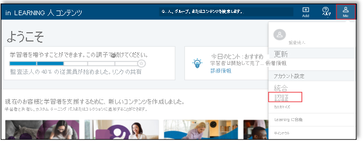
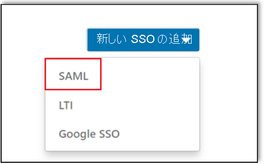
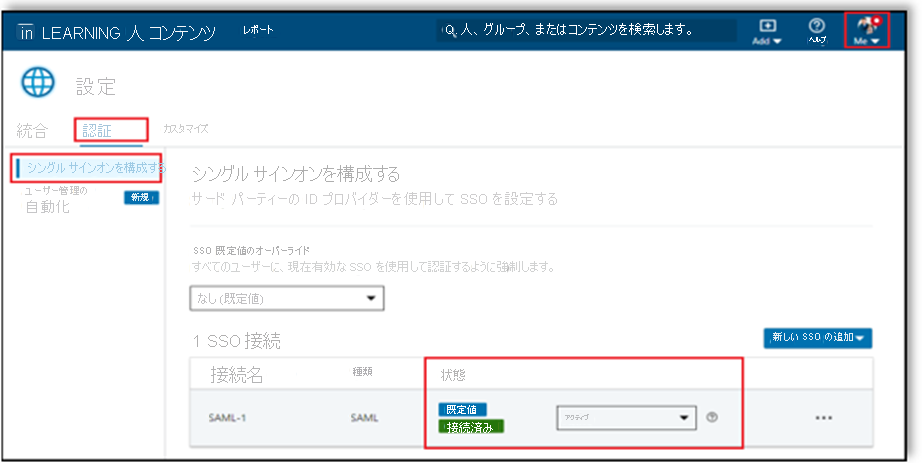

# チュートリアル:Azure Active Directory シングル サインオン (SSO) と LinkedIn Learning の統合

このチュートリアルでは、LinkedIn Learning と Azure Active Directory (Azure AD) を統合する方法について説明します。 LinkedIn Learning を Azure AD と統合すると、次のことができます。

* LinkedIn Learning にアクセスできるユーザーを Azure AD で制御できます。
* ユーザーが自分の Azure AD アカウントを使用して LinkedIn Learning に自動的にサインインできるように設定できます。
* 1 つの中央サイト (Azure Portal) で自分のアカウントを管理します。

## 前提条件

開始するには、次が必要です。

* Azure AD サブスクリプション。 サブスクリプションがない場合は、[無料アカウント](https://azure.microsoft.com/free/)を取得できます。
* LinkedIn Learning でのシングル サインオン (SSO) が有効なサブスクリプション

## シナリオの説明

このチュートリアルでは、テスト環境で Azure AD の SSO を構成してテストします。

* LinkedIn Learning では、**SP と IDP** によって開始される SSO がサポートされます。
* LinkedIn Learning では、**Just-In-Time** ユーザー プロビジョニングがサポートされます。

## LinkedIn Learning をギャラリーから追加する

Azure AD への LinkedIn Learning の統合を構成するには、ギャラリーから管理対象 SaaS アプリの一覧に LinkedIn Learning を追加する必要があります。

1. 職場または学校アカウントか、個人の Microsoft アカウントを使用して、Azure portal にサインインします。
1. 左のナビゲーション ウィンドウで **[Azure Active Directory]** サービスを選択します。
1. **[エンタープライズ アプリケーション]** に移動し、 **[すべてのアプリケーション]** を選択します。
1. 新しいアプリケーションを追加するには、 **[新しいアプリケーション]** を選択します。
1. **[ギャラリーから追加する]** セクションで、検索ボックスに「**LinkedIn Learning**」と入力します。
1. 結果のパネルから **[LinkedIn Learning]** を選択し、アプリを追加します。 お使いのテナントにアプリが追加されるのを数秒待機します。

## LinkedIn Learning の Azure AD SSO の構成とテスト

**B.Simon** というテスト ユーザーを使用して、LinkedIn Learning に対する Azure AD SSO を構成してテストします。 SSO が機能するためには、Azure AD ユーザーと LinkedIn Learning の関連ユーザーとの間にリンク関係を確立する必要があります。

LinkedIn Learning に対する Azure AD SSO を構成してテストするには、次の手順を行います。

1. **[Azure AD SSO の構成](#configure-azure-ad-sso)** - ユーザーがこの機能を使用できるようにします。
    1. **[Azure AD のテスト ユーザーの作成](#create-an-azure-ad-test-user)** - B.Simon で Azure AD のシングル サインオンをテストします。
    1. **[Azure AD テスト ユーザーの割り当て](#assign-the-azure-ad-test-user)** - B.Simon が Azure AD シングル サインオンを使用できるようにします。
1. **[LinkedIn Learning の SSO の構成](#configure-linkedin-learning-sso)** - アプリケーション側でシングル サインオン設定を構成します。
    1. **[ライセンスの割り当て](#assign-licenses)** - LinkedIn Learning で B.Simon に対応するユーザーを作成し、Azure AD の B.Simon にリンクさせます。
1. **[SSO のテスト](#test-sso)** - 構成が機能するかどうかを確認します。

## Azure AD SSO の構成

これらの手順に従って、Azure portal で Azure AD SSO を有効にします。

1. Azure portal の **LinkedIn Learning** アプリケーション統合ページで、 **[管理]** セクションを見つけて、 **[シングル サインオン]** を選択します。
1. **[シングル サインオン方式の選択]** ページで、 **[SAML]** を選択します。
1. **[SAML によるシングル サインオンのセットアップ]** ページで、 **[基本的な SAML 構成]** の鉛筆アイコンをクリックして設定を編集します。

   

1. **[基本的な SAML 構成]** セクションで、アプリケーションを **IDP** 開始モードで構成する場合は、次の手順を実行します。

    a. **[識別子]** ボックスに、LinkedIn ポータルからコピーした **エンティティ ID** を入力します。 

    b. **[応答 URL]** ボックスに、LinkedIn ポータルからコピーした **Assertion Consumer Service (ACS) URL** を入力します。

    c. アプリケーションを **SP 開始** モードで構成する場合は、サインオン URL を指定する **[基本的な SAML 構成]** セクションで **[追加の URL を設定します]** オプションをクリックします。 ログイン URL を作成するには、**Assertion Consumer Service (ACS) URL** をコピーして、/saml/ を /login/ で置き換えます。 これが終了すると、サインオン URL は次のパターンになります。

    `https://www.linkedin.com/checkpoint/enterprise/login/<AccountId>?application=learning&applicationInstanceId=<InstanceId>`

    > [!NOTE]
    > これらは実際の値ではありません。 これらの値は、実際の識別子、応答 URL、およびサインオン URL に更新します。これについては、このチュートリアルの「**LinkedIn Learning の SSO の構成**」セクションで後述します。

1. LinkedIn Learning アプリケーションでは、特定の形式の SAML アサーションを使用するため、カスタム属性マッピングをSAML トークン属性の構成に追加する必要があります。 次のスクリーンショットは、既定の属性の一覧を示しています。ここで、**nameidentifier** は **user.userprincipalname** にマップされています。 LinkedIn Learning アプリケーションでは、**nameidentifier** が **user.mail** にマップされると想定されているため、 **[編集]** アイコンをクリックして属性マッピングを編集し、属性マッピングを変更する必要があります。

    

1. **[SAML でシングル サインオンをセットアップします]** ページの **[SAML 署名証明書]** セクションで、 **[フェデレーション メタデータ XML]** を探して **[ダウンロード]** を選択し、証明書をダウンロードして、お使いのコンピューターに保存します。

    

1. **[LinkedIn Learning のセットアップ]** セクションで、要件に基づいて適切な URL をコピーします。

    

### Azure AD のテスト ユーザーの作成

このセクションでは、Azure portal 内で B.Simon というテスト ユーザーを作成します。

1. Azure portal の左側のウィンドウから、 **[Azure Active Directory]** 、 **[ユーザー]** 、 **[すべてのユーザー]** の順に選択します。
1. 画面の上部にある **[新しいユーザー]** を選択します。
1. **[ユーザー]** プロパティで、以下の手順を実行します。
   1. **[名前]** フィールドに「`B.Simon`」と入力します。  
   1. **[ユーザー名]** フィールドに「username@companydomain.extension」と入力します。 たとえば、「 `B.Simon@contoso.com` 」のように入力します。
   1. **[パスワードを表示]** チェック ボックスをオンにし、 **[パスワード]** ボックスに表示された値を書き留めます。
   1. **Create** をクリックしてください。

### Azure AD テスト ユーザーの割り当て

このセクションでは、B.Simon に LinkedIn Learning へのアクセスを許可することで、このユーザーが Azure シングル サインオンを使用できるようにします。

1. Azure portal で **[エンタープライズ アプリケーション]** を選択し、 **[すべてのアプリケーション]** を選択します。
1. アプリケーションの一覧で **[LinkedIn Learning]** を選択します。
1. アプリの概要ページで、 **[管理]** セクションを見つけて、 **[ユーザーとグループ]** を選択します。
1. **[ユーザーの追加]** を選択し、 **[割り当ての追加]** ダイアログで **[ユーザーとグループ]** を選択します。
1. **[ユーザーとグループ]** ダイアログの [ユーザー] の一覧から **[B.Simon]** を選択し、画面の下部にある **[選択]** ボタンをクリックします。
1. ユーザーにロールが割り当てられることが想定される場合は、 **[ロールの選択]** ドロップダウンからそれを選択できます。 このアプリに対してロールが設定されていない場合は、[既定のアクセス] ロールが選択されていることを確認します。
1. **[割り当ての追加]** ダイアログで、 **[割り当て]** をクリックします。

## LinkedIn Learning の SSO の構成

1. LinkedIn Learning の企業サイトに管理者としてログインします。

1. **[Go to Admin]\(管理者に移動\)**  >  **[Me]**  >  **[Authenticate]\(認証\)** を選択します。 

     

1. **[Authenticate]\(認証\)** で **[Configure single sign-on]\(シングル サインオンの構成\)** を選択し、 **[Add new SSO]\(新しい SSO の追加\)** をクリックします。    

    

1. **[Add new SSO]\(新しい SSO の追加\)** ドロップダウンから **[SAML]** を選択します。

    

1. **[Basics]\(基本\)** タブで、 **[SAML Connection Name]\(SAML 接続名\)** を入力し、 **[Next]\(次へ\)** をクリックします。

    

1. **[Identity provider settings]\(ID プロバイダーの設定\)** タブに移動し、 **[Download file]\(ファイルのダウンロード\)** をクリックしてメタデータ ファイルをダウンロードし、コンピューターに保存して **[Next]\(次へ\)** をクリックします。

    

    > [!NOTE]    
    > このファイルを ID プロバイダーにインポートできない可能性があります。 たとえば、Okta にはこの機能がありません。 このケースが構成要件に該当する場合、個々のフィールドの操作を続行します。

1. **[Identity provider settings]\(ID プロバイダーの設定\)** タブで、 **[Load and copy information from fields]\(フィールドから情報を読み込んでコピー\)** をクリックして必要なフィールドをコピーし、Azure portal の **[基本的な SAML 構成]** セクションに貼り付け、 **[Next]\(次へ\)** をクリックします。

    

1. **[SSO settings]\(SSO 設定\)** タブで、 **[Upload XML file]\(XML ファイルのアップロード\)** をクリックし、Azure portal からダウンロードした **フェデレーション メタデータ XML** ファイルをアップロードします。

    

1. **[SSO settings]\(SSO 設定\)** タブで、Azure portal からコピーした必須フィールドに手動で入力します。

    

1. **[SSO settings]\(SSO 設定\)** で、要件に従って SSO オプションを選択し、 **[Save]\(保存\)** をクリックします。

    

#### シングル サインオンの有効化

構成が完了したら、SSO のステータス ドロップダウンから **[Active]\(アクティブ\)** を選択して SSO を有効にします。

  

### ライセンスの割り当て

SSO を有効にすると、 **[Automatically provision licenses]\(ライセンスの自動プロビジョニング\)** を **[On]\(オン\)** にして **[Save]\(保存\)** をクリックすることで、従業員にライセンスを自動的に割り当てることができます。 このオプションを有効にすると、ユーザーが初めて認証されたときにライセンスが自動的に付与されます。

   

> [!NOTE]   
> このオプションを有効にしない場合、管理者は [People]\(人\) タブでユーザーを手動で追加する必要があります。LinkedIn Learning は電子メール アドレスでユーザーを識別します。

## SSO のテスト 

このセクションでは、次のオプションを使用して Azure AD のシングル サインオン構成をテストします。 

#### SP Initiated:

* Azure portal で **[このアプリケーションをテストします]** をクリックします。 これにより、ログイン フローを開始できる LinkedIn Learning のサインオン URL にリダイレクトされます。  

* LinkedIn Learning のサインオン URL に直接移動し、そこからログイン フローを開始します。

#### IDP Initiated:

* Azure portal で **[このアプリケーションをテストします]** をクリックすると、SSO を設定した LinkedIn Learning に自動的にサインインされます。 

また、Microsoft マイ アプリを使用して、任意のモードでアプリケーションをテストすることもできます。 マイ アプリで [LinkedIn Learning] タイルをクリックすると、SP モードで構成されている場合は、ログイン フローを開始するためのアプリケーション サインオン ページにリダイレクトされます。IDP モードで構成されている場合は、SSO を設定した LinkedIn Learning に自動的にサインインされます。 マイ アプリの詳細については、[マイ アプリの概要](../user-help/my-apps-portal-end-user-access.md)に関するページを参照してください。

## 次のステップ

LinkedIn Learning を構成したら、組織の機密データを流出と侵入からリアルタイムで保護するセッション制御を適用することができます。 セッション制御は、条件付きアクセスを拡張したものです。 [Microsoft Cloud App Security でセッション制御を強制する方法](/cloud-app-security/proxy-deployment-aad)をご覧ください。
