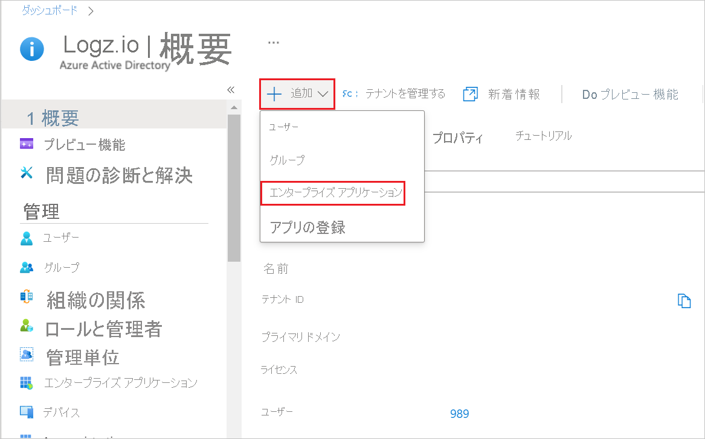
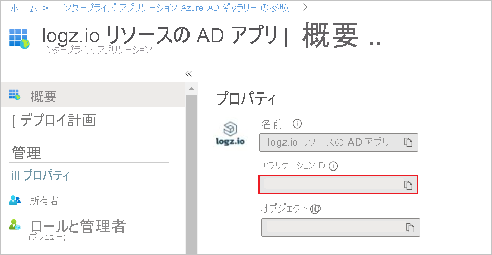
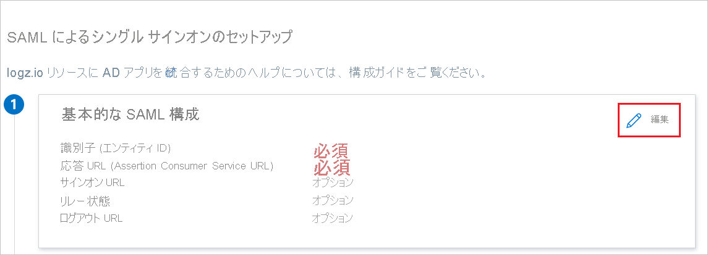
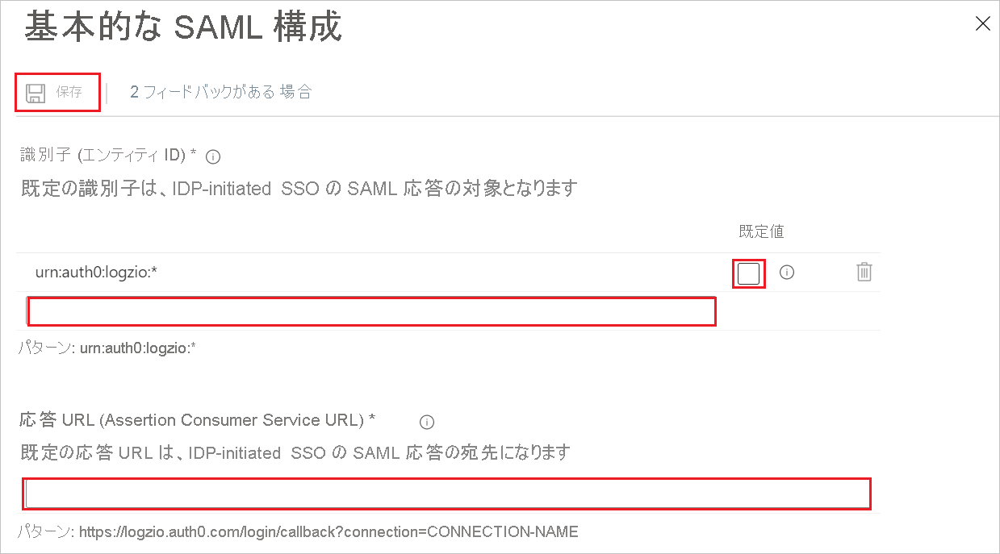
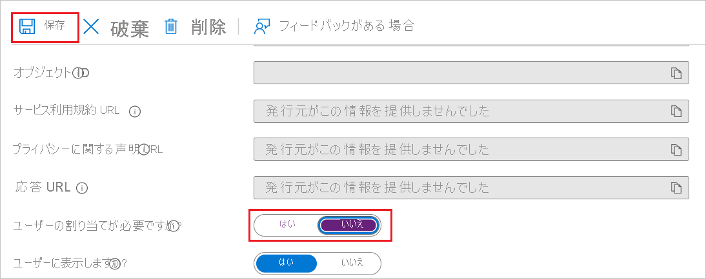

# チュートリアル: Logz.io - Azure AD Integration の Azure Active Directory シングル サインオン (SSO) の設定

## Logz.io - Azure portal 統合のシングル サインオン (SSO)

Logz.io は Azure Marketplace との統合を提供します。 このトピックは、管理者が Logz.io - Azure portal 統合の SSO を設定するためのガイダンスとなります。これにより、Microsoft Azure Marketplace 経由で Logz.io リソースにアクセスするユーザーのための SSO リンクが有効になります。

### メリット

SSO を介した Logz.io Azure リソースへのアクセスをユーザーに提供する利点は次の通りです。 

+ ユーザーごとに一意のユーザー名とパスワードを事前に定義する必要はありません。SSO リンクを持つすべてのユーザーがアプリケーションにサインインできます。
+ ユーザー制御の向上: ユーザーを Azure アカウントで定義して、SSO リンクを使用できるようにする必要があります。

Logz.io の Azure リソースを設定する前に、SSO 接続を準備してください。 リソースを設定するには、このプロセスで作成した資格情報が必要です。 

### Azure Active Directory で Logz.io リソースの SSO 接続を作成する 

SSO を使用して Azure リソースから Logz.io アカウントに接続できるようにするために、Azure Active Directory (AD) Enterprise アプリケーションを作成します。 

### 前提条件: 

開始するには、以下の特権が必要です。

* Azure Active Directory (AAD) へのアクセス
* 新しいエンタープライズ アプリケーションを作成するためのアクセス許可
* Logz.io リソースを作成している Azure サブスクリプションの所有者ロール アクセス許可 

Logz.io - Azure 統合リソース用に作成された SSO リンクにアクセスして使用できるようにするには、関連する Azure アカウントでユーザーが定義されている必要があります。 

#### Logz.io - Azure portal リソースの SSO リンクを設定する

##### ギャラリーから Logz.io - Azure Active Directory Integration を追加する

Azure portal で Logz.io リソースの SSO を構成するには、Logz.io - Azure AD Integration をギャラリーからマネージド SaaS アプリの一覧に追加する必要があります。

1. Azure portal に、Microsoft アカウントを使用してサインインします。
2. Azure portal の **[Logz.io | Overview]\(Logz.io | 概要\)** の **[+ 追加]** メニューで、 **[エンタープライズ アプリケーション]** を選択します。

   
   
3. [Azure Active Directory ギャラリー] で、 **[Logz.io - Azure AD Integration]** アプリケーションを参照して選択します。
4. 関連する名前でその統合の名前を変更し、 **[作成]** をクリックします。 (この後の手順では、**AD app for a logz.io resource** という名前を使用しました)

   

##### アプリケーション ID をコピーする

**[AD app for a logz.io resource (logz.io リソースの AD アプリ) | 概要] > [プロパティ]** で、 **[アプリケーション ID]** プロパティをコピーします。

##### Azure AD SSO の構成

1. **[AD app for a logz.io resource (logz.io リソースの AD アプリ) | 概要] > [作業の開始]** の **[2. シングル サインオンを設定する]** で、 **[はじめに]** をクリックして **[シングル サインオン]** を開きます。

   

2. **[AD app for a logz.io resource (logz.io リソースの AD アプリ) | シングル サインオン]** で、 **[SAML]** 方式を選択します。

   

##### 基本的な SAML 構成   

1. **[AD app for a logz.io resource (logz.io リソースの AD アプリ) | SAML ベースのサインオン]** で、 **[編集]** をクリックして **[基本的な SAML 構成]** パネルを開きます。

   

2. **[識別子 (エンティティ ID)]** テキスト ボックスに、パターン `urn:auth0:logzio:*` を使用して値を入力します。`*` を、手順 2 でコピーした **アプリケーション ID** に置き換え、 **[既定]** オプションをクリックします。 

3. **[応答 URL (Assertion Consumer Service URL)]** テキスト ボックスに、パターン `https://logzio.auth0.com/login/callback?connection=` を使用して URL を入力します。`CONNECTION_NAME` を、手順 2 でコピーした **アプリケーション ID** に置き換えます。

4. パネルの上部にある **[保存]** をクリックします。

    

##### ユーザー割り当てオプションを構成する    

**[AD app for a logz.io resource (logz.io リソースの AD アプリ) | プロパティ]  ([管理] > [プロパティ])** で、 **[ユーザーの割り当てが必要ですか?]** を **[いいえ]** に設定して **[保存]** をクリックします。  
この手順により、SSO リンクにアクセスできるユーザーが Microsoft Azure portal を介して Logz.io にサインインできるようになり、Active Directory で各ユーザーを事前に定義する必要はありません。

このオプションにより、Active Directory で定義されているユーザーが SSO リンクを使用できるようになり、先ほど作成した AD アプリから各ユーザーに対して特定のアクセス権を定義する必要はありません。 

このオプションを構成したくない場合、組織は Logz.io に対する特定のアクセス権を各ユーザーに割り当てる必要があります。

### Azure Active Directory を介して Logz.io リソースの SSO を有効にする

Logz.io アカウントを作成するときに、Logz.io リソース用に作成した AD アプリを使用して、Azure Active Directory によるシングル サインオンを有効にします。  

Logz.io AAD アプリ リソース名は、入力を開始すると自動的に入力されます。

SSO リンクは、Logz.io リソースにサインインすると表示されます。   
そのリンクをクリックして、Logz.io のアカウントにアクセスします。 

Logz.io リソースの作成中に SSO を構成しない場合は、後で [シングル サインオン] ブレードを使用して構成できます。

ログが Logz.io に送信されるように、Azure でログを構成する必要があります。

## 既存の Logz.io アカウントに対する Azure Active Directory シングル サインオン

このセクションでは、Logz.io - Azure AD Integration と Azure Active Directory (Azure AD) を統合する方法について説明します。 Logz.io - Azure AD Integration と Azure AD を統合すると、次のことができます。

* Logz.io - Azure AD Integration にアクセスできるユーザーを Azure AD で制御できます。
* ユーザーが自分の Azure AD アカウントを使用して Logz.io - Azure AD Integration に自動的にサインインできるように設定できます。
* 1 つの中央サイト (Azure Portal) で自分のアカウントを管理します。

### 前提条件

開始するには、次が必要です。

* Azure AD サブスクリプション。 サブスクリプションがない場合は、[無料アカウント](https://azure.microsoft.com/free/)を取得できます。
* Logz.io - Azure AD Integration でのシングル サインオンが有効なサブスクリプション

### シナリオの説明

このチュートリアルでは、テスト環境で Azure AD の SSO を構成してテストします。

* Logz.io - Azure AD Integration では、**IDP** Initiated SSO がサポートされます。

### ギャラリーからの Logz.io - Azure AD Integration の追加

Azure AD への Logz.io - Azure AD Integration の統合を構成するには、ギャラリーからマネージド SaaS アプリの一覧に Logz.io - Azure AD Integration を追加する必要があります。

1. 職場または学校アカウントか、個人の Microsoft アカウントを使用して、Azure portal にサインインします。
1. 左のナビゲーション ウィンドウで **[Azure Active Directory]** サービスを選択します。
1. **[エンタープライズ アプリケーション]** に移動し、 **[すべてのアプリケーション]** を選択します。
1. 新しいアプリケーションを追加するには、 **[新しいアプリケーション]** を選択します。
1. **[ギャラリーから追加する]** セクションで、検索ボックスに「**Logz.io - Azure AD Integration**」と入力します。
1. 結果のパネルから **[Logz.io - Azure AD Integration]** を選択し、アプリを追加します。 お使いのテナントにアプリが追加されるのを数秒待機します。

### Logz.io - Azure AD Integration 用の Microsoft Azure Active Directory SSO の構成とテスト

**B.Simon** というテスト ユーザーを使用して、Logz.io - Azure AD Integration に対する Azure AD SSO を構成してテストします。 SSO を機能させるためには、Azure AD ユーザーと Logz.io - Azure AD Integration の関連ユーザーとの間にリンク関係を確立する必要があります。

Microsoft Azure Active Directory SSO を Logz.io - Azure AD Integration と一緒に構成してテストするには、次の手順を実行します。

1. **[Azure AD SSO の構成](#configure-azure-ad-sso)** - ユーザーがこの機能を使用できるようにします。
    1. **[Azure AD のテスト ユーザーの作成](#create-an-azure-ad-test-user)** - B.Simon で Azure AD のシングル サインオンをテストします。
    1. **[Azure AD テスト ユーザーの割り当て](#assign-the-azure-ad-test-user)** - B.Simon が Azure AD シングル サインオンを使用できるようにします。
1. **[Logz.io - Azure AD Integration の SSO の構成](#configure-logzio-azure-ad-integration-sso)** - アプリケーション側でシングル サインオン設定を構成します。
    1. **[Logz.io - Azure AD Integration のテスト ユーザーの作成](#create-logzio-azure-ad-integration-test-user)** - Logz.io - Azure AD Integration で B.Simon に対応するユーザーを作成し、Azure AD の B.Simon にリンクさせます。
1. **[SSO のテスト](#test-sso)** - 構成が機能するかどうかを確認します。

### Azure AD SSO の構成

これらの手順に従って、Azure portal で Azure AD SSO を有効にします。

1. Azure portal の **Logz.io - Azure AD Integration** アプリケーション統合ページで、 **[管理]** セクションを探して、 **[シングル サインオン]** を選択します。
1. **[シングル サインオン方式の選択]** ページで、 **[SAML]** を選択します。
1. **[SAML によるシングル サインオンのセットアップ]** ページで、 **[基本的な SAML 構成]** の鉛筆アイコンをクリックして設定を編集します。

   

1. **[SAML でシングル サインオンをセットアップします]** ページで、次の手順を実行します。

    a. **[識別子]** ボックスに、`urn:auth0:logzio:CONNECTION-NAME` の形式で値を入力します。

    b. **[応答 URL]** ボックスに、`https://logzio.auth0.com/login/callback?connection=CONNECTION-NAME` のパターンを使用して URL を入力します

    > [!NOTE]
    > これらは実際の値ではありません。 実際の識別子と応答 URL でこれらの値を更新します。 この値を取得するには、[Logz.io - Azure AD Integration クライアント サポート](mailto:help@logz.io) チームに問い合わせてください。 Azure portal の **[基本的な SAML 構成]** セクションに示されているパターンを参照することもできます。

1. Logz.io - Azure AD Integration アプリケーションでは、特定の形式の SAML アサーションを使用するため、カスタム属性マッピングを SAML トークン属性の構成に追加する必要があります。 次のスクリーンショットには、既定の属性一覧が示されています。

    

1. その他に、Logz.io - Azure AD Integration アプリケーションでは、さらにいくつかの属性が SAML 応答で返されることが想定されています。それらの属性を次に示します。 これらの属性も値が事前に設定されますが、要件に従ってそれらの値を確認することができます。
    
    | 名前 |  ソース属性|
    | ---------------| --------- |
    | session-expiration | user.session-expiration |
    | email | User.mail |
    | グループ | user.groups |

1. **[SAML でシングル サインオンをセットアップします]** ページの **[SAML 署名証明書]** セクションで、 **[証明書 (Base64)]** を見つけて、 **[ダウンロード]** を選択し、証明書をダウンロードして、お使いのコンピューターに保存します。

    

1. **[Logz.io - Azure AD Integration のセットアップ]** セクションで、要件に基づいて適切な URL をコピーします。

    

#### Azure AD のテスト ユーザーの作成

このセクションでは、Azure portal 内で B.Simon というテスト ユーザーを作成します。

1. Azure portal の左側のウィンドウから、 **[Azure Active Directory]** 、 **[ユーザー]** 、 **[すべてのユーザー]** の順に選択します。
1. 画面の上部にある **[新しいユーザー]** を選択します。
1. **[ユーザー]** プロパティで、以下の手順を実行します。
   1. **[名前]** フィールドに「`B.Simon`」と入力します。  
   1. **[ユーザー名]** フィールドに「username@companydomain.extension」と入力します。 たとえば、「 `B.Simon@contoso.com` 」のように入力します。
   1. **[パスワードを表示]** チェック ボックスをオンにし、 **[パスワード]** ボックスに表示された値を書き留めます。
   1. **Create** をクリックしてください。

#### Azure AD テスト ユーザーの割り当て

このセクションでは、Logz.io - Azure AD Integration へのアクセスを許可することで、B.Simon が Azure シングル サインオンを使用できるようにします。

1. Azure portal で **[エンタープライズ アプリケーション]** を選択し、 **[すべてのアプリケーション]** を選択します。
1. アプリケーションの一覧で **[Logz.io - Azure AD Integration]** を選択します。
1. アプリの概要ページで、 **[管理]** セクションを見つけて、 **[ユーザーとグループ]** を選択します。
1. **[ユーザーの追加]** を選択し、 **[割り当ての追加]** ダイアログで **[ユーザーとグループ]** を選択します。
1. **[ユーザーとグループ]** ダイアログの [ユーザー] の一覧から **[B.Simon]** を選択し、画面の下部にある **[選択]** ボタンをクリックします。
1. SAML アサーション内に任意のロール値が必要な場合、 **[ロールの選択]** ダイアログでユーザーに適したロールを一覧から選択し、画面の下部にある **[選択]** をクリックします。
1. **[割り当ての追加]** ダイアログで、 **[割り当て]** をクリックします。

### Logz.io Azure AD Integration の SSO の構成

**Logz.io - Azure AD Integration** 側でシングル サインオンを構成するには、ダウンロードした **証明書 (Base64)** と Azure portal からコピーした適切な URL を [Logz.io - Azure AD Integration サポート チーム](mailto:help@logz.io)に送信する必要があります。 サポート チームはこれを設定して、SAML SSO 接続が両方の側で正しく設定されるようにします。

#### Logz.io Azure AD Integration のテスト ユーザーの作成

このセクションでは、Logz.io - Azure AD Integration で Britta Simon というユーザーを作成します。 [Logz.io - Azure AD Integration サポート チーム](mailto:help@logz.io)と連携し、Logz.io - Azure AD Integration プラットフォームにユーザーを追加してください。 シングル サインオンを使用する前に、ユーザーを作成し、有効化する必要があります。

### SSO のテスト 

このセクションでは、次のオプションを使用して Azure AD のシングル サインオン構成をテストします。

* Azure portal で [このアプリケーションをテストします] をクリックすると、SSO を設定した Logz.io Azure AD Integration に自動的にサインインされます。

* Microsoft マイ アプリを使用することができます。 マイ アプリで [Logz.io Azure AD Integration] タイルをクリックすると、SSO を設定した Logz.io Azure AD Integration に自動的にサインインします。 マイ アプリの詳細については、[マイ アプリの概要](https://support.microsoft.com/account-billing/sign-in-and-start-apps-from-the-my-apps-portal-2f3b1bae-0e5a-4a86-a33e-876fbd2a4510)に関するページを参照してください。

### 次のステップ

Logz.io Azure AD Integration を構成したら、組織の機密データを流出と侵入からリアルタイムで保護するセッション制御を適用することができます。 セッション制御は、条件付きアクセスを拡張したものです。 [Microsoft Cloud App Security でセッション制御を強制する方法](/cloud-app-security/proxy-deployment-aad)をご覧ください。