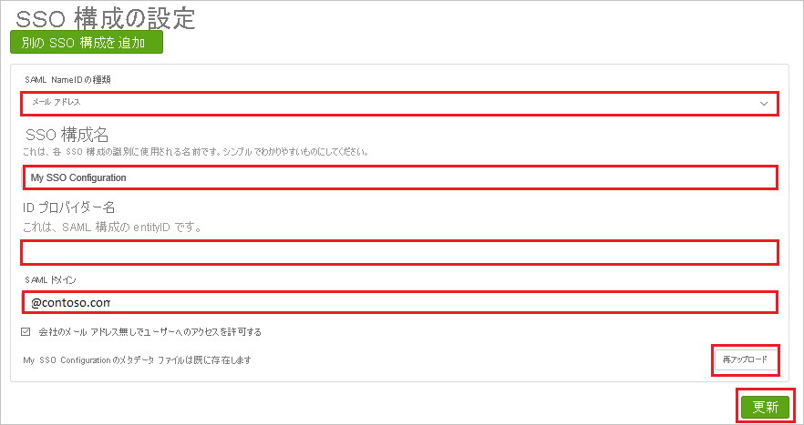

# チュートリアル: Azure AD SSO と Perception United States (非 UltiPro) の統合

このチュートリアルでは、Perception United States (非 UltiPro) と Azure Active Directory (Azure AD) を統合する方法について説明します。 Perception United States (非 UltiPro) と Azure AD を統合すると、次のことができます。

* Perception United States (非 UltiPro) にアクセスできるユーザーを Azure AD で制御する。
* ユーザーが自分の Azure AD アカウントで Perception United States (非 UltiPro) に自動的にサインインできるようにする。
* 1 つの中央サイト (Azure Portal) で自分のアカウントを管理します。

## 前提条件

開始するには、次が必要です。

* Azure AD サブスクリプション。 サブスクリプションがない場合は、[無料アカウント](https://azure.microsoft.com/free/)を取得できます。
* Perception United States (非 UltiPro) でのシングル サインオン (SSO) が有効なサブスクリプション。

## シナリオの説明

このチュートリアルでは、テスト環境で Azure AD のシングル サインオンを構成してテストします。

* Perception United States (非 UltiPro) では、**IDP** Initiated SSO がサポートされます。

> [!NOTE]
> このアプリケーションの識別子は固定文字列値であるため、1 つのテナントで構成できるインスタンスは 1 つだけです。

## ギャラリーから Perception United States (非 UltiPro) を追加する

Azure AD への Perception United States (非 UltiPro) の統合を構成するには、ギャラリーから管理対象 SaaS アプリの一覧に Perception United States (非 UltiPro) を追加する必要があります。

1. 職場または学校アカウントか、個人の Microsoft アカウントを使用して、Azure portal にサインインします。
1. 左のナビゲーション ウィンドウで **[Azure Active Directory]** サービスを選択します。
1. **[エンタープライズ アプリケーション]** に移動し、 **[すべてのアプリケーション]** を選択します。
1. 新しいアプリケーションを追加するには、 **[新しいアプリケーション]** を選択します。
1. **[ギャラリーから追加する]** セクションで、検索ボックスに「**Perception United States (非 UltiPro)** 」と入力します。
1. :結果のパネルから **[Perception United States (非 UltiPro)]** を選択し、アプリを追加します。 お使いのテナントにアプリが追加されるのを数秒待機します。

## Perception United States (非 UltiPro) に対する Azure AD SSO の構成とテスト

**B. Simon** というテスト ユーザーを使用して、Perception United States (非 UltiPro) に対して Azure AD SSO を構成してテストします。 SSO が機能するためには、Azure AD ユーザーと Perception United States (非 UltiPro) の関連ユーザーとの間にリンク関係を確立する必要があります。

Perception United States (非 UltiPro) に対して Azure AD SSO を構成してテストするには、次の手順に従います。

1. **[Azure AD SSO の構成](#configure-azure-ad-sso)** - ユーザーがこの機能を使用できるようにします。
    1. **[Azure AD のテスト ユーザーの作成](#create-an-azure-ad-test-user)** - B.Simon で Azure AD のシングル サインオンをテストします。
    1. **[Azure AD テスト ユーザーの割り当て](#assign-the-azure-ad-test-user)** - B.Simon が Azure AD シングル サインオンを使用できるようにします。
1. **[Perception United States (非 UltiPro) SSO の構成](#configure-perception-united-states-non-ultipro-sso)** - アプリケーション側でシングル サインオン設定を構成します。
    1. **[Perception United States (非 UltiPro) のテスト ユーザーの作成](#create-perception-united-states-non-ultipro-test-user)** - Perception United States (非 UltiPro) で B.Simon に対応するユーザーを作成し、Azure AD のそのユーザーにリンクさせます。
1. **[SSO のテスト](#test-sso)** - 構成が機能するかどうかを確認します。

## Azure AD SSO の構成

これらの手順に従って、Azure portal で Azure AD SSO を有効にします。

1. Azure portal の **Perception United States (非 UltiPro)** アプリケーション統合ページで、 **[管理]** セクションを見つけて、 **[シングル サインオン]** を選択します。
1. **[シングル サインオン方式の選択]** ページで、 **[SAML]** を選択します。
1. **[SAML によるシングル サインオンのセットアップ]** ページで、 **[基本的な SAML 構成]** の鉛筆アイコンをクリックして設定を編集します。

   

4. **[基本的な SAML 構成]** ページで、次の手順を実行します。

    a. **[識別子]** ボックスに、`https://perception.kanjoya.com/sp` という URL を入力します。

    b. **[応答 URL]** ボックスに、`https://perception.kanjoya.com/sso?idp=<entity_id>` のパターンを使用して URL を入力します

    c. **Perception United States (非 UltiPro)** アプリケーションでは、 **[Perception United States (非 UltiPro) のセットアップ]** セクションから取得する **Azure AD ID** の値 <entity_id> を URI でエンコードする必要があります。 URI でエンコードされた値を取得するには、 **http://www.url-encode-decode.com/** リンクを使用してください。

    d. URI でエンコードされた値を取得した後に、次の説明に従って、その値を **応答 URL** と結合します。

    `https://perception.kanjoya.com/sso?idp=<URI encooded entity_id>`
    
    e. **[応答 URL]** ボックスに上の値を貼り付けます。

5. **[SAML でシングル サインオンをセットアップします]** ページの **[SAML 署名証明書]** セクションで、 **[ダウンロード]** をクリックして、要件のとおりに指定したオプションから **フェデレーション メタデータ XML** をダウンロードして、お使いのコンピューターに保存します。

    

6. **[Perception United States (非 UltiPro) のセットアップ]** セクションで、要件どおりの適切な URL をコピーします。

    

### Azure AD のテスト ユーザーの作成 

このセクションでは、Azure portal 内で B.Simon というテスト ユーザーを作成します。

1. Azure portal の左側のウィンドウから、 **[Azure Active Directory]** 、 **[ユーザー]** 、 **[すべてのユーザー]** の順に選択します。
1. 画面の上部にある **[新しいユーザー]** を選択します。
1. **[ユーザー]** プロパティで、以下の手順を実行します。
   1. **[名前]** フィールドに「`B.Simon`」と入力します。  
   1. **[ユーザー名]** フィールドに「username@companydomain.extension」と入力します。 たとえば、「 `B.Simon@contoso.com` 」のように入力します。
   1. **[パスワードを表示]** チェック ボックスをオンにし、 **[パスワード]** ボックスに表示された値を書き留めます。
   1. **Create** をクリックしてください。

### Azure AD テスト ユーザーの割り当て

このセクションでは、Perception United States (非 UltiPro) へのアクセスを許可して、B.Simon が Azure シングル サインオンを使用できるようにします。

1. Azure portal で **[エンタープライズ アプリケーション]** を選択し、 **[すべてのアプリケーション]** を選択します。
1. アプリケーションの一覧で **[Perception United States (非 UltiPro)]** を選択します。
1. アプリの概要ページで、 **[管理]** セクションを見つけて、 **[ユーザーとグループ]** を選択します。
1. **[ユーザーの追加]** を選択し、 **[割り当ての追加]** ダイアログで **[ユーザーとグループ]** を選択します。
1. **[ユーザーとグループ]** ダイアログの [ユーザー] の一覧から **[B.Simon]** を選択し、画面の下部にある **[選択]** ボタンをクリックします。
1. ユーザーにロールが割り当てられることが想定される場合は、 **[ロールの選択]** ドロップダウンからそれを選択できます。 このアプリに対してロールが設定されていない場合は、[既定のアクセス] ロールが選択されていることを確認します。
1. **[割り当ての追加]** ダイアログで、 **[割り当て]** をクリックします。

## Perception United States (非 UltiPro) SSO を構成する

1. 別の Web ブラウザー ウィンドウで、管理者として Perception United States (非 UltiPro) 企業サイトにサインオンします。

2. メイン ツール バーで、 **[Account Settings]** をクリックします。

    ![メイン ツール バーから [Account Settings]\(アカウント設定\) が選択されている画面のスクリーンショット。](./media/perceptionunitedstates-tutorial/user.png)

3. **[Account Settings]** ページで、次の手順を実行します。

    

    a. **[Company Name]** ボックスに、**会社** の名前を入力します。
    
    b. **[Account Name]** ボックスに、**アカウント** の名前を入力します。

    c. **[Default Reply-To Email]** ボックスに、有効な **電子メール** を入力します。

    d. **[SSO Identity Provider]** として **[SAML 2.0]** を選択します。

4. **[SSO 構成]** ページで、次の手順を実行します。

    

    a. **[SAML NameID Type]** として **[EMAIL]** を選択します。

    b. **[SSO Configuration Name]** ボックスに **構成** の名前を入力します。
    
    c. **[Identity Provider Name]\(ID プロバイダー名\)** ボックスに、Azure portal からコピーした **Azure AD 識別子** の値を貼り付けます。 

    d. **[SAML Domain]\(SAML ドメイン\)** ボックスに「@contoso.com」のようにドメインを入力します。

    e. **[Upload Again]** をクリックして、**メタデータ XML** ファイルをアップロードします。

    f. **[Update]** をクリックします。

### Perception United States (非 UltiPro) のテスト ユーザーの作成

このセクションでは、Perception United States (非 UltiPro) で Britta Simon というユーザーを作成します。 [Perception United States (非 UltiPro) サポート チーム](https://www.ultimatesoftware.com/Contact/ContactUs)と連携し、Perception United States (非 UltiPro) プラットフォームにユーザーを追加してください。

## SSO のテスト

このセクションでは、次のオプションを使用して Azure AD のシングル サインオン構成をテストします。

* Azure portal で [このアプリケーションをテストします] をクリックすると、SSO を設定した Perception United States (非 UltiPro) に自動的にサインインします。

* Microsoft マイ アプリを使用することができます。 マイ アプリで [Perception United States (非 UltiPro)] タイルをクリックすると、SSO を設定した Perception United States (非 UltiPro) に自動的にサインインします。 マイ アプリの詳細については、[マイ アプリの概要](../user-help/my-apps-portal-end-user-access.md)に関するページを参照してください。

## 次のステップ

Perception United States (非 UltiPro) を構成したら、組織の機密データを流出と侵入からリアルタイムで保護するセッション制御を適用できます。 セッション制御は、条件付きアクセスを拡張したものです。 [Microsoft Cloud App Security でセッション制御を強制する方法](/cloud-app-security/proxy-deployment-aad)をご覧ください。