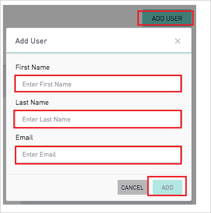

# チュートリアル: Azure AD SSO と Periscope Data の統合

このチュートリアルでは、Periscope Data と Azure Active Directory (Azure AD) を統合する方法について説明します。 Azure AD と Periscope Data を統合すると、次のことができます。

* Periscope Data にアクセスできるユーザーを Azure AD で制御できます。
* ユーザーが自分の Azure AD アカウントを使用して Periscope Data に自動的にサインインできるように設定できます。
* 1 つの中央サイト (Azure Portal) で自分のアカウントを管理します。

## 前提条件

開始するには、次が必要です。

* Azure AD サブスクリプション。 サブスクリプションがない場合は、[無料アカウント](https://azure.microsoft.com/free/)を取得できます。
* Periscope Data でのシングル サインオン (SSO) が有効なサブスクリプション。

## シナリオの説明

このチュートリアルでは、テスト環境で Azure AD のシングル サインオンを構成してテストします。

* Periscope Data では、**SP** Initiated SSO がサポートされます。

## ギャラリーから Periscope Data を追加する

Azure AD への Periscope Data の統合を構成するには、ギャラリーからマネージド SaaS アプリの一覧に Periscope Data を追加する必要があります。

1. 職場または学校アカウントか、個人の Microsoft アカウントを使用して、Azure portal にサインインします。
1. 左のナビゲーション ウィンドウで **[Azure Active Directory]** サービスを選択します。
1. **[エンタープライズ アプリケーション]** に移動し、 **[すべてのアプリケーション]** を選択します。
1. 新しいアプリケーションを追加するには、 **[新しいアプリケーション]** を選択します。
1. **[ギャラリーから追加する]** セクションで、検索ボックスに、「**Periscope Data**」と入力します。
1. 結果のパネルから **[Periscope Data]** を選択し、アプリを追加します。 お使いのテナントにアプリが追加されるのを数秒待機します。

## Periscope Data に対する Azure AD SSO の構成とテスト

**B.Simon** というテスト ユーザーを使用して、Periscope Data に対する Azure AD SSO を構成してテストします。 SSO が機能するためには、Azure AD ユーザーと Periscope Data の関連ユーザーとの間にリンク関係を確立する必要があります。

Periscope Data に対して Azure AD SSO を構成してテストするには、次の手順を実行します。

1. **[Azure AD SSO の構成](#configure-azure-ad-sso)** - ユーザーがこの機能を使用できるようにします。
    1. **[Azure AD のテスト ユーザーの作成](#create-an-azure-ad-test-user)** - B.Simon で Azure AD のシングル サインオンをテストします。
    1. **[Azure AD テスト ユーザーの割り当て](#assign-the-azure-ad-test-user)** - B.Simon が Azure AD シングル サインオンを使用できるようにします。
1. **[Periscope Data SSO の構成](#configure-periscope-data-sso)** - アプリケーション側でシングル サインオン設定を構成します。
    1. **[Periscope Data のテスト ユーザーの作成](#create-periscope-data-test-user)** - Periscope Data で B.Simon に対応するユーザーを作成し、Azure AD のそのユーザーにリンクさせます。
1. **[SSO のテスト](#test-sso)** - 構成が機能するかどうかを確認します。

## Azure AD SSO の構成

これらの手順に従って、Azure portal で Azure AD SSO を有効にします。

1. Azure portal の **Periscope Data** アプリケーション統合ページで、 **[管理]** セクションを見つけて、 **[シングル サインオン]** を選択します。
1. **[シングル サインオン方式の選択]** ページで、 **[SAML]** を選択します。
1. **[SAML によるシングル サインオンのセットアップ]** ページで、 **[基本的な SAML 構成]** の鉛筆アイコンをクリックして設定を編集します。

   

4. **[基本的な SAML 構成]** セクションで、次の手順を実行します。

    a. **[識別子 (エンティティ ID)]** ボックスに、次のパターンを使用して URL を入力します。`https://app.periscopedata.com/<SITENAME>/sso`

    b. **[サインオン URL]** テキスト ボックスに、次のいずれかのパターンを使用して URL を入力します。
    
    | **サインオン URL** |
    |--------|
    | `https://app.periscopedata.com/` |
    | `https://app.periscopedata.com/app/<SITENAME>` |

    > [!NOTE]
    > サインオン URL は実際の値ではありません。 実際のサインオン URL で値を更新してください。 この値を取得するには、[Periscope Data クライアント サポート チーム](mailto:support@periscopedata.com)にお問い合わせください。識別子の値は、このチュートリアルで後ほど説明する「**Periscope Data のシングル サインオンの構成**」セクションで取得します。 Azure portal の **[基本的な SAML 構成]** セクションに示されているパターンを参照することもできます。

5. **Set up Single Sign-On with SAML\(SAML でのシングルサインオンの設定** ページの **SAML 署名証明書** セクションで、コピー ボタンをクリックして **App Federation Metadata Url\(アプリのフェデレーション メタデータ URL)** をコピーして、コンピューターに保存します。

    

### Azure AD のテスト ユーザーの作成 

このセクションでは、Azure portal 内で B.Simon というテスト ユーザーを作成します。

1. Azure portal の左側のウィンドウから、 **[Azure Active Directory]** 、 **[ユーザー]** 、 **[すべてのユーザー]** の順に選択します。
1. 画面の上部にある **[新しいユーザー]** を選択します。
1. **[ユーザー]** プロパティで、以下の手順を実行します。
   1. **[名前]** フィールドに「`B.Simon`」と入力します。  
   1. **[ユーザー名]** フィールドに「username@companydomain.extension」と入力します。 たとえば、「 `B.Simon@contoso.com` 」のように入力します。
   1. **[パスワードを表示]** チェック ボックスをオンにし、 **[パスワード]** ボックスに表示された値を書き留めます。
   1. **Create** をクリックしてください。

### Azure AD テスト ユーザーの割り当て

このセクションでは、Periscope Data へのアクセスを許可して、B.Simon が Azure シングル サインオンを使用できるようにします。

1. Azure portal で **[エンタープライズ アプリケーション]** を選択し、 **[すべてのアプリケーション]** を選択します。
1. アプリケーションの一覧で **[Periscope Data]** を選択します。
1. アプリの概要ページで、 **[管理]** セクションを見つけて、 **[ユーザーとグループ]** を選択します。
1. **[ユーザーの追加]** を選択し、 **[割り当ての追加]** ダイアログで **[ユーザーとグループ]** を選択します。
1. **[ユーザーとグループ]** ダイアログの [ユーザー] の一覧から **[B.Simon]** を選択し、画面の下部にある **[選択]** ボタンをクリックします。
1. ユーザーにロールが割り当てられることが想定される場合は、 **[ロールの選択]** ドロップダウンからそれを選択できます。 このアプリに対してロールが設定されていない場合は、[既定のアクセス] ロールが選択されていることを確認します。
1. **[割り当ての追加]** ダイアログで、 **[割り当て]** をクリックします。

## Periscope Data SSO を構成する

1. 別の Web ブラウザー ウィンドウで、管理者として Periscope Data にサインインします。

2. 左下隅にあるギア メニューを開き、 **[Billing]\(課金\)**  >  **[Security]\(セキュリティ\)** メニューの順に開いてから、次の手順を実行します。 これらの設定にアクセスできるのは管理者のみです。

    ![[セキュリティ] ダイアログのスクリーンショット。設定が選択されています。](./media/periscope-data-tutorial/settings.png)

    a. 手順 5 の **[SAML 署名証明書]** の **[アプリのフェデレーション メタデータ URL]** をコピーし、ブラウザーで開きます。 XML ドキュメントが開きます。

    b. **[Single Sign-On]\(シングル サインオン\)** ボックスで、 **[Azure Active Directory]** を選択します。

    c. **SingleSignOnService** タグを見つけて、**Location** 値を **[SSO URL]\(SSO の URL\)** ボックスに貼り付けます。

    d. **SingleLogoutService** タグを見つけて、**Location** 値を **[SLO URL]\(SLO の URL\)** ボックスに貼り付けます。

    e. インスタンスの **[Identifier]\(識別子\)** をコピーして、Azure portal の **[基本的な SAML 構成]** セクションの **[識別子 (エンティティ ID)]** ボックスに貼り付けます。

    f. XML ファイルの最初のタグを見つけて、**entityID** の値をコピーし、 **[Issuer]\(発行者\)** ボックスに貼り付けます。

    g. SAML プロトコルで **IDPSSODescriptor** タグを見つけます。 そのセクション内で、**use=signing** を含む **KeyDescriptor** タグを見つけます。 **X509Certificate** の値をコピーして、 **[Certificate]\(証明書\)** ボックスに貼り付けます。

    h. 複数の領域を含むサイトでは、既定の領域を **[Default Space]\(既定の領域\)** ドロップダウンから選択できます。 これは、新しいユーザーが初めて Periscope Data にログインしたときに追加され、Active Directory シングル サインオンを介してプロビジョニングされる領域です。

    i. 最後に、 **[Save]\(保存\)** をクリックし、「**Logout**」と入力して SSO 設定を **確定** します。

    ![SSO 構成更新ダイアログのスクリーンショット。テキストボックスに「logout」と入力され、[確認] ボタンが選択されています。](./media/periscope-data-tutorial/configure.png)

### Periscope Data のテスト ユーザーの作成

Azure AD ユーザーが Periscope Data にログインできるようにするには、ユーザーを Periscope Data にプロビジョニングする必要があります。 Periscope Data では、プロビジョニングは手動のタスクです。

**ユーザー アカウントをプロビジョニングするには、次の手順に従います。**

1. Periscope Data に管理者としてログインします。

2. メニューの左下にある **[Settings]\(設定\)** アイコンをクリックして、 **[Permissions]\(権限\)** に移動します。

    ![[Settings]\(設定\) メニューのスクリーンショット。[Permissions]\(権限\) が選択されています。](./media/periscope-data-tutorial/menu.png)

3. **[Add User]\(ユーザーの追加\)** をクリックして、次の手順を実行します。

      

    a. **[First Name]\(名\)** ボックスに、ユーザーの名を入力します (例: **Britta**)。

    b. **[Last Name]\(姓\)** ボックスに、ユーザーの姓を入力します (例: **Simon**)。

    c. **[Email]\(電子メール\)** ボックスに、ユーザーのメール アドレス (**brittasimon\@contoso.com** など) を入力します。

    d. **[ADD]\(追加\)** をクリックします。

## SSO のテスト 

このセクションでは、次のオプションを使用して Azure AD のシングル サインオン構成をテストします。 

* Azure portal で **[このアプリケーションをテストします]** をクリックします。 これにより、ログイン フローを開始できる Periscope Data のサインオン URL にリダイレクトされます。 

* Periscope Data のサインオン URL に直接移動し、そこからログイン フローを開始します。

* Microsoft マイ アプリを使用することができます。 マイ アプリで [Periscope Data] タイルをクリックすると、Periscope Data のサインオン URL にリダイレクトされます。 マイ アプリの詳細については、[マイ アプリの概要](../user-help/my-apps-portal-end-user-access.md)に関するページを参照してください。

## 次のステップ

Periscope Data を構成したら、組織の機密データを流出と侵入からリアルタイムで保護するセッション制御を適用できます。 セッション制御は、条件付きアクセスを拡張したものです。 [Microsoft Cloud App Security でセッション制御を強制する方法](/cloud-app-security/proxy-deployment-aad)をご覧ください。