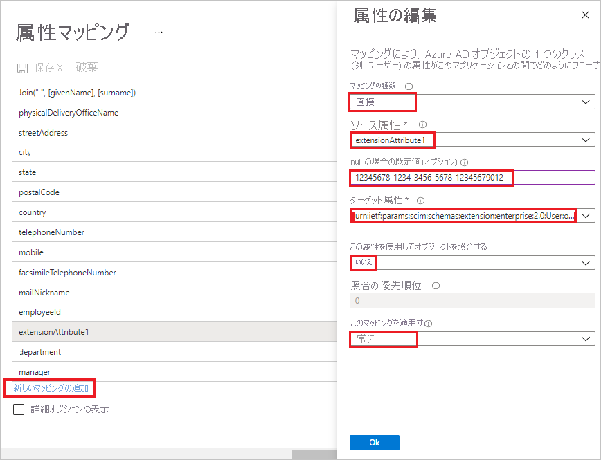

# チュートリアル: SchoolStream ASA を構成し、SchoolStream ASA で自動ユーザー プロビジョニングに対応させる

このチュートリアルでは、自動ユーザー プロビジョニングを構成するために SchoolStream ASA と Azure Active Directory (Azure AD) の両方で実行する必要がある手順について説明します。 構成すると、Azure AD による Azure AD プロビジョニング サービスを使用した [SchoolStream ASA](https://www.ssk12.com/) へのユーザーとグループのプロビジョニングとプロビジョニング解除が自動的に行われます。 このサービスが実行する内容、しくみ、よく寄せられる質問の重要な詳細については、「[Azure Active Directory による SaaS アプリへのユーザー プロビジョニングとプロビジョニング解除の自動化](../app-provisioning/user-provisioning.md)」を参照してください。 

## サポートされる機能
> [!div class="checklist"]
> * SchoolStream ASA でユーザーを作成する 
> * アクセスが不要になった場合に SchoolStream ASA のユーザーを削除する。
> * Azure AD と SchoolStream ASA の間でユーザー属性の同期を維持する
> * SchoolStream ASA への[シングル サインオン](../manage-apps/add-application-portal-setup-oidc-sso.md) (推奨)。

## 前提条件

このチュートリアルで説明するシナリオでは、次の前提条件目があることを前提としています。

* [Azure AD テナント](../develop/quickstart-create-new-tenant.md) 
* プロビジョニングを構成するための[アクセス許可](../roles/permissions-reference.md)を持つ Azure AD のユーザー アカウント (アプリケーション管理者、クラウド アプリケーション管理者、アプリケーション所有者、グローバル管理者など)。 
* SchoolStream Web サイト。 お持ちでない場合は、[SchoolStream のサポート](mailto:support@rtresponse.com)にお問い合わせください。

## 手順 1. プロビジョニングのデプロイを計画する
1. [プロビジョニング サービスのしくみ](../app-provisioning/user-provisioning.md)を確認します。
1. [プロビジョニングの対象](../app-provisioning/define-conditional-rules-for-provisioning-user-accounts.md)となるユーザーを決定します。
1. [Azure AD と SchoolStream ASA の間でマップする](../app-provisioning/customize-application-attributes.md)データを決定します。 

## 手順 2. Azure AD によるプロビジョニングをサポートするように SchoolStream ASA を構成する

1. [SchoolStream のサポート](mailto:support@rtresponse.com)に連絡して SchoolStream ASA の統合を要求してください。**Azure AD のテナント ID** と **SchoolStream Web サイトの URL** を提示する必要があります。

1. SchoolStream で SchoolStream Web サイトと Azure AD テナント ID がマップされた後で、**シークレット トークン** と SchoolStream ASA **テナント URL** を取得します。

## 手順 3. Azure AD アプリケーション ギャラリーから SchoolStream ASA を追加する

Azure AD で SchoolStream ASA へのプロビジョニングの管理を始めるには、Azure AD アプリケーション ギャラリーから SchoolStream ASA を追加する必要があります。 

1. 職場または学校アカウントか、個人の Microsoft アカウントを使用して、Azure portal にサインインします。
2. 左のナビゲーション ウィンドウで **[Azure Active Directory]** サービスを選択します。
3. **[エンタープライズ アプリケーション]** に移動し、 **[すべてのアプリケーション]** を選択します。
4. 新しいアプリケーションを追加するには、 **[新しいアプリケーション]** を選択します。
5. **[Azure AD ギャラリーの参照]** セクションで、検索ボックスに「**SchoolStream ASA**」と入力します。
6. 結果のパネルから **[SchoolStream ASA]** を選択し、**アプリにサインアップ** します。 お使いのテナントにアプリが追加されるのを数秒待機します。

SSO のために以前 SchoolStream ASA を設定している場合は、同じアプリケーションを使用できます。 ただし、統合を初めてテストするときは、別のアプリを作成することをお勧めします。 ギャラリーからアプリケーションを追加する方法の詳細については、[こちら](../manage-apps/add-application-portal.md)を参照してください。 

## 手順 4. プロビジョニングの対象となるユーザーを定義する 

Azure AD プロビジョニング サービスを使用すると、アプリケーションへの割り当て、ユーザーまたはグループの属性に基づいてプロビジョニングされるユーザーのスコープを設定できます。 割り当てに基づいてアプリにプロビジョニングされるユーザーのスコープを設定する場合、以下の[手順](../manage-apps/assign-user-or-group-access-portal.md)を使用して、ユーザーとグループをアプリケーションに割り当てることができます。 ユーザーまたはグループの属性のみに基づいてプロビジョニングされるユーザーのスコープを設定する場合、[こちら](../app-provisioning/define-conditional-rules-for-provisioning-user-accounts.md)で説明されているスコープ フィルターを使用できます。 

* SchoolStream ASA にユーザーとグループを割り当てる場合は、**既定のアクセス** 以外のロールを選択する必要があります。 既定のアクセス ロールを持つユーザーは、プロビジョニングから除外され、プロビジョニング ログで実質的に資格がないとマークされます。 アプリケーションで使用できる唯一のロールが既定のアクセス ロールである場合は、[アプリケーション マニフェストを更新](../develop/howto-add-app-roles-in-azure-ad-apps.md)してロールを追加することができます。 

* 小さいところから始めましょう。 全員にロールアウトする前に、少数のユーザーとグループでテストします。 プロビジョニングのスコープが割り当て済みユーザーとグループに設定される場合、これを制御するには、1 つまたは 2 つのユーザーまたはグループをアプリに割り当てます。 スコープがすべてのユーザーとグループに設定されている場合は、[属性ベースのスコープ フィルター](../app-provisioning/define-conditional-rules-for-provisioning-user-accounts.md)を指定できます。 

## 手順 5. SchoolStream ASA への自動ユーザー プロビジョニングを構成する 

このセクションでは、Azure AD プロビジョニング サービスを構成し、Azure AD でのユーザーやグループの割り当てに基づいて SchoolStream ASA のユーザーやグループを作成、更新、無効化する手順について説明します。

### Azure AD で SchoolStream ASA の自動ユーザー プロビジョニングを構成するには:

1. [Azure portal](https://portal.azure.com) にサインインします。 **[エンタープライズ アプリケーション]** を選択し、 **[すべてのアプリケーション]** を選択します。

    ![[エンタープライズ アプリケーション] ブレード](common/enterprise-applications.png)

1. アプリケーションの一覧で、 **[SchoolStream ASA]** を選択します。

    ![アプリケーションの一覧の [SchoolStream ASA] リンク](common/all-applications.png)

1. **[プロビジョニング]** タブを選択します。

    ![[プロビジョニング] タブ](common/provisioning.png)

1. プロビジョニングを初めて構成する場合は、 **[作業の開始]** を選択します。

    
    
1. **[プロビジョニング モード]** を **[自動]** に設定します。

    ![[プロビジョニング] タブの [自動]](media/schoolstream-asa-provisioning-tutorial/provisioning-automatic.png)

1. **[管理者資格情報]** セクションで、SchoolStream ASA の **[テナントの URL]** と **[シークレット トークン]** を入力します。 **[テスト接続]** をクリックして、Azure AD から SchoolStream ASA に接続できることを確認します。 接続できない場合は、使用している SchoolStream ASA アカウントに管理者アクセス許可があることを確認してから、もう一度試します。

    

1. **[保存]** を選択して **[設定]** セクションを表示します。

1. **[設定]** セクションの **[通知用メール]** フィールドに、プロビジョニングのエラー通知を受け取るユーザーまたはグループのメール アドレスを入力して、 **[エラーが発生したときにメール通知を送信します]** チェック ボックスをオンにします。

    

1. **[マッピング]** セクションで **[Provision Azure Active Directory Users]\(Azure Active Directory ユーザーをプロビジョニングする\)** を選択します。

1. 下部の **[新しいマッピングの追加]** を選択します。

1. ダイアログ **[属性の編集]** で、次のようにします。 
    
   * **[マッピングの種類]** フィールドで、ドロップダウンから **[ダイレクト]** を選択します。
   * **[基になる属性]** フィールドで、ドロップダウンから **[extensionAttribute1]** を選択します。
   * フィールド **[null の場合の既定値 (オプション)]** に **Azure AD のテナント ID** を入力します。
   * **[対象の属性]** フィールドで、ドロップダウンから **[urn:ietf:params:scim:schemas:extension:enterprise:2.0:User:organization]** を選択します。 
   * **[この属性を使用してオブジェクトを照合]** フィールドで、ドロップダウンから **[いいえ]** を選択します。
   * **[Apply this mapping]\(このマッピングを適用する\)** フィールドで、ドロップダウンから **[常に]** を選択します。
   * **[OK]** を選択します。

       

1. **[属性マッピング]** セクションで、Azure AD から SchoolStream ASA に同期されるユーザー属性を確認します。 **[Matching]\(照合\)** プロパティとして選択されている属性は、更新処理で SchoolStream ASA のユーザー アカウントとの照合に使用されます。 [照合する対象の属性](../app-provisioning/customize-application-attributes.md)を変更する場合は、その属性に基づいたユーザーのフィルター処理が SchoolStream ASA API で確実にサポートされている必要があります。

   |属性|Type|フィルター処理のサポート|
   |---|---|---|
   |userName|String|&check;
   |active|Boolean|   
   |displayName|String|
   |emails[type eq "work"].value|String|
   |preferredLanguage|String|
   |name.givenName|String|
   |name.familyName|String|
   |name.formatted|String|
   |phoneNumbers[type eq "mobile"].value|String|
   |externalId|String|
   |urn:ietf:params:scim:schemas:extension:enterprise:2.0:User:organization|String| 

13. **[保存]** ボタンをクリックして変更をコミットします。 **[アプリケーション]** タブに戻り、 **[Edit provisioning]\(プロビジョニングの編集\)** を選択して続行できます。

1. スコープ フィルターを構成するには、[スコープ フィルターのチュートリアル](../app-provisioning/define-conditional-rules-for-provisioning-user-accounts.md)の次の手順を参照してください。

1. SchoolStream ASA に対して Azure AD プロビジョニング サービスを有効にするには、 **[設定]** セクションで **[プロビジョニングの状態]** を **[オン]** に変更します。

    ![プロビジョニングの状態を [オン] に切り替える](common/provisioning-toggle-on.png)

1. **[設定]** セクションの **[スコープ]** で目的の値を選択して、SchoolStream ASA にプロビジョニングするユーザーやグループを定義します。

    

1. プロビジョニングの準備ができたら、 **[保存]** をクリックします。

    

この操作により、 **[設定]** セクションの **[スコープ]** で定義したすべてのユーザーとグループの初期同期サイクルが開始されます。 初期サイクルは後続の同期よりも実行に時間がかかります。後続のサイクルは、Azure AD のプロビジョニング サービスが実行されている限り約 40 分ごとに実行されます。 

## 手順 6. デプロイを監視する
プロビジョニングを構成したら、次のリソースを使用してデプロイを監視します。

* [プロビジョニング ログ](../reports-monitoring/concept-provisioning-logs.md)を使用して、正常にプロビジョニングされたユーザーと失敗したユーザーを特定します。
* [進行状況バー](../app-provisioning/application-provisioning-when-will-provisioning-finish-specific-user.md)を確認して、プロビジョニング サイクルの状態と完了までの時間を確認します。
* プロビジョニング構成が異常な状態になったと考えられる場合、アプリケーションは検疫されます。 検疫状態の詳細については、[こちら](../app-provisioning/application-provisioning-quarantine-status.md)を参照してください。  

## その他のリソース

* [エンタープライズ アプリのユーザー アカウント プロビジョニングの管理](../app-provisioning/configure-automatic-user-provisioning-portal.md)
* [Azure Active Directory のアプリケーション アクセスとシングル サインオンとは](../manage-apps/what-is-single-sign-on.md)

## 次のステップ

* [プロビジョニング アクティビティのログの確認方法およびレポートの取得方法](../app-provisioning/check-status-user-account-provisioning.md)