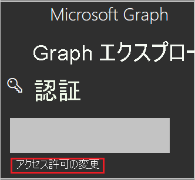

# <a name="tutorial-azure-ad-sso-integration-with-vida"></a>チュートリアル: Azure AD SSO と VIDA の統合

このチュートリアルでは、VIDA と Azure Active Directory (Azure AD) を統合する方法について説明します。 Azure AD と VIDA を統合すると、次のことができます。

* VIDA にアクセスできるユーザーを Azure AD で制御します。
* ユーザーが自分の Azure AD アカウントを使用して VIDA に自動的にサインインできるようにします。
* 1 つの中央サイト (Azure Portal) で自分のアカウントを管理します。

## <a name="prerequisites"></a>前提条件

開始するには、次が必要です。

* Azure AD サブスクリプション。 サブスクリプションがない場合は、[無料アカウント](https://azure.microsoft.com/free/)を取得できます。
* VIDA でのシングル サインオン (SSO) が有効なサブスクリプション。

## <a name="scenario-description"></a>シナリオの説明

このチュートリアルでは、テスト環境で Azure AD の SSO を構成してテストします。

* VIDA では、**SP** によって開始される SSO がサポートされます。

* VIDA では、**Just-In-Time** ユーザー プロビジョニングがサポートされます。

## <a name="adding-vida-from-the-gallery"></a>ギャラリーからの VIDA の追加

Azure AD への VIDA の統合を構成するには、ギャラリーからマネージド SaaS アプリの一覧に VIDA を追加する必要があります。

1. 職場または学校アカウントか、個人の Microsoft アカウントを使用して、Azure portal にサインインします。
1. 左のナビゲーション ウィンドウで **[Azure Active Directory]** サービスを選択します。
1. **[エンタープライズ アプリケーション]** に移動し、 **[すべてのアプリケーション]** を選択します。
1. 新しいアプリケーションを追加するには、 **[新しいアプリケーション]** を選択します。
1. **[ギャラリーから追加する]** セクションで、検索ボックスに「**VIDA**」と入力します。
1. 結果のパネルから **[VIDA]** を選択し、アプリを追加します。 お使いのテナントにアプリが追加されるのを数秒待機します。


## <a name="configure-and-test-azure-ad-sso-for-vida"></a>VIDA の Azure AD SSO の構成とテスト

**B.Simon** というテスト ユーザーを使用して、VIDA に対する Azure AD SSO を構成してテストします。 SSO が機能するためには、Azure AD ユーザーと VIDA の関連ユーザーとの間にリンク関係を確立する必要があります。

VIDA に対する Azure AD SSO を構成してテストするには、次の手順を実行します。

1. **[Azure AD SSO の構成](#configure-azure-ad-sso)** - ユーザーがこの機能を使用できるようにします。
    1. **[Azure AD のテスト ユーザーの作成](#create-an-azure-ad-test-user)** - B.Simon で Azure AD のシングル サインオンをテストします。
    1. **[Azure AD テスト ユーザーの割り当て](#assign-the-azure-ad-test-user)** - B.Simon が Azure AD シングル サインオンを使用できるようにします。
1. **[VIDA SSO の構成](#configure-vida-sso)** - アプリケーション側でシングル サインオン設定を構成します。
    1. **[VIDA のテスト ユーザーの作成](#create-vida-test-user)** - VIDA で B.Simon に対応するユーザーを作成し、Azure AD の B.Simon にリンクさせます。
1. **[SSO のテスト](#test-sso)** - 構成が機能するかどうかを確認します。

## <a name="configure-azure-ad-sso"></a>Azure AD SSO の構成

これらの手順に従って、Azure portal で Azure AD SSO を有効にします。

1. Azure portal の **VIDA** アプリケーション統合ページで、 **[管理]** セクションを見つけて、 **[シングル サインオン]** を選択します。
1. **[シングル サインオン方式の選択]** ページで、 **[SAML]** を選択します。
1. **[SAML によるシングル サインオンのセットアップ]** ページで、 **[基本的な SAML 構成]** の鉛筆アイコンをクリックして設定を編集します。

   

1. **[基本的な SAML 構成]** セクションで、次のフィールドの値を入力します。

    a. **[識別子 (エンティティ ID)]** ボックスに、`urn:amazon:cognito:sp:eu-west-2_IDmTxjGr6` という値を入力します。
    
    b. **[応答 URL]** ボックスに、URL として「`https://vitruevida.auth.eu-west-2.amazoncognito.com/saml2/idpresponse`」と入力します。
    
    c. **[サインオン URL]** ボックスに、次のパターンを使用して URL を入力します。
    
    `https://vitruevida.com/?teamid=<ID>&idp=<IDP_NAME>`

    > [!NOTE]
    > サインオン URL は実際の値ではありません。 実際のサインオン URL でこの値を更新してください。 この値を取得するには、[VIDA クライアント サポート チーム](mailto:support@vitruehealth.com)に問い合わせてください。 Azure portal の **[基本的な SAML 構成]** セクションに示されているパターンを参照することもできます。

1. VIDA アプリケーションでは、特定の形式の SAML アサーションを使用するため、カスタム属性のマッピングを SAML トークンの属性の構成に追加する必要があります。 次のスクリーンショットには、既定の属性一覧が示されています。

    

1. その他に、VIDA アプリケーションでは、いくつかの属性が SAML 応答で返されることが想定されています。それらの属性を次に示します。 これらの属性も値が事前に設定されますが、要件に従ってそれらの値を確認することができます。
    
    | 名前 | ソース属性|
    | ---------------- | --------- |
    | assignedroles | user.assignedroles |

1. **[SAML でシングル サインオンをセットアップします]** ページの **[SAML 署名証明書]** セクションで、 **[フェデレーション メタデータ XML]** を探して **[ダウンロード]** を選択し、証明書をダウンロードして、お使いのコンピューターに保存します。

    

1. **[VIDA のセットアップ]** セクションで、要件に基づいて適切な URL をコピーします。

    

### <a name="create-an-azure-ad-test-user"></a>Azure AD のテスト ユーザーの作成

このセクションでは、Azure portal 内で B.Simon というテスト ユーザーを作成します。

1. Azure portal の左側のウィンドウから、 **[Azure Active Directory]** 、 **[ユーザー]** 、 **[すべてのユーザー]** の順に選択します。
1. 画面の上部にある **[新しいユーザー]** を選択します。
1. **[ユーザー]** プロパティで、以下の手順を実行します。
   1. **[名前]** フィールドに「`B.Simon`」と入力します。  
   1. **[ユーザー名]** フィールドに「username@companydomain.extension」と入力します。 たとえば、「 `B.Simon@contoso.com` 」のように入力します。
   1. **[パスワードを表示]** チェック ボックスをオンにし、 **[パスワード]** ボックスに表示された値を書き留めます。
   1. **Create** をクリックしてください。

### <a name="assign-the-azure-ad-test-user"></a>Azure AD テスト ユーザーの割り当て

このセクションでは、B.Simon に VIDA へのアクセスを許可することで、このユーザーが Azure シングル サインオンを使用できるようにします。

1. Azure portal で **[エンタープライズ アプリケーション]** を選択し、 **[すべてのアプリケーション]** を選択します。
1. アプリケーションの一覧で **[VIDA]** を選択します。
1. アプリの概要ページで、 **[管理]** セクションを見つけて、 **[ユーザーとグループ]** を選択します。
1. **[ユーザーの追加]** を選択し、 **[割り当ての追加]** ダイアログで **[ユーザーとグループ]** を選択します。
1. **[ユーザーとグループ]** ダイアログの [ユーザー] の一覧から **[B.Simon]** を選択し、画面の下部にある **[選択]** ボタンをクリックします。
1. ユーザーにロールが割り当てられることが想定される場合は、 **[ロールの選択]** ドロップダウンからそれを選択できます。 このアプリに対してロールが設定されていない場合は、[既定のアクセス] ロールが選択されていることを確認します。
1. **[割り当ての追加]** ダイアログで、 **[割り当て]** をクリックします。

## <a name="configure-role-based-single-sign-on-in-vida"></a>VIDA でロールベースのシングル サインオンを構成する

1. VIDA ロールと Azure AD ユーザーを関連付けるには、次の手順で Azure AD でロールを作成する必要があります。

    a. [Microsoft Graph Explorer](https://developer.microsoft.com/graph/graph-explorer) にサインオンします。

    b. **[アクセス許可の変更]** をクリックし、ロールの作成に必要なアクセス許可を取得します。

    

    c. 次の画像のように、一覧から次のアクセス許可を選択し、 **[アクセス許可の変更]** をクリックします。

    

    >[!NOTE]
    >アクセス許可が付与されたら、Graph Explorer に再度ログオンします。

    d. Graph Explorer ページで、最初のドロップダウン リストから **[GET]** を選択し、2 つ目のドロップダウン リストから **[ベータ]** を選択します。 ドロップダウン リストの横にあるフィールドに「`https://graph.microsoft.com/beta/servicePrincipals`」と入力し、 **[クエリの実行]** を実行します。

    

    >[!NOTE]
    >複数のディレクトリを使用している場合、クエリのフィールドに「`https://graph.microsoft.com/beta/contoso.com/servicePrincipals`」と入力できます。

    e. **[Response Preview]\(応答プレビュー\)** セクションで、後で使用するために "Service Principal" から appRoles プロパティを抽出します。

    

    >[!NOTE]
    >クエリのフィールドに「`https://graph.microsoft.com/beta/servicePrincipals/<objectID>`」と入力することで appRoles プロパティを見つけることができます。 `objectID` は Azure AD **プロパティ** ページからコピーしたオブジェクト ID であることにご注目ください。

    f. Graph Explorer に戻り、メソッドを **GET** から **PATCH** に変更し、 **[要求本文]** セクションに次のコンテンツを貼り付け、 **[クエリの実行]** をクリックします。
    
   ```
   { 
   "appRoles": [
       {
           "allowedMemberTypes": [
           "User"
           ],
           "description": "User",
           "displayName": "User",
           "id": "18d14569-c3bd-439b-9a66-3a2aee01****",
           "isEnabled": true,
           "origin": "Application",
           "value": null
       },
       {
           "allowedMemberTypes": [
           "User"
           ],
           "description": "msiam_access",
           "displayName": "msiam_access",
           "id": "b9632174-c057-4f7e-951b-be3adc52****",
           "isEnabled": true,
           "origin": "Application",
           "value": null
       },
       {
       "allowedMemberTypes": [
           "User"
       ],
       "description": "VIDACompanyAdmin",
       "displayName": "VIDACompanyAdmin",
       "id": "293414bb-2215-48b4-9864-64520937d437",
       "isEnabled": true,
       "origin": "ServicePrincipal",
       "value": "VIDACompanyAdmin"
       },
       {
       "allowedMemberTypes": [
           "User"
       ],
       "description": "VIDATeamAdmin",
       "displayName": "VIDATeamAdmin",
       "id": "2884f1ae-5c0d-4afd-bf28-d7d11a3d7b2c",
       "isEnabled": true,
       "origin": "ServicePrincipal",
       "value": "VIDATeamAdmin"
       },
       {
       "allowedMemberTypes": [
           "User"
       ],
       "description": "VIDAUser",
       "displayName": "VIDAUser",
       "id": "37b3218c-0c06-484f-90e6-4390ce5a8787",
       "isEnabled": true,
       "origin": "ServicePrincipal",
       "value": "VIDAUser"
       }
   ]
   }
   ```
   > [!NOTE]
   > Azure AD では、SAML 応答の要求値として、これらのロールの値を送信します。 ただし、パッチ操作では、`msiam_access` 部分の後にのみ、新しいロールを追加できます。 作成過程を速やかに進めるため、GUID Generator など、ID ジェネレーターを使用してリアルタイムで ID を生成することをお勧めします。

   g. 必要なロールで "Service Principal" にパッチを適用したら、チュートリアルの「**Azure AD テスト ユーザーの割り当て**」セクションの手順に従い、Azure AD ユーザー (B.Simon) とロールを関連付けます。

## <a name="configure-vida-sso"></a>VIDA SSO の構成

**VIDA** 側でシングル サインオンを構成するには、ダウンロードした **フェデレーション メタデータ XML** と Azure portal からコピーした適切な URL を [VIDA サポート チーム](mailto:support@vitruehealth.com)に送信する必要があります。 サポート チームはこれを設定して、SAML SSO 接続が両方の側で正しく設定されるようにします。

### <a name="create-vida-test-user"></a>VIDA テスト ユーザーの作成

このセクションでは、Britta Simon というユーザーを VIDA に作成します。 VIDA では、Just-In-Time ユーザー プロビジョニングがサポートされています。この設定は既定で有効になっています。 このセクションでは、ユーザー側で必要な操作はありません。 VIDA にユーザーがまだ存在していない場合は、認証後に新規に作成されます。

## <a name="test-sso"></a>SSO のテスト 

このセクションでは、次のオプションを使用して Azure AD のシングル サインオン構成をテストします。 

* Azure portal で **[このアプリケーションをテストします]** をクリックします。 これにより、ログイン フローを開始できる VIDA のサインオン URL にリダイレクトされます。 

* VIDA のサインオン URL に直接移動し、そこからログイン フローを開始します。

* Microsoft マイ アプリを使用することができます。 マイ アプリで [VIDA] タイルをクリックすると、VIDA のサインオン URL にリダイレクトされます。 マイ アプリの詳細については、[マイ アプリの概要](../user-help/my-apps-portal-end-user-access.md)に関するページを参照してください。

## <a name="next-steps"></a>次のステップ

VIDA を構成したら、組織の機密データを流出と侵入からリアルタイムで保護するセッション制御を適用できます。 セッション制御は、条件付きアクセスを拡張したものです。 [Microsoft Cloud App Security でセッション制御を強制する方法](/cloud-app-security/proxy-deployment-aad)をご覧ください。

