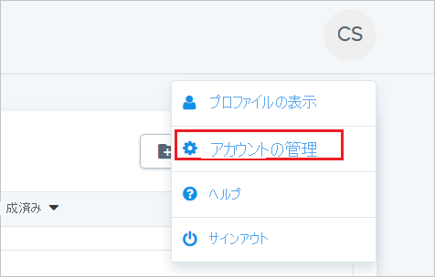
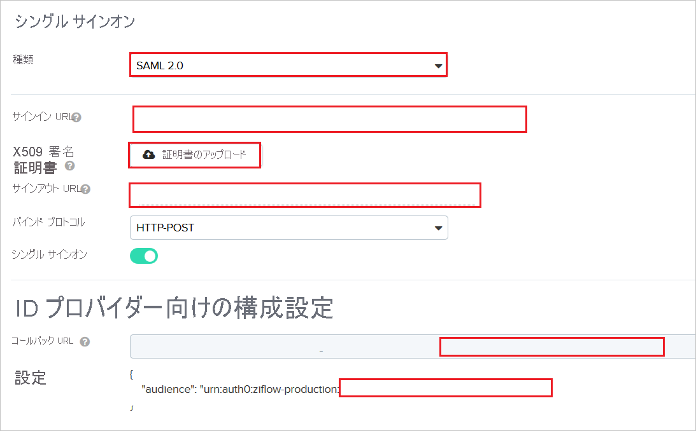

# チュートリアル: Azure Active Directory と Ziflow の統合

このチュートリアルでは、Ziflow と Azure Active Directory (Azure AD) を統合する方法について説明します。 Azure AD と Ziflow を統合すると、次のことができます。

* Ziflow にアクセスできるユーザーを Azure AD で制御します。
* ユーザーが自分の Azure AD アカウントを使用して Ziflow に自動的にサインインできるようにします。
* 1 つの中央サイト (Azure Portal) で自分のアカウントを管理します。

## 前提条件

Ziflow と Azure AD の統合を構成するには、次のものが必要です。

* Azure AD サブスクリプション。 Azure AD の環境がない場合は、[無料アカウント](https://azure.microsoft.com/free/)を取得できます。
* Ziflow シングル サインオンが有効なサブスクリプション。

## シナリオの説明

このチュートリアルでは、テスト環境で Azure AD のシングル サインオンを構成してテストします。

* Ziflow では、**SP** Initiated SSO がサポートされます。

## ギャラリーからの Ziflow の追加

Azure AD への Ziflow の統合を構成するには、ギャラリーから管理対象 SaaS アプリの一覧に Ziflow を追加する必要があります。

1. 職場または学校アカウントか、個人の Microsoft アカウントを使用して、Azure portal にサインインします。
1. 左のナビゲーション ウィンドウで **[Azure Active Directory]** サービスを選択します。
1. **[エンタープライズ アプリケーション]** に移動し、 **[すべてのアプリケーション]** を選択します。
1. 新しいアプリケーションを追加するには、 **[新しいアプリケーション]** を選択します。
1. **[ギャラリーから追加する]** セクションで、検索ボックスに「**Ziflow**」と入力します。
1. 結果のパネルから **[Ziflow]** を選択し、アプリを追加します。 お使いのテナントにアプリが追加されるのを数秒待機します。

## Ziflow の Azure AD SSO の構成とテスト

**B.Simon** というテスト ユーザーを使用して、Ziflow に対する Azure AD SSO を構成してテストします。 SSO を機能させるには、Azure AD ユーザーと Ziflow の関連ユーザーとの間にリンク関係を確立する必要があります。

Ziflow に対する Azure AD SSO を構成してテストするには、次の手順を実行します。

1. **[Azure AD SSO の構成](#configure-azure-ad-sso)** - ユーザーがこの機能を使用できるようにします。
    1. **[Azure AD のテスト ユーザーの作成](#create-an-azure-ad-test-user)** - B.Simon で Azure AD のシングル サインオンをテストします。
    1. **[Azure AD テスト ユーザーの割り当て](#assign-the-azure-ad-test-user)** - B.Simon が Azure AD シングル サインオンを使用できるようにします。
1. **[Ziflow SSO の構成](#configure-ziflow-sso)** - アプリケーション側でシングル サインオン設定を構成します。
    1. **[Ziflow テスト ユーザーの作成](#create-ziflow-test-user)** - Ziflow で B.Simon に対応するユーザーを作成し、Azure AD の B.Simon にリンクさせます。
1. **[SSO のテスト](#test-sso)** - 構成が機能するかどうかを確認します。

## Azure AD SSO の構成

これらの手順に従って、Azure portal で Azure AD SSO を有効にします。

1. Azure portal の **Ziflow** アプリケーション統合ページで、 **[管理]** セクションを探して、 **[シングル サインオン]** を選択します。
1. **[シングル サインオン方式の選択]** ページで、 **[SAML]** を選択します。
1. **[SAML によるシングル サインオンのセットアップ]** ページで、 **[基本的な SAML 構成]** の鉛筆アイコンをクリックして設定を編集します。

   

4. **[基本的な SAML 構成]** セクションで、次の手順を実行します。

    a. **[識別子 (エンティティ ID)]** ボックスに、次のパターンを使用して値を入力します。`urn:auth0:ziflow-production:<UNIQUE_ID>`

    b. **[サインオン URL]** ボックスに、次のパターンを使用して URL を入力します。`https://ziflow-production.auth0.com/login/callback?connection=<UNIQUE_ID>`

    > [!NOTE]
    > 上記の値は、実際の値ではありません。 識別子とサインオン URL 内の固有の ID を実際の値に置き換えます。実際の値については後で説明します。

5. **[SAML でシングル サインオンをセットアップします]** ページの **[SAML 署名証明書]** セクションで、 **[ダウンロード]** をクリックして要件のとおりに指定したオプションからの **証明書 (Base64)** をダウンロードして、お使いのコンピューターに保存します。

    

6. **[Ziflow の設定]** セクションで、要件どおりの適切な URL をコピーします。

    

### Azure AD のテスト ユーザーの作成 

このセクションでは、Azure portal 内で B.Simon というテスト ユーザーを作成します。

1. Azure portal の左側のウィンドウから、 **[Azure Active Directory]** 、 **[ユーザー]** 、 **[すべてのユーザー]** の順に選択します。
1. 画面の上部にある **[新しいユーザー]** を選択します。
1. **[ユーザー]** プロパティで、以下の手順を実行します。
   1. **[名前]** フィールドに「`B.Simon`」と入力します。  
   1. **[ユーザー名]** フィールドに「username@companydomain.extension」と入力します。 たとえば、「 `B.Simon@contoso.com` 」のように入力します。
   1. **[パスワードを表示]** チェック ボックスをオンにし、 **[パスワード]** ボックスに表示された値を書き留めます。
   1. **Create** をクリックしてください。

### Azure AD テスト ユーザーの割り当て

このセクションでは、B.Simon に Ziflow へのアクセスを許可することで、Azure シングル サインオンを使用できるようにします。

1. Azure portal で **[エンタープライズ アプリケーション]** を選択し、 **[すべてのアプリケーション]** を選択します。
1. アプリケーションの一覧で **[Ziflow]** を選択します。
1. アプリの概要ページで、 **[管理]** セクションを見つけて、 **[ユーザーとグループ]** を選択します。
1. **[ユーザーの追加]** を選択し、 **[割り当ての追加]** ダイアログで **[ユーザーとグループ]** を選択します。
1. **[ユーザーとグループ]** ダイアログの [ユーザー] の一覧から **[B.Simon]** を選択し、画面の下部にある **[選択]** ボタンをクリックします。
1. ユーザーにロールが割り当てられることが想定される場合は、 **[ロールの選択]** ドロップダウンからそれを選択できます。 このアプリに対してロールが設定されていない場合は、[既定のアクセス] ロールが選択されていることを確認します。
1. **[割り当ての追加]** ダイアログで、 **[割り当て]** をクリックします。

## Ziflow SSO の構成

1. 別の Web ブラウザー ウィンドウで、セキュリティ管理者として Ziflow にサインインします。

2. 右上隅のアバターをクリックして、 **[アカウントの管理]** をクリックします。

    

3. 左上の **シングル サインオン** をクリックします。

    

4. **Single sign-on**(シングル サインオン) ページで、次の手順を実行します。

    

    a. **[SAML2.0]** として **[種類]** を選択します。

    b. **[サインイン URL]** テキスト ボックスに、Azure portal からコピーした **ログイン URL** の値を貼り付けます。

    c. Azure Portal からダウンロードした base 64 でエンコードされた証明書を **X509 署名証明書** にアップロードします。

    d. **[サインアウト URL]** テキスト ボックスに、Azure portal からコピーした **ログアウト URL** の値を貼り付けます。

    e. **[Configuration Settings for your Identifier Provider (ID プロバイダーの構成設定)]** セクションで、強調表示されている一意の ID 値をコピーし、Azure portal の **[基本的な SAML 構成]** で ID とサインオン URL に追加します。

### Ziflow のテスト ユーザーの作成

Azure AD ユーザーが Ziflow にサインインできるようにするには、そのユーザーを Ziflow にプロビジョニングする必要があります。 Ziflow では、プロビジョニングは手動で行います。

ユーザー アカウントをプロビジョニングするには、次の手順を実行します。

1. セキュリティ管理者として Ziflow にサインインします。

2. 上部の **[ユーザー]** に移動します。

    

3. **[追加]** 、 **[ユーザーの追加]** の順にクリックします。

    ![[ユーザーの追加] オプションが選択されていることを示すスクリーンショット。](./media/ziflow-tutorial/add-tab.png)

4. **[ユーザーの追加]** ポップアップで、次の手順を実行します。

    ![[ユーザーの追加] ダイアログ ボックスを示すスクリーンショット。ここで、説明されている値を入力できます。](./media/ziflow-tutorial/add-user.png)

    a. **[電子メール]** ボックスに、ユーザーのメール アドレスを入力します (例: brittasimon@contoso.com)。

    b. **[名]** ボックスに、ユーザーの名を入力します (例: Britta)。

    c. **[姓]** ボックスに、ユーザーの姓を入力します (例: Simon)。

    d. Ziflow のロールを選択します。

    e. **[1 ユーザーの追加]** をクリックします。

    > [!NOTE]
    > Azure Active Directory アカウント所有者が電子メールを受信し、リンクに従ってアカウントを確認すると、そのアカウントがアクティブになります。

## SSO のテスト 

このセクションでは、次のオプションを使用して Azure AD のシングル サインオン構成をテストします。 

* Azure portal で **[このアプリケーションをテストします]** をクリックします。 これにより、ログイン フローを開始できる Ziflow のサインオン URL にリダイレクトされます。 

* Ziflow のサインオン URL に直接移動し、そこからログイン フローを開始します。

* Microsoft マイ アプリを使用することができます。 マイ アプリで [Ziflow] タイルをクリックすると、Ziflow のサインオン URL にリダイレクトされます。 マイ アプリの詳細については、[マイ アプリの概要](https://support.microsoft.com/account-billing/sign-in-and-start-apps-from-the-my-apps-portal-2f3b1bae-0e5a-4a86-a33e-876fbd2a4510)に関するページを参照してください。

## 次のステップ

Ziflow を構成したら、組織の機密データを流出と侵入からリアルタイムで保護するセッション制御を適用できます。 セッション制御は、条件付きアクセスを拡張したものです。 [Microsoft Cloud App Security でセッション制御を強制する方法](/cloud-app-security/proxy-deployment-aad)をご覧ください。