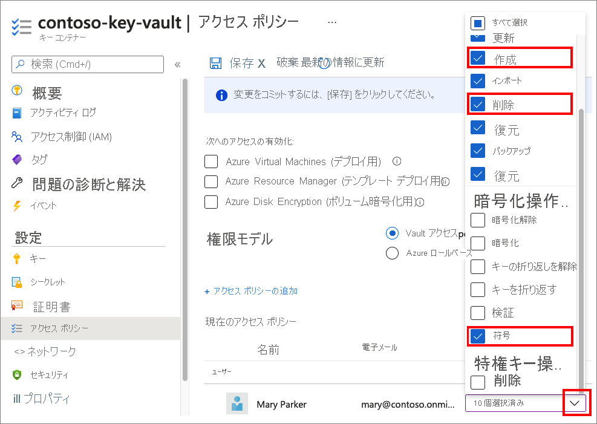
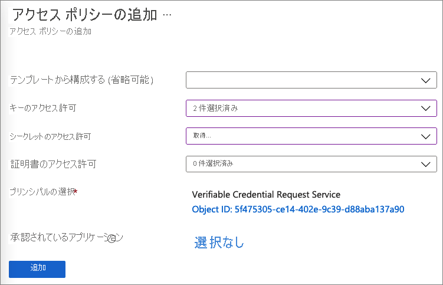
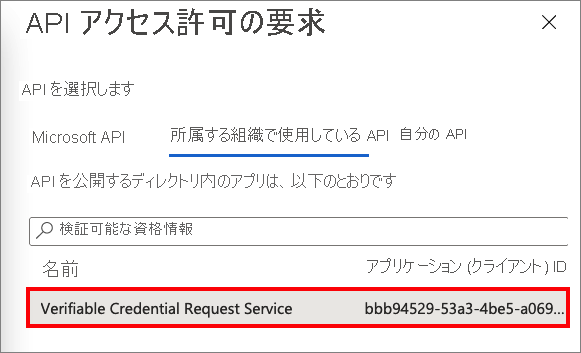
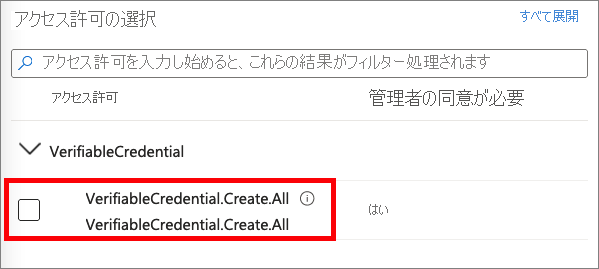
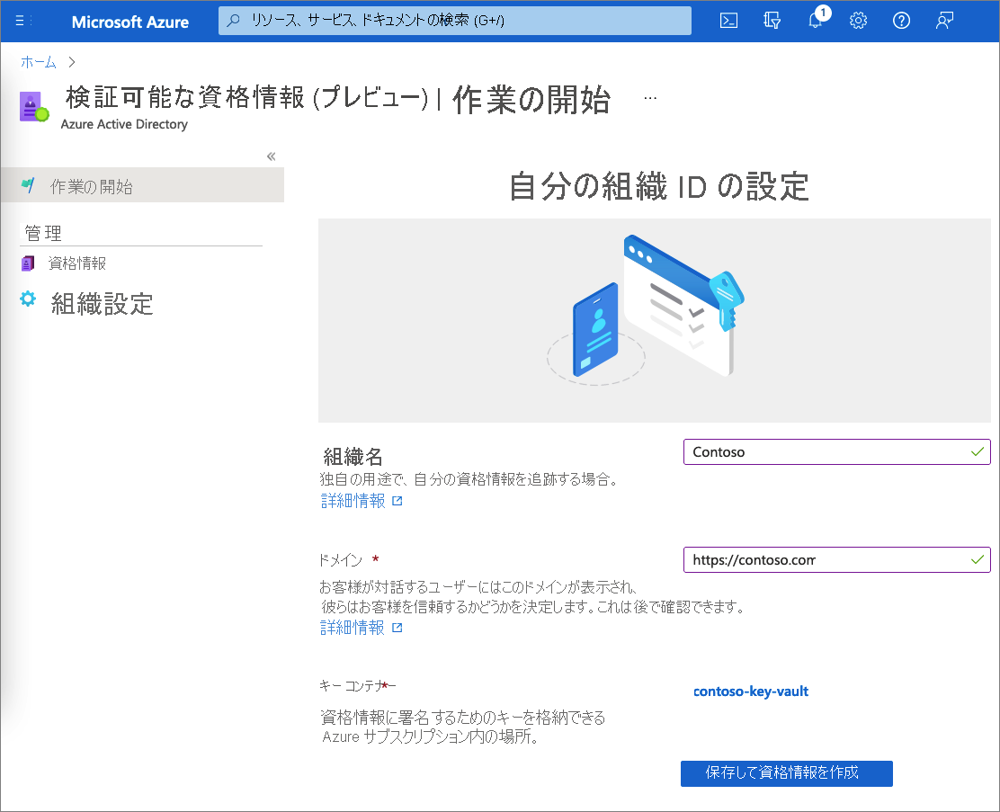

# <a name="configure-your-tenant-for-azure-ad-verifiable-credentials-preview"></a>Azure AD の検証可能な資格情報のためのテナントを構成する (プレビュー)

Azure Active Directory (Azure AD) 検証可能な資格情報サービスを使用すると、資格情報の発行と検証ができます。 資格情報の発行と検証 (またはその両方) をできるようにするには、このチュートリアルのガイダンスに従ってください。

このチュートリアルでは、Azure AD 検証可能な資格情報を使用できるように Azure AD テナントを構成するために必要な手順について説明します。

この記事では、次のことについて説明します。

> [!div class="checklist"]
>
> - サービス プリンシパルを設定する
> - Azure Key Vault を作成する
> - アプリケーションを Azure AD に登録する
> - 検証可能な資格情報プレビュー サービスを設定する

次の図は、Azure AD の検証可能な資格情報のアーキテクチャと構成するコンポーネントを示しています。


## <a name="prerequisites"></a>必須コンポーネント

- Azure サブスクリプションをお持ちでない場合は、[無料でアカウントを作成](https://azure.microsoft.com/free/?WT.mc_id=A261C142F)してください。
- テナントで [Azure Active Directory Premium エディション](../../active-directory/fundamentals/active-directory-get-started-premium.md)のサブスクリプションにサインアップします。
- 構成するディレクトリの[グローバル管理者](../../active-directory/roles/permissions-reference.md#global-administrator)アクセス許可。
- [PowerShell](/powershell/scripting/install/installing-powershell) 7.0.6 LTS-x64、PowerShell 7.1.3-x64、またはそれ以降をインストールします。

## <a name="step-1-set-up-a-service-principal"></a>手順 1. サービス プリンシパルの設定

Request Service API のためのサービス プリンシパルを作成します。 このサービス API は、Azure AD の検証可能な資格情報を発行または検証するために使用する Microsoft サービスです。

サービス プリンシパルを作成するには、次のようにします。

1. 次の PowerShell コマンドを実行します。 これらのコマンドによって、AzureAD モジュールが (まだインストールされていない場合は) インストールされ、[AzureAD モジュール](/powershell/azure/install-az-ps#installation)がインポートされます。 モジュールのインストールに関する問題が発生した場合は、「[Azure Az PowerShell モジュールをインストールする](/powershell/azure/install-az-ps#installation)」の記事を参照してください。

    ```powershell
    if ((Get-Module -ListAvailable -Name "AzureAD") -eq $null) {  Install-Module "AzureAD" -Scope CurrentUser }  Import-Module AzureAD
    ```

1. 次の PowerShell コマンドを実行して、Azure AD テナントに接続します。 \<*your-tenant-ID*> をお使いの [Azure AD のテナント ID](../../active-directory/fundamentals/active-directory-how-to-find-tenant.md) に置き換えます。

    ```powershell
    Connect-AzureAD -TenantId <your-tenant-ID>
    ```

1. 同じ PowerShell セッションで、次のコマンドを実行します。 AppId "bbb94529-53a3-4be5-a069-7eaf2712b826" は、検証可能な資格情報の Microsoft サービスを示しています。

    ```powershell
    New-AzureADServicePrincipal -AppId "bbb94529-53a3-4be5-a069-7eaf2712b826" -DisplayName "Verifiable Credential Request Service" 
    ```

## <a name="step-2-create-a-key-vault"></a>手順 2. Key Vault の作成

[Azure Key Vault](../../key-vault/general/basic-concepts.md) は、シークレットとキーを安全に保管しアクセスできるようにするクラウド サービスです。 検証可能な資格情報サービスでは、Azure Key Vault に公開キーと秘密キーが格納されます。 これらのキーは、資格情報の署名と検証に使用されます。

Azure Key Vault のインスタンスがない場合は、次の手順に従って、Azure portal を使用してキー コンテナーを作成します。

>[!NOTE]
>既定では、キー コンテナーを作成したアカウントのみにアクセス権があります。 検証可能な資格情報サービスはキー コンテナーにアクセスする必要があります。 キー コンテナーには、構成中に使用されるアカウントが **キーを作成** し、オプトアウト時に **キーを削除** するためのアクセス ポリシーと、検証可能な資格情報サービスのドメイン バインドを作成する目的で **署名する** ためのアクセス許可が構成されている必要があります。 テスト中に同じアカウントを使用する場合は、コンテナーの作成者に既定で付与されるアクセス許可のほかに、**署名** するためのアクセス許可をそのアカウントに付与するように既定のポリシーを変更してください。

### <a name="step-21-set-access-policies-for-the-key-vault"></a>手順 2.1 キー コンテナーのアクセス ポリシーの設定

Azure の検証可能な資格情報サービスをオンボードすると、このサービスによって、メッセージ セキュリティを提供するために使用されるキーのセットが生成されます。 これらのキーは、キー コンテナーに格納されます。 発行するか検証するかにかかわらず、検証可能な資格情報の署名、更新、復旧にはキー セットが引き続き使用されます。

Key Vault の[アクセス ポリシー](../../key-vault/general/assign-access-policy.md)では、指定されたセキュリティ プリンシパルによって、Key Vault のシークレットとキーの操作を実行できるかどうかが定義されます。 Azure AD の検証可能な資格情報サービスの管理者アカウントと、作成した Request Service API プリンシパルの両方について、Azure Key Vault にアクセス ポリシーを設定します。

1. [Azure portal](https://portal.azure.com/) で、このチュートリアルで使用する **Key Vault** に移動します。

1. **[設定]** の **[アクセス ポリシー]** を選択します。

1. **[アクセス ポリシーの追加]** ページの **[ユーザー]** で、このチュートリアルを実行するために使用するアカウントを選択します。

1. **[キーのアクセス許可]** で、次のアクセス許可が選択されていることを確認します。 **[作成]、[削除]** 、 **[署名]** です。 既定では、 [作成] と [削除] は既に有効になっています。 更新する必要があるキーのアクセス許可は、 [署名] のみです。
    
    次のスクリーンショットは、管理者のアクセス ポリシーを構成する方法を示しています。

    

1. 変更を保存するには、 **[保存]** を選択します。

1. **[+ アクセス ポリシーの追加]** を選択して、Verifiable Credential Request Service のサービス プリンシパルにアクセス許可を追加します。

1. **[アクセス ポリシーの追加]** ページで、次のようにします

    1. **[キーのアクセス許可]** で、 **[取得]** と **[署名]** を選択します。

    1. **[シークレットのアクセス許可]** で、 **[取得]** を選択します。

    1. **[プリンシパルの選択]** で、 **[Verifiable Credential Request Service]** を選択します。

    1. **[追加]** を選択します。  
        
       次のスクリーンショットは、Verifiable Credential Request Service のためのアクセス ポリシーを追加する方法を示しています。 
    
       

1. **[保存]** を選択して、作成した新しいポリシーを保存します。

## <a name="step-3-register-an-application-in-azure-ad"></a>手順 3. アプリケーションを Azure AD に登録する

Azure AD の検証可能な資格情報の要求サービスは、発行と検証のためのアクセス トークンを取得できる必要があります。 アクセス トークンを取得するには、Web アプリケーションを登録し、前の手順で設定した API Verifiable Credential Request Service のための API アクセス許可を付与します。

1. 管理者アカウントで [Azure portal](https://portal.azure.com/) にサインインします。

1. 複数のテナントにアクセスできる場合は、 **[ディレクトリ + サブスクリプション]** :::image type="icon" source="media/verifiable-credentials-configure-tenant/portal-directory-subscription-filter.png" border="false"::: アイコンを選択します。 次に、お使いの **Azure Active Directory** を探して選択します。

1. **[管理]** で **[アプリの登録]** を選択し、次に **[新規登録]** を選択します。  

   

1. アプリケーションの表示 **名** を入力します。 たとえば、**verifiable-credentials-app** と指定します。

1. **[サポートされているアカウントの種類]** で、 **[Accounts in this organizational directory only (Default Directory only - Single tenant)]\(この組織ディレクトリのアカウントのみ (既定のディレクトリのみ - シングル テナント)\)** を選択します。

1. **[登録]** を選択して、アプリケーションを作成します。
  
   次のスクリーンショットは、アプリケーションの登録方法を示しています。

   

### <a name="31-grant-permissions-to-get-access-tokens"></a>3.1 アクセス トークンを取得するためのアクセス許可の付与

この手順では、[手順 1](#step-1-set-up-a-service-principal) で作成した Verifiable Credential Request Service のプリンシパルにアクセス許可を付与します。

必要なアクセス許可を追加するには、次の手順に従います。

1. **verifiable-credentials-app** アプリケーション詳細ページで作業を続けます。 **[API のアクセス許可]** を選択してから、 **[アクセス許可の追加]** を選択します。
    
    

1. **[所属する組織で使用している API]** を選択します。

1. 以前作成したサービス プリンシパルである、**Verifiable Credential Request Service** を検索し、それを選択します。
    
    

1. **[アプリケーションのアクセス許可]** を選択し、 **[VerifiableCredential.Create.All]** を展開します。

    

1. **[アクセス許可の追加]** を選択します.

1. **[Grant admin consent for \<your tenant name\>]\(テナントに管理者の同意を与える\)** を選択します。

## <a name="step-4-set-up-verifiable-credentials-preview-service"></a>手順 4. 検証可能な資格情報プレビュー サービスを設定する

Azure AD の検証可能な資格情報サービスでは、シームレスな分散化 ID ソリューションを使用して組織を保護します。 発行者の場合、Azure AD によって、独自の検証可能な資格情報を発行するためにカスタマイズして使用できるサービスが提供されます。 検証者の場合、検証可能な資格情報サービスによって、アプリとサービス内で検証可能な資格情報を簡単に要求して受け入れることができる REST API サービスを無料で使用できます。

Azure AD の検証可能な資格情報を設定するには、次の手順を実行します。

1. [Azure portal](https://portal.azure.com/) で、**検証可能な資格情報** を検索します。 次に、 **[検証可能な資格情報 (プレビュー)]** を選択します。

1. 左側のメニューから、 **[はじめに]** を選択します。

1. 次の情報を指定して、組織を設定します。

    1. **組織名**: 検証可能な資格情報内で自分のビジネスを参照する名前を入力します。 この値は顧客には公開されません。

    1. **ドメイン:** DID ドキュメントにサービス エンドポイントとして追加されるドメインを入力します。 ドメインは、ユーザーがお客様のビジネスについて知っている具体的な何かに DID をバインドするものです。 Microsoft Authenticator とその他のデジタル ウォレットでは、DID がドメインにリンクされていることを検証するために、この情報を使用します。 DID を検証できる場合、ウォレットには検証済み記号が表示されます。 ウォレットが DID を検証できない場合、検証できない資格情報が組織によって発行されたことがユーザーに通知されます。   
            
        >[!IMPORTANT]
        > ドメインはリダイレクトしないようにします。 そうしないと、DID とドメインはリンクできません。 ドメインに HTTPS を使用してください (例: <https://contoso.com>)。

    1. **キー コンテナー**: 前に作成したキー コンテナーの名前を入力します。

1. **[Save and create credential]\(保存して資格情報を作成\)** を選択します。  
    
    次のスクリーンショットは、検証可能な資格情報を設定する方法を示しています。  
    
    

## <a name="next-steps"></a>次の手順

- [Azure AD の検証可能な資格情報を Web アプリケーションから発行する方法について学習します](verifiable-credentials-configure-issuer.md)。
- [Azure AD の検証可能な資格情報を検証する方法について学習します](verifiable-credentials-configure-verifier.md)。