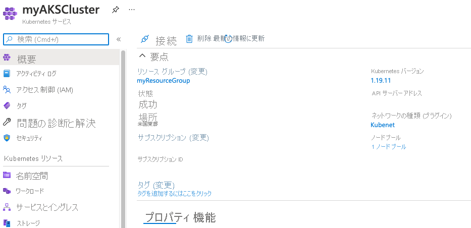
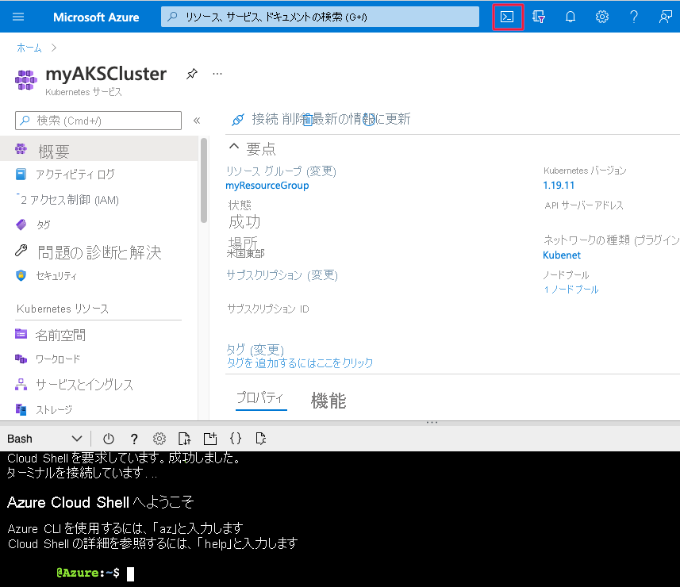

# <a name="quickstart-deploy-an-azure-kubernetes-service-aks-cluster-using-the-azure-portal"></a>クイック スタート:Azure portal を使用して Azure Kubernetes Service (AKS) クラスターをデプロイする

Azure Kubernetes Service (AKS) は、クラスターをすばやくデプロイおよび管理することができる、マネージド Kubernetes サービスです。 このクイックスタートでは次の作業を行います。
* Azure portal を使用して AKS クラスターをデプロイします。 
* このクラスターで、Web フロントエンドと Redis インスタンスが含まれている複数コンテナー アプリケーションを実行します。 
* アプリケーションを実行するクラスターとポッドの正常性を監視します。


このクイックスタートは、Kubernetes の基本的な概念を理解していることを前提としています。 詳細については、「[Azure Kubernetes Services (AKS) における Kubernetes の中心概念][kubernetes-concepts]」を参照してください。

Azure サブスクリプションをお持ちでない場合は、開始する前に [無料アカウント](https://azure.microsoft.com/free/?WT.mc_id=A261C142F) を作成してください。

## <a name="prerequisites"></a>前提条件

Azure Portal [https://portal.azure.com](https://portal.azure.com) にサインインします。

## <a name="create-an-aks-cluster"></a>AKS クラスターを作成する

1. Azure portal のメニューまたは **[ホーム]** ページから **[リソースの作成]** を選択します。

2. **コンテナー** > **Kubernetes Service** を選択します。

3. **[基本]** ページで、次のオプションを構成します。
    - **プロジェクトの詳細**: 
        * Azure の **サブスクリプション** を選択します
        * Azure **リソース グループ** を選択または作成します (*myResourceGroup* など)。
    - **クラスターの詳細**: 
        * **Kubernetes クラスター名** (たとえば、*myAKSCluster*) を入力します。 
        * AKS クラスターの **リージョン** と **Kubernetes バージョン** を選択します。
    - **プライマリ ノード プール**: 
        * AKS ノードの VM **[ノード サイズ]** を選択します。 AKS クラスターがデプロイされた後に、VM サイズを変更することは *できません*。
        * クラスターにデプロイするノードの数を選択します。 このクイック スタートでは、 **[ノード数]** を *1* に設定します。 ノード数は、クラスターをデプロイした後に調整 *できます*。
    
    

4. **[Next:Node pools]\(次: ノード プール\)** を、完了したら選択します。

5. 既定の **[ノード プール]** オプションのままにします。 ページの下部にある **[Next:Authentication] (次: 認証)** をクリックします。
    > [!CAUTION]
    > 新しく作成された Azure AD サービス プリンシパルが伝達されて使用可能になるまでに数分かかる場合があり、それが原因で "service principal not found" (サービス プリンシパルが見つかりません) エラーや検証エラーが Azure portal で発生することがあります。 この問題が生じた場合は、軽減策について[トラブルシューティングに関する記事](troubleshooting.md#received-an-error-saying-my-service-principal-wasnt-found-or-is-invalid-when-i-try-to-create-a-new-cluster)を参照してください。

6. **[認証]** ページで、次のオプションを構成します。
    - 次のいずれかの方法で新しいクラスター ID を作成します。
        * **[認証]** フィールドを **[System-assigned managed identity]\(システム割り当てマネージド ID\)** のままにします。または
        * **[サービス プリンシパル]** を選択して、サービス プリンシパルを使用します。 
            * *[(新規) 既定のサービス プリンシパル]* を選択して、既定のサービス プリンシパルを作成します。または
            * *[サービス プリンシパルを構成します]* を選択して、既存のものを使用します。 既存のプリンシパルの SPN クライアント ID とシークレットを指定する必要があります。
    - Kubernetes ロールベースのアクセス制御 (Kubernetes RBAC) オプションを有効にすると、AKS クラスターにデプロイされた Kubernetes リソースへのアクセスをよりきめ細かく制御できます。

    既定では、"*基本*" ネットワークが使用され、コンテナーに対する Azure Monitor が有効になります。 

7. 検証が完了したら、 **[確認および作成]** 、 **[作成]** の順にクリックします。 


8. AKS クラスターの作成には数分かかります。 デプロイが完了したら、次のいずれかの方法でリソースに移動します。
    * **[リソースに移動]** をクリックします。または
    * AKS クラスター リソース グループを参照し、AKS リソースを選択します。 
        * 下のサンプル クラスター ダッシュボードの例では、*myResourceGroup* を参照し、*myAKSCluster* リソースを選択しています。

        

## <a name="connect-to-the-cluster"></a>クラスターに接続する

Kubernetes クラスターを管理するには、Kubernetes のコマンドライン クライアントである [kubectl][kubectl] を使います。 Azure Cloud Shell を使用している場合、`kubectl` は既にインストールされています。 

1. Azure portal の上部にある `>_` ボタンを使用して Cloud Shell を開きます。

    

    > [!NOTE]
    > ローカル インストールのシェルでこれらの操作を実行するには、次のようにします。
    > 1. Azure CLI がインストールされていることを確認します。
    > 2. `az login` コマンドを使用して Azure に接続します。

2. [az aks get-credentials][az-aks-get-credentials] コマンドを使用して、Kubernetes クラスターに接続するように `kubectl` を構成します。 次のコマンドを使用すると、資格情報がダウンロードされ、それを使用するように Kubernetes CLI が構成されます。

    ```azurecli
    az aks get-credentials --resource-group myResourceGroup --name myAKSCluster
    ```

3. クラスター ノードの一覧を返す `kubectl get` を使用して、クラスターへの接続を確認します。

    ```console
    kubectl get nodes
    ```

    出力は、前の手順で作成した単一ノードを示しています。 ノードの状態が "*準備完了*" であることを確認します。

    ```output
    NAME                       STATUS    ROLES     AGE       VERSION
    aks-agentpool-14693408-0   Ready     agent     15m       v1.11.5
    ```

## <a name="run-the-application"></a>アプリケーションの実行

Kubernetes のマニフェスト ファイルでは、どのコンテナー イメージを実行するかなど、クラスターの望ましい状態を定義します。 

このクイックスタートでは、マニフェストを使用して、Azure Vote アプリケーションを実行するために必要なすべてのオブジェクトを作成します。 このマニフェストには、次の 2 つの Kubernetes デプロイが含まれています。
* サンプルの Azure Vote Python アプリケーション。
* Redis インスタンス。 

次の 2 つの Kubernetes サービスも作成されます。
* Redis インスタンス用の内部サービス。
* インターネットから Azure Vote アプリケーションにアクセスするための外部サービス。

1. Cloud Shell で、エディターを使用して `azure-vote.yaml` という名前のファイルを作成します。例:
    * `code azure-vote.yaml`
    * `nano azure-vote.yaml`、または  
    * `vi azure-vote.yaml`. 

1. 次の YAML 定義をコピーします。

    ```yaml
    apiVersion: apps/v1
    kind: Deployment
    metadata:
      name: azure-vote-back
    spec:
      replicas: 1
      selector:
        matchLabels:
          app: azure-vote-back
      template:
        metadata:
          labels:
            app: azure-vote-back
        spec:
          nodeSelector:
            "beta.kubernetes.io/os": linux
          containers:
          - name: azure-vote-back
            image: mcr.microsoft.com/oss/bitnami/redis:6.0.8
            env:
            - name: ALLOW_EMPTY_PASSWORD
              value: "yes"
            resources:
              requests:
                cpu: 100m
                memory: 128Mi
              limits:
                cpu: 250m
                memory: 256Mi
            ports:
            - containerPort: 6379
              name: redis
    ---
    apiVersion: v1
    kind: Service
    metadata:
      name: azure-vote-back
    spec:
      ports:
      - port: 6379
      selector:
        app: azure-vote-back
    ---
    apiVersion: apps/v1
    kind: Deployment
    metadata:
      name: azure-vote-front
    spec:
      replicas: 1
      selector:
        matchLabels:
          app: azure-vote-front
      template:
        metadata:
          labels:
            app: azure-vote-front
        spec:
          nodeSelector:
            "beta.kubernetes.io/os": linux
          containers:
          - name: azure-vote-front
            image: mcr.microsoft.com/azuredocs/azure-vote-front:v1
            resources:
              requests:
                cpu: 100m
                memory: 128Mi
              limits:
                cpu: 250m
                memory: 256Mi
            ports:
            - containerPort: 80
            env:
            - name: REDIS
              value: "azure-vote-back"
    ---
    apiVersion: v1
    kind: Service
    metadata:
      name: azure-vote-front
    spec:
      type: LoadBalancer
      ports:
      - port: 80
      selector:
        app: azure-vote-front
    ```

1. `kubectl apply` コマンドを使用してアプリケーションをデプロイし、ご利用の YAML マニフェストの名前を指定します。

    ```console
    kubectl apply -f azure-vote.yaml
    ```

    出力は、正常に作成されたデプロイとサービスを示しています。

    ```output
    deployment "azure-vote-back" created
    service "azure-vote-back" created
    deployment "azure-vote-front" created
    service "azure-vote-front" created
    ```

## <a name="test-the-application"></a>アプリケーションをテストする

アプリケーションが実行されると、Kubernetes サービスによってアプリケーション フロント エンドがインターネットに公開されます。 このプロセスが完了するまでに数分かかることがあります。

進行状況を監視するには、`kubectl get service` コマンドを `--watch` 引数と一緒に使用します。

```console
kubectl get service azure-vote-front --watch
```

`azure-vote-front` サービスの **[EXTERNAL-IP]** の出力は、最初は *pending* と表示されます。

```output
NAME               TYPE           CLUSTER-IP   EXTERNAL-IP   PORT(S)        AGE
azure-vote-front   LoadBalancer   10.0.37.27   <pending>     80:30572/TCP   6s
```

**EXTERNAL-IP** アドレスが *保留中* から実際のパブリック IP アドレスに変わったら、`CTRL-C` を使用して `kubectl` ウォッチ プロセスを停止します。 次の出力例は、サービスに割り当てられている有効なパブリック IP アドレスを示しています。


```output
azure-vote-front   LoadBalancer   10.0.37.27   52.179.23.131   80:30572/TCP   2m
```

Azure Vote アプリが動作していることを確認するには、Web ブラウザーを開いてサービスの外部 IP アドレスにアクセスします。


## <a name="monitor-health-and-logs"></a>正常性の監視とログ

クラスターを作成したときに、コンテナーに対する Azure Monitor が有効になりました。 コンテナーに対する Azure Monitor によって、AKS クラスターとそのクラスターで実行されているポッドの両方の正常性メトリックが提供されます。

メトリック データが Azure portal に表示されるまでに数分かかります。 Azure Vote ポッドの現在の正常性状態、アップタイム、およびリソース使用率を確認するには、次のようにします。

1. Azure portal で AKS リソースに戻ります。
1. 左側の **[監視]** の下で、 **[分析情報]** を選択します。
1. 上部の **[+ フィルターの追加]** を選択します。
1. プロパティとして **[名前空間]** を選択し、 *\<All but kube-system\>* を選択します。
1. **[コンテナー]** を選択して、それらを表示します。

次の例に示すように、`azure-vote-back` と `azure-vote-front` のコンテナー が表示されます。


`azure-vote-front` ポッドのログを表示するには、コンテナーの一覧のドロップダウンで **[View container logs]\(コンテナー ログの表示\)** を選択します。 これらのログには、コンテナーからの *stdout* ストリームと *stderr* ストリームが含まれます。


## <a name="delete-cluster"></a>クラスターを削除する

Azure の課金を回避するために、不要なリソースをクリーンアップしてください。 AKS クラスター ダッシュボードの **[削除]** ボタンを選択します。 Cloud Shell で [az aks delete][az-aks-delete] コマンドを使用することもできます。

```azurecli
az aks delete --resource-group myResourceGroup --name myAKSCluster --no-wait
```
> [!NOTE]
> クラスターを削除したとき、AKS クラスターで使用される Azure Active Directory サービス プリンシパルは削除されません。 サービス プリンシパルを削除する手順については、[AKS のサービス プリンシパルに関する考慮事項と削除][sp-delete]に関するページを参照してください。
> 
> マネージド ID を使用した場合、ID はプラットフォームによって管理されるので、削除する必要はありません。

## <a name="get-the-code"></a>コードの入手

このクイック スタートでは、Kubernetes のデプロイを作成するために、既存のコンテナー イメージを使用しました。 関連するアプリケーション コード、Dockerfile、Kubernetes マニフェスト ファイルは、[GitHub で入手できます。][azure-vote-app]

## <a name="next-steps"></a>次のステップ

このクイック スタートでは、Kubernetes クラスターをデプロイし、そこに複数コンテナー アプリケーションをデプロイしました。 AKS クラスターの Kubernetes Web ダッシュボードにアクセスします。


アプリケーションの構築、Azure Container Registry からのデプロイ、実行中のアプリケーションの更新、クラスターのスケーリングとアップグレードなどを含む完全な例を見ながら AKS の詳細について学習するには、Kubernetes クラスター チュートリアルに進んでください。

> [!div class="nextstepaction"]
> [AKS チュートリアル][aks-tutorial]

<!-- LINKS - external -->
[azure-vote-app]: https://github.com/Azure-Samples/azure-voting-app-redis.git
[kubectl]: https://kubernetes.io/docs/user-guide/kubectl/
[kubectl-apply]: https://kubernetes.io/docs/reference/generated/kubectl/kubectl-commands#apply
[kubectl-get]: https://kubernetes.io/docs/reference/generated/kubectl/kubectl-commands#get
[kubernetes-documentation]: https://kubernetes.io/docs/home/

<!-- LINKS - internal -->
[kubernetes-concepts]: concepts-clusters-workloads.md
[az-aks-get-credentials]: /cli/azure/aks#az-aks-get-credentials
[az-aks-delete]: /cli/azure/aks#az-aks-delete
[aks-monitor]: ../azure-monitor/containers/container-insights-overview.md
[aks-network]: ./concepts-network.md
[aks-tutorial]: ./tutorial-kubernetes-prepare-app.md
[http-routing]: ./http-application-routing.md
[sp-delete]: kubernetes-service-principal.md#additional-considerations