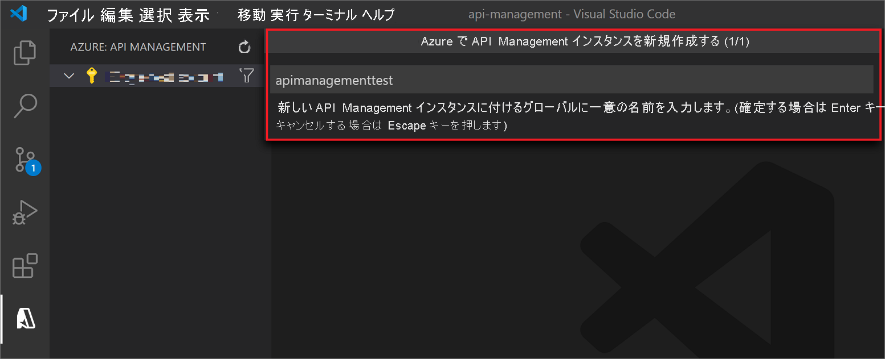
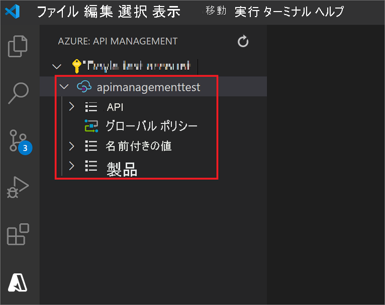
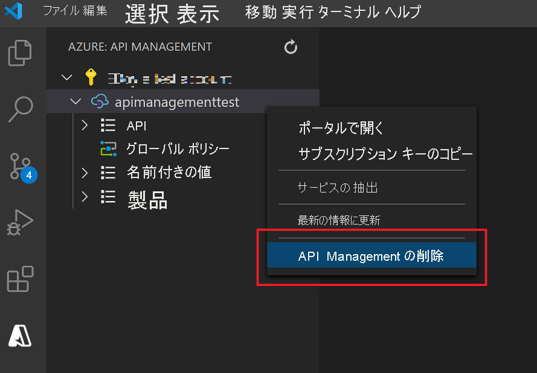

# クイック スタート」を参照してください。Visual Studio Code を使用して新しい Azure API Management サービス インスタンスを作成する

API Management (APIM) が組織にもたらす利点は、外部、パートナー、社内の開発者に API を公開することによって、社内のデータやサービスの可能性を広げられることです。 API Management は、開発者の取り組み、ビジネス インサイト、分析、セキュリティ、保護を通じて API プログラムの価値を高め、企業にコア コンピテンシーをもたらします。 APIM を使用すると、任意の場所でホストされている既存のバックエンド サービスの最新の API ゲートウェイを作成し、管理できます。 詳細については、[概要](api-management-key-concepts.md)に関するトピックを参照してください。

このクイック スタートでは、Visual Studio Code 用の *Azure API Management 拡張機能 (プレビュー)* を使用して新しい API Management インスタンスを作成する手順を説明します。 この拡張機能を使用して、API Management インスタンスに対する一般的な管理操作を実行することもできます。

## 前提条件

[!INCLUDE [quickstarts-free-trial-note](../../includes/quickstarts-free-trial-note.md)]

また、次のものがインストールされていることを確認します。

- [Visual Studio Code](https://code.visualstudio.com/)

- [Visual Studio Code 用の Azure API Management 拡張機能 (プレビュー)](https://marketplace.visualstudio.com/items?itemName=ms-azuretools.vscode-apimanagement&ssr=false#overview)

## Azure へのサインイン

Visual Studio Code を起動し、Azure 拡張機能を開きます (アクティビティ バーに Azure のアイコンが表示されない場合は、*Azure API Management* 拡張機能が有効になっていることを確認してください)。

**[Azure にサインイン]** を選択してブラウザー ウィンドウを起動し、Microsoft アカウントにサインインします。

## API Management サービスの作成

Microsoft アカウントにサインインすると、 *[Azure: API Management]* エクスプローラー ペインに Azure サブスクリプションの一覧が表示されます。

使用するサブスクリプションを右クリックし、 **[Create API Management in Azure]\(Azure でAPI Management を作成する\)** を選択します。

表示されたペインで、新しい API Management インスタンスの名前を指定します。 これは Azure 内でグローバルに一意であり、1 から 50 文字の英数字またはハイフン (あるいは両方) で構成され、アルファベットで始まり英数字で終わる必要があります。

指定した名前で新しい API Management インスタンス (および親リソース グループ) が作成されます。 既定では、インスタンスは、"*従量課金*" SKU を使用して "*米国西部*" リージョンに作成されます。

> [!TIP]
> "*Azure API Management の拡張機能の設定*" で **[Advanced Creation]\(高度な作成\)** を有効にした場合、API Management インスタンスをデプロイするための [API Management SKU](https://azure.microsoft.com/pricing/details/api-management/)、[Azure リージョン](https://status.azure.com/en-us/status)、[リソース グループ](../azure-resource-manager/management/overview.md)を指定することもできます。
>
> "*従量課金*" SKU の場合はプロビジョニングに 1 分かかりませんが、その他の SKU の場合は作成に 30 から 40 分かかります。

これで、最初の API をインポートして発行する準備ができました。 この操作を実行し、さらに Visual Studio Code 用の拡張機能内で共通の API Management 操作を実行することもできます。 詳細については、[チュートリアル](visual-studio-code-tutorial.md)を参照してください。

## リソースをクリーンアップする

API Management インスタンスが必要なくなった場合にこれを削除するには、右クリックして **[ポータルで開く]** を選択し、[API Management サービスとそのリソース グループを削除します](get-started-create-service-instance.md#clean-up-resources)。

または、 **[Delete API Management]\(API Management の削除\)** を選択して、API Management インスタンスのみを削除することもできます (この操作では、そのリソース グループは削除されません)。

## 次のステップ

> [!div class="nextstepaction"]
> [API Management 拡張機能を使用して API をインポートおよび管理する](visual-studio-code-tutorial.md)
