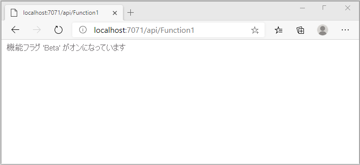

# <a name="quickstart-add-feature-flags-to-an-azure-functions-app"></a>クイック スタート:Azure Functions アプリに機能フラグを追加する

このクイックスタートでは、Azure App Configuration を使用して、Azure Functions アプリに機能管理の実装を作成します。 App Configuration サービスを使用し、すべての機能フラグを 1 か所に格納し、その状態を制御します。 

.NET 機能管理ライブラリは、機能フラグのサポートにより、フレームワークを拡張します。 これらのライブラリは、.NET 構成システム上に構築されます。 .NET 構成プロバイダーを介して、App Configuration と統合されます。

## <a name="prerequisites"></a>前提条件

- Azure サブスクリプション - [無料アカウントを作成する](https://azure.microsoft.com/free/)
- [Visual Studio 2019](https://visualstudio.microsoft.com/vs) と **Azure 開発**ワークロード。
- [Azure Functions ツール](../azure-functions/functions-develop-vs.md#check-your-tools-version)

## <a name="create-an-app-configuration-store"></a>App Configuration ストアを作成する

[!INCLUDE [azure-app-configuration-create](../../includes/azure-app-configuration-create.md)]

7. **[機能マネージャー]**  >  **[+追加]** を選択して、`Beta` という機能フラグを追加します。

    > [!div class="mx-imgBorder"]
    > 

    現時点では `label` と `Description` を空欄にしておいてください。

8. **[適用]** を選択して新しい機能フラグを保存します。

## <a name="create-a-functions-app"></a>関数アプリを作成する

[!INCLUDE [Create a project using the Azure Functions template](../../includes/functions-vstools-create.md)]

## <a name="connect-to-an-app-configuration-store"></a>App Configuration ストアに接続する

1. プロジェクトを右クリックし、 **[NuGet パッケージの管理]** を選択します。 **[参照]** タブで以下の NuGet パッケージを検索し、プロジェクトに追加します。 `Microsoft.Extensions.DependencyInjection` に関しては、最新の安定ビルドであることを確認してください。 

    ```
    Microsoft.Extensions.DependencyInjection
    Microsoft.Extensions.Configuration
    Microsoft.FeatureManagement
    ```


1. *Function1.cs* を開き、次のパッケージの名前空間を追加します。

    ```csharp
    using Microsoft.Extensions.Configuration;
    using Microsoft.FeatureManagement;
    using Microsoft.Extensions.DependencyInjection;
    ```

1. Azure App Configuration プロバイダーを起動するために、以下の `Function1` 静的コンストラクターを追加します。 次に、2 つの `static` メンバーを追加します。1 つは、`ServiceProvider` のシングルトン インスタンスを作成するための `ServiceProvider` という名前のフィールド、もう 1 つは、`IFeatureManager` のシングルトン インスタンスを作成するための `FeatureManager` という名前のプロパティで、`Function1` の下にあります。 次に、`Function1` で `AddAzureAppConfiguration()` を呼び出して App Configuration に接続します。 このプロセスによって、アプリケーションの起動時に構成が読み込まれます。 以後、すべての Functions 呼び出しについて、同じ構成インスタンスが使用されます。 

    ```csharp
        // Implements IDisposable, cached for life time of function
        private static ServiceProvider ServiceProvider; 

        static Function1()
        {
            IConfigurationRoot configuration = new ConfigurationBuilder()
                .AddAzureAppConfiguration(options =>
                {
                    options.Connect(Environment.GetEnvironmentVariable("ConnectionString"))
                           .UseFeatureFlags();
                }).Build();

            var services = new ServiceCollection();                                                                             
            services.AddSingleton<IConfiguration>(configuration).AddFeatureManagement();

            ServiceProvider = services.BuildServiceProvider(); 
        }

        private static IFeatureManager FeatureManager => ServiceProvider.GetRequiredService<IFeatureManager>();
    ```

1. 表示されるメッセージの値が機能フラグの状態に応じて変化するように、`Run` メソッドを更新します。

    ```csharp
        [FunctionName("Function1")]
        public static async Task<IActionResult> Run(
                [HttpTrigger(AuthorizationLevel.Anonymous, "get", "post", Route = null)] HttpRequest req,
                ILogger log)
            {
                string message = await FeatureManager.IsEnabledAsync("Beta")
                     ? "The Feature Flag 'Beta' is turned ON"
                     : "The Feature Flag 'Beta' is turned OFF";
                
                return (ActionResult)new OkObjectResult(message); 
            }
    ```

## <a name="test-the-function-locally"></a>関数をローカルでテストする

1. **ConnectionString** という名前の環境変数を設定します。先ほど App Configuration ストアの **[アクセス キー]** で取得したアクセス キーがその値となります。 Windows コマンド プロンプトを使用する場合は、次のコマンドを実行してコマンド プロンプトを再起動し、変更が反映されるようにします。

    ```cmd
        setx ConnectionString "connection-string-of-your-app-configuration-store"
    ```

    Windows PowerShell を使用する場合は、次のコマンドを実行します。

    ```azurepowershell
        $Env:ConnectionString = "connection-string-of-your-app-configuration-store"
    ```

    macOS または Linux を使用する場合は、次のコマンドを実行します。

    ```bash
        export ConnectionString='connection-string-of-your-app-configuration-store'
    ```

1. F5 キーを押して関数をテストします。 メッセージが表示されたら、Visual Studio からの要求に同意し、**Azure Functions Core (CLI)** ツールをダウンロードしてインストールします。 また、ツールで HTTP 要求を処理できるように、ファイアウォールの例外を有効にすることが必要になる場合もあります。

1. Azure Functions のランタイムの出力から、関数の URL をコピーします。

    

1. HTTP 要求の URL をブラウザーのアドレス バーに貼り付けます。 次の画像のように、機能フラグ `Beta` が無効であることを示す応答が表示されます。 

    

1. [Azure portal](https://portal.azure.com) にサインインします。 **[すべてのリソース]** を選択し、作成した App Configuration ストア インスタンスを選択します。

1. **[Feature Manager]\(機能マネージャー\)** を選択し、 **[Beta]\(ベータ\)** キーの状態を **[On]\(オン\)** に変更します。

1. コマンド プロンプトに戻り、`Ctrl-C` キーを押して、プロセスの実行をキャンセルします。  F5 キーを押してアプリケーションを再起動します。 

1. 手順 3. と同じプロセスを使用して、Azure Functions のランタイムの出力から、関数の URL をコピーします。 HTTP 要求の URL をブラウザーのアドレス バーに貼り付けます。 次の画像のように、ブラウザーの応答が変化し、機能フラグ `Beta` がオンになっていることがわかります。
 
    

## <a name="clean-up-resources"></a>リソースをクリーンアップする

[!INCLUDE [azure-app-configuration-cleanup](../../includes/azure-app-configuration-cleanup.md)]

## <a name="next-steps"></a>次のステップ

このクイックスタートでは、機能フラグを作成し、[App Configuration プロバイダー](/dotnet/api/Microsoft.Extensions.Configuration.AzureAppConfiguration)を介し、Azure Functions アプリでその機能フラグを使用しました。

- [機能管理](./concept-feature-management.md)の詳細を確認します。
- [機能フラグを管理](./manage-feature-flags.md)します。
- [Azure Functions アプリで動的な構成を使用する](./enable-dynamic-configuration-azure-functions-csharp.md)