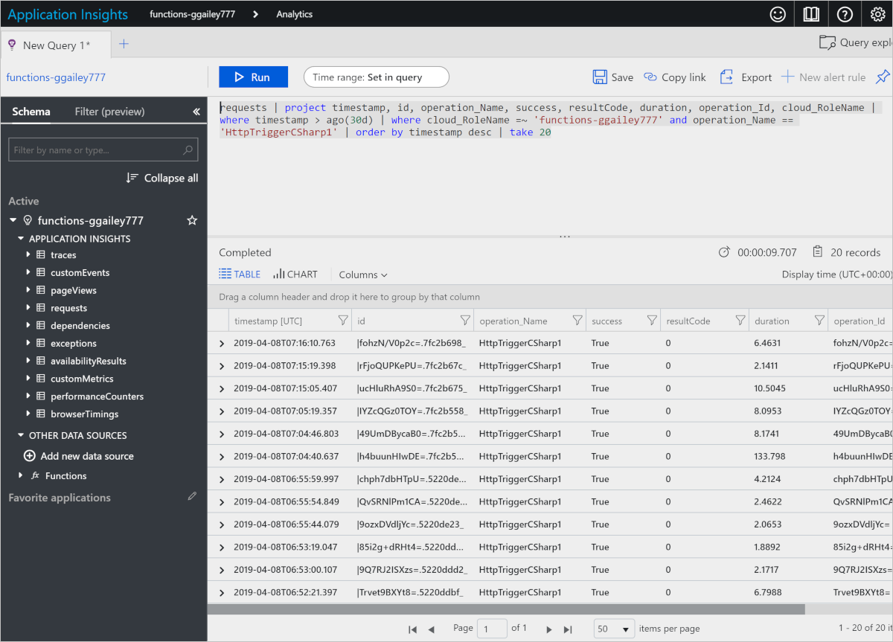

# <a name="analyze-azure-functions-telemetry-in-application-insights"></a>Application Insights で Azure Functions のテレメトリを分析する 

Azure Functions は、関数アプリの監視をより適切に行えるように Application Insights と統合されています。 Application Insights では、アプリからログに書き込まれる情報など、関数アプリによって生成されたテレメトリ データを収集します。 Application Insights との統合は、通常、関数アプリが作成されるときに有効にされます。 お使いの関数アプリにインストルメンテーション キーが設定されていない場合は、まず [Application Insights との統合を有効にする](configure-monitoring.md#enable-application-insights-integration)必要があります。 

既定では、関数アプリから収集されたデータは、Application Insights に格納されます。 [Azure portal](https://portal.azure.com) では、Application Insights によって、テレメトリ データの広範囲にわたるセットの視覚化が提供されます。 エラー ログ、クエリ イベント、メトリックの詳細を表示できます。 この記事では、収集したデータを表示してクエリを実行する方法の基本的な例を示します。 Application Insights での関数アプリ データの詳細については、「[Application Insights とは何か?](../azure-monitor/app/app-insights-overview.md)」を参照してください。 

データ保有と、かかる可能性のあるストレージ コストの詳細については、「[Application Insights でのデータの収集、保有、保存](../azure-monitor/app/data-retention-privacy.md)」を参照してください。   

## <a name="viewing-telemetry-in-monitor-tab"></a>[監視] タブでのテレメトリの表示

[Application Insights 統合が有効になっている](configure-monitoring.md#enable-application-insights-integration)場合は、 **[監視]** タブでテレメトリ データを表示できます。

1. 関数アプリのページで、Application Insights が構成されてから少なくとも 1 回実行された関数を選択します。 次に、左側のウィンドウで **[監視]** を選択します。 関数呼び出しの一覧が表示されるまで、 **[更新]** を一定間隔で選択します。

   

    > [!NOTE]
    > テレメトリ クライアントではサーバーに送信するデータをバッチ処理するため、一覧が表示されるには最大で 5 分かかる場合があります。 この遅延は、[Live Metrics Stream](../azure-monitor/app/live-stream.md) には適用されません。 このサービスは、ページの読み込み時に Functions ホストに接続するため、ログがページに直接ストリーム配信されます。

1. 特定の関数呼び出しのログを表示するには、その呼び出しの **[日付 (UTC)]** 列のリンクを選択します。 その呼び出しのログ出力は、新しいページに表示されます。

   

1. **[Application Insights で実行する]** を選択して、Azure ログ内の Azure Monitor ログ データを取得するクエリのソースを表示します。 サブスクリプションで Azure Log Analytics を初めて使用する場合は、有効にするように求められます。

1. Log Analytics を有効にすると、次のクエリが表示されます。 クエリの結果が過去 30 日間 (`where timestamp > ago(30d)`) に制限されていることがわかります。また、結果に表示されるのはわずか 20 行 (`take 20`) です。 一方、関数の呼び出し詳細の一覧には、過去 30 日間のデータが無制限で表示されます。

   

詳細については、後述の「[テレメトリをクエリする](#query-telemetry-data)」を参照してください。

## <a name="view-telemetry-in-application-insights"></a>Application Insights でテレメトリを表示する

[Azure portal](https://portal.azure.com) で関数アプリから Application Insights を開くには:

1. Azure portal でお使いの関数アプリに移動します。

1. 左側のページの **[設定]** で、 **[Application Insights]** を選択します。 

1. お使いのサブスクリプションで Application Insights を初めて使用する場合は、それを有効にするようメッセージが表示されます。 これを行うには、 **[Application Insights を有効にする]** を選択してから、次のページで **[適用]** を選択します。

![関数アプリの [概要] ページで Application Insights を開く](media/functions-monitoring/ai-link.png)

Application Insights の使用方法については、「[Application Insights のドキュメント](/azure/application-insights/)」をご覧ください。 このセクションでは、Application Insights でデータを表示する方法の例をいくつか示します。 Application Insights を既に使い慣れている場合は、[テレメトリ データの構成とカスタマイズの方法に関するセクション](configure-monitoring.md#configure-log-levels)に直接進んでかまいません。

![[Application Insights の概要] タブ](media/functions-monitoring/metrics-explorer.png)

Application Insights の次の領域は、関数の動作、パフォーマンス、およびエラーを評価するときに役立ちます。

| 調査 | 説明 |
| ---- | ----------- |
| **[障害](../azure-monitor/app/asp-net-exceptions.md)** |  関数の失敗やサーバーの例外に基づいてグラフやアラートを作成します。 **[操作名]** は関数名です。 依存関係に関するカスタム テレメトリを実装している場合を除き、依存関係のエラーは表示されません。 |
| **[パフォーマンス](../azure-monitor/app/performance-counters.md)** | **クラウド ロール インスタンス** あたりのリソース使用率とスループットを表示して、パフォーマンスの問題を分析します。 このパフォーマンス データは、基になっているリソースの処理が関数のために滞っている場合のデバッグに役立つことがあります。 |
| **[メトリック](../azure-monitor/essentials/metrics-charts.md)** | メトリックに基づいたグラフやアラートを作成します。 メトリックには、関数呼び出しの数、実行時間、成功率が含まれます。 |
| **[ライブ メトリック](../azure-monitor/app/live-stream.md)** | メトリック データが作成されたときに、ほぼリアルタイムに表示します。 |

## <a name="query-telemetry-data"></a>テレメトリをクエリする

[Application Insights Analytics](../azure-monitor/logs/log-query-overview.md) では、データベース内のテーブルの形式ですべてのテレメトリ データにアクセスできます。 Analytics では、データを抽出、操作、視覚化するためのクエリ言語が用意されています。 

**[ログ]** を選択して、ログに記録されたイベントを探索または照会します。


以下は、直近 30 分間の worker あたりの要求数の分布を示すクエリの例です。

```kusto
requests
| where timestamp > ago(30m) 
| summarize count() by cloud_RoleInstance, bin(timestamp, 1m)
| render timechart
```

使用可能なテーブルは、左側の **[スキーマ]** タブに表示されます。 次のテーブルで、関数呼び出しによって生成されたデータを確認できます。

| テーブル | 説明 |
| ----- | ----------- |
| **traces** | ランタイムによって作成されたログ、スケール コントローラー、関数コードからのトレース。 |
| **requests** | 関数呼び出しごとの要求。 |
| **exceptions** | ランタイムによってスローされた例外。 |
| **customMetrics** | 呼び出しの成功数と失敗数、成功率、時間。 |
| **customEvents** | ランタイムによって追跡されたイベント。たとえば、関数をトリガーする HTTP 要求など。 |
| **performanceCounters** | 関数が実行されているサーバーのパフォーマンスに関する情報。 |

その他のテーブルには、可用性テストと、クライアントとブラウザーのテレメトリがあります。 カスタム テレメトリを実装して、テーブルにデータを追加できます。

各テーブルでは、関数固有のデータの一部が `customDimensions` フィールドに保存されます。  たとえば、次のクエリでは、ログ レベルが `Error` のすべてのトレースが取得されます。

```kusto
traces 
| where customDimensions.LogLevel == "Error"
```

ランタイムにより、`customDimensions.LogLevel` フィールドと `customDimensions.Category` フィールドが提供されます。 関数コードで記述したログにフィールドを追加できます。 C# での例については、.NET クラス ライブラリ開発者ガイドの「[構造化ログ](functions-dotnet-class-library.md#structured-logging)」を参照してください。

## <a name="query-scale-controller-logs"></a>スケール コントローラー ログのクエリを実行する

_この機能はプレビュー段階にあります。_

[スケール コントローラー ログの記録](configure-monitoring.md#configure-scale-controller-logs)と [Application Insights 統合](configure-monitoring.md#enable-application-insights-integration)の両方を有効にすると、Application Insights ログ検索を使用して、出力されたスケール コントローラー ログのクエリを実行することができます。 スケール コントローラー ログは、**ScaleControllerLogs** カテゴリの `traces` コレクションに保存されます。

次のクエリを使用すると、指定した期間内の現在の関数アプリのスケール コントローラー ログをすべて検索することができます。

```kusto
traces 
| extend CustomDimensions = todynamic(tostring(customDimensions))
| where CustomDimensions.Category == "ScaleControllerLogs"
```

次のクエリは、前のクエリで展開して、スケールの変更を示すログのみを取得する方法を示しています。

```kusto
traces 
| extend CustomDimensions = todynamic(tostring(customDimensions))
| where CustomDimensions.Category == "ScaleControllerLogs"
| where message == "Instance count changed"
| extend Reason = CustomDimensions.Reason
| extend PreviousInstanceCount = CustomDimensions.PreviousInstanceCount
| extend NewInstanceCount = CustomDimensions.CurrentInstanceCount
```

## <a name="consumption-plan-specific-metrics"></a>従量課金プランに特有のメトリック

[従量課金プラン](consumption-plan.md)での実行時には、1 回の関数実行の実行 "*コスト*" は、"*GB 秒数*" で測定されます。 実行コストは、そのメモリ使用量と実行時間を組み合わせて計算されます。 詳細については、「[従量課金プランのコストの見積もり](functions-consumption-costs.md)」を参照してください。

次のテレメトリ クエリは、従量課金プランで実行される関数のコストに影響を与えるメトリックに特有のものです。

[!INCLUDE [functions-consumption-metrics-queries](../../includes/functions-consumption-metrics-queries.md)]

## <a name="azure-monitor-metrics"></a>Azure Monitor のメトリック

Application Insights によって収集されるテレメトリ データに加えて、[Azure Monitor メトリック](../azure-monitor/platform/data-platform-metrics.md)から、関数アプリがどのように実行されているかに関するデータも取得できます。 [App Service アプリで使用できる通常のメトリック](../app-service/web-sites-monitor.md#understand-metrics)と共に、目的の関数に固有の 2 つのメトリックがあります。

| メトリック | 説明 |
| ---- | ---- |
| **FunctionExecutionCount** | 関数の実行回数は、関数アプリが実行された回数を示します。 これは、アプリ内で関数が実行された回数に関連付けられています。 現在、このメトリックは、Linux で実行されている Premium および Dedicated (App Service) のプランではサポートされていません。 |
| **FunctionExecutionUnits** | 関数の実行単位は、実行時間とメモリ使用量を組み合わせたものです。  現在、Azure Monitor では、メモリ データのメトリックは使用できません。 ただし、アプリのメモリ使用量を最適化したい場合は、Application Insights によって収集されるパフォーマンス カウンター データを使用できます。 現在、このメトリックは、Linux で実行されている Premium および Dedicated (App Service) のプランではサポートされていません。|

Application Insights データを使用して従量課金プランのコストを計算する方法の詳細については、「[従量課金プランのコストの見積もり](functions-consumption-costs.md)」を参照してください。 Monitor エクスプローラーを使用してメトリックを表示する方法の詳細については、[Azure メトリックス エクスプローラーの概要](../azure-monitor/platform/metrics-getting-started.md)」を参照してください。


## <a name="next-steps"></a>次の手順

Azure Functions の監視の詳細を確認してください。

+ [Azure Functions を監視する](functions-monitoring.md)
+ [Azure Functions の監視を構成する方法](configure-monitoring.md)

