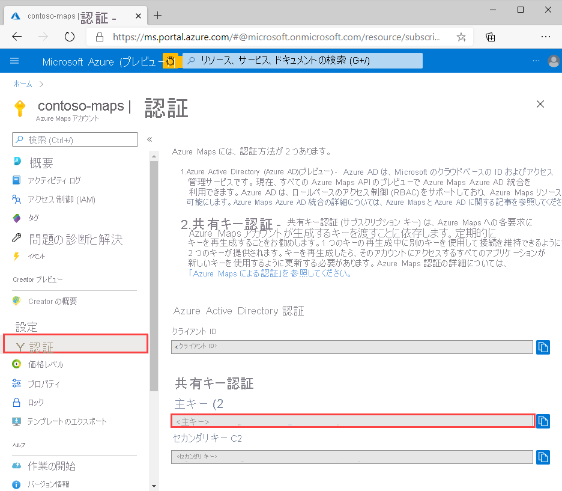
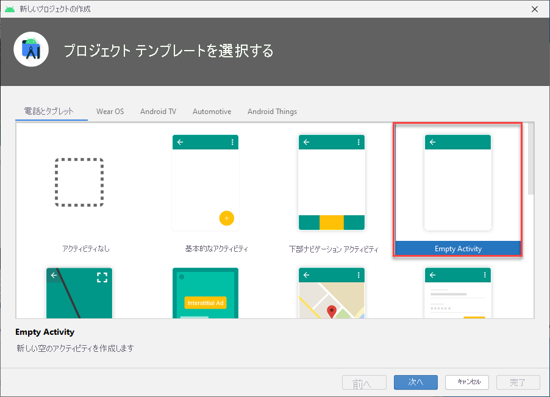
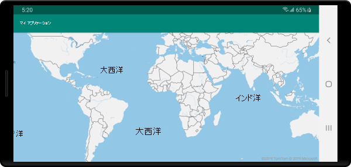

# <a name="quickstart-create-an-android-app-with-azure-maps"></a>クイックスタート: Azure Maps を使用して Android アプリを作成する

この記事では、Android アプリに Azure Maps を追加する方法について説明します。 次の基本的な手順について説明します。

* 使用する開発環境を設定する。
* 自分用の Azure Maps アカウントを作成する。
* アプリで使用する Azure Maps のプライマリ キーを取得する。
* プロジェクトから Azure Maps ライブラリを参照する。
* Azure Maps コントロールをアプリに追加する。

## <a name="prerequisites"></a>[前提条件]

1. [Azure portal](https://portal.azure.com) にサインインして Azure Maps アカウントを作成します。 Azure サブスクリプションをお持ちでない場合は、開始する前に [無料アカウント](https://azure.microsoft.com/free/) を作成してください。
2. [Azure Maps アカウントを作成します](quick-demo-map-app.md#create-an-azure-maps-account)
3. [プライマリ サブスクリプション キー (主キーまたはサブスクリプション キーとも呼ばれます) を取得します](quick-demo-map-app.md#get-the-primary-key-for-your-account)。 Azure Maps での認証の詳細については、「[Azure Maps での認証の管理](how-to-manage-authentication.md)」を参照してください。
4. Google から無料で [Android Studio をダウンロード](https://developer.android.com/studio/)します。

## <a name="create-an-azure-maps-account"></a>Azure Maps アカウントを作成する

次の手順で、新しい Azure Maps アカウントを作成します。

1. [Azure Portal](https://portal.azure.com) の左上隅にある **[リソースの作成]** をクリックします。
2. *[Marketplace を検索]* ボックスに「**Azure Maps**」と入力します。
3. *[結果]* から **[Azure Maps]** を選択します。 マップの下に表示される **[作成]** ボタンをクリックします。
4. **[Azure Maps アカウントの作成]** ページで、次の値を入力します。
    * このアカウントで使う "*サブスクリプション*"。
    * このアカウントの "*リソース グループ*" の名前。 *[新規作成]* を選んで新しく作成することも、 *[既存のものを使用]* を選んで既存のリソース グループを使うこともできます。
    * 新しいアカウントの "*名前*"。
    * このアカウントの "*価格レベル*"。
    * *[ライセンス]* と *[プライバシーに関する声明]* の内容を読み、チェック ボックスをオンにして条件に同意します。
    * **[作成]** ボタンをクリックします。

    :::image type="content" source="./media/quick-demo-map-app/create-account.png" alt-text="ポータルで Maps アカウントを作成する":::

## <a name="get-the-primary-key-for-your-account"></a>アカウントの主キーを取得する

Maps アカウントが正常に作成されたら、Maps API のクエリを実行できる主キーを取得します。

1. ポータルで、Maps アカウントを開きます。
2. [設定] セクションで **[認証]** を選択します。
3. **[主キー]** をクリップボードにコピーします。 このチュートリアルで後ほど使用するためにローカルに保存します。

>[!NOTE]
> Azure Maps のプライマリ キーではなく Azure サブスクリプション キーを使用した場合、マップは正しく表示されません。 また、セキュリティ上の理由から、主キーとセカンダリ キーをローテーションすることをお勧めします。 キーをローテーションするには、セカンダリ キーを使用するようにアプリを更新してデプロイします。次に、主キーの横にある [cycle/refresh]\(サイクル/更新\) ボタンを押して、新しい主キーを生成します。 古い主キーは無効になります。 キー ローテーションの詳細については、「[キー ローテーションと監査で Azure Key Vault を設定する](../key-vault/secrets/tutorial-rotation-dual.md)」を参照してください。



## <a name="create-a-project-in-android-studio"></a>Android Studio でプロジェクトを作成する

まず、空のアクティビティを含む新しいプロジェクトを作成します。 Android Studio プロジェクトを作成するには、次の手順を完了します。

1. **[Choose your project]\(プロジェクトの選択\)** で、 **[Phone and Tablet]\(電話およびタブレット\)** を選択します。 このフォーム ファクターでアプリケーションが実行されます。
2. **[Phone and Tablet]\(電話およびタブレット\)** タブで、 **[Empty Activity]\(空のアクティビティ\)** 、 **[次へ]** の順に選択します。
3. **[Configure your project]\(プロジェクトの構成\)** で、最小限の SDK として `API 21: Android 5.0.0 (Lollipop)` を選択します。 これは Azure Maps Android SDK でサポートされる最も古いバージョンです。
4. 既定値の `Activity Name` と `Layout Name` を受け入れ、 **[完了]** を選択します。

Android Studio のインストールと新しいプロジェクトの作成の詳細については、[Android Studio のドキュメント](https://developer.android.com/studio/intro/)を参照してください。



## <a name="set-up-a-virtual-device"></a>仮想デバイスを設定する

Android Studio を使用すると、コンピューター上で仮想 Android デバイスを設定できます。 このようにすると、開発中のアプリケーションのテストに役立つ場合があります。 仮想デバイスを設定するには、プロジェクト画面の右上隅にある Android 仮想デバイス (AVD) アイコンを選び、 **[仮想デバイスの作成]** を選択します。 ツールバーで **[ツール]**  >  **[Android]**  >  **[AVD マネージャー]** の順に選択して、AVD マネージャーに移動することもできます。 **[Phones]\(電話\)** カテゴリで **[Nexus 5X]** 、 **[次へ]** の順に選択します。

AVD の設定の詳細については、[Android Studio のドキュメント](https://developer.android.com/studio/run/managing-avds)を参照してください。


## <a name="install-the-azure-maps-android-sdk"></a>Azure Maps Android SDK をインストールする

アプリケーションのビルドの次の手順は、Azure Maps Android SDK をインストールすることです。 SDK をインストールするには、以下の手順を完了します。

1. 最上位の **build.gradle** ファイルを開き、次のコードを **すべてのプロジェクト** の **リポジトリ** ブロック セクションに追加します。

    ```gradle
    maven {
        url "https://atlas.microsoft.com/sdk/android"
    }
    ```

2. **app/build.gradle** を更新し、以下のコードを追加します。

    1. プロジェクトの **minSdkVersion** が API 21 以降であることを確認します。

    2. Android セクションに、次のコードを追加します。

        ```gradle
        compileOptions {
            sourceCompatibility JavaVersion.VERSION_1_8
            targetCompatibility JavaVersion.VERSION_1_8
        }
        ```

    3. 依存関係のブロックを更新し、最新の Azure Maps Android SDK の新しい実装の依存関係の行を追加します。

        ```gradle
        implementation "com.azure.android:azure-maps-control:1.0.0"
        ```

        > [!Note]
        > バージョン番号を "0+" に設定して、コードが常に最新バージョンを指すようにすることができます。

    4. ツール バーの **[ファイル]** に移動し、 **[Sync Project with Gradle Files]\(プロジェクトを Gradle ファイルと同期\)** をクリックします。
3. メイン アクティビティにマップ フラグメントを追加します (res \> layout \> activity\_main.xml)。

    ```xml
    <com.azure.android.maps.control.MapControl
        android:id="@+id/mapcontrol"
        android:layout_width="match_parent"
        android:layout_height="match_parent"
        />
    ```

::: zone pivot="programming-language-java-android"

4. **MainActivity.java** ファイルで、以下の操作を行う必要があります。

    * Azure Maps SDK の imports を追加する
    * Azure Maps の認証情報を設定する
    * **onCreate** メソッドでマップ コントロールのインスタンスを取得する

    `setSubscriptionKey` または `setAadProperties` メソッドを使用して `AzureMaps` クラスにグローバルに認証情報を設定すると、すべてのビューで認証情報を追加する必要がなくなります。

    マップ コントロールには、Android の OpenGL ライフサイクルを管理するための独自のライフサイクル メソッドが含まれています。 これらのライフサイクル メソッドは、それが含まれているアクティビティから直接呼び出す必要があります。 アプリでマップ コントロールのライフサイクル メソッドを正しく呼び出すためには、マップ コントロールを含むアクティビティで次のライフサイクル メソッドをオーバーライドする必要があります。 また、それぞれのマップ コントロール メソッドを呼び出す必要があります。

    * `onCreate(Bundle)`
    * `onDestroy()`
    * `onLowMemory()`
    * `onPause()`
    * `onResume()`
    * `onSaveInstanceState(Bundle)`
    * `onStart()`
    * `onStop()`

    **MainActivity.java** ファイルを次のように編集します。

    ```java
    package com.example.myapplication;
    
    import androidx.appcompat.app.AppCompatActivity;
    import com.azure.android.maps.control.AzureMaps;
    import com.azure.android.maps.control.MapControl;
    import com.azure.android.maps.control.layer.SymbolLayer;
    import com.azure.android.maps.control.options.MapStyle;
    import com.azure.android.maps.control.source.DataSource;
    
    public class MainActivity extends AppCompatActivity {
        
    static {
        AzureMaps.setSubscriptionKey("<Your Azure Maps subscription key>");

        //Alternatively use Azure Active Directory authenticate.
        //AzureMaps.setAadProperties("<Your aad clientId>", "<Your aad AppId>", "<Your aad Tenant>");
    }

    MapControl mapControl;

    @Override
    protected void onCreate(Bundle savedInstanceState) {
        super.onCreate(savedInstanceState);
        setContentView(R.layout.activity_main);

        mapControl = findViewById(R.id.mapcontrol);

        mapControl.onCreate(savedInstanceState);

        //Wait until the map resources are ready.
        mapControl.onReady(map -> {
            //Add your post map load code here.

        });
    }

    @Override
    public void onResume() {
        super.onResume();
        mapControl.onResume();
    }

    @Override
    protected void onStart(){
        super.onStart();
        mapControl.onStart();
    }

    @Override
    public void onPause() {
        super.onPause();
        mapControl.onPause();
    }

    @Override
    public void onStop() {
        super.onStop();
        mapControl.onStop();
    }

    @Override
    public void onLowMemory() {
        super.onLowMemory();
        mapControl.onLowMemory();
    }

    @Override
    protected void onDestroy() {
        super.onDestroy();
        mapControl.onDestroy();
    }

    @Override
    protected void onSaveInstanceState(Bundle outState) {
        super.onSaveInstanceState(outState);
        mapControl.onSaveInstanceState(outState);
    }}
    ```

    > [!NOTE]
    > 上記の手順を完了した後、一部のコードについて、Android Studio に警告が表示される場合があります。 これらの警告を解決するには、`MainActivity.java` で参照されているクラスをインポートします。
    > `Alt` + `Enter` (Mac では `Option` + `Return`) を選択すると、このようなクラスを自動的にインポートできます。

::: zone-end

::: zone pivot="programming-language-kotlin"

4. **MainActivity.kt** ファイルで、以下の操作を行う必要があります。

    * Azure Maps SDK の imports を追加する
    * Azure Maps の認証情報を設定する
    * **onCreate** メソッドでマップ コントロールのインスタンスを取得する

    `setSubscriptionKey` または `setAadProperties` メソッドを使用して `AzureMaps` クラスにグローバルに認証情報を設定すると、すべてのビューで認証情報を追加する必要がなくなります。

    マップ コントロールには、Android の OpenGL ライフサイクルを管理するための独自のライフサイクル メソッドが含まれています。 これらのライフサイクル メソッドは、それが含まれているアクティビティから直接呼び出す必要があります。 アプリでマップ コントロールのライフサイクル メソッドを正しく呼び出すためには、マップ コントロールを含むアクティビティで次のライフサイクル メソッドをオーバーライドする必要があります。 また、それぞれのマップ コントロール メソッドを呼び出す必要があります。

    * `onCreate(Bundle)`
    * `onDestroy()`
    * `onLowMemory()`
    * `onPause()`
    * `onResume()`
    * `onSaveInstanceState(Bundle)`
    * `onStart()`
    * `onStop()`

    **MainActivity.kt** ファイルを次のように編集します。

    ```kotlin
    package com.example.myapplication;

    import androidx.appcompat.app.AppCompatActivity
    import android.os.Bundle
    import com.azure.android.maps.control.AzureMap
    import com.azure.android.maps.control.AzureMaps
    import com.azure.android.maps.control.MapControl
    import com.azure.android.maps.control.events.OnReady
    
    class MainActivity : AppCompatActivity() {
    
        companion object {
            init {
                AzureMaps.setSubscriptionKey("<Your Azure Maps subscription key>");
    
                //Alternatively use Azure Active Directory authenticate.
                //AzureMaps.setAadProperties("<Your aad clientId>", "<Your aad AppId>", "<Your aad Tenant>");
            }
        }
    
        var mapControl: MapControl? = null
    
        override fun onCreate(savedInstanceState: Bundle?) {
            super.onCreate(savedInstanceState)
            setContentView(R.layout.activity_main)
    
            mapControl = findViewById(R.id.mapcontrol)
    
            mapControl?.onCreate(savedInstanceState)
    
            //Wait until the map resources are ready.
            mapControl?.onReady(OnReady { map: AzureMap -> })
        }
    
        public override fun onStart() {
            super.onStart()
            mapControl?.onStart()
        }
    
        public override fun onResume() {
            super.onResume()
            mapControl?.onResume()
        }
    
        public override fun onPause() {
            mapControl?.onPause()
            super.onPause()
        }
    
        public override fun onStop() {
            mapControl?.onStop()
            super.onStop()
        }
    
        override fun onLowMemory() {
            mapControl?.onLowMemory()
            super.onLowMemory()
        }
    
        override fun onDestroy() {
            mapControl?.onDestroy()
            super.onDestroy()
        }
    
        override fun onSaveInstanceState(outState: Bundle) {
            super.onSaveInstanceState(outState)
            mapControl?.onSaveInstanceState(outState)
        }
    }
    ```

    > [!NOTE]
    > 上記の手順を完了した後、一部のコードについて、Android Studio に警告が表示される場合があります。 これらの警告を解決するには、`MainActivity.kt` で参照されているクラスをインポートします。
    > `Alt` + `Enter` (Mac では `Option` + `Return`) を選択すると、このようなクラスを自動的にインポートできます。

::: zone-end

5. 以下の図に示すように、実行ボタンを選択して (Mac の場合は `Control` + `R` キーを押す)、アプリケーションをビルドします。

    ![[実行] をクリックします。](media/quick-android-map/run-app.png)

Android Studio でアプリケーションをビルドするには、数秒かかります。 ビルドが完了した後、エミュレートされた Android デバイスでアプリケーションをテストできます。 次のようなマップが表示されます。



## <a name="clean-up-resources"></a>リソースをクリーンアップする

>[!WARNING]
> 「[次のステップ](#next-steps)」セクションに示されているチュートリアルでは、お使いのアカウントで Azure Maps を使用および構成する方法を詳しく説明しています。 チュートリアルに進む場合は、このクイック スタートで作成したリソースをクリーンアップしないでください。

チュートリアルに進まない場合は、次の手順に従ってリソースをクリーンアップしてください。

1. Android Studio を閉じて、作成したアプリケーションを削除します。
2. 外部のデバイスでアプリケーションをテストした場合は、デバイスからアプリケーションをアンインストールしてください。

今後 Azure Maps Android SDK を使用した開発を行う予定がない場合は次の手順を実行します。

1. Azure portal ページに移動します。 ポータルのメイン ページで、 **[すべてのリソース]** を選択します。 または、左上隅にあるメニュー アイコンをクリックします。 **[すべてのリソース]** を選択します。
2. お使いの Azure Maps アカウントをクリックします。 ページの上部にある **[削除]** をクリックします。
3. Android アプリの開発を今後行う予定がない場合は、必要に応じて Android Studio をアンインストールします。

その他のコード例については、次のガイドを参照してください。

* [Azure Maps での認証の管理](how-to-manage-authentication.md)
* [Android マップでのマップ スタイルの変更](set-android-map-styles.md)
* [シンボル レイヤーを追加する](how-to-add-symbol-to-android-map.md)
* [線レイヤーを追加する](android-map-add-line-layer.md)
* [多角形レイヤーを追加する](how-to-add-shapes-to-android-map.md)

## <a name="next-steps"></a>次のステップ

このクイックスタートでは、Azure Maps アカウントを作成し、デモ アプリケーションを作成しました。 Azure Maps の詳細については、以下のチュートリアルを参照してください。

> [!div class="nextstepaction"]
> [GeoJSON データを Azure Maps に読み込む](tutorial-load-geojson-file-android.md)