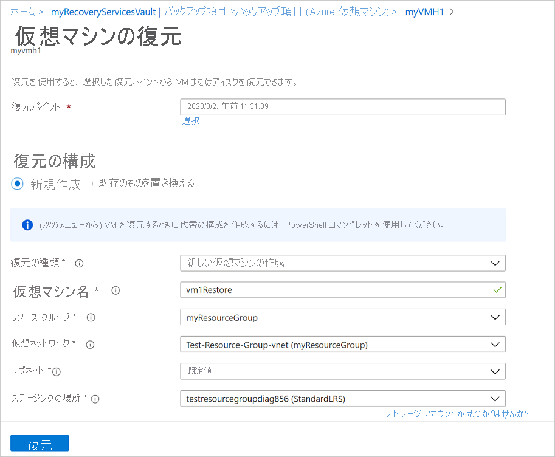

# <a name="how-to-restore-azure-vm-data-in-azure-portal"></a>Azure portal で Azure VM データを復元する方法

この記事では、[Azure Backup](backup-overview.md) Recovery Services コンテナーに格納されている復旧ポイントから Azure VM データを復元する方法について説明します。

## <a name="restore-options"></a>復元オプション

Azure Backup は、VM を復元するためのさまざまな方法を提供します。

**復元オプション** | **詳細**
--- | ---
**新しい VM を作成する** | 基本的な VM を復元ポイントからすばやく作成し、起動して実行します。<br/><br/> VM の名前を指定し、配置先のリソース グループと仮想ネットワーク (VNet) を選択して、復元された VM のストレージ アカウントを指定することができます。 新しい VM は、ソース VM と同じリージョンに作成する必要があります。<br><br>Azure の指定リージョンで Azure VM SKU が使用できなかったか、それ以外の問題があったために VM の復元に失敗した場合でも、Azure Backup では指定されたリソース グループ内のディスクが復元されます。
**ディスクを復元する** | 新しい VM を作成するために使用できる VM ディスクを復元します。<br/><br/> Azure Backup は、VM のカスタマイズと作成に役立つテンプレートを提供します。 <br/><br> 復元ジョブによって生成されるテンプレートをダウンロードして使用することで、カスタム VM 設定を指定したり、VM を作成したりできます。<br/><br/> ディスクは、指定したリソース グループにコピーされます。<br/><br/> または、ディスクを既存の VM に接続することや、PowerShell を使用して新しい VM を作成することもできます。<br/><br/> このオプションは、VM をカスタマイズする場合や、バックアップの時点では存在していなかった構成設定を追加する場合や、テンプレートまたは PowerShell を使用して構成する必要がある設定を追加する場合に役立ちます。
**既存のものを置き換える** | ディスクを復元し、それを使用して既存の VM 上のディスクを置き換えることができます。<br/><br/> 現在の VM が存在する必要があります。 削除されている場合、このオプションは使用できません。<br/><br/> ディスクを交換する前に、Azure Backup によって既存の VM のスナップショットが取得され、指定したステージングの場所に格納されます。 VM に接続されている既存のディスクが、選択した復元ポイントを使用して置き換えられます。<br/><br/> スナップショットはコンテナーにコピーされ、アイテム保持ポリシーに従って保持されます。 <br/><br/> ディスクの交換操作の後、元のディスクはリソース グループに保持されます。 元のディスクが必要ない場合は、それを手動で削除することを選択できます。 <br/><br/>[既存のものを置き換える] は、暗号化されていない管理 VM ([カスタム イメージを使用して作成された](https://azure.microsoft.com/resources/videos/create-a-custom-virtual-machine-image-in-azure-resource-manager-with-powershell/) VM など) でサポートされます。 クラシック VM、アンマネージド VM、および[一般化された VM](../virtual-machines/windows/upload-generalized-managed.md) ではサポートされていません。<br/><br/> 復元ポイントにあるディスクの数が現在の VM よりも多い (または少ない) 場合、復元ポイントのディスク数だけが VM 構成に反映されます。<br><br> 既存のものの置き換えは、[ユーザー割り当てマネージド ID](../active-directory/managed-identities-azure-resources/overview.md) や [Key Vault](../key-vault/general/overview.md) など、リンクされたリソースを持つ VM でもサポートされます。
**リージョンをまたがる (セカンダリ リージョン)** | リージョンをまたがる復元を使用すると、Azure VM をセカンダリ リージョン ([Azure のペアになっているリージョン](../best-practices-availability-paired-regions.md#what-are-paired-regions)) に復元できます。<br><br> セカンダリ リージョンにバックアップが実行されている場合は、選択されている回復ポイントのすべての Azure VM を復元できます。<br><br> バックアップ中、スナップショットはセカンダリ リージョンにレプリケートされません。 コンテナーに格納されているデータのみがレプリケートされます。 そのため、セカンダリ リージョンの復元は[コンテナー階層](about-azure-vm-restore.md#concepts)の復元だけです。 セカンダリ リージョンの復元時間は、プライマリ リージョンのコンテナー階層の復元時間とほぼ同じになります。  <br><br> この機能は、次のオプションで使用できます。<br> <li> [VM を作成します](#create-a-vm) <br> <li> [ディスクを復元する](#restore-disks) <br><br> 現時点では、[[既存のディスクの置き換え]](#replace-existing-disks) オプションはサポートされていません。<br><br> アクセス許可<br> セカンダリ リージョンでの復元操作は、バックアップ管理者とアプリ管理者が実行できます。

> [!NOTE]
> Azure VM 上の特定のファイルとフォルダーを復旧することもできます。 [詳細については、こちらを参照してください](backup-azure-restore-files-from-vm.md)。

## <a name="storage-accounts"></a>ストレージ アカウント

ストレージ アカウントの詳細を次に示します。

- **VM の作成**:作成した新しい VM は、指定したストレージ アカウントに配置されます。
- **ディスクの復元**: 復元したディスクは、指定したストレージ アカウントにコピーされます。 復元ジョブによって生成されるテンプレートをダウンロードして使用することで、カスタム VM 設定を指定できます。 このテンプレートは、指定したストレージ アカウントに配置されます。
- **ディスクの交換**: 既存の VM でディスクを交換するとき、ディスク交換の前に Azure Backup によって既存の VM のスナップショットが取得されます。 そのスナップショットは、データ転送を通じて、バックグラウンド プロセスとして Recovery Services コンテナーにもコピーされます。 ただし、スナップショット フェーズが完了すると、ディスクの置換操作がトリガーされます。 ディスクの置換操作の後、ソース Azure VM のディスクは、指定されたリソース グループに操作のために残され、VHD は指定されたストレージ アカウントに格納されます。 これらの VHD とディスクは、削除するか保持するかを選択できます。
- **ストレージ アカウントの場所**: ストレージ アカウントは、コンテナーと同じリージョンに存在する必要があります。 これらのアカウントのみが表示されます。 その場所にストレージ アカウントがない場合は、作成する必要があります。
- **[Storage type]\(ストレージの種類\)** :Blob Storage はサポートされていません。
- **ストレージ冗長**: ゾーン冗長ストレージ (ZRS) はサポートされていません。 アカウントのレプリケーションおよび冗長性の情報は、アカウント名の後のかっこ内に表示されます。
- **Premium Storage**:
  - Premium 以外の VM を復元する場合、Premium Storage アカウントはサポートされません。
  - マネージド VM を復元する場合、ネットワーク ルールで構成されている Premium Storage アカウントはサポートされません。

## <a name="before-you-start"></a>開始する前に

VM を復元する (新しい VM を作成する) には、VM の復元操作のための正しい Azure ロールベースのアクセス制御 (Azure RBAC) [アクセス許可](backup-rbac-rs-vault.md#mapping-backup-built-in-roles-to-backup-management-actions)があることを確認してください。

アクセス許可がない場合は、[ディスクを復元し](#restore-disks)、ディスクが復元された後、復元操作の一部として生成された[テンプレートを使用して](#use-templates-to-customize-a-restored-vm)新しい VM を作成できます。

[!INCLUDE [backup-center.md](../../includes/backup-center.md)]

## <a name="select-a-restore-point"></a>復元ポイントを選択

1. 復元する VM に関連付けられているコンテナーで、 **[バックアップ アイテム]**  >  **[Azure 仮想マシン]** を選択します。
1. VM を選択します。 既定では、VM ダッシュボードには過去 30 日間の復旧ポイントが表示されます。 30 日前よりも古い復旧ポイントを表示することや、日付、時間範囲、スナップショット整合性の種類をフィルターにして復旧ポイントを探すことができます。
1. VM を復元するには、 **[VM の復元]** を選択します。

    

1. 復旧に使用する復元ポイントを選択します。

## <a name="choose-a-vm-restore-configuration"></a>VM の復元の構成を選択する

1. **[仮想マシンの復元]** で、復元オプションを選択します。
    - **新規作成**: 新しい VM を作成する場合、このオプションを使用します。 単純な設定で VM を作成することも、ディスクを復元して、カスタマイズされた VM を作成することもできます。
    - **既存のものを置き換える**:既存の VM 上のディスクを置き換える場合、このオプションを使用します。

        

1. 選択した復元オプションの設定を指定します。

## <a name="create-a-vm"></a>VM の作成

[復元オプション](#restore-options)の 1 つであり、基本的な設定を使用して復元ポイントから VM をすばやく作成できます。

1. **[仮想マシンの復元]**  >  **[新規作成]**  >  **[復元の種類]** で、 **[仮想マシンの作成]** を選択します。
1. **[仮想マシン名]** で、サブスクリプションに存在しない VM を指定します。
1. **[リソース グループ]** で、新しい VM の既存のリソース グループを選択するか、グローバルに一意の名前を持つ新しいリソース グループを作成します。 既に存在している名前を割り当てると、Azure は VM と同じ名前をグループに割り当てます。
1. **[仮想ネットワーク]** で、VM が配置される VNet を選択します。 サブスクリプションに関連付けられているすべての VNet が表示されます。 サブネットを選択します。 最初のサブネットが既定で選択されています。
1. **[ステージングの場所]** で、VM のストレージ アカウントを指定します。 [詳細については、こちらを参照してください](#storage-accounts)。

    

1. **[復元]** を選択して復元操作をトリガーします。

## <a name="restore-disks"></a>ディスクを復元する

[復元オプション](#restore-options)の 1 つであり、復元ポイントからディスクを作成できます。 その後、ディスクを使用して次のいずれかのアクションを実行できます。

- 復元操作中に生成されるテンプレートを使用して設定をカスタマイズし、VM デプロイをトリガーします。 既定のテンプレート設定を編集し、VM デプロイのテンプレートを送信します。
- 既存の VM に、[復元されたディスクをアタッチ](../virtual-machines/windows/attach-managed-disk-portal.md)します。
- PowerShell を使用して、復元されたディスクから[新しい VM を作成](./backup-azure-vms-automation.md#create-a-vm-from-restored-disks)します。

1. **[復元の構成]**  >  **[新規作成]**  >  **[復元の種類]** で、 **[ディスクの復元]** を選択します。
1. **[リソース グループ]** で、復元されたディスクの既存のリソース グループを選択するか、グローバルに一意の名前を持つ新しいリソース グループを作成します。
1. **[ステージングの場所]** で、VHD のコピー先となるストレージ アカウントを指定します。 [詳細については、こちらを参照してください](#storage-accounts)。

    ![[リソース グループ] と [ステージングの場所] を選択します](./media/backup-azure-arm-restore-vms/trigger-restore-operation1.png)

1. **[復元]** を選択して復元操作をトリガーします。

仮想マシンでマネージド ディスクを使用しているときに **[仮想マシンの作成]** オプションを選択した場合、Azure Backup では、指定されたストレージ アカウントは使用されません。 ただし、 **[ディスクの復元]** と **[インスタント リストア]** の場合、ストレージ アカウントはテンプレートを格納するためにのみ使用されます。 指定したリソース グループ内にマネージド ディスクが作成されます。
仮想マシンでアンマネージド ディスクを使用した場合、それらはストレージ アカウントに対して BLOB として復元されます。

### <a name="use-templates-to-customize-a-restored-vm"></a>テンプレートを使用して復元 VM をカスタマイズする

ディスクが復元された後に、復元操作の一環として生成されたテンプレートを使用して、新しい VM をカスタマイズおよび作成します。

1. **[バックアップ ジョブ]** で、適切な復元ジョブを選択します。

1. **[復元]** で、 **[テンプレートのデプロイ]** を選択して、テンプレートのデプロイを開始します。

    

1. テンプレートで提供されている VM 設定をカスタマイズするには、 **[テンプレートの編集]** を選択します。 さらにカスタマイズを追加する場合は、 **[パラメーターの編集]** を選択します。
    - カスタム テンプレートからのリソースのデプロイに関する[詳細情報](../azure-resource-manager/templates/deploy-portal.md#deploy-resources-from-custom-template)。
    - テンプレートの作成に関する[詳細情報](../azure-resource-manager/templates/template-syntax.md)。

   

1. VM のカスタム値を入力し、**利用規約** を受諾して **[購入]** を選択します。

   

## <a name="replace-existing-disks"></a>既存のディスクの置き換え

[復元オプション](#restore-options)の 1 つであり、選択した復元ポイントで既存の VM ディスクを置き換えることができます。 すべての復元オプションを[確認](#restore-options)します。

1. **[復元の構成]** で、 **[既存の以下のものを置き換えます]** を選択します。
1. **[リストアの種類]** で、 **[Replace disk/s]\(ディスクの交換\)** を選択します。 これは、既存の VM ディスクを置き換えるために使用される復元ポイントです。
1. **[ステージングの場所]** で、復元プロセス中に現在のマネージド ディスクのスナップショットを保存する場所を指定します。 [詳細については、こちらを参照してください](#storage-accounts)。

   ![復元の構成ウィザードの [既存の以下のものを置き換えます]](./media/backup-azure-arm-restore-vms/restore-configuration-replace-existing.png)

## <a name="cross-region-restore"></a>リージョンをまたがる復元

[復元オプション](#restore-options)の 1 つである、リージョンをまたがる復元 (CRR) を使用すると、Azure VM をセカンダリ リージョン (Azure のペアになっているリージョン) に復元できます。

この機能の使用を開始するには、「[開始する前に](./backup-create-rs-vault.md#set-cross-region-restore)」セクションを参照してください。

CRR が有効になっているかどうかを確認するには、「[リージョンをまたがる復元の構成](backup-create-rs-vault.md#configure-cross-region-restore)」の手順に従ってください。

### <a name="view-backup-items-in-secondary-region"></a>セカンダリ リージョンのバックアップ項目を表示する

CRR が有効になっている場合は、セカンダリ リージョンのバックアップ項目を表示できます。

1. ポータルから **[Recovery Services コンテナー]** 、 **[バックアップ項目]** の順に移動します。
1. セカンダリ リージョンの項目を表示するには、 **[セカンダリ リージョン]** を選択します。

>[!NOTE]
>CRR 機能をサポートする種類のバックアップ管理のみが一覧に表示されます。 現時点では、セカンダリ リージョン データをセカンダリ リージョンに復元することのみが許可されています。<br></br>Azure VM の CRR は、Azure マネージド VM (暗号化された Azure VM を含む) でサポートされています。


### <a name="restore-in-secondary-region"></a>セカンダリ リージョンに復元する

セカンダリ リージョンに復元するユーザー エクスペリエンスは、プライマリ リージョンに復元するユーザー エクスペリエンスに似ています。 [復元の構成] ペインで復元の詳細を構成するときに、セカンダリ リージョンのパラメーターのみを指定するように求められます。

現在、[読み取りアクセス geo 冗長ストレージ (RA GRS)](../storage/common/storage-redundancy.md#redundancy-in-a-secondary-region) のレプリケーションは 15 分ですが、セカンダリ リージョンの [RPO](azure-backup-glossary.md#rpo-recovery-point-objective) は、プライマリ リージョンから最大 12 時間です。


- VM を復元して作成する方法については、「[VMの作成](#create-a-vm)」を参照してください。
- ディスクとして復元するには、「[ディスクを復元する](#restore-disks)」を参照してください。

>[!NOTE]
>
>- 復元がトリガーされた後、データ転送フェーズでは、復元ジョブを取り消すことができません。
>- リージョンをまたがる復元機能では、CMK (カスタマー マネージド キー) が有効になっている Azure VM が、セカンダリ リージョンにおける CMK が有効になっていない VM として復元されます。これらの VM は、CMK が有効になっている Recovery Services コンテナーにはバックアップされません。
>- セカンダリ リージョンに復元するために必要な Azure ロールは、プライマリ リージョンにおけるものと同じです。
>- Azure VM の復元中に、Azure Backup によってセカンダリ リージョンの仮想ネットワーク設定が自動的に構成されます。 テンプレートのデプロイ中に[ディスクを復元](#restore-disks)する場合は、確実にセカンダリ リージョンに対応する仮想ネットワーク設定を指定してください。

[Azure ゾーン固定 VM](../virtual-machines/windows/create-portal-availability-zone.md) は、同じリージョンの任意の[可用性ゾーン](../availability-zones/az-overview.md)で復元できます。

復元プロセスでは、 **[可用性ゾーン]** オプションが表示されます。 既定のゾーンが最初に表示されます。 別のゾーンを選択するには、任意のゾーンの番号を選択します。 固定ゾーンが使用できない場合は、バックアップ データがゾーン的にレプリケートされないため、別のゾーンにデータを復元することはできません。 可用性ゾーンでは、コンテナー階層の復旧ポイントからの復元のみが可能です。


### <a name="monitoring-secondary-region-restore-jobs"></a>セカンダリ リージョンの復元ジョブの監視

1. ポータルから **[Recovery Services コンテナー]**  >  **[バックアップ ジョブ]** に移動します。
1. セカンダリ リージョンの項目を表示するには、 **[セカンダリ リージョン]** を選択します。

    

## <a name="restoring-unmanaged-vms-and-disks-as-managed"></a>アンマネージドの VM およびディスクをマネージドとして復元する

復元の際に[アンマネージド ディスク](../storage/common/storage-disaster-recovery-guidance.md#azure-unmanaged-disks)を[マネージド ディスク](../virtual-machines/managed-disks-overview.md)として復元するオプションが用意されています。 既定では、アンマネージドの VM およびディスクは、アンマネージドの VM およびディスクとして復元されます。 ただし、マネージドの VM およびディスクとして復元することを選択できるようになりました。 これらの復元はスナップショット フェーズからはトリガーされず、コンテナー フェーズからのみトリガーされます。 この機能は、アンマネージドの暗号化された VM では使用できません。


## <a name="restore-vms-with-special-configurations"></a>特別な構成を持つ VM を復元する

VM の復元が必要になることがある、一般的なシナリオは多数あります。

**シナリオ** | **ガイダンス**
--- | ---
**Hybrid Use Benefit を使用して VM を復元する** | Windows VM が [Hybrid Use Benefit (HUB) ライセンス](../virtual-machines/windows/hybrid-use-benefit-licensing.md)を使用している場合、ディスクを復元し、提供されているテンプレート ( **[ライセンスの種類]** を **Windows_Server** に設定)、または PowerShell を使用して新しい VM を作成します。  この設定は、VM の設定後にも適用できます。
**Azure データ センターでの障害発生時に VM を復元する** | コンテナーで GRS を使用しており、VM のプライマリ データセンターがダウンした場合、Azure Backup では、バックアップされた VM を、ペアのデータセンターに復元することができます。 ペアのデータセンターでストレージ アカウントを選択し、通常どおりに復元します。 Azure Backup は、ペアのリージョンのコンピューティング サービスを使用して、復元された VM を作成します。 データセンターの回復性に関して[詳しくはこちらを参照してください](/azure/architecture/resiliency/recovery-loss-azure-region)。<br><br> コンテナーで GRS が使用されている場合、[リージョンをまたがる復元](#cross-region-restore)という新しい機能を選択できます。 これにより、完全な停止でも、部分的な停止でも、あるいはまったく停止していない場合でさえも、第二リージョンに復元できます。
**ベア メタル回復** | Azure VM とオンプレミスのハイパーバイザーの大きな違いは、Azure では VM コンソールが使用できないことです。 コンソールは、ベア メタル回復 (BMR) タイプのバックアップを使用して回復するといった特定のシナリオで必要です。 ただし、コンテナーからの VM の復元が、BMR の代わりとなります。
**特別なネットワーク構成を持つ VM を復元する** | 特別なネットワーク構成に含まれるものとしては、内部または外部の負荷分散を使用する VM、複数の NIC の使用、または複数の予約済み IP アドレスがあります。 これらの VM は、[ディスクの復元オプション](#restore-disks)を使用して復元します。 このオプションでは、指定されたストレージ アカウントに VHD のコピーを作成した後、構成に応じて、[内部](../load-balancer/quickstart-load-balancer-standard-internal-powershell.md)または[外部](../load-balancer/quickstart-load-balancer-standard-public-powershell.md)のロード バランサー、[複数の NIC](../virtual-machines/windows/multiple-nics.md)、または[複数の予約済み IP アドレス](../virtual-network/virtual-network-multiple-ip-addresses-powershell.md)を使用して VM を作成できます。
**NIC/サブネットでのネットワーク セキュリティ グループ (NSG)** | Azure VM バックアップは、vnet、サブネット、および NIC レベルでの NSG 情報のバックアップと復元をサポートします。
**ゾーンにピン留めされた VM** | ゾーンにピン留めされた Azure VM を (Azure Backup で) バックアップした場合は、それをピン留めされていたのと同じゾーンで復元できます。 [詳細情報](../availability-zones/az-overview.md)
**可用性セットで VM を復元する** | ポータルから VM を復元するとき、可用性セットを選択するオプションはありません。 復元された VM には可用性セットがありません。 ディスクの復元オプションを使用する場合、提供されているテンプレートまたは PowerShell を使用してディスクから VM を作成するときに[可用性セットを指定する](../virtual-machines/windows/tutorial-availability-sets.md)ことができます。
**SQL VM などの特別な VM を復元する** | Azure VM バックアップを使用して SQL VM をバックアップした後、VM の復元オプションを使用したか、ディスクを復元した後に VM を作成した場合は、新しく作成した VM を SQL プロバイダーに登録する必要があります ([こちら](../azure-sql/virtual-machines/windows/sql-agent-extension-manually-register-single-vm.md?tabs=azure-cli%2cbash)を参照してください)。 これにより、復元された VM が SQL VM に変換されます。

### <a name="restore-domain-controller-vms"></a>ドメイン コントローラー VM を復元する

**シナリオ** | **ガイダンス**
--- | ---
**単一ドメイン内の単一ドメイン コントローラー VM を復元する** | 他の VM と同様に VM を復元します。 以下の点に注意してください。<br/><br/> Active Directory の観点からは、Azure VM は他の VM と同様です。<br/><br/> ディレクトリ サービス復元モード (DSRM) も利用できるので、Active Directory の復元シナリオはすべて実行可能です。 仮想化ドメイン コントローラーのバックアップと復元の考慮事項に関する[詳細情報](#post-restore-steps)。
**単一ドメイン内の複数のドメイン コントローラー VM を復元する** | 同じドメイン内の他のドメイン コントローラーにネットワーク経由で到達できる場合は、VM と同様にそのドメイン コントローラーを復元できます。 これがドメイン内の最後のドメイン コントローラーである場合や、分離されたネットワークでの復旧を実行している場合は、[フォレストの復旧](/windows-server/identity/ad-ds/manage/ad-forest-recovery-single-domain-in-multidomain-recovery)を使用します。
**複数のドメイン構成で単一のドメイン コントローラー VM を復元する** |  [PowerShell を使用して](backup-azure-vms-automation.md#restore-the-disks)、ディスクを復元して VM を作成します  
**1 つのフォレスト内の複数のドメインを復元する** | [フォレストの復旧](/windows-server/identity/ad-ds/manage/ad-forest-recovery-single-domain-in-multidomain-recovery)をお勧めします。

詳細については、「[Active Directory ドメイン コントローラーのバックアップおよび復元](active-directory-backup-restore.md)」を参照してください。

## <a name="track-the-restore-operation"></a>復元操作を追跡する

復元操作をトリガーすると、追跡用のジョブがバックアップ サービスによって作成されます。 Azure Backup は、ジョブに関する通知をポータルに表示します。 表示されない場合は、 **[通知]** シンボルを選択し、 **[アクティビティ ログのその他のイベント]** を選択して、復元プロセスの状態を確認します。


 次のように復元を追跡します:

1. ジョブの操作を表示するには、通知のハイパーリンクを選択します。 または、コンテナーで **[バックアップ ジョブ]** を選択してから、関連する VM を選択します。

    

1. 復元の進行状況を監視するには、ステータスが **[進行中]** である任意の復元ジョブを選択します。 復元の進行状況に関する情報が進行状況バーに表示されます。

    - **[Estimated time of restore]\(復元の推定時間\)** :最初は、復元操作の完了にかかる時間を示します。 操作の進行に伴って所要時間が減り、復元操作が終了するとゼロになります。
    - **[Percentage of restore]\(復元率\)** 。 実行された復元操作の割合を示します。
    - **[転送バイト数]** :新しい VM を作成することによって復元している場合、転送予定の合計バイト数に対する転送されたバイト数を示します。

## <a name="post-restore-steps"></a>復元後の手順

VM を復元した後の注意点がいくつかあります:

- バックアップの構成の間に存在した拡張機能はインストールされますが、有効にはされません。 問題がある場合は、拡張機能を再インストールしてください。
- バックアップされた VM が静的 IP アドレスを持っていた場合、復元された VM は競合を回避するために動的 IP アドレスを持つことになります。 [復元された VM に静的 IP アドレスを追加する](/powershell/module/az.network/set-aznetworkinterfaceipconfig#description)ことができます。
- 復元された VM には可用性セットがありません。 ディスクの復元オプションを使用する場合、提供されているテンプレートまたは PowerShell を使用してディスクから VM を作成するときに[可用性セットを指定する](../virtual-machines/windows/tutorial-availability-sets.md)ことができます。
- Ubuntu など cloud-init ベースの Linux ディストリビューションを使用している場合、セキュリティ上の理由から、復元後にパスワードがブロックされます。 復元した VM で VMAccess 拡張機能を使用して、[パスワードをリセット](/troubleshoot/azure/virtual-machines/reset-password)してください。 これらのディストリビューションでは SSH キーを使用することを推奨しているため、復元後にパスワードをリセットする必要はありません。
- 復元された VM に、ドメイン コントローラーとのリレーションシップが破損しているためにアクセスできない場合は、次の手順に従って VM を起動します。
  - 回復した VM にデータ ディスクとして OS ディスクを接続します。
  - Azure エージェントが応答していないことが判明した場合は、この[リンク](/troubleshoot/azure/virtual-machines/install-vm-agent-offline)に従って VM エージェントを手動でインストールしてください。
  - VM でシリアル コンソール アクセスを有効にして、VM へのコマンドライン アクセスを許可します

  ```cmd
    bcdedit /store <drive letter>:\boot\bcd /enum
    bcdedit /store <VOLUME LETTER WHERE THE BCD FOLDER IS>:\boot\bcd /set {bootmgr} displaybootmenu yes
    bcdedit /store <VOLUME LETTER WHERE THE BCD FOLDER IS>:\boot\bcd /set {bootmgr} timeout 5
    bcdedit /store <VOLUME LETTER WHERE THE BCD FOLDER IS>:\boot\bcd /set {bootmgr} bootems yes
    bcdedit /store <VOLUME LETTER WHERE THE BCD FOLDER IS>:\boot\bcd /ems {<<BOOT LOADER IDENTIFIER>>} ON
    bcdedit /store <VOLUME LETTER WHERE THE BCD FOLDER IS>:\boot\bcd /emssettings EMSPORT:1 EMSBAUDRATE:115200
    ```

  - VM が再構築されたら、Azure portal を使用してローカル管理者アカウントとパスワードをリセットします
  - シリアル コンソール アクセスと CMD を使用して、VM をドメインから切断します

    ```cmd
    cmd /c "netdom remove <<MachineName>> /domain:<<DomainName>> /userD:<<DomainAdminhere>> /passwordD:<<PasswordHere>> /reboot:10 /Force"
    ```

- VM が切断されて再起動されると、ローカル管理者の資格情報で VM に正常に RDP 接続し、正常に VM をドメインに再度参加させることができます。

## <a name="backing-up-restored-vms"></a>復元された VM のバックアップ

- 最初にバックアップされた VM と同じ名前で同じリソース グループに VM を復元した場合、復元後も VM に対するバックアップは引き続き行われます。
- 別のリソース グループに VM を復元した場合、または復元された VM に別の名前を指定した場合、復元された VM のバックアップをセットアップする必要があります。

## <a name="next-steps"></a>次のステップ

- 復元処理中に問題が発生した場合は、一般的な問題とエラーを[確認](backup-azure-vms-troubleshoot.md#restore)してください。
- VM が復元されたら、[仮想マシンの管理](backup-azure-manage-vms.md)について理解します