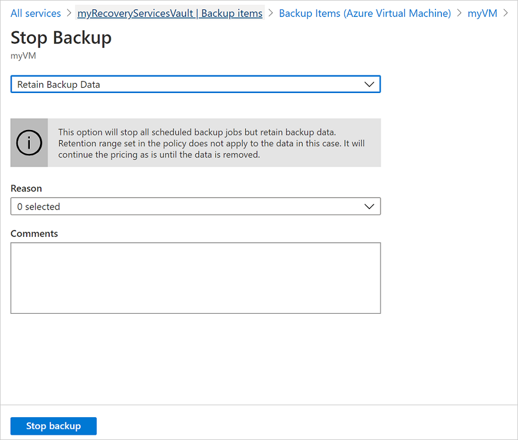

# Azure Backup サービスで Azure VM のバックアップを管理する

この記事では、[Azure Backup サービス](backup-overview.md)を使用してバックアップされる Azure 仮想マシン (VM) を管理する方法について説明します。 また、コンテナーのダッシュボードで確認できるバックアップ情報の概要も示します。

Azure portal では、Recovery Services コンテナーのダッシュボードで、次のようなコンテナー情報にアクセスできます。

* 最新のバックアップ (最新の復元ポイントでもあります)。
* バックアップ ポリシー。
* すべてのバックアップ スナップショットの合計サイズ。
* バックアップが有効になっている VM の数。

ダッシュボードを使用し、個々の VM にドリルダウンして、バックアップを管理できます。 マシンのバックアップを開始するには、ダッシュボードでコンテナーを開きます。

[!INCLUDE [backup-center.md](../../includes/backup-center.md)]

## ダッシュボードで VM を表示する

コンテナー ダッシュボードに VM を表示するには、次の手順を実行します。

1. [Azure portal](https://portal.azure.com/) にサインインします。
1. 左側のメニューから、 **[すべてのサービス]** を選択します。

    ![[すべてのサービス] を選択する](./media/backup-azure-manage-vms/select-all-services.png)

1. **[すべてのサービス]** ダイアログ ボックスに、「*Recovery Services*」と入力します。 入力に従って、リソースの一覧がフィルター処理されます。 リソースの一覧から **[Recovery Services コンテナー]** を選択します。

    ![[Recovery Services コンテナー] と入力して選択する](./media/backup-azure-manage-vms/all-services.png)

    サブスクリプションに Recovery Services コンテナーの一覧が表示されます。

1. 使いやすくするために、コンテナー名の横にあるピン アイコンを選択し、 **[ダッシュボードにピン留めする]** を選択します。
1. コンテナー ダッシュボードを開きます。

    ![コンテナー ダッシュボードと [設定] ウィンドウを開く](./media/backup-azure-manage-vms/full-view-rs-vault.png)

1. **[バックアップ項目]** タイルで、 **[Azure Virtual Machines]** を選択します。

    ![[バックアップ項目] タイルを開く](./media/backup-azure-manage-vms/azure-virtual-machine.png)

1. **[バックアップ項目]** ウィンドウでは、保護されている VM の一覧を表示できます。 この例では、コンテナーは 1 つの仮想マシン、*myVMR1* を保護します。  

    ![[バックアップ項目] ウィンドウを表示する](./media/backup-azure-manage-vms/backup-items-blade-select-item.png)

1. コンテナー項目のダッシュボードから、バックアップ ポリシーの変更、オンデマンド バックアップの実行、VM の保護の停止と再開、バックアップ データの削除、復元ポイントの表示、復元の実行を行うことができます。

    ![[バックアップ項目] ダッシュボードと [設定] ウィンドウ](./media/backup-azure-manage-vms/item-dashboard-settings.png)

## VM のバックアップ ポリシーを管理する

### バックアップ ポリシーの変更

既存のバックアップ ポリシーを変更するには、次のようにします。

1. [Azure portal](https://portal.azure.com/) にサインインします。 コンテナー ダッシュボードを開きます。
2. **[管理] > [バックアップ ポリシー]** で、バックアップ ポリシーの種類として **[Azure Virtual Machine]** を選択します。
3. **[変更]** を選択し、設定を変更します。

### バックアップ ポリシーを切り替える

バックアップ ポリシーを管理するには、次の手順を実行します。

1. [Azure portal](https://portal.azure.com/) にサインインします。 コンテナー ダッシュボードを開きます。
2. **[バックアップ項目]** タイルで、 **[Azure Virtual Machines]** を選択します。

    ![[バックアップ項目] タイルを開く](./media/backup-azure-manage-vms/azure-virtual-machine.png)

3. **[バックアップ項目]** ウィンドウでは、保護されている VM と、最新の復元ポイントの時点の最後のバックアップの状態の一覧を表示できます。

    ![[バックアップ項目] ウィンドウを表示する](./media/backup-azure-manage-vms/backup-items-blade-select-item.png)

4. コンテナー項目のダッシュボードでは、バックアップ ポリシーを選択できます。

   * ポリシーを切り替えるには、別のポリシーを選択し、 **[保存]** を選択します。 すぐに、新しいポリシーがコンテナーに適用されます。

     

## オンデマンド バックアップを実行する

保護を設定した後、VM のオンデマンド バックアップを実行できます。 以下の詳細を考慮してください。

* 初回バックアップがまだ実行されていない場合、オンデマンド バックアップを実行すると、VM の完全なコピーが Recovery Services コンテナーに作成されます。
* 初回バックアップが完了している場合、オンデマンド バックアップによって Recovery Services コンテナーに送信されるのは、前回のスナップショット以降の変更だけです。 つまり、以降のバックアップでは、増分のみが送信対象となります。
* オンデマンド バックアップのリテンション期間は、バックアップをトリガーするタイミングを指定するリテンション期間の値です。

> [!NOTE]
> Azure Backup サービスでは、1 日あたり最大 3 回のオンデマンド バックアップと、スケジュール済みバックアップを追加で 1 回サポートします。

オンデマンド バックアップをトリガーするには:

1. [コンテナー項目のダッシュボード](#view-vms-on-the-dashboard)の **[保護された項目]** で、 **[バックアップ項目]** を選択します。

    ![[今すぐバックアップ] オプション](./media/backup-azure-manage-vms/backup-now-button.png)

2. **[バックアップの管理の種類]** で、 **[Azure Virtual Machine]** を選択します。 **[バックアップ項目 (Azure 仮想マシン)]** ウィンドウが表示されます。
3. VM を選択し、 **[今すぐバックアップ]** を選択してオンデマンド バックアップを作成します。 **[今すぐバックアップ]** ウィンドウが表示されます。
4. **[バックアップの保持]** フィールドに、バックアップが保持される日付を指定します。

    ![[今すぐバックアップ] のカレンダー](./media/backup-azure-manage-vms/backup-now-check.png)

5. **[OK]** を選択してバックアップ ジョブを実行します。

ジョブの進行状況を追跡するには、コンテナーのダッシュボードで **[バックアップ ジョブ]** タイルを選択します。

## VM の保護を停止する

VM の保護を停止するには、次の 2 つの方法があります。

* **保護を停止してバックアップ データを保持します**。 このオプションを選択すると、今後のすべてのバックアップ ジョブで VM が保護されなくなります。 ただし、Azure Backup サービスは、バックアップされている復旧ポイントを保持します。  コンテナーの復旧ポイントを保持するには、料金を支払う必要があります (詳細については、[Azure Backup の料金に関するページ](https://azure.microsoft.com/pricing/details/backup/)を参照してください)。 必要な場合は、VM を復元することができます。 VM の保護を再開する場合は、*バックアップの再開* オプションを使用できます。
* **保護を停止してバックアップ データを削除します**。 このオプションでは、将来のすべてのバックアップ ジョブによる VM の保護を停止し、すべての復元ポイントを削除します。 VM の復元も、*バックアップの再開* オプションも使用することはできません。

>[!NOTE]
>バックアップを停止しないでデータ ソースを削除すると、新しいバックアップは失敗します。 古い復旧ポイントはポリシーに従って期限切れになりますが、最新の復旧ポイントは常に、ユーザーがバックアップを停止してデータを削除するまで保持されます。
>

### 保護を停止してバックアップ データを保持する

保護を停止して VM のバックアップ データを保持するには、次の手順を実行します。

1. [コンテナー項目のダッシュボード](#view-vms-on-the-dashboard)で **[バックアップの停止]** を選択します。
2. **[バックアップ データの保持]** を選択し、必要に応じて選択内容を確認します。 必要に応じてコメントを追加します。 項目の名前がわからない場合は、感嘆符にマウス カーソルを合わせると名前が表示されます。

    

バックアップ ジョブが停止したことを示す通知が表示されます。

### 保護を停止してバックアップ データを削除する

保護を停止して VM のデータを削除するには、次の手順を実行します。

1. [コンテナー項目のダッシュボード](#view-vms-on-the-dashboard)で **[バックアップの停止]** を選択します。
2. **[バックアップ データの削除]** を選択し、必要に応じて選択内容を確認します。 バックアップ項目の名前を入力し、必要に応じてコメントを追加します。

    

> [!NOTE]
> 削除操作を完了した後、バックアップ データは、[論理的な削除の状態](./soft-delete-virtual-machines.md)で 14 日間保持されます。  また、[論理的な削除を有効または無効にする](./backup-azure-security-feature-cloud.md#enabling-and-disabling-soft-delete)こともできます。

## VM の保護を再開する

VM の保護を停止する際に [[保護を停止してバックアップ データを保持する]](#stop-protection-and-retain-backup-data) オプションを選択した場合は、**バックアップの再開** を使用できます。 このオプションは、[[保護を停止してバックアップ データを削除する]](#stop-protection-and-delete-backup-data) オプション、または[[バックアップ データの削除]](#delete-backup-data) を選択した場合は使用できません。

VM の保護を再開するには、次の手順を実行します。

1. [コンテナー項目のダッシュボード](#view-vms-on-the-dashboard)で **[バックアップの再開]** を選択します。

2. [バックアップ ポリシーの管理](#manage-backup-policy-for-a-vm)に関するトピックの手順に従って、VM のポリシーを割り当てます。 VM の初期の保護ポリシーを選択する必要はありません。
3. VM にバックアップ ポリシーを適用した後、次のメッセージが表示されます。

    

## バックアップ データの削除

VM のバックアップ データを削除する方法は 2 つあります。

* コンテナー項目のダッシュ ボードから [バックアップの停止] を選択し、[保護を停止してバックアップ データを削除する](#stop-protection-and-delete-backup-data)オプションの手順に従います。

  ![[バックアップの停止] を選択する](./media/backup-azure-manage-vms/stop-backup-button.png)

* コンテナー項目のダッシュボードから [バックアップ データの削除] を選択します。 このオプションは、VM の保護を停止する際に [[保護を停止してバックアップ データを保持する]](#stop-protection-and-retain-backup-data) オプションを選択した場合に有効になります。

  

  * [コンテナー項目のダッシュボード](#view-vms-on-the-dashboard)で **[バックアップ データの削除]** を選択します。
  * バックアップ項目の名前を入力して、復旧ポイントを削除してもよいことを確認します。

    

  * 項目のバックアップ データを削除するには、 **[削除]** を選択します。 バックアップ データが削除されたことを示す通知メッセージが表示されます。

ご利用のデータを保護するために、Azure Backup には論理的な削除機能が含まれています。 論理的な削除では、VM のバックアップ (すべての回復ポイント) が削除された後でも、バックアップ データは 14 日間保持されます。 詳細については、[論理的な削除に関するドキュメント](./backup-azure-security-feature-cloud.md)を参照してください。

  > [!NOTE]
  > バックアップ データを削除すると、関連付けられている復旧ポイントもすべて削除されます。 特定の復旧ポイントを選択して削除することはできません。

### プライマリ データ ソースが存在しなくなったバックアップ項目

* Azure Backup 用に構成された Azure VM が保護を停止せずに削除または移動された場合は、スケジュールされたバックアップ ジョブとオンデマンド (アドホック) バックアップ ジョブの両方がエラー UserErrorVmNotFoundV2 で失敗します。 バックアップの事前チェックは、失敗したオンデマンド バックアップ ジョブについてのみクリティカルと表示されます (スケジュールされたジョブが失敗した場合は表示されません)。
* ユーザーによって設定されたバックアップおよびアイテム保持ポリシーに準拠しているシステムでは、これらのバックアップ項目はアクティブなままになります。 これらの Azure VM のバックアップ データは、アイテム保持ポリシーに従って保持されます。 期限切れの復旧ポイント (最新の復旧ポイントを除く) は、バックアップ ポリシーで設定されている保持期間の範囲に従ってクリーニングされます。
* 余計なコストがかからないようにするには、プライマリ データ ソースが存在しなくなったバックアップ アイテムを削除することをお勧めします。 これは削除されたリソースのバックアップ項目/データが不要になるというシナリオです。最新の回復ポイントは無期限に保持され、該当するバックアップ価格に従って課金されるためです。

## 次のステップ

* [VM の設定から Azure VM をバックアップする](backup-azure-vms-first-look-arm.md)方法を確認します。
* [VM を復元する](backup-azure-arm-restore-vms.md)方法を確認します。
* [Azure VM のバックアップを監視する](./backup-azure-monitoring-built-in-monitor.md)方法を確認します。
