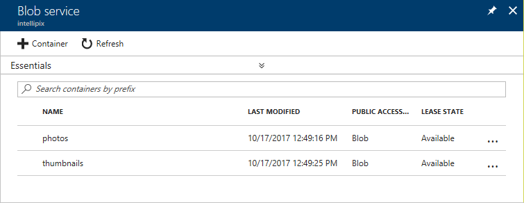
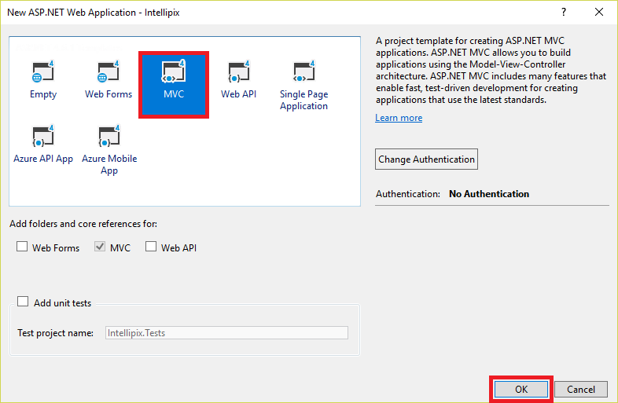
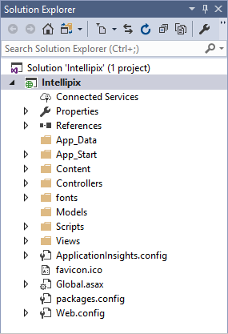
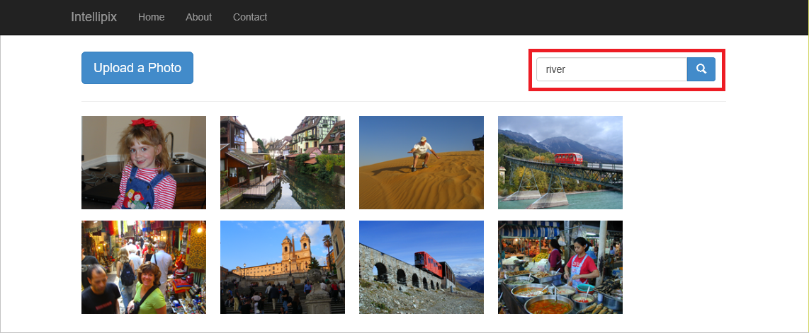

# <a name="tutorial-use-computer-vision-to-generate-image-metadata-in-azure-storage"></a>チュートリアル:Computer Vision を使用して Azure Storage に画像メタデータを生成する

このチュートリアルでは、Azure Computer Vision サービスを Web アプリに統合して、アップロードされた画像のメタデータを生成する方法について学習します。 これは[デジタル資産管理 (DAM)](../overview.md#computer-vision-for-digital-asset-management) のシナリオに役立ちます。たとえば、企業がすべての画像についてわかりやすいキャプションや検索可能なキーワードをすばやく生成する場合などです。

ユーザーによってアップロードされた画像を受け入れ、Azure Blob Storage に画像を格納する MVC Web アプリを作成するには、Visual Studio を使用します。 C# で BLOB の読み取りと書き込みを行い、BLOB メタデータを使用して、作成した BLOB に追加情報をアタッチする方法について説明します。 その後、ユーザーによってアップロードされた各画像を Computer Vision API に送信し、画像のキャプションと検索メタデータを生成します。 最後に、Visual Studio を使用してアプリをクラウドにデプロイできます。

このチュートリアルでは、次の操作方法について説明します。

> [!div class="checklist"]
> * Azure portal を使用してストレージ アカウントとストレージ コンテナーを作成する
> * Visual Studio で Web アプリを作成して Azure にデプロイする
> * Computer Vision API を使用して画像から情報を抽出する
> * Azure Storage の画像にメタデータをアタッチする
> * [Azure Storage Explorer](http://storageexplorer.com/) を使用して画像のメタデータを確認する

> [!TIP]
> 「[Computer Vision を使用してメタデータを生成する](#Exercise5)」セクションは、画像分析に最も関連しています。 画像分析が確立されたアプリケーションにどのように統合されるかを確認するだけの場合は、そこにスキップしてください。

Azure サブスクリプションをお持ちでない場合は、開始する前に [無料アカウント](https://azure.microsoft.com/free/cognitive-services) を作成してください。 

## <a name="prerequisites"></a>前提条件

- "ASP.NET と Web 開発" および "Azure の開発" ワークロードがインストールされている [Visual Studio 2017 Community エディション](https://www.visualstudio.com/products/visual-studio-community-vs.aspx)以上。
- [Azure Storage Explorer](http://storageexplorer.com/) ツールがインストールされている。

<a name="Exercise1"></a>
## <a name="create-a-storage-account"></a>ストレージ アカウントの作成

このセクションでは、[Azure portal](https://portal.azure.com?WT.mc_id=academiccontent-github-cxa) を使用してストレージ アカウントを作成します。 その後、コンテナーのペアを作成します。1 つはユーザーによってアップロードされた画像を格納するためのもので、もう 1 つはアップロードされた画像から生成された画像サムネイルを格納するためのものです。

1. ブラウザーで [Azure portal](https://portal.azure.com?WT.mc_id=academiccontent-github-cxa) を開きます。 サインインを求められたら、Microsoft アカウントを使用してサインインします。
1. ストレージ アカウントを作成するには、左側のリボンで **[+ リソースの作成]** をクリックします。 その後、 **[ストレージ]** 、 **[ストレージ アカウント]** の順にクリックします。

    
1. **[名前]** フィールドにストレージ アカウントの一意の名前を入力し、その横に緑色のチェック マークが表示されることを確認します。 この名前は重要です。これにより、このアカウントで作成された BLOB にアクセスするための URL の一部が形成されるためです。 ストレージ アカウントを "IntellipixResources" という名前の新しいリソース グループに配置し、最も近いリージョンを選択します。 画面の下部にある **[確認と作成]** ボタンをクリックして、新しいストレージ アカウントを作成して終了します。
    > [!NOTE]
    > ストレージ アカウント名の長さは 3 から 24 文字にすることができ、数字と小文字のみを含めることができます。 さらに、入力する名前は Azure 内で一意である必要があります。 他のユーザーが同じ名前を選択した場合、 **[名前]** フィールドに赤い感嘆符が付く名前は使用できないことが通知されます。
   
    
1. 左側のリボンの **[リソース グループ]** をクリックします。 その後、[IntellipixResources] リソース グループをクリックします。

    
1. リソース グループに対して開いたタブで、作成したストレージ アカウントをクリックします。 そこにストレージ アカウントがまだない場合は、表示されるまでタブの上部にある **[最新の情報に更新]** をクリックできます。

    
1. ストレージ アカウントのタブで、 **[BLOB]** をクリックして、このアカウントに関連付けられているコンテナーの一覧を表示します。

    

1. ストレージ アカウントには現在、コンテナーはありません。 BLOB を作成する前に、それを格納するコンテナーを作成する必要があります。 **[+ コンテナー]** をクリックして新しいコンテナーを作成します。 **[名前]** フィールドに「`photos`」と入力し、 **[パブリック アクセス レベル]** として **[BLOB]** を選択します。 その後、 **[OK]** をクリックして、"photos" という名前のコンテナーを作成します。

    > 既定では、コンテナーとその内容は非公開となります。 アクセス レベルとして **[BLOB]** を選択すると、"photos" コンテナー内の BLOB はパブリックにアクセスできるようになりますが、コンテナー自体はパブリックになりません。 "photos" コンテナーに格納されている画像は Web アプリからリンクされるので、このようにする必要があります。 

    

1. 前の手順を繰り返して、"thumbnails" という名前のコンテナーを作成し、もう一度、コンテナーの **[パブリック アクセス レベル]** が **[BLOB]** に設定されていることを確認します。
1. このストレージ アカウントのコンテナーの一覧に両方のコンテナーが表示され、名前のスペルが正しいことを確認します。

    

1. [Blob service] 画面を閉じます。 ストレージ アカウント画面の左側にあるメニューの **[アクセス キー]** をクリックしてから、 **[key1]** の **[キー]** の横にある **[コピー]** ボタンをクリックします。 後で使用するために、このアクセス キーを任意のテキスト エディターに貼り付けます。

    

これで、ビルドするアプリにアップロードされた画像を保持するストレージ アカウントと、画像を格納するコンテナーが作成されました。 

<a name="Exercise2"></a>
## <a name="run-azure-storage-explorer"></a>Azure Storage Explorer を実行する

[Azure Storage Explorer](http://storageexplorer.com/) は、Windows、macOS、Linux を実行している PC で Azure Storage を操作するグラフィカル インターフェイスを提供する無料のツールです。 Azure portal と同じ機能のほとんどが用意されており、BLOB メタデータを表示する機能などのその他の機能が提供されます。 このセクションでは、Microsoft Azure Storage Explorer を使用して、前のセクションで作成したコンテナーを表示します。

1. Storage Explorer をインストールしていない場合や、最新バージョンを実行していることを確認したい場合は、 http://storageexplorer.com/ に移動し、ダウンロードしてインストールしてください。
1. Storage Explorer を開始します。 サインインを求められたら、Microsoft アカウント (Azure portal にサインインするために使用したのと同じもの) を使用してサインインします。 Storage Explorer の左側のペインにストレージ アカウントが表示されていない場合は、以下の強調表示されている **[アカウントの管理]** ボタンをクリックし、ご自分の Microsoft アカウントとサブスクリプション (ストレージ アカウントの作成に使用したもの) の両方が Storage Explorer に追加されていることを確認してください。

    

1. ストレージ アカウントの横にある小さい矢印をクリックしてその内容を表示してから、 **[BLOB コンテナー]** の横にある矢印をクリックします。 作成したコンテナーが一覧に表示されていることを確認します。

    

現在、コンテナーは空ですが、アプリがデプロイされ、写真のアップロードを開始すると変更されます。 Storage Explorer をインストールすると、アプリによって BLOB ストレージに書き込まれる内容を簡単に確認できるようになります。

<a name="Exercise3"></a>
## <a name="create-a-new-web-app-in-visual-studio"></a>Visual Studio で新しい Web アプリを作成する

このセクションでは、Visual Studio で新しい Web アプリを作成し、画像のアップロード、それらの BLOB ストレージへの書き込み、および Web ページでのそれらの表示に必要な基本的な機能を実装するコードを追加します。

1. Visual Studio を起動し、 **[ファイル] -> [新規] -> [プロジェクト]** コマンドを使用して、"Intellipix" ("Intelligent Pictures" の略) という名前の新しい Visual C# の **ASP.NET Web アプリケーション** プロジェクトを作成します。

    

1. [新しい ASP.NET Web アプリケーション] ダイアログで、 **[MVC]** が選択されていることを確認します。 次に、 **[OK]** をクリックします

    

1. 少し時間を取って、ソリューション エクスプローラーでプロジェクトの構造を確認します。 特に重要なのは、プロジェクトの MVC コントローラーを保持する **Controllers** という名前のフォルダーと、プロジェクトのビューを保持する **Views** という名前のフォルダーがあることです。 アプリケーションを実装するので、これらとその他のフォルダー内の資産を操作することになります。

    

1. Visual Studio の **[デバッグ] -> [デバッグなしで開始]** コマンドを使用して (または **Ctrl+F5** キーを押して)、ブラウザでアプリケーションを起動します。 アプリケーションの現在の状態を以下に示します。

    

1. ブラウザーを閉じ、Visual Studio に戻ります。 ソリューション エクスプローラーで **Intellipix** プロジェクトを右クリックし、 **[NuGet パッケージの管理]** を選択します。 **[参照]** をクリックします。 その後、検索ボックスに「`imageresizer`」と入力し、**ImageResizer** という名前の NuGet パッケージを選択します。 最後に、 **[インストール]** をクリックして最新の安定したバージョンのパッケージをインストールします。 ImageResizer には、アプリにアップロードされた画像から画像サムネイルを作成するために使用する API が含まれています。 変更内容に問題がなければ、提示されたライセンスを受け入れます。

    

1. このプロセスを繰り返し、**WindowsAzure.Storage** という名前の NuGet パッケージをプロジェクトに追加します。 このパッケージには、.NET アプリケーションから Azure Storage にアクセスするための API が含まれています。 変更内容に問題がなければ、提示されたライセンスを受け入れます。

    

1. _Web.config_ を開き、```<appSettings>``` セクションに次のステートメントを追加します。ACCOUNT_NAME は、最初のセクションで作成したストレージ アカウントの名前に置き換え、ACCOUNT_KEY は、保存したアクセス キーに置き換えます。

    ```xml
    <add key="StorageConnectionString" value="DefaultEndpointsProtocol=https;AccountName=ACCOUNT_NAME;AccountKey=ACCOUNT_KEY" />
    ```

1. プロジェクトの **Views\Shared** フォルダーにある *_Layout.cshtml* という名前のファイルを開きます。 19 行目の "Application name" を "Intellipix" に変更します。 その行はこのようになるはずです。

    ```C#
    @Html.ActionLink("Intellipix", "Index", "Home", new { area = "" }, new { @class = "navbar-brand" })
    ```

    > [!NOTE]
    > ASP.NET MVC プロジェクトでは、 *_Layout.cshtml* は、他のビューのテンプレートとして機能する特別なビューです。 通常は、このファイルのすべてのビューに共通するヘッダーとフッターの内容を定義します。

1. プロジェクトの **Models** フォルダーを右クリックし、 **[追加] -> [クラス]** コマンドを使用して、*BlobInfo.cs* という名前のクラス ファイルをそのフォルダーに追加します。 その後、空の **BlobInfo** クラスを以下のクラス定義に置き換えます。

    ```C#
    public class BlobInfo
    {
        public string ImageUri { get; set; }
        public string ThumbnailUri { get; set; }
        public string Caption { get; set; }
    }
    ```

1. プロジェクトの **Controllers** フォルダーから *HomeController.cs* を開き、そのファイルの先頭に次の `using` ステートメントを追加します。

    ```C#
    using ImageResizer;
    using Intellipix.Models;
    using Microsoft.WindowsAzure.Storage;
    using Microsoft.WindowsAzure.Storage.Blob;
    using System.Configuration;
    using System.Threading.Tasks;
    using System.IO;
    ```

1. *HomeController.cs* の **Index** メソッドを、次の実装に置き換えます。

    ```C#
    public ActionResult Index()
    {
        // Pass a list of blob URIs in ViewBag
        CloudStorageAccount account = CloudStorageAccount.Parse(ConfigurationManager.AppSettings["StorageConnectionString"]);
        CloudBlobClient client = account.CreateCloudBlobClient();
        CloudBlobContainer container = client.GetContainerReference("photos");
        List<BlobInfo> blobs = new List<BlobInfo>();
    
        foreach (IListBlobItem item in container.ListBlobs())
        {
            var blob = item as CloudBlockBlob;
    
            if (blob != null)
            {
                blobs.Add(new BlobInfo()
                {
                    ImageUri = blob.Uri.ToString(),
                    ThumbnailUri = blob.Uri.ToString().Replace("/photos/", "/thumbnails/")
                });
            }
        }
    
        ViewBag.Blobs = blobs.ToArray();
        return View();
    }
    ```

    新しい **Index** メソッドでは、`"photos"` コンテナー内の BLOB を列挙し、ASP.NET MVC の **ViewBag** プロパティを使用して、これらの BLOB を表す **BlobInfo** オブジェクトの配列をビューに渡します。 後で、ビューを変更してこれらのオブジェクトを列挙し、写真のサムネイルのコレクションを表示します。 ストレージ アカウントにアクセスし、BLOB を列挙するために使用するクラス &mdash; **[CloudStorageAccount](/dotnet/api/microsoft.azure.storage.cloudstorageaccount?view=azure-dotnet)** 、 **[CloudBlobClient](/dotnet/api/microsoft.azure.storage.blob.cloudblobclient?view=azure-dotnet-legacy)** 、および **[CloudBlobContainer](/dotnet/api/microsoft.azure.storage.blob.cloudblobcontainer?view=azure-dotnet-legacy)** &mdash; は、NuGet を通じてインストールした **WindowsAzure.Storage** パッケージから取得されます。

1. *HomeController.cs* の **HomeController** クラスに次のメソッドを追加します。

    ```C#
    [HttpPost]
    public async Task<ActionResult> Upload(HttpPostedFileBase file)
    {
        if (file != null && file.ContentLength > 0)
        {
            // Make sure the user selected an image file
            if (!file.ContentType.StartsWith("image"))
            {
                TempData["Message"] = "Only image files may be uploaded";
            }
            else
            {
                try
                {
                    // Save the original image in the "photos" container
                    CloudStorageAccount account = CloudStorageAccount.Parse(ConfigurationManager.AppSettings["StorageConnectionString"]);
                    CloudBlobClient client = account.CreateCloudBlobClient();
                    CloudBlobContainer container = client.GetContainerReference("photos");
                    CloudBlockBlob photo = container.GetBlockBlobReference(Path.GetFileName(file.FileName));
                    await photo.UploadFromStreamAsync(file.InputStream);
    
                    // Generate a thumbnail and save it in the "thumbnails" container
                    using (var outputStream = new MemoryStream())
                    {
                        file.InputStream.Seek(0L, SeekOrigin.Begin);
                        var settings = new ResizeSettings { MaxWidth = 192 };
                        ImageBuilder.Current.Build(file.InputStream, outputStream, settings);
                        outputStream.Seek(0L, SeekOrigin.Begin);
                        container = client.GetContainerReference("thumbnails");
                        CloudBlockBlob thumbnail = container.GetBlockBlobReference(Path.GetFileName(file.FileName));
                        await thumbnail.UploadFromStreamAsync(outputStream);
                    }
                }
                catch (Exception ex)
                {
                    // In case something goes wrong
                    TempData["Message"] = ex.Message;
                }
            }
        }
    
        return RedirectToAction("Index");
    }
    ```

    これは、写真をアップロードするときに呼び出されるメソッドです。 アップロードされた各画像は BLOB として `"photos"` コンテナーに格納され、`ImageResizer` パッケージを使用して元のイメージからサムネイル画像が作成され、そのサムネイル画像は BLOB として `"thumbnails"` コンテナーに格納されます。

1. プロジェクトの **Views/Home** フォルダーにある *Index.cshmtl* を開き、その内容を以下のコードとマークアップに置き換えます。

    ```HTML
    @{
        ViewBag.Title = "Intellipix Home Page";
    }
    
    @using Intellipix.Models
    
    <div class="container" style="padding-top: 24px">
        <div class="row">
            <div class="col-sm-8">
                @using (Html.BeginForm("Upload", "Home", FormMethod.Post, new { enctype = "multipart/form-data" }))
                {
                    <input type="file" name="file" id="upload" style="display: none" onchange="$('#submit').click();" />
                    <input type="button" value="Upload a Photo" class="btn btn-primary btn-lg" onclick="$('#upload').click();" />
                    <input type="submit" id="submit" style="display: none" />
                }
            </div>
            <div class="col-sm-4 pull-right">
            </div>
        </div>
    
        <hr />
    
        <div class="row">
            <div class="col-sm-12">
                @foreach (BlobInfo blob in ViewBag.Blobs)
                {
                    
                }
            </div>
        </div>
    </div>
    
    @section scripts
    {
        <script type="text/javascript" language="javascript">
            if ("@TempData["Message"]" !== "") {
                alert("@TempData["Message"]");
            }
        </script>
    }
    ```

    ここで使用される言語は [Razor](http://www.asp.net/web-pages/overview/getting-started/introducing-razor-syntax-c) です。これにより、実行可能コードを HTML マークアップに埋め込むことができます。 ファイルの途中にある ```@foreach``` ステートメントでは、**ViewBag** のコントローラーから渡された **BlobInfo** オブジェクトを列挙し、それらから HTML `````` 要素を作成します。 各要素の ```src``` プロパティは、画像サムネイルを含む BLOB の URI で初期化されます。

1. [GitHub サンプル データ リポジトリ](https://github.com/Azure-Samples/cognitive-services-sample-data-files/tree/master/ComputerVision/storage-lab-tutorial)から _photos.zip_ ファイルをダウンロードして解凍します。 これには、アプリのテストに使用できる異なるさまざまな写真が含まれています。

1. 変更内容を保存し、**Ctrl + F5** キーを押してブラウザーでアプリケーションを起動します。 その後、 **[写真のアップロード]** をクリックし、ダウンロードした画像のいずれかをアップロードします。 ページにサムネイル バージョンの写真が表示されていることを確認します。

    

1. **photos** フォルダーからさらにいくつかの画像をアップロードします。 ページにそれらも表示されていることを確認します。

    

1. ブラウザーで右クリックし、 **[ページ ソースの表示]** を選択してページのソース コードを表示します。 画像のサムネイルを表す `````` 要素を見つけます。 画像に割り当てられている URL で、Blob Storage 内の BLOB が直接参照されていることを確認します。 これは、コンテナーの **[パブリック アクセス レベル]** を **[BLOB]** に設定することにより、中にある BLOB をパブリックにアクセスできるようにするためです。

1. Azure Storage Explorer に戻り (または実行していない場合は再起動し)、ご利用のストレージ アカウントで `"photos"` コンテナーを選択します。 コンテナー内の BLOB の数は、アップロードした写真の数と同じである必要があります。 BLOB のいずれかをダブルクリックしてダウンロードし、その BLOB に格納されている画像を確認します。

    

1. Storage Explorer で `"thumbnails"` コンテナーを開きます。 BLOB のいずれかを開き、アップロードした画像から生成されたサムネイル画像を表示します。

アプリでは、アップロードした元の画像を表示する方法はまだ提供されていません。 画像のサムネイルをクリックすると、元の画像が表示されるのが理想的です。 次はその機能を追加します。

<a name="Exercise4"></a>
## <a name="add-a-lightbox-for-viewing-photos"></a>写真を表示するためのライトボックスを追加する

このセクションでは、無料のオープンソース JavaScript ライブラリを使用して、ユーザーが (画像のサムネイルだけでなく) アップロードした元の画像を表示できるようにするライトボックス ビューアーを追加します。 ファイルは自動的に提供されます。 必要なのは、それらをプロジェクトに統合して、*Index.cshtml* に少し変更を加えるだけです。

1. [GitHub コード リポジトリ](https://github.com/Azure-Samples/cognitive-services-quickstart-code/tree/master/dotnet/ComputerVision/storage-lab-tutorial)から _lightbox.css_ および _lightbox.js_ ファイルをダウンロードします。
1. ソリューション エクスプローラーで、プロジェクトの **Scripts** フォルダーを右クリックし、 **[追加] -> [新しい項目]** コマンドを使用して *lightbox.js* ファイルを作成します。 [GitHub コード リポジトリ](https://github.com/Azure-Samples/cognitive-services-quickstart-code/blob/master/dotnet/ComputerVision/storage-lab-tutorial/scripts/lightbox.js)のサンプル ファイルの内容を貼り付けます。

1. プロジェクトの "Content" フォルダーを右クリックし、 **[追加] -> [新しい項目]** コマンドを使用して *lightbox.css* ファイルを作成します。 [GitHub コード リポジトリ](https://github.com/Azure-Samples/cognitive-services-quickstart-code/blob/master/dotnet/ComputerVision/storage-lab-tutorial/css/lightbox.css)のサンプル ファイルの内容を貼り付けます。
1. GitHub データ ファイル リポジトリ (https://github.com/Azure-Samples/cognitive-services-sample-data-files/tree/master/ComputerVision/storage-lab-tutorial ) から _buttons.zip_ ファイルをダウンロードして解凍します。 ボタンの画像が 4 つあるはずです。

1. ソリューション エクスプローラーで Intellipix プロジェクトを右クリックし、 **[追加] -> [新しいフォルダー]** コマンドを使用して、"Images" という名前のフォルダーをそのプロジェクトに追加します。

1. **Images** フォルダーを右クリックし、 **[追加] -> [既存の項目]** コマンドを使用して、ダウンロードした 4 つの画像をインポートします。

1. プロジェクトの "App_Start" フォルダーにある *BundleConfig.cs* を開きます。 **BundleConfig.cs** で ```RegisterBundles``` メソッドに次のステートメントを追加します。

    ```C#
    bundles.Add(new ScriptBundle("~/bundles/lightbox").Include(
              "~/Scripts/lightbox.js"));
    ```

1. 同じメソッドで、"~/Content/css" から ```StyleBundle``` を作成するステートメントを見つけ、そのバンドル内のスタイル シートの一覧に *lightbox.css* を追加します。 変更されたステートメントを以下に示します。

    ```C#
    bundles.Add(new StyleBundle("~/Content/css").Include(
              "~/Content/bootstrap.css",
              "~/Content/site.css",
              "~/Content/lightbox.css"));
    ```

1. プロジェクトの **Views/Shared** フォルダーにある *_Layout.cshtml* を開き、下部付近の ```@RenderSection``` ステートメントの直前に次のステートメントを追加します。

    ```C#
    @Scripts.Render("~/bundles/lightbox")
    ```

1. 最後のタスクは、ライトボックス ビューアーをホーム ページに組み込むことです。 これを行うには、(プロジェクトの **Views/Home** フォルダーにある) *Index.cshtml* を開き、```@foreach``` ループをこのように置き換えます。

    ```HTML
    @foreach (BlobInfo blob in ViewBag.Blobs)
    {
        <a href="@blob.ImageUri" rel="lightbox" title="@blob.Caption">
            
        </a>
    }
    ```

1. 変更内容を保存し、**Ctrl + F5** キーを押してブラウザーでアプリケーションを起動します。 その後、先ほどアップロードした画像のいずれかをクリックします。 ライトボックスが表示され、画像の拡大ビューが示されていることを確認します。

    

1. ライトボックスの右下隅にある **[X]** をクリックして閉じます。

これで、アップロードした画像を表示できるようになりました。 次の手順では、これらの画像でさらに多くのことを行います。

<a name="Exercise5"></a>
## <a name="use-computer-vision-to-generate-metadata"></a>Computer Vision を使用してメタデータを生成する

### <a name="create-a-computer-vision-resource"></a>Computer Vision リソースを作成する

お客様の Azure アカウント用に Computer Vision リソースを作成する必要があります。このリソースによって、Azure の Computer Vision サービスへのアクセスが管理されます。 

1. [Azure Cognitive Services リソースを作成する](../../cognitive-services-apis-create-account.md)の指示に従って、Computer Vision リソースを作成します。

1. その後、ご利用のリソース グループのメニューに移動し、作成した Computer Vision API サブスクリプションをクリックします。 **[エンドポイント]** の下の URL を、一瞬で簡単に取得できる場所にコピーします。 次に、 **[アクセス キーを表示]** をクリックします。

    
    
    [!INCLUDE [Custom subdomains notice](../../../../includes/cognitive-services-custom-subdomains-note.md)]


1. 次のウィンドウで、 **[キー 1]** の値をクリップボードにコピーします。

    ![コピー ボタンが強調表示された [キーの管理] ダイアログ](Images/copy-vision-key.png)

### <a name="add-computer-vision-credentials"></a>Computer Vision の資格情報を追加する

次に、お客様のアプリが Computer Vision リソースにアクセスできるように、必要な資格情報を追加します。

プロジェクトのルートにある *Web.config* ファイルに移動します。 次のステートメントをファイルの `<appSettings>` セクションに追加します。このとき、`VISION_KEY` を前の手順でコピーしたキーに置き換え、`VISION_ENDPOINT` をその前の手順で保存した URL に置き換えます。

```xml
<add key="SubscriptionKey" value="VISION_KEY" />
<add key="VisionEndpoint" value="VISION_ENDPOINT" />
```

次に、ソリューション エクスプローラーで、プロジェクトを右クリックし、 **[NuGet パッケージの管理]** コマンドを使用してパッケージ **Microsoft.Azure.CognitiveServices.Vision.ComputerVision** をインストールします。 このパッケージには、Computer Vision API を呼び出すために必要な型が含まれています。

### <a name="add-metadata-generation-code"></a>メタデータ生成コードを追加する

次に、Computer Vision サービスを実際に使用して画像のメタデータを作成するコードを追加します。

1. プロジェクトの **Controllers** フォルダーにある *HomeController.cs* ファイルを開き、ファイルの先頭に次の `using` ステートメントを追加します。

    ```csharp
    using Microsoft.Azure.CognitiveServices.Vision.ComputerVision;
    using Microsoft.Azure.CognitiveServices.Vision.ComputerVision.Models;
    ```

1. 次に、**Upload** メソッドに進みます。このメソッドでは、画像を BLOB ストレージに変換してアップロードします。 次のコードを、`// Generate a thumbnail` で始まるブロックの直後 (または image-blob-creation プロセスの最後) に追加します。 このコードでは、画像 (`photo`) を含む BLOB を受け取り、Computer Vision を使用してその画像の説明を生成します。 Computer Vision API によって、画像に適用されるキーワードの一覧も生成されます。 生成された説明とキーワードは、後で取得できるように BLOB のメタデータに格納されます。

    ```csharp
    // Submit the image to Azure's Computer Vision API
    ComputerVisionClient vision = new ComputerVisionClient(
        new ApiKeyServiceClientCredentials(ConfigurationManager.AppSettings["SubscriptionKey"]),
        new System.Net.Http.DelegatingHandler[] { });
    vision.Endpoint = ConfigurationManager.AppSettings["VisionEndpoint"];

    List<VisualFeatureTypes?> features = new List<VisualFeatureTypes?>() { VisualFeatureTypes.Description };
    var result = await vision.AnalyzeImageAsync(photo.Uri.ToString(), features);

    // Record the image description and tags in blob metadata
    photo.Metadata.Add("Caption", result.Description.Captions[0].Text);

    for (int i = 0; i < result.Description.Tags.Count; i++)
    {
        string key = String.Format("Tag{0}", i);
        photo.Metadata.Add(key, result.Description.Tags[i]);
    }

    await photo.SetMetadataAsync();
    ```

1. 次に、同じファイルの **Index** メソッドに進みます。 このメソッドでは、対象となる BLOB コンテナーに格納されている画像 BLOB を (**IListBlobItem** インスタンスとして) 列挙し、それらをアプリケーション ビューに渡します。 このメソッドの `foreach` ブロックを次のコードに置き換えます。 このコードでは、**CloudBlockBlob.FetchAttributes** を呼び出して、各 BLOB のアタッチされたメタデータを取得します。 コンピューターによって生成された説明 (`caption`) がメタデータから抽出され、それが **BlobInfo** オブジェクトに追加されます。これがビューに渡されます。
    
    ```csharp
    foreach (IListBlobItem item in container.ListBlobs())
    {
        var blob = item as CloudBlockBlob;
    
        if (blob != null)
        {
            blob.FetchAttributes(); // Get blob metadata
            var caption = blob.Metadata.ContainsKey("Caption") ? blob.Metadata["Caption"] : blob.Name;
    
            blobs.Add(new BlobInfo()
            {
                ImageUri = blob.Uri.ToString(),
                ThumbnailUri = blob.Uri.ToString().Replace("/photos/", "/thumbnails/"),
                Caption = caption
            });
        }
    }
    ```

### <a name="test-the-app"></a>アプリケーションをテストする

変更内容を Visual Studio に保存し、**Ctrl + F5** キーを押してブラウザーでアプリケーションを起動します。 アプリを使用して、ダウンロードした写真セットから、または独自のフォルダーから、さらにいくつかの画像をアップロードします。 ビュー内の新しい画像のいずれかの上にカーソルを置くと、ツールヒント ウィンドウが表示され、その画像に対してコンピューターによって生成されたキャプションが示されるはずです。


アタッチされているメタデータをすべて表示するには、Azure Storage Explorer を使って、画像に使用しているストレージ コンテナーを表示します。 コンテナー内の任意の BLOB を右クリックして、 **[プロパティ]** を選択します。 ダイアログに、キーと値のペアの一覧が表示されます。 コンピューターによって生成された画像の説明は `Caption` という項目に格納され、検索キーワードは `Tag0`、`Tag1` などに格納されます。 完了したら、 **[キャンセル]** をクリックしてダイアログを閉じます。


<a name="Exercise6"></a>
## <a name="add-search-to-the-app"></a>アプリに検索を追加する

このセクションでは、ホーム ページに検索ボックスを追加して、ユーザーがアップロードした画像に対してキーワード検索を実行できるようにします。 このキーワードは、Computer Vision API によって生成され、BLOB メタデータに格納されるものです。

1. プロジェクトの **Views/Home** フォルダーにある *Index.cshtml* を開き、```class="col-sm-4 pull-right"``` 属性を持つ空の ```<div>``` 要素に次のステートメントを追加します。

    ```HTML
    @using (Html.BeginForm("Search", "Home", FormMethod.Post, new { enctype = "multipart/form-data", @class = "navbar-form" }))
    {
        <div class="input-group">
            <input type="text" class="form-control" placeholder="Search photos" name="term" value="@ViewBag.Search" style="max-width: 800px">
            <span class="input-group-btn">
                <button class="btn btn-primary" type="submit">
                    <i class="glyphicon glyphicon-search"></i>
                </button>
            </span>
        </div>
    }
    ```

    このコードとマークアップでは、ホーム ページに検索ボックスと **[検索]** ボタンを追加します。

1. プロジェクトの **Controllers** フォルダーにある *HomeController.cs* を開き、**HomeController** クラスに次のメソッドを追加します。

    ```C#
    [HttpPost]
    public ActionResult Search(string term)
    {
        return RedirectToAction("Index", new { id = term });
    }
    ```

    これは、前の手順で追加した **[検索]** ボタンをユーザーがクリックすると呼び出されるメソッドです。 ページが更新され、URL に検索パラメーターが含まれます。

1. **Index** メソッドを次の実装に置き換えます。

    ```C#
    public ActionResult Index(string id)
    {
        // Pass a list of blob URIs and captions in ViewBag
        CloudStorageAccount account = CloudStorageAccount.Parse(ConfigurationManager.AppSettings["StorageConnectionString"]);
        CloudBlobClient client = account.CreateCloudBlobClient();
        CloudBlobContainer container = client.GetContainerReference("photos");
        List<BlobInfo> blobs = new List<BlobInfo>();

        foreach (IListBlobItem item in container.ListBlobs())
        {
            var blob = item as CloudBlockBlob;

            if (blob != null)
            {
                blob.FetchAttributes(); // Get blob metadata

                if (String.IsNullOrEmpty(id) || HasMatchingMetadata(blob, id))
                {
                    var caption = blob.Metadata.ContainsKey("Caption") ? blob.Metadata["Caption"] : blob.Name;

                    blobs.Add(new BlobInfo()
                    {
                        ImageUri = blob.Uri.ToString(),
                        ThumbnailUri = blob.Uri.ToString().Replace("/photos/", "/thumbnails/"),
                        Caption = caption
                    });
                }
            }
        }

        ViewBag.Blobs = blobs.ToArray();
        ViewBag.Search = id; // Prevent search box from losing its content
        return View();
    }
    ```

    **Index** メソッドで、ユーザーが検索ボックスに入力した値を含むパラメーター _id_ が受け入れられるようになったことを確認します。 空または欠落している _id_ パラメーターは、すべての写真が表示される必要があることを示します。

1. **HomeController** クラスに次のヘルパー メソッドを追加します。

    ```C#
    private bool HasMatchingMetadata(CloudBlockBlob blob, string term)
    {
        foreach (var item in blob.Metadata)
        {
            if (item.Key.StartsWith("Tag") && item.Value.Equals(term, StringComparison.InvariantCultureIgnoreCase))
                return true;
        }

        return false;
    }
    ```

    このメソッドは、特定の画像 BLOB にアタッチされているメタデータ キーワードに、ユーザーが入力した検索用語が含まれているかどうかを判断するために **Index** メソッドによって呼び出されます。

1. もう一度アプリケーションを起動し、いくつかの写真をアップロードします。 チュートリアルで提供されている写真だけでなく、独自の写真を自由に使用できます。

1. 検索ボックスに "river" などのキーワードを入力します。 その後、 **[検索]** ボタンをクリックします。

    

1. 検索結果は、入力した内容とアップロードした画像によって異なります。 しかし、結果は、入力したキーワードのすべてまたは一部がメタデータ キーワードに含まれる画像のフィルター処理された一覧になるはずです。

    

1. ブラウザーの [戻る] ボタンをクリックして、もう一度すべての画像を表示します。

完了までもう少しです。 次はアプリをクラウドにデプロイします。

<a name="Exercise7"></a>
## <a name="deploy-the-app-to-azure"></a>Azure にアプリケーションをデプロイする

このセクションでは、アプリを Visual Studio から Azure にデプロイします。 Visual Studio で自動的に Azure Web アプリを作成できるようにします。これにより、Azure portal にアクセスして個別に作成する必要がなくなります。

1. ソリューション エクスプローラーでプロジェクトを右クリックし、コンテキスト メニューから **[発行]** を選択します。 **[Microsoft Azure App Service]** と **[新規作成]** が選択されていることを確認してから、 **[発行]** ボタンをクリックします。

    

1. 次のダイアログで、 **[リソース グループ]** の下にある [IntellipixResources] リソース グループを選択します。 [App Service プラン] の横にある **[新規]** ボタンをクリックし、「[ストレージ アカウントを作成する](#Exercise1)」でストレージ アカウント用に選択したのと同じ場所に新しい App Service プランを作成します。それ以外はすべて既定値を受け入れます。 **[作成]** ボタンをクリックして終了します。

    

1. しばらくすると、アプリがブラウザー ウィンドウに表示されます。 アドレス バーの URL をメモしておきます。 アプリはローカルで実行されなくなりました。つまり、Web 上に存在し、パブリックに到達できるようになりました。

    

アプリに変更を加え、その変更内容を Web にプッシュする場合は、もう一度発行プロセスを実行します。 Web に発行する前にローカルで引き続き変更内容をテストできます。

## <a name="clean-up-resources"></a>リソースをクリーンアップする

お客様の Web アプリの作業を続行する場合は、「[次のステップ](#next-steps)」セクションを参照してください。 このアプリケーションを使い続ける予定がない場合は、アプリに固有のリソースをすべて削除する必要があります。 リソースの削除は、お客様の Azure Storage サブスクリプションと Computer Vision リソースが含まれているリソース グループを削除することで実行できます。 これにより、ストレージ アカウント、そこにアップロードされた BLOB、および ASP.NET Web アプリに接続するために必要な App Service リソースが削除されます。 

リソース グループを削除するには、ポータルで **[リソース グループ]** タブを開き、お客様がこのプロジェクトに使用したリソース グループに移動して、ビューの上部にある **[リソース グループの削除]** をクリックします。 リソース グループの名前を入力して削除の意思を確認するように求められます。 リソース グループはいったん削除すると復旧できません。

## <a name="next-steps"></a>次のステップ

Azure を使用して、Intellipix アプリをさらに開発するために行えることはまだたくさんあります。 たとえば、ユーザーの認証と写真の削除のサポートを追加し、アップロード後に Cognitive Services で写真が処理されるまで待つようにユーザーに強制するのではなく、[Azure Functions](https://azure.microsoft.com/services/functions/?WT.mc_id=academiccontent-github-cxa) を使用して、画像が BLOB ストレージに追加されるたびに Computer Vision API を非同期的に呼び出すことができます。 また、概要で説明されているように、画像に対して任意の数の他の画像分析操作を実行できます。

> [!div class="nextstepaction"]
> [画像分析の概要](../overview-image-analysis.md)
