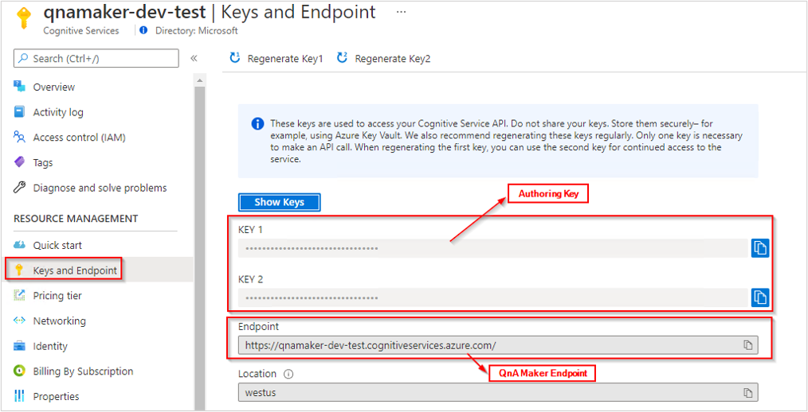
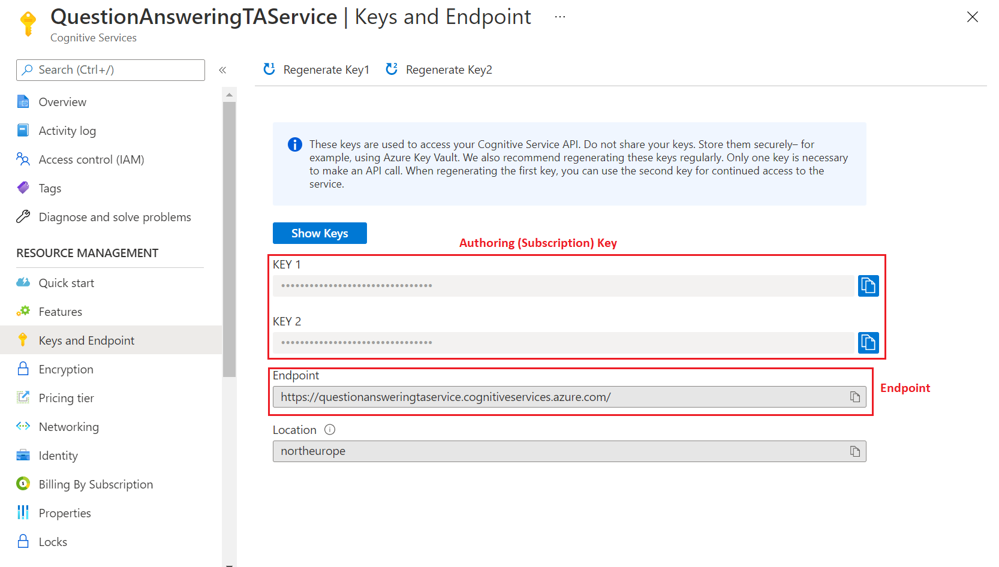

# <a name="qna-maker-ga-stable-release"></a>[QnA Maker GA (安定版リリース)](#tab/version-1)

Python 用 QnA Maker クライアント ライブラリは、次の目的で使用することができます。

* ナレッジ ベースの作成
* ナレッジ ベースの更新
* ナレッジ ベースの公開
* 予測ランタイム エンドポイント キーの取得
* 実行時間の長いタスクの待機
* ナレッジ ベースのダウンロード
* ナレッジ ベースから回答を取得する
* ナレッジ ベースの削除

[リファレンス ドキュメント](/python/api/azure-cognitiveservices-knowledge-qnamaker/azure.cognitiveservices.knowledge.qnamaker) | [ライブラリのソース コード](https://github.com/Azure/azure-sdk-for-python/tree/master/sdk/cognitiveservices/azure-cognitiveservices-knowledge-qnamaker) | [パッケージ (PyPi)](https://pypi.org/project/azure-cognitiveservices-knowledge-qnamaker/0.2.0/) | [Python サンプル](https://github.com/Azure-Samples/cognitive-services-quickstart-code/blob/master/python/QnAMaker/sdk/quickstart.py)

# <a name="custom-question-answering-preview-release"></a>[カスタム質問と回答 (プレビュー リリース)](#tab/version-2)

Python 用 QnA Maker クライアント ライブラリは、次の目的で使用することができます。

* ナレッジ ベースの作成
* ナレッジ ベースの更新
* ナレッジ ベースの公開
* 実行時間の長いタスクの待機
* ナレッジ ベースのダウンロード
* ナレッジ ベースから回答を取得する
* ナレッジ ベースの削除

[リファレンス ドキュメント](/python/api/azure-cognitiveservices-knowledge-qnamaker/azure.cognitiveservices.knowledge.qnamaker) | [ライブラリのソース コード](https://github.com/Azure/azure-sdk-for-python/tree/master/sdk/cognitiveservices/azure-cognitiveservices-knowledge-qnamaker) | [パッケージ (PyPi)](https://pypi.org/project/azure-cognitiveservices-knowledge-qnamaker/) | [Python サンプル](https://github.com/Azure-Samples/cognitive-services-quickstart-code/blob/master/python/QnAMaker/sdk/preview-sdk/quickstart.py)

---

[!INCLUDE [Custom subdomains notice](../../../../includes/cognitive-services-custom-subdomains-note.md)]

## <a name="prerequisites"></a>前提条件

# <a name="qna-maker-ga-stable-release"></a>[QnA Maker GA (安定版リリース)](#tab/version-1)

* Azure サブスクリプション - [無料アカウントを作成します](https://azure.microsoft.com/free/cognitive-services)
* [Python 3.x](https://www.python.org/)
* Azure サブスクリプションを入手したら、Azure portal で [QnA Maker リソース](https://ms.portal.azure.com/#create/Microsoft.CognitiveServicesQnAMaker)を作成し、オーサリング キーとエンドポイントを取得します。 デプロイされたら、 **[リソースに移動]** を選択します。
    * アプリケーションを QnA Maker API に接続するには、作成したリソースのキーとエンドポイントが必要です。 このクイックスタートで後に示すコードに、自分のキーとエンドポイントを貼り付けます。
    * Free 価格レベル (`F0`) を使用してサービスを試用し、後から運用環境用の有料レベルにアップグレードすることができます。

# <a name="custom-question-answering-preview-release"></a>[カスタム質問と回答 (プレビュー リリース)](#tab/version-2)

* Azure サブスクリプション - [無料アカウントを作成します](https://azure.microsoft.com/free/cognitive-services)
* [Python 3.x](https://www.python.org/)
* * カスタム質問と回答には、API キーとエンドポイントを生成するために、カスタム質問と回答の機能を有効にした [Text Analytics リソース](https://ms.portal.azure.com/?quickstart=true#create/Microsoft.CognitiveServicesTextAnalytics)が必要です。
    * Text Analytics リソースのデプロイの後に、 **[リソースに移動]** を選択します。 アプリケーションを QnA Maker API に接続するには、作成したリソースのキーとエンドポイントが必要です。 このクイックスタートで後に示すコードに、自分のキーとエンドポイントを貼り付けます。

---

## <a name="setting-up"></a>設定

### <a name="install-the-client-library"></a>クライアント ライブラリをインストールする

# <a name="qna-maker-ga-stable-release"></a>[QnA Maker GA (安定版リリース)](#tab/version-1)

Python をインストールしたら、次を使用してクライアント ライブラリをインストールすることができます。

```console
pip install azure-cognitiveservices-knowledge-qnamaker==0.2.0
```

# <a name="custom-question-answering-preview-release"></a>[カスタム質問と回答 (プレビュー リリース)](#tab/version-2)

Python をインストールしたら、次を使用してクライアント ライブラリをインストールすることができます。

```console
pip install azure-cognitiveservices-knowledge-qnamaker
```

---

### <a name="create-a-new-python-application"></a>新しい Python アプリケーションを作成する

`quickstart-file.py` という名前の新しい Python ファイルを作成して次のライブラリをインポートします。

# <a name="qna-maker-ga-stable-release"></a>[QnA Maker GA (安定版リリース)](#tab/version-1)

[!code-python[Dependencies](~/cognitive-services-quickstart-code/python/QnAMaker/sdk/quickstart.py?name=Dependencies)]

# <a name="custom-question-answering-preview-release"></a>[カスタム質問と回答 (プレビュー リリース)](#tab/version-2)

[!code-python[Dependencies](~/cognitive-services-quickstart-code/python/QnAMaker/sdk/preview-sdk/quickstart.py?name=Dependencies)]

---

自分のリソースの Azure エンドポイントおよびキー用の変数を作成します。

# <a name="qna-maker-ga-stable-release"></a>[QnA Maker GA (安定版リリース)](#tab/version-1)

- サブスクリプション キーとオーサリング キーは同じ意味で使用しています。 オーサリング キーの詳細については、「[QnA Maker のキー](../concepts/azure-resources.md?tabs=v1#keys-in-qna-maker)」を参照してください。

- QNA_MAKER_ENDPOINT の値の形式は `https://YOUR-RESOURCE-NAME.cognitiveservices.azure.com` です。 Azure portal に移動し、前提条件で作成した QnA Maker リソースを探します。 **[リソース管理]** の **[Keys and Endpoint]\(キーとエンドポイント\)** ページをクリックし、オーサリング (サブスクリプション) キーと QnA Maker のエンドポイントを見つけます。

 

- QNA_MAKER_RUNTIME_ENDPOINT の値の形式は `https://YOUR-RESOURCE-NAME.azurewebsites.net` です。 Azure portal に移動し、前提条件で作成した QnA Maker リソースを探します。 **[オートメーション]** の **[テンプレートのエクスポート]** ページをクリックして、ランタイム エンドポイントを見つけます。

 
   
- 運用環境では、資格情報を安全に格納して利用するための方法を用いることを検討してください。 たとえば、[Azure Key Vault](../../../key-vault/general/overview.md) で安全なキー記憶域を確保できます。

[!code-python[Resource variables](~/cognitive-services-quickstart-code/python/QnAMaker/sdk/quickstart.py?name=Resourcevariables)]

# <a name="custom-question-answering-preview-release"></a>[カスタム質問と回答 (プレビュー リリース)](#tab/version-2)

- サブスクリプション キーとオーサリング キーは同じ意味で使用しています。 オーサリング キーの詳細については、「[キー](../concepts/azure-resources.md?tabs=v2#keys-in-qna-maker)」を参照してください。

- QNA_MAKER_ENDPOINT の値の形式は `https://YOUR-RESOURCE-NAME.cognitiveservices.azure.com` です。 Azure portal に移動し、前提条件で作成した Text Analytics リソースを探します。 **[リソース管理]** の **[キーとエンドポイント]** ページをクリックし、オーサリング (サブスクリプション) キーとエンドポイントを見つけます。

> [!div class="mx-imgBorder"]
> 
 
- 運用環境では、資格情報を安全に格納して利用するための方法を用いることを検討してください。 たとえば、[Azure Key Vault](../../../key-vault/general/overview.md) で安全なキー記憶域を確保できます。

[!code-python[Resource variables](~/cognitive-services-quickstart-code/python/QnAMaker/sdk/preview-sdk/quickstart.py?name=Resourcevariables)]

---

## <a name="object-models"></a>オブジェクト モデル

# <a name="qna-maker-ga-stable-release"></a>[QnA Maker GA (安定版リリース)](#tab/version-1)

[QnA Maker](/python/api/azure-cognitiveservices-knowledge-qnamaker/azure.cognitiveservices.knowledge.qnamaker) では、2 種類のオブジェクト モデルが使用されます。
* **[QnAMakerClient](#qnamakerclient-object-model)** は、ナレッジ ベースを作成、管理、公開、ダウンロードするためのオブジェクトです。
* **[QnAMakerRuntime](#qnamakerruntimeclient-object-model)** は、GenerateAnswer API を使用してナレッジ ベースを照会したり、Train API を使用して ([アクティブ ラーニング](../how-to/use-active-learning.md)の一環として) 提案された新しい質問を送信したりするためのオブジェクトです。

# <a name="custom-question-answering-preview-release"></a>[カスタム質問と回答 (プレビュー リリース)](#tab/version-2)

[QnA Maker](/python/api/azure-cognitiveservices-knowledge-qnamaker/azure.cognitiveservices.knowledge.qnamaker) では、次のオブジェクト モデルが使用されます。
* **[QnAMakerClient](#qnamakerclient-object-model)** は、ナレッジ ベースの作成、管理、公開、ダウンロード、およびクエリを行うためのオブジェクトです。

---

[!INCLUDE [Get KBinformation](./quickstart-sdk-cognitive-model.md)]

### <a name="qnamakerclient-object-model"></a>QnAMakerClient オブジェクト モデル

作成の QnA Maker クライアントは、自分のキーが含まれている Microsoft.Rest.ServiceClientCredentials を使用して Azure に対する認証を行う [QnAMakerClient](/python/api/azure-cognitiveservices-knowledge-qnamaker/azure.cognitiveservices.knowledge.qnamaker.qn_amaker_client.qnamakerclient) オブジェクトです。

クライアントが作成されたら、[ナレッジ ベース](/python/api/azure-cognitiveservices-knowledge-qnamaker/azure.cognitiveservices.knowledge.qnamaker.operations.knowledgebase_operations.knowledgebaseoperations) プロパティを使用して、ナレッジ ベースを作成、管理、および公開します。

JSON オブジェクトを送信して、ナレッジ ベースを管理します。 即時操作の場合は、通常、状態を示す JSON オブジェクトがメソッドから返されます。 実行時間の長い操作の場合、応答は操作 ID になります。 [operations.get_details](/python/api/azure-cognitiveservices-knowledge-qnamaker/azure.cognitiveservices.knowledge.qnamaker.operations.knowledgebase_operations.knowledgebaseoperations#get-details-kb-id--custom-headers-none--raw-false----operation-config-) メソッドを操作 ID と共に呼び出して、[要求の状態](/python/api/azure-cognitiveservices-knowledge-qnamaker/azure.cognitiveservices.knowledge.qnamaker.models.operationstatetype)を確認します。

### <a name="qnamakerruntimeclient-object-model"></a>QnAMakerRuntimeClient オブジェクト モデル

# <a name="qna-maker-ga-stable-release"></a>[QnA Maker GA (安定版リリース)](#tab/version-1)

予測の QnA Maker クライアントは、`QnAMakerRuntimeClient` オブジェクトです。ナレッジ ベースの公開後に作成クライアントの呼び出し ([client.EndpointKeysOperations.get_keys](/python/api/azure-cognitiveservices-knowledge-qnamaker/azure.cognitiveservices.knowledge.qnamaker.operations.endpoint_keys_operations.endpointkeysoperations#get-keys-custom-headers-none--raw-false----operation-config-)) から返される Microsoft.Rest.ServiceClientCredentials (予測ランタイム キーを含む) を使用して Azure に対する認証を行います。

クエリ ランタイムから回答を取得するには、`generate_answer` メソッドを使用します。

# <a name="custom-question-answering-preview-release"></a>[カスタム質問と回答 (プレビュー リリース)](#tab/version-2)

カスタム質問と回答では、QnAMakerRuntimeClient オブジェクトを使用する必要はありません。 代わりに、[QnAMakerClient](/python/api/azure-cognitiveservices-knowledge-qnamaker/azure.cognitiveservices.knowledge.qnamaker.qn_amaker_client.qnamakerclient) オブジェクトで [generate_answer](/python/api/azure-cognitiveservices-knowledge-qnamaker/azure.cognitiveservices.knowledge.qnamaker.operations.knowledgebase_operations.knowledgebaseoperations#generate-answer-kb-id--generate-answer-payload--custom-headers-none--raw-false----operation-config-) を直接呼び出します。

---

## <a name="authenticate-the-client-for-authoring-the-knowledge-base"></a>ナレッジ ベースを作成するためのクライアントを認証する

ご利用のエンドポイントとキーを使用してクライアントをインスタンス化します。 キーを使用して CognitiveServicesCredentials オブジェクトを作成し、それをエンドポイントと共に使用して、[QnAMakerClient](/python/api/azure-cognitiveservices-knowledge-qnamaker/azure.cognitiveservices.knowledge.qnamaker.qn_amaker_client.qnamakerclient) オブジェクトを作成します。

# <a name="qna-maker-ga-stable-release"></a>[QnA Maker GA (安定版リリース)](#tab/version-1)

[!code-python[Authorization to resource key](~/cognitive-services-quickstart-code/python/QnAMaker/sdk/quickstart.py?name=AuthorizationAuthor)]

# <a name="custom-question-answering-preview-release"></a>[カスタム質問と回答 (プレビュー リリース)](#tab/version-2)

[!code-python[Authorization to resource key](~/cognitive-services-quickstart-code/python/QnAMaker/sdk/preview-sdk/quickstart.py?name=AuthorizationAuthor)]

---

## <a name="create-a-knowledge-base"></a>ナレッジ ベースの作成

クライアント オブジェクトを使用して[ナレッジ ベース操作](/python/api/azure-cognitiveservices-knowledge-qnamaker/azure.cognitiveservices.knowledge.qnamaker.operations.knowledgebaseoperations)オブジェクトを取得します。

ナレッジ ベースには、次の 3 つのソースの [CreateKbDTO](/python/api/azure-cognitiveservices-knowledge-qnamaker/azure.cognitiveservices.knowledge.qnamaker.models.createkbdto) オブジェクトに対する質問と回答のペアが格納されます。

* **本文** の場合は、[QnADTO](/python/api/azure-cognitiveservices-knowledge-qnamaker/azure.cognitiveservices.knowledge.qnamaker.models.qnadto) オブジェクトを使用します。
    * メタデータとフォローアップ プロンプトを使用するには、編集コンテキストを使用します (このデータは個々の QnA ペア レベルで追加されるため)。
* **ファイル** の場合は、[FileDTO](/python/api/azure-cognitiveservices-knowledge-qnamaker/azure.cognitiveservices.knowledge.qnamaker.models.filedto) オブジェクトを使用します。 FileDTO には、ファイル名と、ファイルに到達するためのパブリック URL が含まれます。
* **URL** の場合は、公開されている URL を表す文字列のリストを使用します。

[create](/python/api/azure-cognitiveservices-knowledge-qnamaker/azure.cognitiveservices.knowledge.qnamaker.operations.knowledgebaseoperations#create-create-kb-payload--custom-headers-none--raw-false----operation-config-) メソッドを呼び出した後、返された操作 ID を [Operations.getDetails](#get-status-of-an-operation) メソッドに渡して、状態をポーリングします。

次のコードの最後の行では、MonitorOperation の応答からナレッジ ベース ID を返しています。

# <a name="qna-maker-ga-stable-release"></a>[QnA Maker GA (安定版リリース)](#tab/version-1)

[!code-python[Create knowledge base](~/cognitive-services-quickstart-code/python/QnAMaker/sdk/quickstart.py?name=CreateKBMethod)]

# <a name="custom-question-answering-preview-release"></a>[カスタム質問と回答 (プレビュー リリース)](#tab/version-2)

[!code-python[Create knowledge base](~/cognitive-services-quickstart-code/python/QnAMaker/sdk/preview-sdk/quickstart.py?name=CreateKBMethod)]

---

ナレッジ ベースを適切に作成するには、上記のコードで参照されている [`_monitor_operation`](#get-status-of-an-operation) 関数を必ず含めます。

## <a name="update-a-knowledge-base"></a>ナレッジ ベースの更新

ナレッジ ベースを更新するには、ナレッジ ベース ID と、[add](/python/api/azure-cognitiveservices-knowledge-qnamaker/azure.cognitiveservices.knowledge.qnamaker.models.updatekboperationdtoadd)、[update](/python/api/azure-cognitiveservices-knowledge-qnamaker/azure.cognitiveservices.knowledge.qnamaker.models.updatekboperationdtoupdate)、[delete](/python/api/azure-cognitiveservices-knowledge-qnamaker/azure.cognitiveservices.knowledge.qnamaker.models.updatekboperationdtodelete) DTO オブジェクトを含む [UpdateKbOperationDTO](/python/api/azure-cognitiveservices-knowledge-qnamaker/azure.cognitiveservices.knowledge.qnamaker.models.updatekboperationdto) を、[update](/python/api/azure-cognitiveservices-knowledge-qnamaker/azure.cognitiveservices.knowledge.qnamaker.operations.knowledgebase_operations.knowledgebaseoperations) メソッドに渡します。 更新が成功したかどうかを確認するには、[Operation.getDetail](#get-status-of-an-operation) メソッドを使用します。

# <a name="qna-maker-ga-stable-release"></a>[QnA Maker GA (安定版リリース)](#tab/version-1)

[!code-python[Update a knowledge base](~/cognitive-services-quickstart-code/python/QnAMaker/sdk/quickstart.py?name=UpdateKBMethod)]

# <a name="custom-question-answering-preview-release"></a>[カスタム質問と回答 (プレビュー リリース)](#tab/version-2)

[!code-python[Update a knowledge base](~/cognitive-services-quickstart-code/python/QnAMaker/sdk/preview-sdk/quickstart.py?name=UpdateKBMethod)]

---

ナレッジ ベースを適切に更新するには、上記のコードで参照されている [`_monitor_operation`](#get-status-of-an-operation) 関数を必ず含めます。

## <a name="download-a-knowledge-base"></a>ナレッジ ベースのダウンロード

データベースを [QnADocumentsDTO](/python/api/azure-cognitiveservices-knowledge-qnamaker/azure.cognitiveservices.knowledge.qnamaker.models.qnadocumentsdto) のリストとしてダウンロードするには、[download](/python/api/azure-cognitiveservices-knowledge-qnamaker/azure.cognitiveservices.knowledge.qnamaker.operations.knowledgebaseoperations) メソッドを使用します。 このメソッドの結果は TSV ファイルではないため、これは、QnA Maker ポータルの **[設定]** ページからのエクスポートと同等 "_ではありません_"。

# <a name="qna-maker-ga-stable-release"></a>[QnA Maker GA (安定版リリース)](#tab/version-1)

[!code-python[Download a knowledge base](~/cognitive-services-quickstart-code/python/QnAMaker/sdk/quickstart.py?name=DownloadKB)]

# <a name="custom-question-answering-preview-release"></a>[カスタム質問と回答 (プレビュー リリース)](#tab/version-2)

[!code-python[Download a knowledge base](~/cognitive-services-quickstart-code/python/QnAMaker/sdk/preview-sdk/quickstart.py?name=DownloadKB)]

---

## <a name="publish-a-knowledge-base"></a>ナレッジ ベースの公開

[publish](/python/api/azure-cognitiveservices-knowledge-qnamaker/azure.cognitiveservices.knowledge.qnamaker.operations.knowledgebaseoperations#publish-kb-id--custom-headers-none--raw-false----operation-config-) メソッドを使用して、ナレッジ ベースを公開します。 これにより、ナレッジ ベース ID によって参照される、最新の保存済みおよびトレーニング済みのモデルが取得され、エンドポイントで公開されます。

# <a name="qna-maker-ga-stable-release"></a>[QnA Maker GA (安定版リリース)](#tab/version-1)

[!code-python[Publish a knowledge base](~/cognitive-services-quickstart-code/python/QnAMaker/sdk/quickstart.py?name=PublishKB)]

# <a name="custom-question-answering-preview-release"></a>[カスタム質問と回答 (プレビュー リリース)](#tab/version-2)

[!code-python[Publish a knowledge base](~/cognitive-services-quickstart-code/python/QnAMaker/sdk/preview-sdk/quickstart.py?name=PublishKB)]

---

## <a name="query-a-knowledge-base"></a>ナレッジ ベースにクエリを実行する

# <a name="qna-maker-ga-stable-release"></a>[QnA Maker GA (安定版リリース)](#tab/version-1)

### <a name="get-query-runtime-key"></a>クエリ ランタイム キーの取得

ナレッジ ベースの公開後、ランタイムに対してクエリを実行するには、クエリ ランタイム キーが必要です。 これは、元のクライアント オブジェクトを作成するときに使用したキーとは異なります。

[EndpointKeysOperations.get_keys](/python/api/azure-cognitiveservices-knowledge-qnamaker/azure.cognitiveservices.knowledge.qnamaker.operations.endpointkeysoperations#get-keys-custom-headers-none--raw-false----operation-config-) メソッドを使用して、[EndpointKeysDTO](/python/api/azure-cognitiveservices-knowledge-qnamaker/azure.cognitiveservices.knowledge.qnamaker.models.endpointkeysdto) クラスを取得します。

そのオブジェクトに返されたいずれかのキー プロパティを使用して、ナレッジ ベースにクエリを実行します。

[!code-python[Get query runtime key](~/cognitive-services-quickstart-code/python/QnAMaker/sdk/quickstart.py?name=GetQueryEndpointKey)]

### <a name="authenticate-the-runtime-for-generating-an-answer"></a>回答を生成するためのランタイムを認証する

ナレッジ ベースにクエリを実行して回答を生成したり、アクティブ ラーニングからトレーニングしたりするための [QnAMakerRuntimeClient](/javascript/api/@azure/cognitiveservices-qnamaker-runtime/qnamakerruntimeclient) を作成します。

[!code-python[Authenticate the runtime](~/cognitive-services-quickstart-code/python/QnAMaker/sdk/quickstart.py?name=AuthorizationQuery)]

QnAMakerRuntimeClient を使用してナレッジから回答を取得するか、または、[アクティブ ラーニング](../concepts/active-learning-suggestions.md)を目的として提案された新しい質問をナレッジ ベースに送信します。

### <a name="generate-an-answer-from-the-knowledge-base"></a>ナレッジ ベースから回答を生成する

QnAMakerRuntimeClient.runtime.generate_answer メソッドを使用して、公開済みのナレッジ ベースから回答を生成します。 このメソッドは、ナレッジ ベース ID と [QueryDTO](/python/api/azure-cognitiveservices-knowledge-qnamaker/azure.cognitiveservices.knowledge.qnamaker.models.querydto) を受け取ります。 さらに、Top や Context など、QueryDTO のプロパティにアクセスしてチャット ボットで使用することができます。

[!code-python[Generate an answer from a knowledge base](~/cognitive-services-quickstart-code/python/QnAMaker/sdk/quickstart.py?name=GenerateAnswer)]

# <a name="custom-question-answering-preview-release"></a>[カスタム質問と回答 (プレビュー リリース)](#tab/version-2)

### <a name="generate-an-answer-from-the-knowledge-base"></a>ナレッジ ベースから回答を生成する

[generate_answer](/python/api/azure-cognitiveservices-knowledge-qnamaker/azure.cognitiveservices.knowledge.qnamaker.operations.knowledgebaseoperations#generate-answer-kb-id--generate-answer-payload--custom-headers-none--raw-false----operation-config-) メソッドを使用して、公開済みのナレッジ ベースから回答を生成します。 このメソッドは、ナレッジ ベース ID と [QueryDTO](/python/api/azure-cognitiveservices-knowledge-qnamaker/azure.cognitiveservices.knowledge.qnamaker.models.querydto) を受け取ります。 さらに、Top や Context など、QueryDTO のプロパティにアクセスしてチャット ボットで使用することができます。

[!code-python[Generate an answer from a knowledge base](~/cognitive-services-quickstart-code/python/QnAMaker/sdk/preview-sdk/quickstart.py?name=GenerateAnswer)]

---

これは、ナレッジ ベースに対してクエリを実行する単純な例です。 高度なクエリ シナリオについては、[他のクエリ サンプル](../quickstarts/get-answer-from-knowledge-base-using-url-tool.md?pivots=url-test-tool-curl#use-curl-to-query-for-a-chit-chat-answer)をご覧ください。

## <a name="delete-a-knowledge-base"></a>ナレッジ ベースを削除する

[delete](/python/api/azure-cognitiveservices-knowledge-qnamaker/azure.cognitiveservices.knowledge.qnamaker.operations.knowledgebaseoperations#delete-kb-id--custom-headers-none--raw-false----operation-config-) メソッドをナレッジ ベース ID のパラメーターと共に使用して、ナレッジ ベースを削除します。

# <a name="qna-maker-ga-stable-release"></a>[QnA Maker GA (安定版リリース)](#tab/version-1)

[!code-python[Delete a knowledge base](~/cognitive-services-quickstart-code/python/QnAMaker/sdk/quickstart.py?name=DeleteKB)]

# <a name="custom-question-answering-preview-release"></a>[カスタム質問と回答 (プレビュー リリース)](#tab/version-2)

[!code-python[Delete a knowledge base](~/cognitive-services-quickstart-code/python/QnAMaker/sdk/preview-sdk/quickstart.py?name=DeleteKB)]

---

## <a name="get-status-of-an-operation"></a>操作の状態の取得

create や update などのメソッドの中には、プロセスが終了するのを待つ代わりに、[操作](/python/api/azure-cognitiveservices-knowledge-qnamaker/azure.cognitiveservices.knowledge.qnamaker.models.operation(class))が返されるのに十分な時間がかかるものがあります。 操作からの操作 ID を使用して、(再試行ロジックを使用して) ポーリングし、元のメソッドの状態を判別します。

次のコード ブロック内の _setTimeout_ 呼び出しは、非同期コードをシミュレートするために使用されています。 これを再試行ロジックに置き換えます。

# <a name="qna-maker-ga-stable-release"></a>[QnA Maker GA (安定版リリース)](#tab/version-1)

[!code-python[Monitor an operation](~/cognitive-services-quickstart-code/python/QnAMaker/sdk/quickstart.py?name=MonitorOperation)]

# <a name="custom-question-answering-preview-release"></a>[カスタム質問と回答 (プレビュー リリース)](#tab/version-2)

[!code-python[Monitor an operation](~/cognitive-services-quickstart-code/python/QnAMaker/sdk/preview-sdk/quickstart.py?name=MonitorOperation)]

---

## <a name="run-the-application"></a>アプリケーションの実行

クイック スタート ファイルで python コマンドを使用して、アプリケーションを実行します。

```console
python quickstart-file.py
```

# <a name="qna-maker-ga-stable-release"></a>[QnA Maker GA (安定版リリース)](#tab/version-1)

このサンプルのソース コードは、[GitHub](https://github.com/Azure-Samples/cognitive-services-quickstart-code/blob/master/python/QnAMaker/sdk/quickstart.py) にあります。

# <a name="custom-question-answering-preview-release"></a>[カスタム質問と回答 (プレビュー リリース)](#tab/version-2)

このサンプルのソース コードは、[GitHub](https://github.com/Azure-Samples/cognitive-services-quickstart-code/blob/master/python/QnAMaker/sdk/preview-sdk/quickstart.py) にあります。

---
