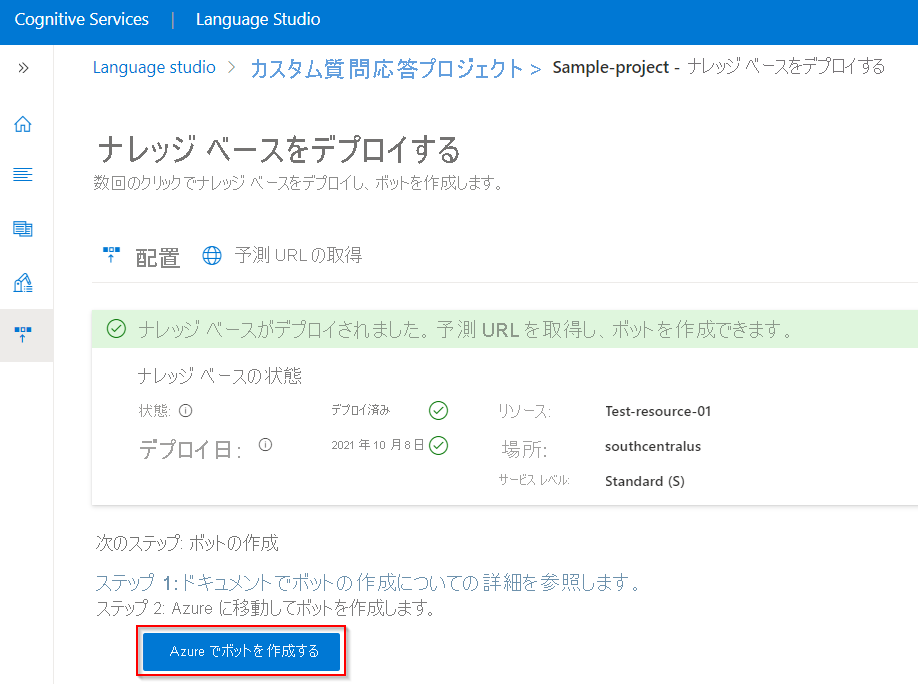
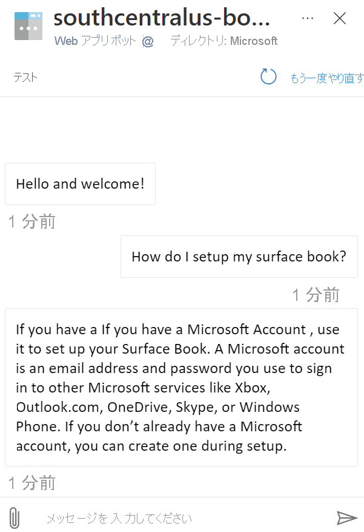

# チュートリアル: FAQ ボットを作成する

質問と回答と Azure [Bot Service](https://azure.microsoft.com/services/bot-service/) を使って、FAQ ボットをコーディングなしで作成します。

このチュートリアルでは、以下の内容を学習します。

<!-- green checkmark -->
> [!div class="checklist"]
> * 質問と回答のプロジェクトとナレッジ ベースを Azure Bot Service にリンクする
> * ボットをデプロイする
> * Web チャットでボットとチャットする
> * サポートされているチャネルでボットを有効にする

## ナレッジ ベースの作成と公開

[作業の開始に関する記事](../how-to/create-test-deploy.md)に従ってください。 ナレッジ ベースが正常にデプロイされたら、この記事を始めることができます。

## ボットの作成

プロジェクトとナレッジ ベースをデプロイした後、 **[Deploy knowledge base]\(ナレッジ ベースのデプロイ\)** ページからボットを作成できます。

* 複数のボットを迅速に作成し、個々のボットはリージョンや価格プランが異なっていてもすべて同じナレッジ ベースを指すことができます。

* ナレッジ ベースを変更して再デプロイするときは、ボットに対して何も行う必要はありません。 ナレッジ ベースと連携するように既に構成されており、ナレッジ ベースに対する今後のすべての変更に対応します。 ナレッジ ベースを発行するたびに、それに接続されているすべてのボットが自動的に更新されます。

1. Language Studio ポータルの質問と回答の **[Deploy knowledge base]\(ナレッジ ベースのデプロイ\)** ページで、 **[Create bot]\(ボットの作成\)** を選びます。

    > [!div class="mx-imgBorder"]
    > 

1. Azure portal の新しいブラウザー タブが開き、Azure Bot Service の作成ページが表示されます。 Azure Bot Service を構成します。

    |設定 |値|
    |----------|---------|
    | ボット ハンドル| ボットの一意識別子です。 この値は、アプリ名とは異なる必要があります |
    | サブスクリプション | サブスクリプションを選択します。 |
    | リソース グループ | 既存のリソース グループを選ぶか、新しく作成します |
    | Location | 適当な場所を選びます |
    | Pricing tier | 価格レベルの選択 |
    |アプリの名前 | ボットのアプリ サービス名 |
    |SDK 言語 | C# または Node.js。 ボットの作成後、ローカル開発環境にコードをダウンロードして、開発プロセスを続行できます。 |
    | QnA 認証キー | このキーは、デプロイされた質問と回答のプロジェクトとナレッジ ベースに自動的に設定されます |
    | App Service プラン/場所 | この値は自動的に設定されます。この値は変更しないでください |

1. ボットが作成された後、 **[Bot service]\(ボット サービス\)** リソースを開きます。
1. **[設定]** で **[Web チャットでテスト]** を選択します。

    > [!div class="mx-imgBorder"]
    > ![Azure Bot Service UI の [Test web chat]\(Web チャットのテスト\) ボタンのスクリーンショット。](../media/bot-service/test-in-web-chat.png)

1. チャット プロンプトの **[Type your message]\(メッセージを入力\)** で、以下のように入力します。

    `How do I setup my surface book?`

    チャット ボットが、ナレッジ ベースからの回答で応答します。

    > [!div class="mx-imgBorder"]
    > 

## ボットをチャネルと統合する

作成した Bot Service リソースで **[Channels]\(チャネル\)** を選びます。 追加の[サポートされているチャネル](/azure/bot-service/bot-service-manage-channels)でボットをアクティブにすることができます。

   >[!div class="mx-imgBorder"]
   >

## リソースをクリーンアップする

このアプリケーションを引き続き使うのでない場合は、関連付けられた質問と回答および Bot Service リソースを削除します。

## 次のステップ

次の記事に進み、マルチターン プロンプトで FAQ ボットをカスタマイズする方法を学習します。
> [!div class="nextstepaction"]
> [マルチターン プロンプト](guided-conversations.md)
