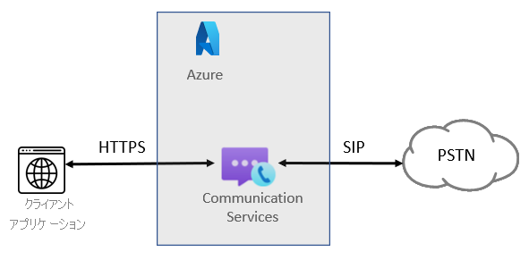
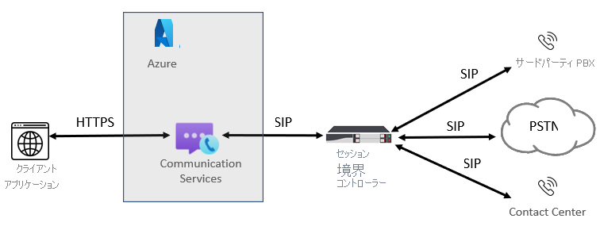

# テレフォニーの概念

[!INCLUDE [Regional Availability Notice](../../includes/regional-availability-include.md)]

Azure Communication Services の Calling SDK を使用すると、アプリケーションにテレフォニーと公衆交換電話網のアクセスを追加することができます。 このページには、テレフォニーの主な概念と機能がまとめられています。 具体的な SDK の言語と機能の詳細については、[通話ライブラリ](../../quickstarts/voice-video-calling/calling-client-samples.md)に関するページを参照してください。

## テレフォニーの概要
ユーザーが従来の電話番号を使用して対話すると、通話は常に PSTN (公衆交換電話網) 音声通話によって行われます。 PSTN 通話を発信および受信するには、Azure Communication Services リソースにテレフォニー機能を追加する必要があります。 この場合、信号とメディアでは、ユーザーを接続するために、IP ベースおよび PSTN ベースのテクノロジが組み合わされて使用されます。 Communication Services には、PSTN ネットワークに接続するための 2 つの異なる方法として、音声通話 (PSTN) と Azure 直接ルーティングが用意されています。

### 音声通話 (PSTN)

アプリまたはサービスに PSTN 接続を追加する簡単な方法として、この場合は、Microsoft が電気通信プロバイダーになります。 番号は Microsoft から直接購入できます。 Azure Cloud Calling は、Communication Services のためのオールインクラウドのテレフォニー ソリューションです。 きわめてシンプルな方法で、公衆交換電話網 (PSTN) に Communication Services を接続して世界中の固定電話や携帯電話への通話を実現することができます。 次の図に示すように Microsoft が PSTN 通信事業者としての役割を果たします。

次の項目が該当する場合は、音声通話 (PSTN) が最適なソリューションです。
- お客様のリージョンで音声通話 (PSTN) が提供されている。
- 現在の PSTN 通信事業者にこだわる必要がない。
- Microsoft が管理する PSTN アクセスを利用したい。

このオプションでは、
- Microsoft から直接番号を取得し、世界中に電話をかけることができます。
- 音声通話 (PSTN) は Azure Communication Services の外で稼動しているため、オンプレミス環境のデプロイやメンテナンスは必要ありません。
- 注: サードパーティの PBX、アナログ デバイス、その他のセッション ボーダー コントローラー (SBC) でサポートされるサードパーティのテレフォニー機器との相互運用性を確保するために、必要であれば、サポートされている SBC を Azure 直接ルーティング経由で接続することもできます。

この方法を選択する場合は、Azure Communication Services への接続が中断されないようにする必要があります。  

クラウド通話の場合、発信呼び出しは対象の国に応じて分単位の料金で請求されます。 [PSTN 通話の現在の料金一覧](https://github.com/Azure/Communication/blob/master/pricing/communication-services-pstn-rates.csv)を参照してください。

### Azure 直接ルーティング

[!INCLUDE [Public Preview](../../includes/public-preview-include-document.md)]

この方法を選択すると、従来のオンプレミス テレフォニーと任意の通信事業者を Azure Communication Services に接続することができます。 お客様の国またはリージョンで音声通話 (PSTN) が提供されていなくても、これにより、Communication Services アプリケーションから PSTN 通話機能を利用することができます。 

次の項目に 1 つでも該当すれば、Azure 直接ルーティングが適切なソリューションです。

- Communication Services を PSTN 通話機能と共に使用したい。
- 現在の PSTN 通信事業者を引き続き使用する必要がある。
- ルーティングを混在させて、音声通話 (PSTN) を経由する通話と通信事業者を経由する通話を使い分けたい。
- サードパーティの PBX や装置 (コール システムやアナログ デバイスなど) との相互運用性を確保する必要がある。

このオプションでは、

- オンプレミスのソフトウェアを追加しなくても、自分が所有するサポート対象の SBC を Azure Communication Services に接続することができます。
- 事実上すべてのテレフォニー通信事業者を Communication Services で使用することができます。
- この方法の構成と管理は、ご自身で行うことができるほか、通信事業者やパートナーが行うこともできます (対応の可否については、通信事業者またはパートナーにお問い合わせください)。
- テレフォニー機器 (サードパーティの PBX、アナログ デバイスなど) と Communication Services の相互運用性をご自身で構成できます。

このオプションには以下が必要です。

- Azure との中断のない接続。
- サポートされている SBC のデプロイとメンテナンス。
- サードパーティ通信事業者との契約 (サードパーティの PBX、アナログ デバイスなど、その他テレフォニー機器への接続を Communication Services を利用しているユーザーに提供するオプションとしてデプロイされている場合を除く)。

## 次の手順

### 概念説明のドキュメント

- [Azure Communication Services での電話番号の種類](./plan-solution.md)
- [Azure 直接ルーティングを計画する](./sip-interface-infrastructure.md)
- [Azure Communication Services のダイレクト ルーティングに対して認定されたセッション ボーダー コントローラー](./certified-session-border-controllers.md)
- [料金](../pricing.md)

### クイックスタート

- [電話番号を取得する](../../quickstarts/telephony-sms/get-phone-number.md)
- [電話の呼び出し](../../quickstarts/voice-video-calling/pstn-call.md)
