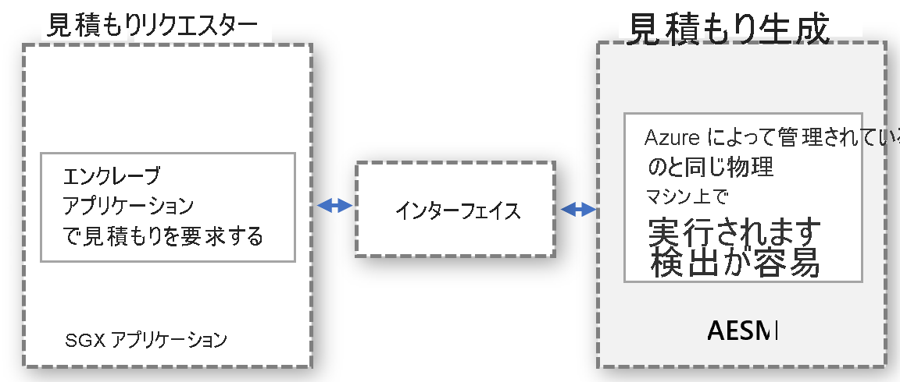

# <a name="platform-software-management-with-intel-sgx-quote-helper-daemonset-preview"></a>Intel SGX クォート ヘルパー デーモンセットによるプラットフォーム ソフトウェア管理 (プレビュー)

リモート構成証明を実行する[エンクレーブ アプリケーション](confidential-computing-enclaves.md)は、生成されたクォートを必要とします。 このクォートによって、アプリケーションの ID と状態、そしてエンクレーブが実行されている環境の暗号による証明が得られます。 クォートを生成するためには、Intel の Platform Software Components (PSW) の一部である、信頼されたソフトウェア コンポーネントが必要です。

## <a name="overview"></a>概要
 
クォートの生成に関して、Intel は 2 つの構成証明モードをサポートしています。

- "*インプロセス*": 信頼されたソフトウェア コンポーネントをエンクレーブ アプリケーションのプロセス内でホストします。

- "*アウトプロセス*": 信頼されたソフトウェア コンポーネントをエンクレーブ アプリケーションの外でホストします。
 
Open Enclave SDK を使用してビルドされた Intel Software Guard Extension (Intel SGX) アプリケーションは、既定でインプロセス構成証明モードを使用します。 Intel SGX ベースのアプリケーションでは、アウトプロセス構成証明モードが許可されます。 このモードを使用する場合は、追加のホストが必要であり、Architectural Enclave Service Manager (AESM) などの必要なコンポーネントをアプリケーションの外部に公開する必要があります。

この機能により、Intel プラットフォームの更新中や DCAP ドライバーの更新中のエンクレーブ アプリのアップタイムが向上します。 このため、この使用をお勧めします。

Azure Kubernetes Services (AKS) クラスターでこの機能を有効にするには、コンフィデンシャル コンピューティング アドオンを有効にするときに、Azure CLI に `--enable-sgxquotehelper` コマンドを追加します。 

```azurecli-interactive
# Create a new AKS cluster with system node pool with Confidential Computing addon enabled and SGX Quote Helper
az aks create -g myResourceGroup --name myAKSCluster --generate-ssh-keys --enable-addon confcom --enable-sgxquotehelper
```

詳細については、「[クイックスタート: コンフィデンシャル コンピューティング ノードを含む AKS クラスターを Azure CLI を使用してデプロイする](confidential-nodes-aks-get-started.md)」を参照してください。

## <a name="benefits-of-the-out-of-process-mode"></a>アウトプロセス モードの利点

次の一覧では、この構成証明モードの主な利点について説明します。

-   コンテナー化されたアプリケーションごとに PSW のクォート生成コンポーネントを更新する必要がない。 コンテナーの所有者がそのコンテナー内の更新を管理する必要がありません。 コンテナーの所有者は、コンテナーの外部にある一元化されたサービスを呼び出すプロバイダー インターフェイスを利用できます。 プロバイダーはコンテナーを更新し、管理します。

-   古い PSW コンポーネントに起因する構成証明の失敗を懸念する必要がない。 プロバイダーが、これらのコンポーネントの更新を管理します。

-   アウトプロセス モードでは、インプロセス モードよりも、EPC メモリの使用率が高くなる。 インプロセス モードでは、リモート構成証明のために、各エンクレーブ アプリケーションが QE と PCE のコピーをインスタンス化する必要があります。 アウトプロセス モードでは、それらのエンクレーブをコンテナーでホストする必要がないため、コンテナーのクォータからはエンクレーブのメモリが消費されません。

-   Intel SGX ドライバーを Linux カーネルにアップストリームすると、より高い特権がエンクレーブに付与される。 この特権によってエンクレーブは PCE を呼び出すことができ、インプロセス モードで実行されているエンクレーブ アプリケーションが中断されます。 既定では、エンクレーブは、この権限を受け取りません。 この特権をエンクレーブ アプリケーションに与えるためには、アプリケーションのインストール プロセスに変更を加える必要があります。 これに対し、アウトプロセス モードでは、アウトプロセス要求を処理するサービスのプロバイダーがこの特権を使用してサービスをインストールします。

-   PSW および DCAP との下位互換性をチェックしなくてよい。 PSW のクォート生成コンポーネントに対する更新は、あらかじめプロバイダーによって下位互換性が確認されます。 これは、機密ワークロードの更新をデプロイする前に、互換性の問題を処理するために役立ちます。

## <a name="confidential-workloads"></a>機密ワークロード

クォートの要求側とクォートの生成側は別々に実行されますが、同じ物理マシン上で実行されます。 クォートの生成は一元化され、すべてのエンティティからのクォートの要求に対処します。 クォートを要求するすべてのエンティティに対して、インターフェイスが適切に定義され、検出できるようになっている必要があります。



この抽象モデルは、機密ワークロードのシナリオを対象としたものです。既に使用可能な AESM サービスを利用しています。 AESM はコンテナー化され、Kubernetes クラスター全体にデーモンセットとしてデプロイされます。 AESM サービス コンテナーの 1 つのインスタンスがポッドにラップされ、各エージェント ノードにデプロイされることが Kubernetes によって保証されます。 新しい Intel SGX クォート デーモンセットは、sgx-device-plugin デーモンセットに依存します。AESM サービス コンテナーは、QE と PCE のエンクレーブを起動するための EPC メモリを sgx-device-plugin に要求するためです。

アウトプロセスのクォート生成を使用するには、作成時に環境変数 `SGX_AESM_ADDR=1` を設定して、それぞれのコンテナーでオプトインする必要があります。 また、コンテナーには、既定の Unix ドメイン ソケットに要求を誘導する役割を果たす libsgx-quote-ex パッケージが含まれている必要があります。

アプリケーションでは従来どおり、インプロセスの構成証明を使用することもできますが、あるアプリケーション内でインプロセスとアウトプロセスを同時に使用することはできません。 アウトプロセス インフラストラクチャは既定で利用でき、リソースを消費します。

## <a name="sample-implementation"></a>実装例

次の Docker ファイルは、Open Enclave に基づくアプリケーションのサンプルです。 `SGX_AESM_ADDR=1` 環境変数を Docker ファイルで設定するか、デプロイ ファイルで設定します。 次のサンプルでは、Docker ファイルとデプロイの詳細について説明します。 

  > [!Note] 
  > アウトプロセス構成証明を正しく機能させるためには、アプリケーション コンテナーに Intel の libsgx-quote-ex を含める必要があります。
    
```yaml
# Refer to Intel_SGX_Installation_Guide_Linux for details
FROM ubuntu:18.04 as sgx_base
RUN apt-get update && apt-get install -y \
    wget \
    gnupg

# Add the repository to sources, and add the key to the list of
# trusted keys used by the apt to authenticate packages
RUN echo "deb [arch=amd64] https://download.01.org/intel-sgx/sgx_repo/ubuntu bionic main" | tee /etc/apt/sources.list.d/intel-sgx.list \
    && wget -qO - https://download.01.org/intel-sgx/sgx_repo/ubuntu/intel-sgx-deb.key | apt-key add -
# Add Microsoft repo for az-dcap-client
RUN echo "deb [arch=amd64] https://packages.microsoft.com/ubuntu/18.04/prod bionic main" | tee /etc/apt/sources.list.d/msprod.list \
    && wget -qO - https://packages.microsoft.com/keys/microsoft.asc | apt-key add -

FROM sgx_base as sgx_sample
RUN apt-get update && apt-get install -y \
    clang-7 \
    libssl-dev \
    gdb \
    libprotobuf10 \
    libsgx-dcap-ql \
    libsgx-quote-ex \
    az-dcap-client \
    open-enclave
WORKDIR /opt/openenclave/share/openenclave/samples/remote_attestation
RUN . /opt/openenclave/share/openenclave/openenclaverc \
    && make build
# This sets the flag for out-of-process attestation mode. Alternatively you can set this flag on the deployment files.
ENV SGX_AESM_ADDR=1 

CMD make run
```
または、デプロイの .yaml ファイルでアウトプロセス構成証明モードを設定することもできます。 次に手順を示します。

```yaml
apiVersion: batch/v1
kind: Job
metadata:
  name: sgx-test
spec:
  template:
    spec:
      containers:
      - name: sgxtest
        image: <registry>/<repository>:<version>
        env:
        - name: SGX_AESM_ADDR
          value: 1
        resources:
          limits:
            kubernetes.azure.com/sgx_epc_mem_in_MiB: 10
        volumeMounts:
        - name: var-run-aesmd
          mountPath: /var/run/aesmd
      restartPolicy: "Never"
      volumes:
      - name: var-run-aesmd
        hostPath:
          path: /var/run/aesmd
```

## <a name="next-steps"></a>次のステップ

[クイックスタート: コンフィデンシャル コンピューティング ノードを含む AKS クラスターを Azure CLI を使用してデプロイする](./confidential-nodes-aks-get-started.md)

[機密コンテナーのクイック スタート サンプル](https://github.com/Azure-Samples/confidential-container-samples)

[DCsv2 SKU](../virtual-machines/dcv2-series.md)
