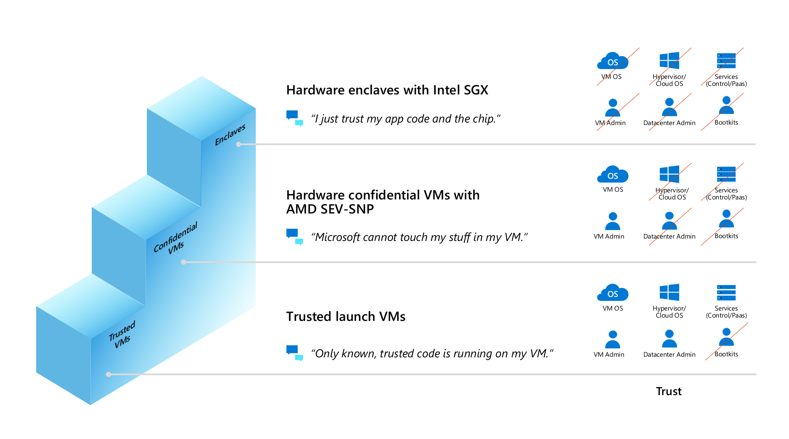

# Azure におけるコンフィデンシャル コンピューティング

現在、お客様は保存データと転送中のデータを暗号化しますが、メモリ内で使用されている間は暗号化を行いません。 Microsoft が共同で設立した [Confidential Computing Consortium](https://confidentialcomputing.io/) (CCC) の定義によれば、コンフィデンシャル コンピューティングとは、ハードウェアベースの[高信頼実行環境](https://en.wikipedia.org/wiki/Trusted_execution_environment) (TEE) を使用して、使用中のデータを保護することです。 これらの TEE により、使用中のアプリケーションとデータに対する未承認のアクセスや変更が妨げられるので、機密データや規制対象データを管理する組織のセキュリティ レベルを向上させることができます。 TEE は信頼された環境であり、これによってデータ整合性、データ機密性、コード整合性が一定レベルで保証されます。 コンフィデンシャル コンピューティング脅威モデルは、クラウド プロバイダーのオペレーターやテナントのドメイン内の他のアクターによる実行中のコードやデータへのアクセスを不可能にしたり、限定したりすることを目的としています。

Intel [Software Guard Extensions](https://www.intel.com.au/content/www/au/en/architecture-and-technology/software-guard-extensions-enhanced-data-protection.html) (Intel SGX) や [AMD Secure Encrypted Virtualization](https://www.amd.com/en/processors/amd-secure-encrypted-virtualization) (SEV-SNP) などのテクノロジは、コンフィデンシャル コンピューティングの実装をサポートする最近の CPU の機能強化です。 これらのテクノロジは仮想化拡張機能として設計され、コンフィデンシャル コンピューティング脅威モデルを構築するために、メモリの暗号化と整合性、CPU 状態の機密性と整合性、構成証明などの機能セットを提供します。

:::image type="content" source="media/overview-azure-products/three-states.png" alt-text="データ保護の 3 つの状態のグラフィック。コンフィデンシャル コンピューティングの使用中データが強調表示されています。":::

コンフィデンシャル コンピューティングを保存時および転送中のデータ暗号化と併用すると、使用中の暗号化という暗号化にとって最大の単一の障壁を打破できます。これは、機密性の高い、または高度に規制されたデータ セットとアプリケーション ワークロードを、セキュリティで保護されたパブリック クラウド プラットフォーム内で保護することによって可能になります。 コンフィデンシャル コンピューティングは、汎用的なデータ保護をはるかに超えるものです。 また、TEE は、独自のビジネス ロジック、分析機能、機械学習アルゴリズム、さらにはアプリケーション全体を保護するためにも使用されています。

## Azure のコンフィデンシャル コンピューティングのご案内

コンフィデンシャル コンピューティングのための [Microsoft のオファリング](https://aka.ms/azurecc)は、サービスとしてのインフラストラクチャ (IaaS) からサービスとしてのプラットフォーム (PaaS) や、クラウドでのデータとコードの機密性への移行をサポートする開発者ツールにまで及びます。

## 攻撃対象領域を縮小する
信頼済みのコンピューティング ベース (TCB) とは、セキュリティで保護された環境を提供する、システムのハードウェア、ファームウェア、およびソフトウェア コンポーネントのすべてのことです。 TCB 内のコンポーネントは、"クリティカル" と見なされます。 TCB 内の 1 つのコンポーネントが侵害された場合、システム全体のセキュリティが脅かされる可能性があります。 TCB が低いほど、セキュリティが高いことを意味します。 さまざまな脆弱性、マルウェア、攻撃、および悪意のある人物にさらされるリスクが低下します。 Azure のコンフィデンシャル コンピューティングは、TEE を提供することで、クラウド ワークロードの TCB を低くすることを目的としています。 

### Azure での TCB の削減

Azure のコンフィデンシャル仮想マシンをデプロイすると、TCB を削減できます。 AMD SEV-SNP で実行されているコンフィデンシャル VM デプロイ ソリューションでは、既存のワークロードをリフトアンドシフトし、VM レベルの機密性でクラウド オペレーターからデータを保護できます。 Intel SGX アプリケーション エンクレーブを備えたコンフィデンシャル VM には、TCB を最小限に抑え、クラウド オペレーターと現場のオペレーターの両方からデータを保護するために、アプリケーション内のコード行制御が備わっています。  Intel SGX を備えたアプリケーション エンクレーブでは、構成ポリシーまたはアプリケーション コードにいくつかの変更が必要な場合があります。  独立系ソフトウェア ベンダー (ISV) パートナーまたはオープンソース ソフトウェア (OSS) を活用して、アプリケーション エンクレーブ内で既存のアプリを実行することもできます。 

### 信頼の梯子

Azure では、コンフィデンシャル コンピューティング IaaS ワークロード用に各種の仮想マシンが提供され、お客様は好みのセキュリティ態勢に応じて最適な仮想マシンを選択できます。 "信頼の梯子" の図では、これらの IaaS オファリングに関するセキュリティ態勢の観点からお客様が期待できることを示しています。

## Azure オファリング

現在一般提供されているサービスは次のとおりです。

- [Intel SGX アプリケーション エンクレーブを備えたコンフィデンシャル VM](confidential-computing-enclaves.md)。 Azure では、ハードウェアベースのエンクレーブ作成用に、Intel SGX テクノロジを基盤とする [DCsv2](../virtual-machines/dcv2-series.md)、[DCsv3、DCdsv3](../virtual-machines/dcv3-series.md) シリーズを提供しています。 一連の VM で動作するセキュア エンクレーブベースのアプリケーションを構築すれば、アプリケーションのデータとコードをその使用中に保護することができます。
- Azure Kubernetes Service (AKS) で稼働する[エンクレーブ対応コンテナー](enclave-aware-containers.md)。 AKS 上のコンフィデンシャル コンピューティング ノードでは、Intel SGX を使用して、そのノード内の各コンテナー アプリケーション間に、隔離されたエンクレーブ環境を作成できます。
- [Azure SQL でセキュア エンクレーブを使用する Always Encrypted](/sql/relational-databases/security/encryption/always-encrypted-enclaves)。 データベース エンジンが実行されるセキュア エンクレーブの使用を必要とする暗号化されたデータに対する操作が SQL ステートメントに含まれている場合、SQL クエリを TEE 内で直接実行することにより、機密データの機密性がマルウェアや高い特権を持つ未承認のユーザーから保護されます。
- [Microsoft Azure Attestation](../attestation/overview.md) は、複数の高信頼実行環境 (TEE) の信頼性を検証し、TEE 内で実行されているバイナリの整合性を検証するためのリモート構成証明サービスです。
- [Azure Key Vault Managed HSM](/azure/key-vault/managed-hsm/) は、フル マネージド、高可用性、シングル テナント、標準準拠を特徴とするクラウド サービスであり、FIPS 140-2 レベル 3 適合のハードウェア セキュリティ モジュール (HSM) を使用してクラウド アプリケーションの暗号化キーを保護することができます。
- [Azure IoT Edge](../iot-edge/deploy-confidential-applications.md) では、モノのインターネット (IoT) デバイス上のセキュア エンクレーブ内で実行される機密性の高いアプリケーションがサポートされています。 IoT デバイスは、悪意のあるアクターによって物理的にアクセス可能なので、しばしば、改ざんや偽造にさらされます。 コンフィデンシャル IoT Edge デバイスは、クラウドにストリーミングする前に、デバイス自体によってキャプチャおよび格納されたデータへのアクセスを保護することで、エッジでの信頼と整合性を増し加えます。

下記に示すその他のサービスは現在プレビュー中です。

- [AMD SEV-SNP テクノロジ](https://azure.microsoft.com/blog/azure-and-amd-enable-lift-and-shift-confidential-computing/)に基づくコンフィデンシャル VM は現在プレビュー中であり、一部のお客様が利用できます。
- [トラステッド起動](../virtual-machines/trusted-launch.md)は第 2 世代のすべての VM で利用でき、強化されたセキュリティ機能として、セキュア ブート、仮想トラステッド プラットフォーム モジュール、ブート整合性の監視を提供します。これにより、ブート キット、ルートキット、カーネルレベルのマルウェアから保護されます。
- [Azure Confidential Ledger](../confidential-ledger/overview.md)。 ACL は、レコードの保持と監査のため、またはマルチパーティー シナリオでのデータの透明性のために機密データを格納するための改ざん防止レジスタです。 Write-Once-Read-Many の保証が提供され、データを消去不可および変更不可にできます。 このサービスは、Microsoft Research の [Confidential Consortium Framework](https://www.microsoft.com/research/project/confidential-consortium-framework/) を基に構築されています。
- [機密推論 ONNX Runtime](https://github.com/microsoft/onnx-server-openenclave) は、ML ホスティング パーティーが推論要求とそれに対応する応答の両方にアクセスすることを制限する機械学習 (ML) 推論サーバーです。

## 次のステップ

- [アプリケーション エンクレーブの開発について学習する](application-development.md)
