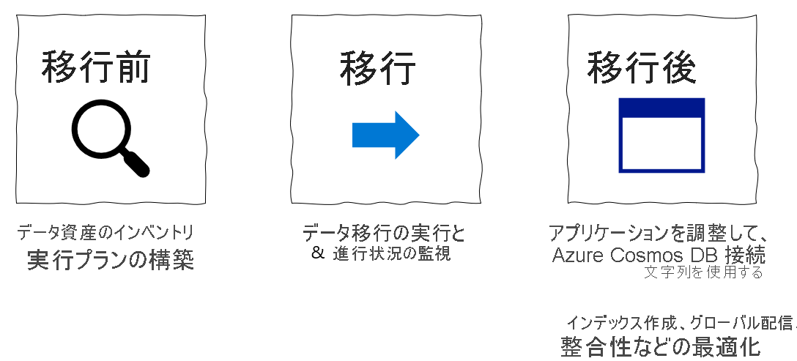

# <a name="pre-migration-steps-for-data-migrations-from-mongodb-to-azure-cosmos-dbs-api-for-mongodb"></a>MongoDB から Azure Cosmos DB の MongoDB 用 API へのデータ移行の移行前手順
[!INCLUDE[appliesto-mongodb-api](../includes/appliesto-mongodb-api.md)]

> [!IMPORTANT]  
> 移行前の手順を実行する前に、このガイド全体をお読みください。
>

この MongoDB 移行前ガイドは、MongoDB の移行に関するシリーズの一部です。 MongoDB 移行の重要な手順は、次に示すように、移行前、移行、そして[移行後](post-migration-optimization.md)です。



## <a name="overview-of-pre-migration"></a>移行前の概要

実際にデータを移動する前に、移行に関する具体的な計画と意思決定を行うことが重要です。 この最初の意思決定プロセスを、"移行前" と呼びます。 移行前の目標は、(1) 移行後のアプリケーションに求める要件を満たすように Azure Cosmos DB を設定し、(2) 移行の実行方法を計画することです。

次の手順に従って、移行前の手順を詳細に実行します
* [既存の MongoDB リソースを検出し、それらを追跡するためのアーティファクトを作成する](#pre-migration-discovery)
* [データ移行に向けて既存の MongoDB リソースの準備状態を評価する](#pre-migration-assessment)
* [既存の MongoDB リソースを新しい Azure Cosmos DB リソースにマップする](#pre-migration-mapping)
* [フルスケールのデータ移行を開始する前に、移行プロセスのロジスティクスを最初から最後まで計画する](#execution-logistics)

次に、移行前の計画に従って移行を実行します。

最後に、[カットオーバーと最適化の重要な移行後の手順](post-migration-optimization.md)を実行します。

移行を成功させるには、上記のすべての手順が不可欠です。

移行を計画するときは、可能な限りリソースごとのレベルで計画することをお勧めします。

## <a name="pre-migration-discovery"></a>移行前の検出

移行前の最初の手順は、リソース探索です。 この手順では、MongoDB データ資産にある既存のリソースの包括的な一覧を作成します。

### <a name="create-a-data-estate-migration-spreadsheet"></a>データ資産の移行スプレッドシートを作成する

好みの生産性ソフトウェアを使用して、移行の追跡ドキュメントとして使用する **データ資産の移行スプレッドシート** を作成します。 
   * このスプレッドシートの目的は、生産性を向上させ、移行を最初から最後まで計画するのに役立ちます。
   * スプレッドシートの構成はお好みで作成してください。 いくつかのお勧めを、次の箇条書きでまとめています。
   * このスプレッドシートは、リスト形式の、データ資産リソースの記録として構成する必要があります。
   * 各行は、リソース (データベースまたはコレクション) に対応します。
   * 各列はリソースのプロパティに対応しています。今のところ、少なくとも "*名前*" と "*データ サイズ (GB)* " の列は作成すべきですが、理想的にはリソースごとに MongoDB のバージョンに関する情報も収集できるようにしたいので、その場合は "*Mongo のバージョン*" の列も追加します。 
   * 最初は、MongoDB データ資産の既存リソースのリストをこのスプレッドシートに記入します。 このガイドを読み進めながら必要に応じて列を追加して、このスプレッドシートを移行計画を最初から最後まで追跡するドキュメントに仕上げていきます。

### <a name="discover-existing-mongodb-data-estate-resources"></a>既存の MongoDB データ資産リソースを検出する

適切な検出ツールを使用して、既存の MongoDB データ資産内のリソース (データベース、コレクション) を可能な限り包括的に特定します。 

リソースの検出に使用できるツールをいくつかご紹介します:
   * [MongoDB シェル](https://www.mongodb.com/try/download/shell)
   * [MongoDB Compass](https://www.mongodb.com/try/download/compass)

## <a name="pre-migration-assessment"></a>移行前の評価

次に、移行計画の前段階として、データ資産内の各リソースの準備状況を評価します。 

準備状況を左右する主な要因は、MongoDB のバージョンです。 Azure Cosmos DB は現在、MongoDB バイナリ プロトコルのバージョン 3.2、3.6、4.0 をサポートしています。 作成する移行計画用のスプレッドシートには、"*MongoDB のバージョン*" を示す欄を入れるようにしてください。 スプレッドシートを見て、Azure Cosmos DB と互換性のない MongoDB バージョンを使用しているリソースをハイライトしておきます。

## <a name="pre-migration-mapping"></a>移行前のマッピング

検出と評価の手順が完了すれば、MongoDB 側の作業は終了です。 次は、Azure Cosmos DB 側の計画を立てる番です。 本番用の Azure Cosmos DB リソースは、どのように設定して構成しますか? 計画は、"*リソース単位*" で立てるようにします。つまり、計画用のスプレッドシートには以下の列を追加する必要があります。 
* Azure Cosmos DB マッピング 
* シャード キー 
* データ モデル
* 専用 vs 共有スループット

詳細については、次のセクションを参照してください。

### <a name="considerations-when-using-azure-cosmos-dbs-api-for-mongodb"></a>Azure Cosmos DB の MongoDB 用 API を使用する場合の考慮事項

Azure Cosmos DB のデータ資産を計画する前に、次の Azure Cosmos DB の概念を理解しておく必要があります。

- **容量モデル**:Azure Cosmos DB のデータベース容量は、スループットベースのモデルに基づいています。 このモデルは[要求ユニット/秒](../request-units.md)に基づいています。これは、1 秒ごとにコレクションに対して実行できるデータベース操作の数を表す単位です。 この容量は、[データベースまたはコレクション レベル](../set-throughput.md)で割り当てることができます。また、割り当てモデルに対してプロビジョニングすることも、[自動スケーリングでプロビジョニングされたスループット](../provision-throughput-autoscale.md)を使用してプロビジョニングすることもできます。

- **要求ユニット**:すべてのデータベース操作には、Azure Cosmos DB に関連付けられた要求ユニット (RU) コストがあります。 実行すると、指定された秒で使用可能な要求ユニット レベルからこれが減算されます。 要求に、現在割り当てられている RU/秒よりも多くの RU が必要な場合、問題を解決するための 2 つの選択肢があります。つまり、RU の量を増やすか、次の秒が開始されるまで待機してから操作を再試行します。

- **エラスティック容量**:特定のコレクションまたはデータベースの容量は、いつでも変更できます。 これにより、データベースをワークロードのスループット要件に柔軟に適応させることができます。

- **自動シャーディング**:Azure Cosmos DB では、シャード (またはパーティション キー) のみを必要とする自動パーティション分割システムが提供されます。 [自動パーティション分割メカニズム](../partitioning-overview.md)は、すべての Azure Cosmos DB API 間で共有されます。これにより、水平分布を通じて、シームレスなデータおよびスループットのスケーリングが可能になります。

### <a name="plan-the-azure-cosmos-db-data-estate"></a>Azure Cosmos DB データ資産を計画する

どの Azure Cosmos DB リソースを作成するかを確認します。 これは、データ資産の移行スプレッドシートのステップを実行し、既存の MongoDB リソースを新しい Azure Cosmos DB リソースにマッピングすることを意味します。 
* 各 MongoDB データベースが Azure Cosmos DB データベースになることを想定します
* 各 MongoDB コレクションが Azure Cosmos DB コレクションになることを想定します
* Azure Cosmos DB リソースの名前付け規則を設定します。 データベースやコレクションの構造に変更が無い限り、通常は、同じリソース名を維持することをお勧めします。
* MongoDB では、コレクションのシャーディングは省略可能です。 Azure Cosmos DB では、すべてのコレクションがシャード化されます。
* *MongoDB コレクションのシャード キーがユーザーの Azure Cosmos DB コレクションのシャード キーになるとは限りません。既存の MongoDB データモデルやドキュメント構造が Azure Cosmos DB で採用されるものであるとは限りません。* 
   * シャード キーは、Azure Cosmos DB のスケーラビリティとパフォーマンスを最適化するために最も重要な設定であり、データ モデルはその次に重要です。 これらの設定はどちらも不変で、設定後に変更することはできません。そのため、計画フェーズで最適化することが非常に重要です。 詳細については、「[変更できない決定事項](#immutable-decisions)」セクションのガイダンスに従ってください。
* Azure Cosmos DB では、上限付きコレクションなど、特定の MongoDB のコレクション型は認識されません。 これらのリソースの場合は、通常の Azure Cosmos DB 作成してください。
* Azure Cosmos DB には、共有スループットと専用スループットという、2 種類のコレクションがあります。 共有と専用のスループットは、計画段階で行う必要のある重要な変更できない決定の 1 つです。 詳細については、「[変更できない決定事項](#immutable-decisions)」セクションのガイダンスに従ってください。

### <a name="immutable-decisions"></a>変更できない決定事項

次の Azure Cosmos DB リソースを作成した後に、選択した Azure Cosmos DB の構成を変更することはできません。したがって、移行を開始する前に、移行前の計画でこれらを正しく行うことが重要です。
* 最適なシャード キーを選択するには、[このガイド](../partitioning-overview.md)に従ってください。 パーティション分割 (シャーディングともいう) は、データを移行する前に考慮すべき重要な点です。 Azure Cosmos DB では、フルマネージド パーティション分割を使用して、ストレージとスループットの要件を満たすためにデータベースの容量を増やします。 この機能では、ルーティング サーバーのホストや構成は必要ありません。   
   * 同様の方法で、パーティション分割機能によって自動的に容量が追加され、それに応じてデータが再調整されます。 データに適したパーティション キーの選択に関する詳細および推奨事項については、「[パーティション キーの選択](../partitioning-overview.md#choose-partitionkey)」記事を参照してください。 
* データ モデルを選択するには、[このガイド](../modeling-data.md)に従ってください
* 移行するリソースごとに専用スループットと共有スループットのどちらを使用するか選択するには、[このガイド](../optimize-cost-throughput.md#optimize-by-provisioning-throughput-at-different-levels)に従ってください。
* 意思決定プロセスに役立つ、シャーディングとデータ モデリングの実例を[ここ](../how-to-model-partition-example.md)に示します。

### <a name="cost-of-ownership"></a>保有コスト

* [Azure Cosmos DB の容量計算ツール](https://cosmos.azure.com/capacitycalculator/)を使用して、新しい Azure Cosmos DB リソースの保有コストを見積もります。

### <a name="estimating-throughput"></a>スループットの見積り

* Azure Cosmos DB では、スループットは事前にプロビジョニングされ、1 秒あたりの要求ユニット (RU) で測定されます。 VM やオンプレミス サーバーとは異なり、RU はいつでも簡単にスケールアップしたりスケールダウンしたりすることができます。 プロビジョニングされた RU の数をすぐに変更することができます。 詳細については、「[Azure Cosmos DB の要求ユニット](../request-units.md)」を参照してください。

* [Azure Cosmos DB Capacity Calculator](https://cosmos.azure.com/capacitycalculator/) を使用すると、データベース アカウントの構成、データの量、ドキュメント サイズ、1 秒あたりの必要な読み取りと書き込みに基づいて、要求ユニットの量を確認できます。

* 必要な RU 数に影響する主な要因は、次のとおりです。
   * **ドキュメント サイズ**:アイテム/ドキュメントのサイズが増加すると、そのアイテム/ドキュメントの読み書きに消費される RU 数も増加します。

   * **ドキュメント プロパティの数**: ドキュメントの作成または更新で消費される RU の数は、そのプロパティの数、複雑さ、長さに関連します。 [インデックス付きのプロパティ数を制限する](mongodb-indexing.md)と、書き込み操作で消費される要求ユニットを削減できます。

   * **クエリのパターン**:クエリが複雑であると、そのクエリで消費される要求ユニット数に影響します。 

* クエリのコストを理解する最良の方法は、Azure Cosmos DB でサンプル データを使用し、`getLastRequestStastistics` コマンドを使って [MongoDB Shell からサンプル クエリを実行](connect-mongodb-account.md)して、消費される RU の数を出力する、要求の料金を取得することです。

    `db.runCommand({getLastRequestStatistics: 1})`

    このコマンドでは、以下のような JSON ドキュメントが出力されます。

    ```{  "_t": "GetRequestStatisticsResponse",  "ok": 1,  "CommandName": "find",  "RequestCharge": 10.1,  "RequestDurationInMilliSeconds": 7.2}```

* [診断設定](../cosmosdb-monitor-resource-logs.md)を使用して、Azure Cosmos DB に対して実行されるクエリの頻度とパターンを理解することもできます。 診断ログの結果は、ストレージ アカウント、EventHub インスタンスまたは [Azure Log Analytics](../../azure-monitor/logs/log-analytics-tutorial.md) に送信できます。  

## <a name="pre-migration-logistics-planning"></a>移行前のロジスティクス計画

最後に、既存のデータ資産のビューと新しい Azure Cosmos DB データ資産の設計ができたので、移行プロセスを最初から最後まで実行する方法を計画する準備ができました。 繰り返しになりますが、計画は *リソース単位* で立て、スプレッドシートに列を追加して以下のようなロジスティック ディメンションを把握します。

### <a name="execution-logistics"></a>実行ロジスティック
* 既存の各リソースを MongoDB から Azure Cosmos DB に移行するための責任者を割り当てます。 移行を完了させるために、チームのリソースをどのように活用するかは、お客様次第です。 小規模な移行では、1 つのチームが移行全体を開始し、その進捗を監視することができます。 大規模な移行では、リソースを移行および監視するために、リソースごとにチームメンバーに責任を割り当てることができます。
* リソースの移行の担当者を決定したら、次は移行に適した移行ツールを選択します。 小規模な移行では、MongoDB ネイティブ ツールや Azure DMS などの移行ツールを使用して、一度にすべてのリソースを移行することができるかもしれません。 大規模な移行や特殊な要件のある移行の場合は、リソースごとの粒度で移行ツールを選択することをお勧めします。
   * 使用する移行ツールを計画する前に、利用可能なオプションについて理解しておくことをお勧めします。 [Azure Cosmos DB の MongoDB 用 API の Azure Database Migration Service](../../dms/tutorial-mongodb-cosmos-db.md) では、フル マネージド ホスティング プラットフォーム、移行の監視オプションおよび自動調整処理を提供することで、データの移行を簡略化するメカニズムが提供されます。 オプションの完全な一覧を以下に示します。

   |**移行の種類**|**ソリューション**|**考慮事項**|
   |---------|---------|---------|
   |オンライン|[Azure Database Migration Service](../../dms/tutorial-mongodb-cosmos-db-online.md)|&bull; Azure Cosmos DB Bulk Executor ライブラリを使用します <br/>&bull; 大規模なデータセットに適し、ライブ変更のレプリケーションを処理します <br/>&bull; 他の MongoDB ソースでのみ機能します|
   |オフライン|[Azure Database Migration Service](../../dms/tutorial-mongodb-cosmos-db-online.md)|&bull; Azure Cosmos DB Bulk Executor ライブラリを使用します <br/>&bull; 大規模なデータセットに適し、ライブ変更のレプリケーションを処理します <br/>&bull; 他の MongoDB ソースでのみ機能します|
   |オフライン|[Azure Data Factory](../../data-factory/connector-azure-cosmos-db.md)|&bull; セットアップが簡単で、さまざまなソースをサポートします <br/>&bull; Azure Cosmos DB Bulk Executor ライブラリを使用します <br/>&bull; 大規模なデータセットに適しています <br/>&bull; チェックポイントがなく、移行の途中で問題が発生した場合、移行プロセスを全部やり直す必要があります<br/>&bull; 配信不能キューがなく、エラーが含まれるファイルがいくつかあると、移行プロセス全体が停止することがあります <br/>&bull; 特定のデータ ソースの読み取りスループットを向上させるためのカスタム コードが必要です|
   |オフライン|[既存の Mongo ツール (mongodump、mongorestore、Studio3T)](https://azure.microsoft.com/resources/videos/using-mongodb-tools-with-azure-cosmos-db/)|&bull; セットアップと統合が簡単 <br/>&bull; スロットルのカスタム処理が必要です|
    
   * リソースをオフラインで移行することが可能な場合は、以下の図を参考に適切な移行ツールを選択してください。

   

   * リソースをオンラインで移行する必要がある場合は、以下の図を参考に適切な移行ツールを選択してください。

   
   
   前述の[移行ソリューションの概要とデモ](https://www.youtube.com/watch?v=WN9h80P4QJM)については、この動画をご覧ください。

* 各リソースの移行ツールを決定したら、次は移行するリソースの優先順位を決めます。 優先順位を適切につけることで、移行をスケジュール通りに進めることができます。 移行に最も時間がかかるリソースを優先的に移行することをお勧めします。これらのリソースを最初に移行することで、完了までの時間を短縮することができるようになります。 さらに、一般的には、これらの時間のかかる移行には多くのデータが含まれ、移行ツールのリソースをより多く必要とするため、移行パイプラインの問題を早期に発見できる可能性が高くなります。 これにより、移行パイプラインに問題があるためにスケジュールが遅れる可能性を最小限に抑えることができます。
* 移行が開始された後の移行の進行状況を監視する方法を計画します。 チームでデータ移行作業を調整している場合は、チーム間で定期的に同期を行うよう計画し、優先度の高い移行作業の進捗状況を総合的に把握できるようにします。
  

### <a name="supported-migration-scenarios"></a>サポートされる移行シナリオ

採用すべき最適な MongoDB 移行ツールは、移行シナリオによって異なります。 

#### <a name="types-of-migrations"></a>移行の種類

移行シナリオごとの互換性のあるツールを次に示します。


#### <a name="tooling-support-for-mongodb-versions"></a>MongoDB バージョンのツール サポート

特定の MongoDB バージョンから移行する場合、サポートされるツールは以下のとおりです:


### <a name="post-migration"></a>移行後

移行前のフェーズでは、少し時間を費やして、アプリの移行と移行後の最適化に向けて、どのようなステップを踏むのかを計画します。
* 移行後のフェーズでは、既存の MongoDB データ資産の代わりに Azure Cosmos DB を使用するために、アプリケーションのカットオーバーを実行します。 
* インデックス、グローバル分散、一貫性、その他の *変更可能な* Azure Cosmos DB のプロパティをリソースごとに計画するよう最善を尽くします。ただし、これらの Azure Cosmos DB の構成設定は後で変更することが *可能* なので、これらの設定は今後調整することも想定されます。 これらの側面が分析の妨げにならないようにしましょう。 これらの変更可能な構成は、移行後に適用します。
* 移行後の最適なガイドについては、[こちら](post-migration-optimization.md)を参照してください。

## <a name="next-steps"></a>次のステップ
* [Database Migration Service を使用してお使いの MongoDB データを Cosmos DB に移行する。](../../dms/tutorial-mongodb-cosmos-db.md) 
* [Azure Cosmos のコンテナーとデータベースにスループットをプロビジョニングする](../set-throughput.md)
* [Azure Cosmos DB でのパーティション分割](../partitioning-overview.md)
* [Azure Cosmos DB でのグローバル分散](../distribute-data-globally.md)
* [Azure Cosmos DB のインデックス作成](../index-overview.md)
* [Azure Cosmos DB の要求ユニット](../request-units.md)
