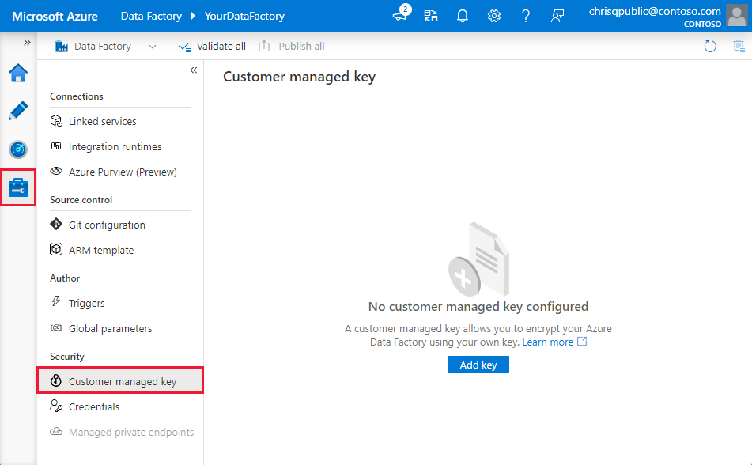

# カスタマー マネージド キーを使用した Azure Data Factory の暗号化

[!INCLUDE[appliesto-adf-xxx-md](includes/appliesto-adf-xxx-md.md)]

Azure Data Factory では、エンティティの定義や実行中にキャッシュされたデータなど、保存データを暗号化します。 既定では、データは、ランダムに生成されてデータ ファクトリに一意に割り当てられる Microsoft 管理のキーで暗号化されます。 セキュリティをさらに保証するために、Azure Data Factory のカスタマー マネージド キー機能を使用して Bring Your Own Key (BYOK) を有効にできるようになりました。 カスタマー マネージド キーを指定すると、Data Factory により、ファクトリ システム キーと CMK の__両方__を使用して顧客データが暗号化されます。 どちらかがない場合は、データとファクトリへのアクセスが拒否されます。

カスタマー マネージド キーを格納するには、Azure Key Vault が必要です。 独自のキーを作成してキー コンテナーに格納することも、Azure Key Vault API を使ってキーを生成することもできます。 キー コンテナーと Data Factory は同じ Azure Active Directory (Azure AD) テナントで同じリージョンに存在する必要がありますが、サブスクリプションは異なっていてもかまいません。 Azure Key Vault の詳細については、「 [What is Azure Key Vault? (Azure Key Vault とは)](../key-vault/general/overview.md)

> [!NOTE]
> カスタマー マネージド キーは、空のデータ ファクトリでのみ構成することができます。 データ ファクトリには、リンクされたサービス、パイプライン、データ フローなどのリソースを含めることはできません。 ファクトリの作成直後に、カスタマー マネージド キーを有効にすることをお勧めします。

## カスタマー マネージド キーの概要

次の図は、Data Factory で Azure Active Directory と Azure Key Vault を使用して、カスタマー マネージド キーを用いて要求を行う方法を示しています。

  

次の一覧では、図の番号付きの手順について説明します。

1. Azure Key Vault 管理者が、Data Factory に関連付けられているマネージド ID に暗号化キーへのアクセス許可を付与します
1. Data Factory 管理者が、ファクトリでカスタマー マネージド キー機能を有効にします
1. Data Factory により、ファクトリに関連付けられているマネージド ID を使用して、Azure Active Directory 経由で Azure Key Vault へのアクセスが認証されます
1. Data Factory により、Azure Key Vault のカスタマー キーを使用してファクトリ暗号化キーがラップされます
1. 読み取り/書き込み操作の場合、Data Factory により、Azure Key Vault に要求が送信され、暗号化と暗号化の解除の操作を実行できるようにアカウント暗号化キーのラップが解除されます。

## 前提条件 - Azure Key Vault を構成してキーを生成する

### Azure Key Vault で論理的な削除と消去しないを有効にする

Data Factory でカスタマー マネージド キーを使用するには、Key Vault に__論理的な削除__と__消去しない__の 2 つのプロパティが設定されている必要があります。 これらのプロパティは、新規または既存のキー コンテナーで、PowerShell または Azure CLI を使用して有効にすることができます。 既存のキー コンテナーでこれらのプロパティを有効にする方法については、次のいずれかの記事の「_論理的な削除を有効にする_」および「_消去保護を有効にする_」を参照してください。

- [PowerShell で論理的な削除を使用する方法](../key-vault/general/soft-delete-powershell.md)
- [CLI で論理的な削除を使用する方法](../key-vault/general/soft-delete-cli.md)

Azure portal を使用して新しい Azure Key Vault を作成している場合は、次のように __論理的な削除__と__消去しない__を有効にすることができます。

  

### Azure Key Vault への Data Factory アクセスを許可する

Azure Key Vault と Azure Data Factory が、同じ Azure Active Directory (Azure AD) テナントで "_同じリージョン_" に存在することを確認します。 Azure Key Vault アクセスの制御から、データ ファクトリのマネージド サービス ID (MSI) に次のアクセス許可を付与します。"_取得_"、"_キーの折り返しを解除_"、"_キーを折り返す_"。 これらのアクセス許可は、Data Factory でカスタマー マネージド キーを有効にするために必要です。

  

### カスタマー マネージド キーを生成または Azure Key Vault にアップロードする

独自のキーを作成してキー コンテナーに格納することも、Azure Key Vault API を使ってキーを生成することもできます。 Data Factory 暗号化では、2048 ビットの RSA キーのみがサポートされています。 詳細については、「[About keys, secrets, and certificates (キー、シークレット、証明書について)](../key-vault/general/about-keys-secrets-certificates.md)」を参照してください。

  

## カスタマー マネージド キーを有効にする

1. Data Factory を確実に空にします。 データ ファクトリには、リンクされたサービス、パイプライン、データ フローなどのリソースを含めることはできません。 ここで、空でないファクトリにカスタマー マネージド キーをデプロイすると、エラーが発生します。

1. Azure portal でキーの URI を検索するには、Azure Key Vault に移動して、[キー] 設定を選択します。 目的のキーを選択し、キーをクリックしてそのバージョンを表示します。 キーのバージョンを選択して設定を表示します

1. [キー識別子] フィールドで、URI を示す値をコピーします

    

1. Azure Data Factory ポータルを起動し、左側のナビゲーション バーを使用して Data Factory 管理ポータルに移動します

1. __[カスタマー マネージド キー]__ アイコンをクリックします

    

1. 先ほどコピーしたカスタマー マネージド キーの URI を入力します

1. __[保存]__ をクリックすると、Data Factory でカスタマー マネージド キーの暗号化が有効になります

## キーのバージョンを更新する

キーの新しいバージョンを作成した場合、その新しいバージョンを使用するには、データ ファクトリを更新します。 「_カスタマー マネージド キーを有効にする_」セクションの説明と同じように、以下の手順に従います。

1. Azure Key Vault ポータルを使用して、新しいキー バージョンの URI を検索します

1. __[カスタマー マネージド キー]__ 設定に移動します

1. 新しいキーの URI を置き換えて貼り付けます

1. __[保存]__ をクリックすると、Data Factory により、新しいキーのバージョンで暗号化されます

## 別のキーを使用する

Data Factory の暗号化に使用するキーを変更するには、Data Factory の設定を手動で更新する必要があります。 「_カスタマー マネージド キーを有効にする_」セクションの説明と同じように、以下の手順に従います。

1. Azure Key Vault ポータルを使用して、新しいキーの URI を検索します

1. __[カスタマー マネージド キー]__ 設定に移動します

1. 新しいキーの URI を置き換えて貼り付けます

1. __[保存]__ をクリックすると、Data Factory により、新しいキーで暗号化されます

## カスタマー マネージド キーを無効にする

設計上、カスタマー マネージド キー機能を有効にすると、追加のセキュリティ手順を削除することはできません。 ユーザーが、ファクトリとデータを暗号化するキーを提供されることを常にお勧めします。

## 次のステップ

より多くのシナリオで Data Factory を使用する方法については、[チュートリアル](tutorial-copy-data-dot-net.md)を参照してください。
