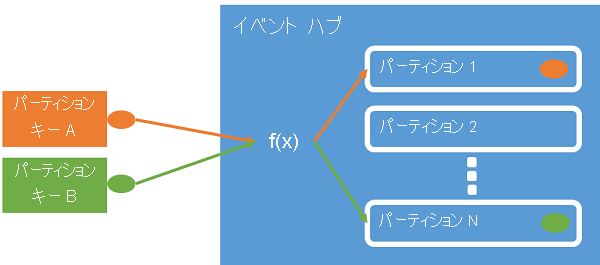
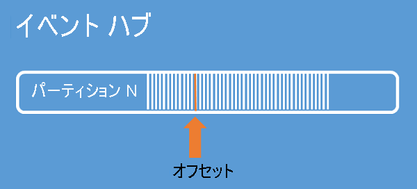

# <a name="features-and-terminology-in-azure-event-hubs"></a>Azure Event Hubs の機能と用語

Azure Event Hubs は、大量のイベントやデータを取り込んで処理するスケーラブルなイベント処理サービスで、短い待機時間と高い信頼性を実現します。 概要については、「[Event Hubs とは](./event-hubs-about.md)」を参照してください。

[概要記事](./event-hubs-about.md)内の情報に基づいて作成されたこの記事では、Event Hubs のコンポーネントと機能に関する実装の技術的な詳細を説明します。

> [!TIP]
> [**Apache Kafka** クライアント (バージョン 1.0 以降) のプロトコル サポート](event-hubs-for-kafka-ecosystem-overview.md)により、任意のクライアントで Apache Kafka を使用するように構築されたアプリケーションで、Event Hubs を使用できるようにするネットワーク エンドポイントが提供されます。 既存の Kafka アプリケーションのほとんどは、Kafka クラスターのブートストラップ サーバーではなく、イベント ハブの名前空間を指すように簡単に再構成できます。 
>
>コスト、運用の作業量、信頼性の観点から見ると、Azure Event Hubs は、独自の Kafka および Zookeeper クラスターをデプロイして運用したり、Azure にネイティブではないサービスとしての Kafka を提供したりすることに代わる優れた手段です。 
>
> Apache Kafka ブローカーと同じコア機能を利用できるだけでなく、Azure Event Hub の機能にアクセスすることもできます。これには、[Event Hubs Capture](event-hubs-capture-overview.md) 経由の自動のバッチ処理とアーカイブ、自動のスケーリングと分散、ディザスター リカバリー、コストに依存しない可用性ゾーンのサポート、柔軟で安全なネットワーク統合、ファイアウォールに適した WebSocket 経由の AMQP プロトコルを含むマルチプロトコル サポートなどがあります。


## <a name="namespace"></a>名前空間
Event Hubs 名前空間は、DNS 統合ネットワーク エンドポイントと、アクセス制御およびネットワーク統合管理機能 ([IP フィルタリング](event-hubs-ip-filtering.md)、[仮想ネットワーク サービス エンドポイント](event-hubs-service-endpoints.md)、[Private Link](private-link-service.md) など) を提供します。また、複数のイベント ハブ インスタンス (または Kafka 用語ではトピック) の管理コンテナーです。

## <a name="event-publishers"></a>イベント発行元

イベント ハブにデータを送信するエンティティは、"*イベント発行元*" ("*イベント プロデューサー*" と同義) です。 イベント発行元は、HTTPS、AMQP 1.0、または Kafka プロトコルを使用してイベントを発行できます。 イベント発行元は、OAuth2 で発行された JWT トークンか、イベント ハブ固有の Shared Access Signature (SAS) トークンによる Azure Active Directory ベースの承認を使用して、発行アクセス権を取得します。

### <a name="publishing-an-event"></a>イベントの発行

AMQP 1.0、Kafka プロトコル、または HTTPS 経由でイベントを発行できます。 Event Hubs サービスは、イベント ハブにイベントを発行するための [REST API](/rest/api/eventhub/) と [.NET](event-hubs-dotnet-standard-getstarted-send.md)、[Java](event-hubs-java-get-started-send.md)、[Python](event-hubs-python-get-started-send.md)、[JavaScript](event-hubs-node-get-started-send.md)、[Go](event-hubs-go-get-started-send.md) の各クライアント ライブラリを備えています。 その他のランタイムとプラットフォームには、 [Apache Qpid](https://qpid.apache.org/)などの任意の AMQP 1.0 クライアントを使用できます。 

AMQP または HTTPS のどちらを使用するかは、使用シナリオによって決まります。 AMQP では、トランスポート レベルのセキュリティ (TLS) または SSL/TLS に加えて、永続的な双方向ソケットを確立する必要があります。 AMQP ではセッション初期化時のネットワーク コストが高くなりますが、HTTPS では要求ごとに追加の TLS オーバーヘッドが必要になります。 AMQP は、頻度の高い発行元に対して非常に高いパフォーマンスを備えており、非同期発行コードと共に使用すると、はるかに短い待機時間を実現できます。

イベントは、個別に発行することもバッチ処理することもできます。 単一イベントまたはバッチのどちらであるかに関係なく、単一パブリケーションには 1 MB の制限があります。 このしきい値を超えるイベントの発行は拒否されます。 

Event Hubs のスループットは、パーティションとスループット ユニットの割り当てを使用してスケーリングされます (以下を参照)。 発行元が、イベント ハブ用に選択された特定のパーティション分割モデルを認識しないままでいること、および、関連するイベントを同じパーティションに一貫して割り当てるために使用される *パーティション キー* のみを指定することがベスト プラクティスです。



Event Hubs によって、1 つのパーティション キー値を共有するすべてのイベントが一緒に格納され、到着順に配信されます。 パーティション キーと発行元ポリシーを併用する場合は、発行元の ID とパーティション キーの値が一致する必要があります。 そうでない場合、エラーが発生します。

### <a name="event-retention"></a>イベント保持

発行されたイベントは、構成可能な時間ベースの保持ポリシーに基づいて、イベント ハブから削除されます。 重要な点がいくつかあります。

- **既定** 値および指定可能な **最小** 保持期間は **1 日 (24 時間)** です。
- Event Hubs **Standard** の場合、最大保持期間は **7 日** です。 
- Event Hubs **Dedicated** の場合、最大保持期間は **90 日** です。
- 保持期間を変更すると、既にイベント ハブ内にあるメッセージを含むすべてのメッセージに適用されます。 

Event Hubs は構成された期間にわたりイベントを保持します。これは、すべてのパーティションに適用されます。 保持期間が経過するとイベントは自動的に削除されます。 保持期間を 1 日に指定すると、イベントは、その受領からちょうど 24 時間で利用できなくなります。 イベントを明示的に削除することはできません。 

保持期間の上限を超えてイベントをアーカイブする必要がある場合、[Event Hubs Capture 機能を有効にして Azure Storage または Azure Data Lake にそれらを自動的に格納](event-hubs-capture-overview.md)することができます。また、そのような大量のアーカイブを検索したり分析したりする必要がある場合は、[それらを Azure Synapse に簡単にインポート](store-captured-data-data-warehouse.md)することができます。他の同様のストアや分析プラットフォームにインポートすることも可能です。 

Event Hubs でデータの保持期間に上限を設けている理由は、タイムスタンプによってのみインデックスされ、順次アクセスしかできない大きなストアに、過去に発生した大量のカスタマー データが無造作に取り込まれるのを避けるためです。 履歴データには、Event Hubs や Kafka が提供するリアルタイムのイベント処理インターフェイスよりも高度なインデックス処理と直接アクセスが必要であるという思想の下に設計されています。 イベント ソーシングの長期的アーカイブやデータ レイク用途には、イベント ストリーム エンジンは適しません。 
 

> [!NOTE]
> Event Hubs はリアルタイムのイベント ストリーム エンジンであるため、データベースや、無期限に保持されるイベント ストリームの永続的なストアの代わりとして使用されるように設計されていません。 
> 
> イベント ストリームの履歴が多いほど、特定のストリームの特定の履歴スライスを見つけるために多くの補助インデックスが必要になります。 イベント ペイロードとインデックスの検査は、Event Hubs (または Apache Kafka) の機能の範囲にはありません。 したがって、データベースや、[Azure Data Lake Store](../data-lake-store/data-lake-store-overview.md)、[Azure Data Lake Analytics](../data-lake-analytics/data-lake-analytics-overview.md)、[Azure Synapse](../synapse-analytics/overview-what-is.md) などの専用の分析ストアおよびエンジンの方が、履歴イベントの保存にはずっと適しています。
>
> [Event Hubs Capture](event-hubs-capture-overview.md) は Azure Blob Storage および Azure Data Lake Storage に直接統合されており、その統合を通じて[イベントを Azure Synapse に直接フローさせる](store-captured-data-data-warehouse.md)ことができます。
>
> アプリケーションの[イベント ソーシング](/azure/architecture/patterns/event-sourcing) パターンを使用する場合は、スナップショット戦略を Event Hubs の保持期間の制限に合わせる必要があります。 期間の開始時点からのすべての未加工イベントで、具体化されたビューを再構築しようとしないでください。 そのような戦略は、アプリケーションをしばらく本稼働させて十分に使用した後、プロジェクション ビルダーが、最新および継続中の変更に追い付こうとしながら数年分の変更イベントを使用しなければならなくなった場合に必ず後悔するようになります。 


### <a name="publisher-policy"></a>発行元ポリシー

Event Hubs では、 *発行元ポリシー* を介してイベント プロデューサーをきめ細かく制御できます。 発行元ポリシーは、多数の独立したイベント発行元を支援するために設計されたランタイム機能です。 発行元ポリシーでは、次のメカニズムを使用してイベント ハブにイベントを発行する際に、各発行元は独自の一意の識別子を使用します。

```http
//<my namespace>.servicebus.windows.net/<event hub name>/publishers/<my publisher name>
```

前もって発行元名を作成しておく必要はありませんが、独立した発行元 ID を保証するために、発行元名はイベントを発行するときに使用される SAS トークンと一致する必要があります。 発行元ポリシーを使用する場合は、 **PartitionKey** 値を発行元名に設定します。 適切に機能するために、これらの値が一致する必要があります。

## <a name="capture"></a>キャプチャ

[Event Hubs Capture](event-hubs-capture-overview.md) では、Event Hubs のストリーミング データを自動でキャプチャし、任意の BLOB ストレージ アカウントまたは Azure Data Lake Service アカウントのいずれかに保存することができます。 Azure Portal から Capture を有効にし、キャプチャを実行する最小サイズと時間枠を指定できます。 Event Hubs Capture を使用すると、キャプチャされたデータを格納するための独自の Azure Blob Storage アカウントとコンテナーまたは Azure Data Lake Service アカウントを指定することができます。 キャプチャされたデータは、Apache Avro 形式で書き込まれます。

## <a name="partitions"></a>メジャー グループ
[!INCLUDE [event-hubs-partitions](../../includes/event-hubs-partitions.md)]


## <a name="sas-tokens"></a>SAS トークン

Event Hubs は、名前空間とイベント ハブのレベルで利用可能な *Shared Access Signature* を使用します。 SAS トークンは、SAS キーから生成されるものであり、特定の形式でエンコードされた URL の SHA ハッシュです。 Event Hubs は、キー (ポリシー) の名前とトークンを使用することで、ハッシュを再生成し、送信者を認証できます。 通常、イベント発行元の SAS トークンは特定のイベント ハブへの **送信** 特権のみを付加して作成されます。 この SAS トークン URL のメカニズムは、発行元ポリシーに導入された発行元識別のための基盤です。 SAS を使用する方法の詳細については、「[Service Bus による Shared Access Signature 認証](../service-bus-messaging/service-bus-sas.md)」を参照してください。

## <a name="event-consumers"></a>イベント コンシューマー

イベント ハブからイベント データを読み取るエンティティは、いずれも "*イベント コンシューマー*" です。 Event Hubs のすべてのコンシューマーは AMQP 1.0 セッションを介して接続します。イベントは使用可能になると、このセッションを使用して配信されます。 クライアントがデータの可用性をポーリングする必要はありません。

### <a name="consumer-groups"></a>コンシューマー グループ

Event Hubs の発行/サブスクライブのメカニズムは、"*コンシューマー グループ*" によって有効になります。 コンシューマー グループは、イベント ハブ全体のビュー (状態、位置、またはオフセット) を表します。 コンシューマー グループを使用することにより、複数のコンシューマー アプリケーションは、イベント ストリームの個別のビューをそれぞれ保有し、独自のペースで独自のオフセットによってストリームを別々に読み取ることができます。

ストリーム処理アーキテクチャにおいて、各ダウンストリーム アプリケーションはコンシューマー グループに相当します。 (パーティションからさらに) 長期的なストレージにイベント データを書き込む場合、そのストレージ ライター アプリケーションはコンシューマー グループとなります。 複雑なイベント処理は、別の異なるコンシューマー グループで実行できます。 パーティションにはコンシューマー グループを介してのみアクセスできます。 イベント ハブには既定のコンシューマー グループが常に存在します。Standard レベルのイベント ハブに対して最大 20 個のコンシューマー グループを作成できます。

コンシューマー グループ内の 1 つのパーティションが同時に接続できるリーダーは最大 5 つですが、**コンシューマー グループごとのパーティションのアクティブな受信者は 1 つだけにすることをお勧めします**。 1 つのパーティション内で、各リーダーがすべてのメッセージを受信します。 同じパーティションに複数のリーダーがある場合、重複したメッセージを処理します。 お使いのコード内でこれを処理する必要があり、相応の作業量が生じる場合があります。 ただし、これは一部のシナリオで有効な手法です。

Azure SDK によって提供される一部のクライアントはインテリジェントなコンシューマー エージェントです。これは、各パーティションに 1 つのリーダーがあり、イベント ハブのすべてのパーティションが読み取られていることを確認するための詳細を自動的に管理します。 これにより、コードではイベント ハブから読み取られるイベントの処理に注力できるため、パーティションの詳細の多くを無視できます。 詳細については、「[パーティションに接続する](#connect-to-a-partition)」を参照してください。

コンシューマー グループ URI 表記の例を次に示します。

```http
//<my namespace>.servicebus.windows.net/<event hub name>/<Consumer Group #1>
//<my namespace>.servicebus.windows.net/<event hub name>/<Consumer Group #2>
```

次の図は、Event Hubs ストリーム処理のアーキテクチャを示しています。


### <a name="stream-offsets"></a>ストリームのオフセット

"*オフセット*" は、パーティション内のイベントの位置です。 オフセットは、クライアント側のカーソルと考えることができます。 オフセットはイベントのバイト位置です。 このオフセットにより、イベント コンシューマー (リーダー) は、イベント ストリーム内でのイベント読み取りの開始点を指定することができます。 オフセットは、タイムスタンプとして、またはオフセット値として指定することができます。 Event Hubs サービスの外部で独自のオフセット値を格納する場合は、コンシューマーの責任で行います。 パーティション内では、各イベントにオフセットが含まれます。



### <a name="checkpointing"></a>チェックポイント機能

"*チェックポイント処理*" とは、リーダーがパーティションにおけるイベント シーケンス内の位置をマークまたはコミットするために使用する処理です。 チェックポイント処理はコンシューマーの責任で行います。この処理はコンシューマー グループ内でパーティションごとに発生します。 つまり、コンシューマー グループごとに、各パーティション リーダーは、イベント ストリーム内でのその現在の位置を追跡する必要があり、データ ストリームが完了したと見なしたときにサービスに通知することができます。

リーダーがパーティションから切断し、その後再び接続すると、該当するコンシューマー グループ内の該当するパーティションの最後のリーダーによって最後に送信されたチェックポイントから読み取りが開始されます。 リーダーは接続の際に、このオフセットをイベント ハブに渡して、読み取りを開始する場所を指定します。 このように、チェックポイント処理を使用することで、ダウンストリーム アプリケーションごとにイベントに "完了" のマークを付けると共に、異なるコンピューター上で実行中のリーダー間でフェールオーバーが発生した場合に回復性をもたらすことができます。 このチェックポイント処理で、より小さなオフセットを指定すると、古いデータに戻ることができます。 このメカニズムにより、チェックポイント処理ではフェールオーバーの回復性とイベント ストリームの再生の両方を実現できます。

> [!IMPORTANT]
> オフセットは、Event Hubs サービスによって提供されます。 イベントが処理されるときにチェックポイント処理を行うのは、コンシューマーの役割です。

> [!NOTE]
> Azure で一般公開されているものとは異なるバージョンの Storage Blob SDK をサポートする環境で、チェックポイント ストアとして Azure Blob Storage を使用している場合は、コードを使用して、Storage Service API バージョンをその環境でサポートされている特定のバージョンに変更する必要があります。 たとえば、[Azure Stack Hub バージョン 2002 上で Event Hubs](/azure-stack/user/event-hubs-overview) を実行している場合、Storage Service で利用可能な最も高いバージョンは 2017-11-09 です。 この場合は、コードを使用して、対象にする Storage Service API のバージョンを 2017-11-09 にする必要があります。 特定の Storage API バージョンを対象にする方法の例については、GitHub の次のサンプルを参照してください。 
> - [.NET](https://github.com/Azure/azure-sdk-for-net/tree/master/sdk/eventhub/Azure.Messaging.EventHubs.Processor/samples/) 
> - [Java](https://github.com/Azure/azure-sdk-for-java/blob/master/sdk/eventhubs/azure-messaging-eventhubs-checkpointstore-blob/src/samples/java/com/azure/messaging/eventhubs/checkpointstore/blob/)
> - [JavaScript](https://github.com/Azure/azure-sdk-for-js/blob/master/sdk/eventhub/eventhubs-checkpointstore-blob/samples/javascript) または [TypeScript](https://github.com/Azure/azure-sdk-for-js/blob/master/sdk/eventhub/eventhubs-checkpointstore-blob/samples/typescript)
> - [Python](https://github.com/Azure/azure-sdk-for-python/blob/master/sdk/eventhub/azure-eventhub-checkpointstoreblob-aio/samples/)

### <a name="common-consumer-tasks"></a>一般的なコンシューマー タスク

すべての Event Hubs コンシューマーは、AMQP 1.0 セッション (状態に対応する双方向の通信チャネル) を介して接続します。 各パーティションには、パーティションによって分離されたイベントの転送を容易にする AMQP 1.0 セッションがあります。

#### <a name="connect-to-a-partition"></a>パーティションに接続する

パーティションに接続する場合は、特定のパーティションへのリーダーの接続を調整するためにリース メカニズムを使用するのが一般的です。 このため、コンシューマー グループ内のどのパーティションもアクティブなリーダーが 1 つだけである可能性があります。 チェックポイント処理、リース、およびリーダーの管理は、インテリジェントなコンシューマー エージェントとして機能する Event Hubs SDK 内のクライアントを使用して簡略化されます。 次のとおりです。

- .NET 用 [EventProcessorClient](/dotnet/api/azure.messaging.eventhubs.eventprocessorclient)
- Java 用 [EventProcessorClient](https://github.com/Azure/azure-sdk-for-java/blob/master/sdk/eventhubs/azure-messaging-eventhubs/src/main/java/com/azure/messaging/eventhubs/EventProcessorClient.java)
- Python 用 [EventHubConsumerClient](/python/api/azure-eventhub/azure.eventhub.aio.eventhubconsumerclient)
- JavaScript/TypeScript 用 [EventHubConsumerClient](/javascript/api/@azure/event-hubs/eventhubconsumerclient)

#### <a name="read-events"></a>イベントを読み取る

特定のパーティションに対して AMQP 1.0 のセッションおよびリンクが開かれると、Event Hubs サービスによってイベントが AMQP 1.0 クライアントに配信されます。 この配信メカニズムでは、HTTP GET などのプル ベースのメカニズムよりも高いスループットおよび短い遅延時間を実現します。 イベントがクライアントに送信されるとき、イベント データの各インスタンスには、イベント シーケンスでのチェックポイント処理を容易にするために使用されるオフセットやシーケンス番号などの重要なメタデータが含まれます。

イベント データ:
* Offset
* Sequence number
* Body
* ユーザー プロパティ
* システム プロパティ

ユーザーはオフセットを管理する必要があります。

## <a name="next-steps"></a>次のステップ

Event Hubs の詳細については、次のリンクを参照してください。

- Event Hubs の使用
    - [.NET](event-hubs-dotnet-standard-getstarted-send.md)
    - [Java](event-hubs-java-get-started-send.md)
    - [Python](event-hubs-python-get-started-send.md)
    - [JavaScript](event-hubs-node-get-started-send.md)
* [Event Hubs のプログラミング ガイド](event-hubs-programming-guide.md)
* [Event Hubs における可用性と一貫性](event-hubs-availability-and-consistency.md)
* [Event Hubs の FAQ](event-hubs-faq.yml)
* [Event Hubs サンプル](event-hubs-samples.md)
