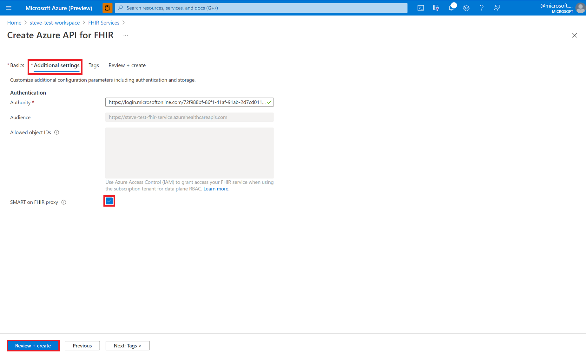

# Azure Healthcare API 内に FHIR サービスをデプロイする - ポータルを使用する

> [!IMPORTANT]
> Azure Healthcare APIs は現在プレビュー段階です。 ベータ版、プレビュー版、または一般提供としてまだリリースされていない Azure の機能に適用されるその他の法律条項については、「[Microsoft Azure プレビューの追加使用条件](https://azure.microsoft.com/support/legal/preview-supplemental-terms/)」に記載されています。

この記事では、Azure Healthcare API (ここでは FHIR サービスと呼ばれる) 内に、Azure portal を使用して FHIR サービスをデプロイする方法について説明します。

## 前提条件

開始する前に、Azure Healthcare API を既にデプロイしている必要があります。 Azure Healthcare API のデプロイの詳細については、「Azure Healthcare API のデプロイ」を参照[Azure portal。](../healthcare-apis-quickstart.md)

## 新しい FHIR サービスを作成する

ワークスペースから **[Deploy FHIR Services]を選択します**。

[+ **Add FHIR Service]を選択します**。

FHIR **サービスのアカウント** 名を入力します。 **FHIR** バージョン (**STU3** または **R4**) を選択し、 [確認および作成 **] を選択します**。

[作成] **を選択する** 前に、FHIR **サービスの** [基本] **と** [追加設定] のプロパティを確認します。 戻って変更を加える必要がある場合は、 [前へ] を **選択します**。 [検証の成功 **] メッセージが** 表示されます。 

## 追加の設定 (オプション)

[追加設定] タブ **を選択して** 、認証設定を表示することもできます。 Azure API for FHIR の既定の構成では、**データ プレーン ロールの割り当てに Azure RBAC が使用されます**。 このモードで構成されている場合、FHIR サービスの "機関" は、サブスクリプションの Azure Active Directory テナントに設定されます。

[許可されたオブジェクトの **ID] を** 入力するボックスがグレー表示されているのに注意してください。これは、この場合のロールの割り当てを構成するために Azure RBAC を使用する理由です。

外部またはセカンダリの Azure Active Directory テナントを使用するように FHIR サービスを構成する場合は、オーソリティを変更し、サーバーへのアクセスを許可するユーザーおよびグループのオブジェクト ID を入力します。

## FHIR API の機能ステートメントをフェッチする

新しい FHIR API アカウントがプロビジョニングされているのを検証するには、 を参照して機能ステートメントをフェッチします `https://<WORKSPACE NAME>-<ACCOUNT-NAME>.fhir.azurehealthcareapis.com/metadata` 。

## 次の手順

>[!div class="nextstepaction"]
>[Postman を使用して FHIR サービスにアクセスする](../use-postman.md)

