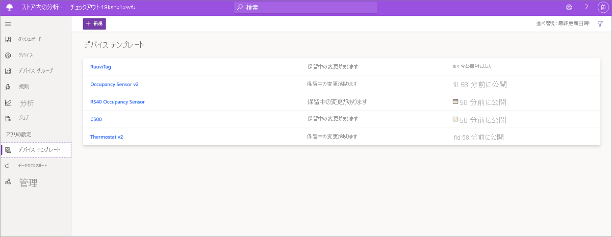
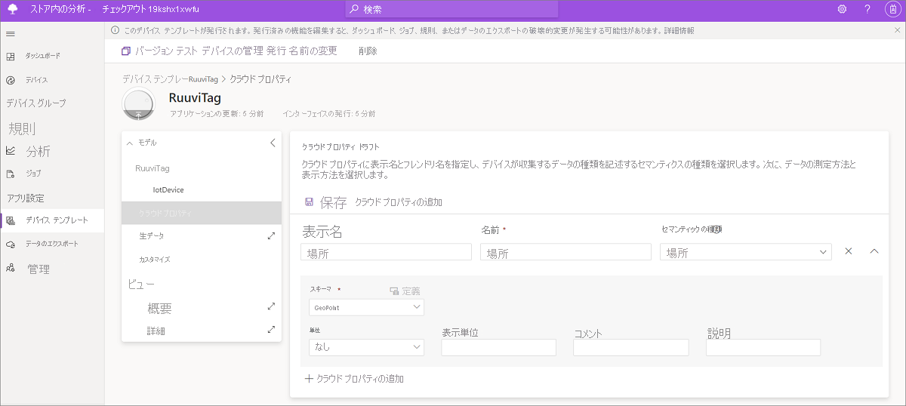
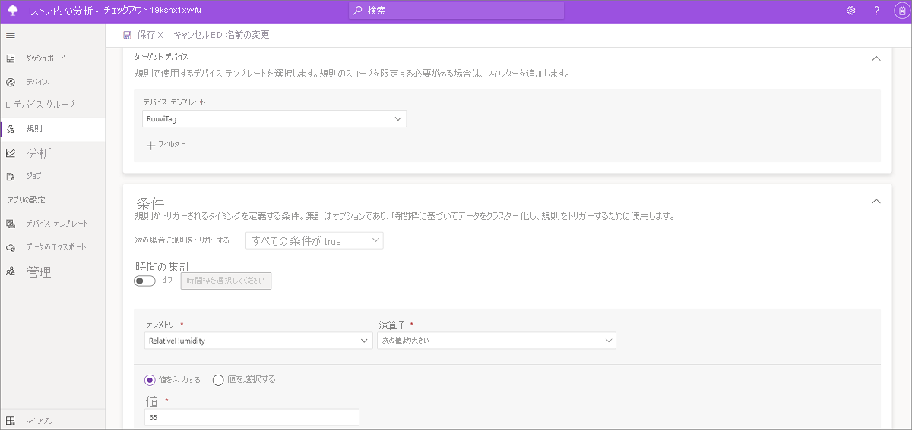
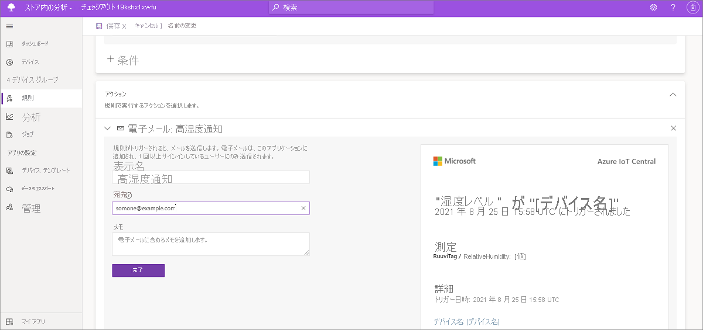

# チュートリアル:Azure IoT Central でストア内分析アプリケーションを作成する

チュートリアルでは、Azure IoT Central のストア内分析アプリケーションを作成する方法をソリューション ビルダーに説明します。 サンプル アプリケーションは小売店用です。 これは、利用状況と環境条件を監視して適応するという一般的なビジネス ニーズに対するソリューションです。

作成するサンプル アプリケーションには、3 つの実際のデバイス (1 つの Rigado Cascade 500 ゲートウェイと 2 つの RuuviTag センサー) が含まれます。 チュートリアルでは、アプリケーション テンプレートに含まれるシミュレートされた人感センサーをテスト目的で使用する方法についても説明します。 Rigado C500 ゲートウェイは、アプリケーション内で通信ハブとして機能します。 これにより、ストア内のセンサーと通信し、クラウドへの接続を管理します。 RuuviTag は、温度、湿度、圧力などのテレメトリを提供する環境センサーです。 シミュレートされた人感センサーでは、ストアのチェックアウト エリア内での動きと存在を追跡する手段が提供されます。 

このチュートリアルには、Rigado デバイスと RuuviTag デバイスをアプリケーションに接続するための手順が含まれています。 別のゲートウェイとセンサーがある場合でも、その手順に従ってアプリケーションを作成できます。 チュートリアルでは、シミュレートされた RuuviTag センサーを作成する方法についても説明しています。 シミュレートされたセンサーを使用すると、実際のデバイスがない場合でもアプリケーションを作成できます。 

次の 3 つのパートで、チェックアウトと条件の監視ソリューションを開発します。

* アプリケーションを作成し、デバイスを接続して条件を監視する
* オペレーターがデバイスを監視および管理できるようにダッシュボードをカスタマイズする
* データのエクスポートを構成して、ストア マネージャーが分析を実行し、分析情報を視覚化できるようにする

このチュートリアルでは、以下の内容を学習します。
> [!div class="checklist"]
> * Azure IoT Central の **In-store analytics - checkout** テンプレートを使用して小売店アプリケーションを作成する
> * アプリケーションの設定をカスタマイズする
> * IoT デバイス テンプレートを作成およびカスタマイズする
> * デバイスをアプリケーションに接続する
> * 条件を監視するためのルールとアクションを追加する

## 前提条件

このチュートリアル シリーズを完了するには、以下が必要です。
* Azure サブスクリプションをお勧めします。 必要に応じて、7 日間無料の試用版を使用することもできます。 Azure サブスクリプションがない場合は、[Azure サインアップ ページ](https://aka.ms/createazuresubscription)で作成できます。
* ゲートウェイ デバイスと 2 つの環境センサーへのアクセス (チュートリアルで説明するように、必要に応じてシミュレートされたデバイスを使用できます)
* 使用するデバイスのデバイス テンプレート (このチュートリアルで使用するすべてのデバイス用のテンプレートが用意されています)

## アプリケーションの作成
このセクションでは、テンプレートから新しい Azure IoT Central アプリケーションを作成します。 チュートリアル シリーズ全体でこのアプリケーションを使用して、完全なソリューションを構築します。

新しい Azure IoT Central アプリケーションを作成するには:

1. [Azure IoT Central のアプリケーション マネージャー](https://aka.ms/iotcentral) Web サイトに移動します。

1. Azure サブスクリプションを持っている場合は、そのサブスクリプションへのアクセス用の資格情報を使用してサインインします。持っていない場合は、Microsoft アカウントを使用してサインインします。

    

1. 新しい Azure IoT Central アプリケーションの作成を開始するには、 **[New Application]\(新しいアプリケーション\)** を選択します。

1. **[小売]** を選択します。  小売ページに、いくつかの小売アプリケーション テンプレートが表示されます。

新しいストア内分析チェックアウト アプリケーションを作成するには:  

1. **In-store analytics - checkout** アプリケーション テンプレートを選択します。 このテンプレートには、RuuviTag センサーを除き、チュートリアルで使用するすべてのデバイス用のデバイス テンプレートが含まれています。 テンプレートには、チェックアウトと環境の条件、およびデバイスの状態を監視するためのオペレーター ダッシュボードも用意されています。 

1. 必要に応じて、わかりやすい **アプリケーション名** を選びます。 このアプリケーションは、Contoso という架空の小売店に基づいています。 このチュートリアルでは、*Contoso checkout* という **アプリケーション名** を使用します。 アプリケーション テンプレートは、Northwind という架空の会社に基づいています。 このチュートリアルでは、Contoso を使用して、アプリケーションをカスタマイズする方法を学習します。

    > [!NOTE]
    > わかりやすい **アプリケーション名** を使用する場合でも、アプリケーションの **URL** には一意の値を使用する必要があります。

1. Azure サブスクリプションをお持ちの場合は、"*ディレクトリ、Azure サブスクリプション、リージョン*" を入力します。 サブスクリプションをお持ちでない場合は、**7 日間の無料試用版** を有効にし、必須の連絡先情報を入力できます。  

    ディレクトリとサブスクリプションの詳細については、[アプリケーションの作成のクイック スタート](../core/quick-deploy-iot-central.md)に関するページを参照してください。

1. **［作成］** を選択します

    ![Azure IoT Central の [Create Application]\(アプリケーションの作成\) ページ](./media/tutorial-in-store-analytics-create-app/preview-application-template.png)

    

## アプリケーションの設定をカスタマイズする

ビルダーとして、いくつかの設定を変更して、アプリケーションでのユーザー エクスペリエンスをカスタマイズできます。 このセクションでは、定義済みのアプリケーション テーマを選択します。 必要に応じて、カスタム テーマを作成し、アプリケーション イメージを更新する方法も学習します。 カスタム テーマを使用すると、アプリケーション ブラウザーの色、ブラウザーのアイコン、およびマストヘッドに表示されるアプリケーション ロゴを設定できます。

定義済みのアプリケーション テーマを選択するには:

1. マストヘッドにある **[設定]** を選択します。

    

2. 新しい **[テーマ]** を選択します。

3. **[保存]** を選択します。

定義済みのテーマを使用する代わりに、カスタム テーマを作成することができます。 サンプル イメージのセットを使用してアプリケーションをカスタマイズし、チュートリアルを完了するには、[Contoso サンプル イメージ](https://github.com/Azure-Samples/iot-central-docs-samples/tree/master/retail)をダウンロードします。

カスタム テーマを作成するには:

1. まだ展開されていない場合は、左側のウィンドウを展開します。

    

1. **[管理] > [アプリケーションのカスタマイズ]** を選択します。

1. **[変更]** ボタンを使用して、**アプリケーション ロゴ** としてアップロードするイメージを選択します。 必要に応じて、 **[ロゴの代替テキスト]** の値を指定します。 

1. **[変更]** ボタンを使用して、ブラウザーのタブに表示される **ブラウザー アイコン** イメージを選択します。

1. 必要に応じて、HTML 16 進数のカラー コードを追加して、既定の **[ブラウザーの色]** を置き換えます。 **[ヘッダー]** には、 *#008575* を追加します。  **[アクセント]** には、 *#A1F3EA* を追加します。 

1. **[保存]** を選択します。 

    

    保存した後、アプリケーションによってブラウザーの色、マストヘッド内のロゴ、ブラウザー アイコンが更新されます。 

    

アプリケーション イメージを更新するには:

1. **[管理] > [アプリケーションの設定]** を選択します。

1. **[画像の選択]** ボタンを使用して、アプリケーション イメージとしてアップロードするイメージを選択します。 このイメージは、IoT Central アプリケーション マネージャーの **[マイ アプリ]** ページのアプリケーション タイルに表示されます。

1. **[保存]** を選択します。

1. 必要に応じて、[Azure IoT Central のアプリケーション マネージャー](https://aka.ms/iotcentral) Web サイト上の **[マイ アプリ]** ビューに移動します。 アプリケーション タイルに、更新されたアプリケーション イメージが表示されます。

    

## デバイス テンプレートを作成する
ビルダーとして、ご自身やアプリケーション オペレーターがデバイスを構成および管理できるようにするデバイス テンプレートを作成できます。 テンプレートを作成するには、カスタム テンプレートを作成するか、既存のテンプレート ファイルをインポートするか、Azure IoT デバイス カタログからテンプレートをインポートします。 デバイス テンプレートを作成し、カスタマイズしたら、それを使用して実際のデバイスをご自身のアプリケーションに接続します。 必要に応じて、デバイス テンプレートを使用して、テスト用のシミュレートされたデバイスを生成します。

**In-store analytics - checkout** アプリケーション テンプレートには、複数のデバイス用のデバイス テンプレートがあります。  アプリケーションで使用する 3 つのデバイスのうち 2 つにデバイス テンプレートがあります。 RuuviTag デバイス テンプレートは、**In-store analytics - checkout** アプリケーション テンプレートに含まれていません。 このセクションでは、RuuviTag センサー用のデバイス テンプレートをアプリケーションに追加します。

RuuviTag デバイス テンプレートをアプリケーションに追加するには:

1. 左側のウィンドウで **[デバイス テンプレート]** を選択します。

1. **[+ 新規]** を選択して新しいデバイス テンプレートを作成します。

1. Azure IoT デバイス カタログ内で **RuuviTag** センサー デバイス テンプレートを探して選択します。 

1. **カスタマイズ** を選択します。

    ![[Next: Customize]\(次へ: カスタマイズ\) ボタンが強調表示されているスクリーンショット。](./media/tutorial-in-store-analytics-create-app/ruuvitag-device-template.png)

1. **［作成］** を選択します アプリケーションによって、RuuviTag デバイス テンプレートが追加されます。

1. 左側のウィンドウで **[デバイス テンプレート]** を選択します。 このページには、アプリケーション テンプレートに含まれるすべてのデバイス テンプレートと、追加した RuuviTag デバイス テンプレートが表示されます。

    

## デバイス テンプレートのカスタマイズ
アプリケーションでデバイス テンプレートをカスタマイズするには、3 つの方法があります。 まず、デバイスの機能を変更して、デバイス内のネイティブ組み込みインターフェイスをカスタマイズします。 たとえば、温度センサーでは、温度インターフェイスの表示名、データ型、測定単位、最小と最大の動作範囲などの詳細を変更できます。 

第 2 に、クラウドのプロパティを追加することでデバイス テンプレートをカスタマイズします。 クラウドのプロパティは、組み込みのデバイス機能の一部ではありません。 クラウドのプロパティは、Azure IoT Central アプリケーションがデバイスに対して作成、格納、関連付けを行うカスタム データです。 クラウド プロパティの例としては、計算値や、一連のデバイスに関連付ける場所などのメタデータがあります。 

第 3 に、カスタム ビューを作成することでデバイス テンプレートをカスタマイズします。 ビューでは、デバイスのメトリックや正常性など、デバイスのテレメトリとメタデータをオペレーターが視覚化する手段が提供されます。

ここでは、最初の 2 つの方法を使用して、RuuviTag センサー用のデバイス テンプレートをカスタマイズします。 センサーのビューの作成について詳しくは、「[シミュレートされたデバイスを IoT Central アプリケーションに追加する](../core/quick-create-simulated-device.md)」のクイックスタートを参照してください。

RuuviTag デバイス テンプレートの組み込みインターフェイスをカスタマイズするには:

1. 左側のウィンドウで **[デバイス テンプレート]** を選択します。 

1. RuuviTag センサー用のテンプレートを選択します。 

1. 左側のウィンドウを非表示にします。 テンプレートの [概要] ビューには、デバイスの機能が表示されます。

    ![Azure IoT Central RuuviTag デバイス テンプレートの [概要] ビュー](./media/tutorial-in-store-analytics-create-app/ruuvitag-device-summary-view.png)

1. RuuviTag デバイス テンプレート メニューの **[カスタマイズ]** を選択します。 

1. 機能の一覧をスクロールし、テレメトリの種類 `humidity` を見つけます。 これは、*humidity* という編集可能な **[表示名]** 値を含む行アイテムです。

以下の手順では、RuuviTag センサーのテレメトリの種類 `humidity` をカスタマイズします。 必要に応じて、他のテレメトリの種類の一部をカスタマイズします。

テレメトリの種類 `humidity` について、次の変更を行います。

1. **[展開]** コントロールを選択して、その行のスキーマ詳細を展開します。

1. **[表示名]** の値を *humidity* から *Relative humidity* などのカスタム値に更新します。

1. **[セマンティックの種類]** オプションを "*なし*" から *Humidity* に変更します。  必要に応じて、展開されたスキーマ ビュー内で humidity のテレメトリの種類のスキーマ値を設定します。 スキーマ設定により、センサーによって追跡されるデータの詳細な検証要件を作成できます。たとえば、特定のインターフェイスに対して、動作範囲の最小値と最大値を設定できます。

1. **[保存]** を選択して変更を保存します。

    ![[カスタマイズ] 画面が表示され、[保存] ボタンが強調表示されているスクリーンショット。](./media/tutorial-in-store-analytics-create-app/ruuvitag-device-template-customize.png)

アプリケーションのデバイス テンプレートにクラウド プロパティを追加するには:

1. RuuviTag デバイス テンプレート メニューの **[クラウドのプロパティ]** を選択します。

1. **[クラウド プロパティの追加]** を選択します。 

以下の値を指定して、各デバイスの場所を格納するカスタム プロパティを作成します。

1. **[表示名]** に *Location* という値を入力します。 この値は、プロパティのフレンドリ名である **[名前]** フィールドに自動的にコピーされます。 コピーした値を使用することも、値を変更することもできます。

1. **[スキーマ]** ドロップダウンで "*文字列*" を選択します。 文字列型を使用すると、場所名の文字列を、テンプレートに基づいた任意のデバイスに関連付けることができます。 たとえば、ストア内の領域を各デバイスに関連付けることができます。 必要に応じて、プロパティの **[セマンティックの種類]** を *Location* に設定できます。これにより、 **[スキーマ]** が *Geopoint* に自動的に設定されます。 これにより、GPS 座標をデバイスに関連付けることができます。 

1. **[最小の長さ]** を *2* に設定します。 

1. **[Trim Whitespace]\(空白のトリミング\)** を **On** に設定します。

1. **[保存]** を選択して、カスタム クラウド プロパティを保存します。

    

1. **[発行]** を選択します。 

    デバイス テンプレートを発行すると、アプリケーション オペレーターに表示されるようになります。 テンプレートを発行したら、それを使用して、テスト用のシミュレートされたデバイスを生成したり、実際のデバイスをアプリケーションに接続したりします。 アプリケーションに接続しているデバイスが既にある場合は、カスタマイズされたテンプレートを発行すると、変更がデバイスにプッシュされます。

## デバイスの追加
デバイス テンプレートを作成し、カスタマイズしたら、デバイスを追加します。 

このチュートリアルでは、次の実際のデバイスとシミュレートされたデバイスのセットを使用して、アプリケーションを作成します。
- 実際の Rigado C500 ゲートウェイ
- 2 つの実際の RuuviTag センサー
- シミュレートされた **人感** センサー。 シミュレートされたセンサーはアプリケーション テンプレートに含まれているため、作成する必要はありません。 

> [!NOTE]
> 実際のデバイスがない場合でも、シミュレートされた RuuviTag センサーを作成することによって、このチュートリアルを完了できます。 次に、シミュレートされた RuuviTag を作成する手順を示します。 シミュレートされたゲートウェイを作成する必要はありません。

次の 2 つの記事の手順を完了して、実際の Rigado ゲートウェイと RuuviTag センサーを接続します。 完了したら、このチュートリアルに戻ります。 このチュートリアルではデバイス テンプレートを既に作成しているため、次の一連の指示でもう一度作成する必要はありません。

- Rigado ゲートウェイを接続するには、[Azure IoT Central アプリケーションへの Rigado Cascade 500 の接続](../core/howto-connect-rigado-cascade-500.md)に関する記事を参照してください。
- RuuviTag センサーを接続するには、「[Azure IoT Central アプリケーションへの RuuviTag センサーの接続](../core/howto-connect-ruuvi.md)」を参照してください。 必要に応じて、これらの指示に従って 2 つのシミュレートされたセンサーを作成することもできます。

## ルールとアクションの追加
Azure IoT Central アプリケーション内でセンサーを使用して状態を監視することの一環として、特定の条件が満たされたときにアクションを実行するルールを作成できます。 ルールはデバイス テンプレートと 1 つまたは複数のデバイスに関連付けられており、デバイスのテレメトリまたはイベントに基づいて満たす必要がある条件が含まれています。 また、ルールには 1 つ以上のアクションが関連付けられています。 アクションには、メール通知の送信、または他のサービスにデータを送信するための Webhook アクションのトリガーが含まれる場合があります。 **In-store analytics - checkout** アプリケーション テンプレートには、アプリケーションのデバイス用の定義済みルールがいくつか含まれています。

このセクションでは、RuuviTag センサー テレメトリに基づいて最大の相対湿度レベルを確認する新しいルールを作成します。 湿度が最大値を超えた場合に、アプリケーションからメールが送信されるように、ルールにアクションを追加します。 

ルールを作成するには: 

1. 左側のウィンドウを展開します。

1. **[ルール]** を選択します。

1. **[+新規]** を選択します。

1. ルールの名前として *Humidity level* を入力します。 

1. **[スコープ]** で RuuviTag デバイス テンプレートを選択します。 定義したルールは、そのテンプレートに基づくすべてのセンサーに適用されます。 必要に応じて、定義されているセンサーのサブセットのみに規則を適用するフィルターを作成することもできます。 

1. **[テレメトリ]** として `Relative humidity` を選択します。 これは、前の手順でカスタマイズしたデバイス機能です。

1. **[演算子]** として `Is greater than` を選択します。 

1. **[値]** として、環境に対する室内湿度レベルの一般的な上限を入力します。 たとえば、「*65*」と入力します。 RuuviTag の実際のセンサーまたはシミュレートされたセンサーの相対湿度がこの値を超えると発生する条件をルールに設定しました。 環境内の通常の湿度範囲に応じて、値を上下に調整することが必要な場合があります。  

   

ルールにアクションを追加するには:

1. **[+ Email]\(+ メール\)** を選択します。 

1. アクションのわかりやすい **表示名** として「*High humidity notification*」を入力します。 

1. アカウントに関連付けられているメール アドレスを **[送信先]** に入力します。 別のメールを使用する場合、使用するアドレスは、アプリケーションに追加されているユーザーのアドレスである必要があります。 ユーザーは、少なくとも 1 回サインインしてサインアウトする必要もあります。

1. 必要に応じて、メールのテキストに含めるメモを入力します。

1. **[完了]** を選択して、アクションを完了します。

   

1. **[保存]** を選択して、新しいルールを保存してアクティブにします。 

    数分以内に、指定したメール アカウントでメールの受信が開始します。 湿度レベルが条件の値を超えたことがセンサーで示されるたびに、アプリケーションによってメールが送信されます。

## リソースをクリーンアップする

[!INCLUDE [iot-central-clean-up-resources](../../../includes/iot-central-clean-up-resources.md)]

## 次のステップ

このチュートリアルでは、以下の内容を学習しました。

* Azure IoT Central の **In-store analytics - checkout** テンプレートを使用して小売店アプリケーションを作成する
* アプリケーションの設定をカスタマイズする
* IoT デバイス テンプレートを作成およびカスタマイズする
* デバイスをアプリケーションに接続する
* 条件を監視するためのルールとアクションを追加する

ここでは、Azure IoT Central の条件監視アプリケーションを作成しました。推奨される次の手順は以下のとおりです。

> [!div class="nextstepaction"]
> [オペレーター ダッシュボードをカスタマイズする](./tutorial-in-store-analytics-customize-dashboard.md)
