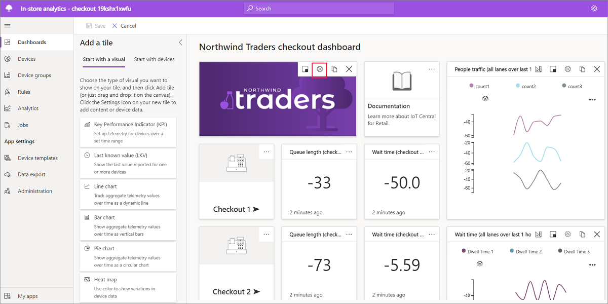
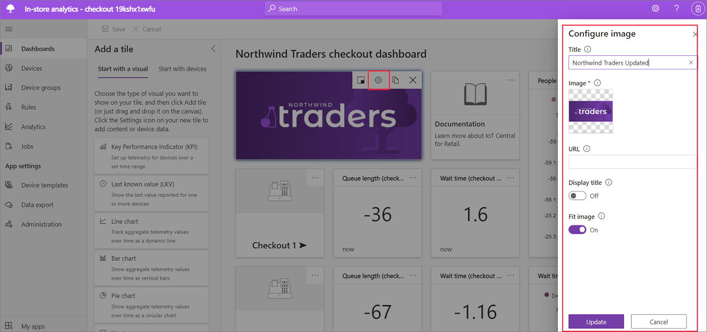
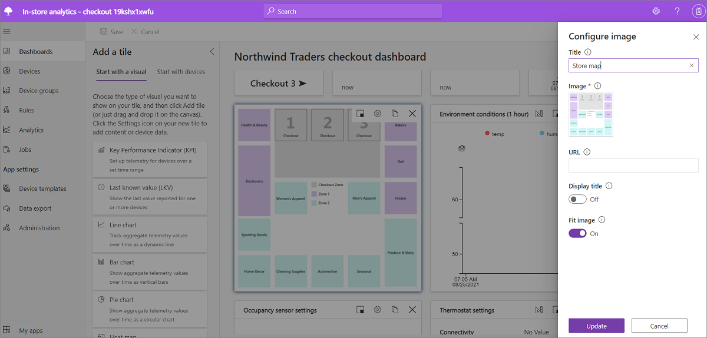
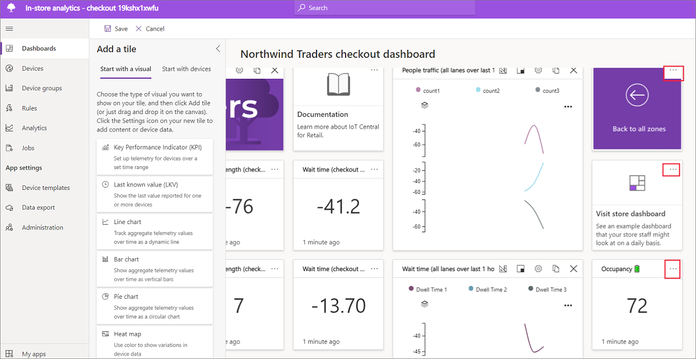

# チュートリアル:Azure IoT Central でのダッシュボードのカスタマイズと、デバイスの管理

このチュートリアルでは、Azure IoT Central のストア内分析アプリケーションでダッシュボードをカスタマイズする方法について説明します。 アプリケーションのオペレーターは、カスタマイズされたダッシュボードを使用して、アプリケーションを実行し、接続されているデバイスを管理できます。

このチュートリアルでは、以下の内容を学習します。
> [!div class="checklist"]
> * ダッシュボード名を変更する
> * ダッシュボード上のイメージ タイルをカスタマイズする
> * タイルを配置してレイアウトを変更する
> * テレメトリ タイルを追加して条件を表示する
> * プロパティ タイルを追加してデバイスの詳細を表示する
> * コマンド タイルを追加してコマンドを実行する

## 前提条件

ビルダーは、Azure IoT Central ストア内分析アプリケーションを作成してデバイスを追加する手順が記載された、次のチュートリアルを完了する必要があります。

* [Azure IoT Central でストア内分析アプリケーションを作成する](./tutorial-in-store-analytics-create-app.md) (必須)

## ダッシュボード名を変更する
ダッシュボードをカスタマイズするには、アプリケーションの既定のダッシュボードを編集する必要があります。 また、新しい追加のダッシュボードを作成することもできます。 アプリケーションでダッシュボードをカスタマイズするための最初の手順は、名前を変更することです。

1. [Azure IoT Central のアプリケーション マネージャー](https://aka.ms/iotcentral) Web サイトに移動します。

1. 「[Azure IoT Central でストア内分析アプリケーションを作成する](./tutorial-in-store-analytics-create-app.md)」チュートリアルで作成した条件監視アプリケーションを開きます。

1. ダッシュボード ツール バーの **[編集]** を選択します。 編集モードでは、ダッシュボードの外観、レイアウト、コンテンツをカスタマイズできます。

    

1. 必要に応じて、左ウィンドウを非表示にします。 左ウィンドウを非表示にすると、ダッシュボードを編集するための作業領域が広くなります。

1. **[ダッシュボード名]** にダッシュボードのフレンドリ名を入力します。 このチュートリアルでは Contoso という架空の会社名を使用します。サンプルのダッシュボード名は *Contoso dashboard* です。 

1. **[保存]** を選択します。 変更内容がダッシュボードに保存され、編集モードが無効になります。

    

## ダッシュボード上のイメージ タイルをカスタマイズする
Azure IoT Central のアプリケーション ダッシュボードは、1 つまたは複数のタイルで構成されます。 タイルは、ダッシュボードにコンテンツを表示するための四角形のコンテナーです。 さまざまな種類のコンテンツをタイルに関連付けて、タイルのドラッグ、ドロップ、サイズ変更を行い、ダッシュボードのレイアウトをカスタマイズします。 コンテンツを表示するためのタイルには、いくつかの種類があります。 イメージ タイルには画像が含まれ、ユーザーが画像をクリックできるように URL を追加することができます。 ラベル タイルはプレーン テキストを表示します。 Markdown タイルには書式設定されたコンテンツが含まれ、画像、URL、タイトル、HTML として表示される Markdown コードを設定できます。 テレメトリ、プロパティ、またはコマンドの各タイルには、デバイス固有のデータが表示されます。 

このセクションでは、ダッシュボード上のイメージ タイルをカスタマイズする方法について説明します。

ダッシュボードでブランド イメージを表示するイメージ タイルをカスタマイズするには、次のようにします。

1. ダッシュボード ツール バーの **[編集]** を選択します。 

1. Northwind のブランド イメージが表示されているイメージ タイル上で **[構成]** を選択します。 

    

1. **[タイトル]** を変更します。 タイトルは、ユーザーが画像をポイントしたときに表示されます。

1. **[画像]** を選択します。 ダイアログが開き、カスタム画像をアップロードできるようになります。 

1. 必要に応じて、画像の URL を指定します。

1. **[構成の更新]** を選択します。 **[構成の更新]** ボタンをクリックすると、編集モードが有効のまま、ダッシュボードへの変更が保存されます。

    

1. 必要に応じて、 **[Documentation]\(ドキュメント\)** というタイトルのタイルで **[構成]** を選択し、サポート コンテンツの URL を指定します。 

店内のセンサー ゾーンのマップを表示するイメージ タイルをカスタマイズするには、次のようにします。

1. 既定のストア ゾーン マップを表示するイメージ タイル上で **[構成]** を選択します。 

1. **[画像]** を選択し、ダイアログを使用して、ストア ゾーン マップのカスタム画像をアップロードします。 

1. **[構成の更新]** を選択します。

    

    Contoso ストア マップの例では、4 つのゾーン (2 つのレジ ゾーン、アパレルとヘルスケアのゾーン、食料雑貨とデリのゾーン) が示されています。 このチュートリアルでは、これらのゾーンにセンサーを関連付け、テレメトリを提供します。

    

1. **[保存]** を選択します。 

## タイルを配置してレイアウトを変更する
ダッシュボードをカスタマイズするための重要な手順は、タイルを再配置して便利なビューを作成することです。 アプリケーションのオペレーターは、ダッシュボードを使用してデバイス テレメトリを視覚化し、デバイスを管理し、店内の状態を監視します。 Azure IoT Central を使用することで、ダッシュボードを作成するアプリケーションの作成者のタスクを簡略化できます。 ダッシュボードの編集モードを使用すると、タイルの追加、移動、サイズ変更、削除を簡単に行うことができます。 また、 **[ストア内の分析 - チェックアウト]** アプリケーション テンプレートを使用することで、ダッシュボードを作成するタスクを簡略化することもできます。 これによって、センサーが接続された状態で動作するダッシュボード レイアウトと、レジの順番待ちカウントと環境条件を表示するタイルが提供されます。

このセクションでは、 **[ストア内の分析 - チェックアウト]** アプリケーション テンプレートでダッシュボードを再配置して、カスタム レイアウトを作成します。

アプリケーションで使用する予定がないタイルを削除するには、次のようにします。

1. ダッシュボード ツール バーの **[編集]** を選択します。 

1. **[X 削除]** を選択して、次のタイルを削除します。 **[Back to all zones]\(すべてのゾーンに戻る\)** 、 **[Visit store dashboard]\(ストア ダッシュボードを参照\)** 、 **[Wait time]\(待ち時間\)** に加えて、 **[Checkout 3]\(レジ 3\)** に関連付けられている 3 つのすべてのタイルです。 Contoso ストア ダッシュボードでは、これらのタイルは使用しません。 

    

1. スクロールして、残りのダッシュボード タイルを表示します。

1. **[X 削除]** を選択して、次のタイルを削除します。 **[Warm-up checkout zone]\(レジ ゾーンの温度を上げる\)** 、 **[Cool-down checkout zone]\(レジ ゾーンの温度を下げる\)** 、 **[Occupancy sensor settings]\(混雑状況センサーの設定\)** 、 **[Thermostat sensor settings]\(サーモスタット センサーの設定\)** 、 **[Environment conditions]\(環境条件\)** 。 

   

1. **[保存]** を選択します。 使用しないタイルを削除すると、編集ページにより広いスペースを確保でき、オペレーターにとってダッシュボードの見た目がシンプルになります。

1. ダッシュボードに加えた変更を表示します。

   

使用しないタイルを削除した後、残りのタイルを再配置して、整理されたレイアウトを作成します。 新しいレイアウトには、後の手順で追加するタイル用の領域が含まれます。

残りのタイルを再配置するには次のようにします。

1. **[編集]** を選択します。

1. **[Occupancy firmware]\(混雑状況のファームウェア\)** タイルを選択し、 **[Occupancy]\(混雑状況\)** バッテリ タイルの右側にドラッグします。

1. **[Thermostat firmware]\(サーモスタットのファームウェア\)** タイルを選択し、 **[Thermostat]\(サーモスタット\)** バッテリ タイルの右側にドラッグします。

1. **[保存]** を選択します。

1. レイアウトの変更を表示します。 

    

## テレメトリ タイルを追加して条件を表示する
ダッシュボードのレイアウトをカスタマイズしたら、テレメトリを表示するタイルを追加できます。 テレメトリ タイルを作成するには、デバイス テンプレートとデバイス インスタンスを選択し、タイルに表示するデバイス固有のテレメトリを選択します。 **[ストア内の分析 - チェックアウト]** アプリケーション テンプレートでは、ダッシュボードに複数のテレメトリ タイルが含まれています。 2 つのレジ ゾーン内の 4 つのタイルには、シミュレートされた混雑状況センサーからのテレメトリが表示されます。 **[People traffic]\(人の量\)** タイルには、2 つのレジ ゾーンのカウントが表示されます。 

このセクションでは、さらに 2 つのテレメトリ タイルを追加して、「[Azure IoT Central でストア内分析アプリケーションを作成する](./tutorial-in-store-analytics-create-app.md)」チュートリアルで追加した RuuviTag センサーの環境テレメトリを表示します。 

RuuviTag センサーの環境データを表示するためのタイルを追加するには、次のようにします。

1. **[編集]** を選択します。

1. **[デバイス テンプレート]** 一覧で `RuuviTag` を選択します。 

1. 2 つの RuuviTag センサーのいずれかの **デバイス インスタンス** を選択します。 Contoso ストアの例では、`Zone 1 Ruuvi` を選択してゾーン 1 のテレメトリ タイルを作成します。 

1. **[テレメトリ]** 一覧で `Relative humidity` と `temperature` を選択します。 これらは、ゾーンごとにタイルに表示されるテレメトリ項目です。

1. **[結合]** を選択します。 

    

    新しいタイルが表示され、選択したセンサーの湿度と温度のテレメトリの組み合わせが表示されます。 

1. RuuviTag センサーの新しいタイルで **[構成]** を選択します。 

1. **タイトル** を「*Zone 1 environment (ゾーン 1 環境)* 」に変更します。 

1. **[構成の更新]** を選択します。

1. 前の手順を繰り返して、2 つ目のセンサー インスタンスのタイルを作成します。 **タイトル** を「*Zone 2 environment (ゾーン 2 環境)* 」に設定し、 **[構成の更新]** を選択します。

1. 「**Zone 2 environment (ゾーン 2 環境)** 」というタイトルのタイルを **[Thermostat firmware]\(サーモスタットのファームウェア\)** タイルの下にドラッグします。 

1. 「**Zone 1 environment (ゾーン 1 環境)** 」というタイトルのタイルを **[People traffic]\(人の量\)** タイルの下にドラッグします。 

1. **[保存]** を選択します。 ダッシュボードで、2 つの新しいタイルにゾーンのテレメトリが表示されます。

    

**[People traffic]\(人の量\)** タイルを編集して、2 つのレジ ゾーンのみのテレメトリを表示するには、次のようにします。

1. **[編集]** を選択します。 

1. **[People traffic]\(人の量\)** タイルで **[構成]** を選択します。

1. **[テレメトリ]** で、 **[count 1]\(カウント 1\)** 、 **[count 2]\(カウント 2\)** 、 **[count 3]\(カウント 3)** を選択します。 

1. **[構成の更新]** を選択します。 これにより、タイルの既存の構成が消去されます。 

1. もう一度、 **[People traffic]\(人の量\)** タイルで **[構成]** を選択します。

1. **[テレメトリ]** で、 **[count 1]\(カウント 1\)** 、 **[count 2]\(カウント 2\)** を選択します。 

1. **[構成の更新]** を選択します。 

1. **[保存]** を選択します。  更新されたダッシュボードには、シミュレートされた混雑状況センサーに基づく 2 つのレジ ゾーンのカウントのみが表示されます。

    

## プロパティ タイルを追加してデバイスの詳細を表示する
アプリケーションのオペレーターは、ダッシュボードを使用してデバイスを管理し、状態を監視します。 各 RuuviTag 用のタイルを追加して、オペレーターがソフトウェアのバージョンを表示できるようにします。 

各 RuuviTag のプロパティ タイルを追加するには、次のようにします。

1. **[編集]** を選択します。

1. **[デバイス テンプレート]** 一覧で `RuuviTag` を選択します。 

1. 2 つの RuuviTag センサーのいずれかの **デバイス インスタンス** を選択します。 Contoso ストアの例では、`Zone 1 Ruuvi` を選択してゾーン 1 のテレメトリ タイルを作成します。 

1. **[プロパティ] > [ソフトウェア バージョン]** を選択します。

1. **[結合]** を選択します。 

1. 「**Software version (ソフトウェア バージョン)** 」というタイトルの新しく作成されたタイルで、 **[構成]** を選択します。 

1. **タイトル** を「*Ruuvi 1 software version (Ruuvi 1 ソフトウェア バージョン)* 」に変更します。

1. **[構成の更新]** を選択します。 

1. **[Zone 1 environment]\(ゾーン 1 環境\)** タイルの下に、「**Ruuvi 1 software version (Ruuvi 1 ソフトウェア バージョン)** 」というタイトルのタイルをドラッグします。

1. 前の手順を繰り返して、2 つ目の RuuviTag 用のソフトウェア バージョンのプロパティ タイルを作成します。 

1. **[保存]** を選択します。  

    

## コマンド タイルを追加してコマンドを実行する
アプリケーションのオペレーターは、コマンドを実行してデバイスを管理するためにもダッシュボードを使用します。 事前に定義されたコマンドをデバイスに対して実行するコマンド タイルをダッシュボードに追加できます。 このセクションでは、コマンド タイルを追加して、オペレーターが Rigado ゲートウェイを再起動できるようにします。 

ゲートウェイを再起動するためのコマンド タイルを追加するには、次のようにします。

1. **[編集]** を選択します。 

1. **[デバイス テンプレート]** 一覧で `C500` を選択します。 これは、Rigado C500 ゲートウェイのテンプレートです。 

1. **[デバイス インスタンス]** でゲートウェイ インスタンスを選択します。

1. **[コマンド] > [再起動]** を選択し、ストア マップの横にあるダッシュボードにドラッグします。 

1. **[保存]** を選択します。 

1. 完成した Contoso ダッシュボードを表示します。 

    

1. 必要に応じて、 **[Reboot]\(再起動\)** タイルを選択して、ゲートウェイで再起動コマンドを実行します。

## リソースをクリーンアップする

[!INCLUDE [iot-central-clean-up-resources](../../../includes/iot-central-clean-up-resources.md)]

## 次のステップ

このチュートリアルでは、以下の内容を学習しました。

* ダッシュボード名を変更する
* ダッシュボード上のイメージ タイルをカスタマイズする
* タイルを配置してレイアウトを変更する
* テレメトリ タイルを追加して条件を表示する
* プロパティ タイルを追加してデバイスの詳細を表示する
* コマンド タイルを追加してコマンドを実行する

こちらでは、Azure IoT Central のストア内分析アプリケーションでダッシュボードをカスタマイズしました。推奨される次の手順は以下のとおりです。

> [!div class="nextstepaction"]
> [データをエクスポートして分析情報を視覚化する](./tutorial-in-store-analytics-export-data-visualize-insights.md)
