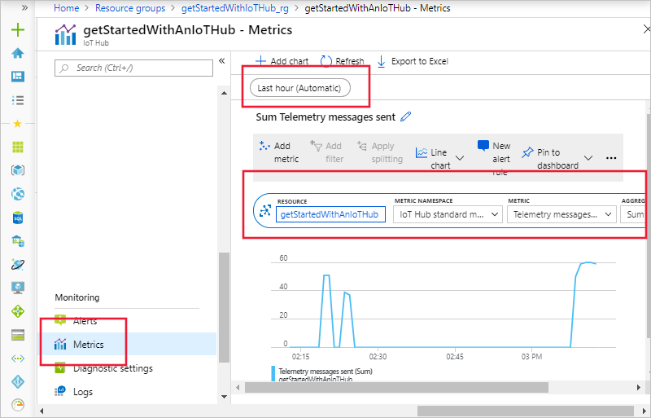

# <a name="tutorial-use-a-simulated-device-to-test-connectivity-with-your-iot-hub"></a>チュートリアル:シミュレートされたデバイスを使用して IoT ハブとの接続をテストする

このチュートリアルでは、Azure IoT Hub ポータル ツールと Azure CLI コマンドを使用してデバイスの接続をテストします。 このチュートリアルでは、デスクトップ マシンで実行する単純なデバイス シミュレーターも使用します。

Azure サブスクリプションをお持ちでない場合は、開始する前に[無料アカウントを作成](https://azure.microsoft.com/free/)してください。

このチュートリアルでは、以下の内容を学習します。
> [!div class="checklist"]
> * デバイスの認証を確認する
> * デバイスからクラウドへの接続を確認する
> * クラウドからデバイスへの接続を確認する
> * デバイス ツインの同期を確認する

[!INCLUDE [cloud-shell-try-it.md](../../includes/cloud-shell-try-it.md)]

## <a name="prerequisites"></a>前提条件

このチュートリアルで実行する CLI スクリプトでは、[Microsoft Azure IoT Extension for Azure CLI](https://github.com/Azure/azure-iot-cli-extension/blob/master/README.md) を使用します。 この拡張機能をインストールするには、次の CLI コマンドを実行します。

```azurecli-interactive
az extension add --name azure-iot
```

[!INCLUDE [iot-hub-cli-version-info](../../includes/iot-hub-cli-version-info.md)]

このチュートリアルで実行するデバイス シミュレーター アプリケーションは、Node.js を使用して作成しています。 開発用コンピューター上に Node.js v10.x.x 以降が必要です。

複数のプラットフォームに対応する Node.js を [nodejs.org](https://nodejs.org) からダウンロードできます。

開発コンピューターに現在インストールされている Node.js のバージョンは、次のコマンドを使って確認できます。

```cmd/sh
node --version
```

[https://github.com/Azure-Samples/azure-iot-samples-node/archive/master.zip](https://github.com/Azure-Samples/azure-iot-samples-node/archive/master.zip ) からサンプル デバイス シミュレーター Node.js プロジェクトをダウンロードし、ZIP アーカイブを抽出します。

ポート 8883 がファイアウォールで開放されていることを確認してください。 このチュートリアルのデバイス サンプルでは、ポート 8883 を介して通信する MQTT プロトコルを使用しています。 このポートは、企業や教育用のネットワーク環境によってはブロックされている場合があります。 この問題の詳細と対処方法については、「[IoT Hub への接続 (MQTT)](iot-hub-mqtt-support.md#connecting-to-iot-hub)」を参照してください。

## <a name="create-an-iot-hub"></a>IoT Hub の作成

以前のクイックスタートまたはチュートリアルで無料または標準の IoT ハブを作成した場合は、この手順をスキップできます。

[!INCLUDE [iot-hub-tutorials-create-free-hub](../../includes/iot-hub-tutorials-create-free-hub.md)]

## <a name="check-device-authentication"></a>デバイスの認証を確認する

ハブとの間でデータを交換するには、デバイスがハブの認証を受ける必要があります。 ポータルの **[デバイスの管理]** セクションにある **[IoT デバイス]** ツールを使用して、デバイスを管理し、使用している認証キーを確認できます。 チュートリアルのこのセクションでは、新しいテスト デバイスを追加し、そのキーを取得し、テスト デバイスがハブに接続できることを確認します。 後で、認証キーをリセットして、デバイスが古いキーを使用しようとしたときの動作を観察します。 チュートリアルのこのセクションでは、Azure Portal を使用してデバイスの作成、管理、および監視し、サンプル Node.js デバイス シミュレーターを作成します。

ポータルにサインインし、IoT ハブに移動します。 次に、**IoT デバイス** ツールに移動します。


新しいデバイスを登録するには、 **[+ 追加]** をクリックし、 **[デバイス ID]** を **MyTestDevice** に設定して **[保存]** をクリックします。


**MyTestDevice** の接続文字列を取得するには、デバイスの一覧でその接続文字列をクリックし、 **[接続文字列 - 主キー]** の値をコピーします。 接続文字列には、デバイスの*共有アクセス キー*が含まれています。


IoT ハブにテレメトリを送信する **MyTestDevice** をシミュレートするには、前にダウンロードした Node.js のシミュレートされたデバイス アプリケーションを実行します。

開発用マシンのターミナル ウィンドウで、ダウンロードしたサンプル Node.js プロジェクトのルート フォルダーに移動します。 次に、**iot-hub\Tutorials\ConnectivityTests** フォルダーに移動します。

ターミナル ウィンドウで次のコマンドを実行して、必要なライブラリをインストールし、シミュレートされたデバイス アプリケーションを実行します。 ポータルでデバイスを追加したときにメモしたデバイスの接続文字列を使用します。

```cmd/sh
npm install
node SimulatedDevice-1.js "{your device connection string}"
```

ハブに接続しようとすると、ターミナル ウィンドウには情報が表示されます。


これで、IoT ハブによって生成されたデバイス キーを使用して、デバイスから正常に認証されました。

### <a name="reset-keys"></a>キーをリセットする

このセクションでは、デバイス キーをリセットし、シミュレートされたデバイスが接続しようとしたときのエラーを観察します。

**MyTestDevice** のプライマリ デバイス キーをリセットするには、次のコマンドを実行します。

```azurecli-interactive
# Generate a new Base64 encoded key using the current date
read key < <(date +%s | sha256sum | base64 | head -c 32)

# Requires the IoT Extension for Azure CLI
# az extension add --name azure-iot

# Reset the primary device key for MyTestDevice
az iot hub device-identity update --device-id MyTestDevice --set authentication.symmetricKey.primaryKey=$key --hub-name {YourIoTHubName}
```

開発用マシンのターミナル ウィンドウで、シミュレートされたデバイス アプリケーションをもう一度実行します。

```cmd/sh
npm install
node SimulatedDevice-1.js "{your device connection string}"
```

今回は、アプリケーションが接続しようとすると認証エラーが表示されます。


### <a name="generate-shared-access-signature-sas-token"></a>Shared Access Signature (SAS) トークンを生成する

デバイスが IoT Hub デバイス SDK のいずれかを使用している場合、SDK ライブラリ コードで、ハブの認証を受けるために使用される SAS トークンを生成します。 SAS トークンは、ハブの名前、デバイスの名前、およびデバイス キーから生成されます。

クラウド プロトコル ゲートウェイやカスタム認証スキームの一部のシナリオなど、場合によっては SAS トークンを手動で生成する必要があります。 SAS 生成コードに関する問題を解決する場合、テスト時に使用できる、問題のないことが明白な SAS トークンを生成できると便利です。

> [!NOTE]
> SimulatedDevice-2.js のサンプルには、SDK があるバージョンとないバージョンの SAS トークンを生成する例が含まれています。

CLI を使用して問題のない既知の SAS トークンを生成するには、次のコマンドを実行します。

```azurecli-interactive
az iot hub generate-sas-token --device-id MyTestDevice --hub-name {YourIoTHubName}
```

生成された SAS トークンの全文をメモします。 SAS トークンは次のようになります。`SharedAccessSignature sr=tutorials-iot-hub.azure-devices.net%2Fdevices%2FMyTestDevice&sig=....&se=1524155307`

開発用マシンのターミナル ウィンドウで、ダウンロードしたサンプル Node.js プロジェクトのルート フォルダーに移動します。 次に、**iot-hub\Tutorials\ConnectivityTests** フォルダーに移動します。

ターミナル ウィンドウで次のコマンドを実行して、必要なライブラリをインストールし、シミュレートされたデバイス アプリケーションを実行します。

```cmd/sh
npm install
node SimulatedDevice-2.js "{Your SAS token}"
```

SAS トークンを使用してハブに接続しようとすると、ターミナル ウィンドウには情報が表示されます。


これで、CLI コマンドで生成されたテスト SAS トークンを使用して、デバイスから正常に認証されました。 **SimulatedDevice-2.js** ファイルには、コードで SAS トークンを生成する方法を示すサンプル コードが含まれています。

### <a name="protocols"></a>プロトコル

デバイスは、次のいずれかのプロトコルを使用して IoT ハブに接続できます。

| Protocol | 送信ポート |
| --- | --- |
| MQTT |8883 |
| WebSocket 経由の MQTT |443 |
| AMQP |5671 |
| AMQP over WebSocket |443 |
| HTTPS |443 |

送信ポートがファイアウォールによってブロックされている場合、デバイスは接続できません。


## <a name="check-device-to-cloud-connectivity"></a>デバイスからクラウドへの接続を確認する

デバイスが接続されると、通常、IoT ハブにテレメトリを送信しようとします。 このセクションでは、デバイスから送信されたテレメトリがハブに到達したことを確認する方法について説明します。

まず、次のコマンドを使用して、シミュレートされたデバイスの現在の接続文字列を取得します。

```azurecli-interactive
az iot hub device-identity show-connection-string --device-id MyTestDevice --output table --hub-name {YourIoTHubName}
```

メッセージを送信するシミュレートされたデバイスを実行するには、ダウンロードしたコードの **iot-hub\Tutorials\ConnectivityTests** フォルダーに移動します。

ターミナル ウィンドウで次のコマンドを実行して、必要なライブラリをインストールし、シミュレートされたデバイス アプリケーションを実行します。

```cmd/sh
npm install
node SimulatedDevice-3.js "{your device connection string}"
```

テレメトリをハブに送信すると、ターミナル ウィンドウには情報が表示されます。


ポータルの **[メトリック]** を使用して、テレメトリ メッセージが IoT ハブに到達していることを確認できます。 **[リソース]** ドロップダウンで IoT ハブを選択し、メトリックとして **[Telemetry messages sent]\(送信されたテレメトリ メッセージ\)** を選択し、時間範囲を **[過去 1 時間]** に設定します。 グラフには、シミュレートしたデバイスから送信されたメッセージの総数が表示されます。



シミュレートされたデバイスの起動後、メトリックが使用できるようになるまでには数分かかります。

## <a name="check-cloud-to-device-connectivity"></a>クラウドからデバイスへの接続を確認する

このセクションでは、デバイスに対してテストのダイレクト メソッド呼び出しを実行して、クラウドからデバイスへの接続を確認する方法について説明します。 開発用マシン上でシミュレートされたデバイスを実行して、ハブからのダイレクト メソッド呼び出しをリッスンします。

ターミナル ウィンドウで、次のコマンドを使用してシミュレートされたデバイス アプリケーションを実行します。

```cmd/sh
node SimulatedDevice-3.js "{your device connection string}"
```

CLI コマンドを使用して、デバイス上でダイレクト メソッドを呼び出します。

```azurecli-interactive
az iot hub invoke-device-method --device-id MyTestDevice --method-name TestMethod --timeout 10 --method-payload '{"key":"value"}' --hub-name {YourIoTHubName}
```

シミュレートされたデバイスは、ダイレクト メソッド呼び出しを受信すると、コンソールにメッセージを出力します。


シミュレートされたデバイスがダイレクト メソッド呼び出しを正常に受信すると、ハブに受信確認を返します。


## <a name="check-twin-synchronization"></a>ツインの同期を確認する

デバイスは、ツインを使用してデバイスとハブ間の状態を同期します。 このセクションでは、CLI コマンドを使用して、_必要なプロパティ_ をデバイスに送信し、デバイスによって送信された _報告されたプロパティ_ を読み取ります。

このセクションで使用するシミュレートされたデバイスは、起動されるたびに報告されたプロパティをハブに送信し、受信するたびにコンソールに必要なプロパティを出力します。

ターミナル ウィンドウで、次のコマンドを使用してシミュレートされたデバイス アプリケーションを実行します。

```cmd/sh
node SimulatedDevice-3.js "{your device connection string}"
```

ハブがデバイスから報告されたプロパティを受信したことを確認するには、次の CLI コマンドを使用します。

```azurecli-interactive
az iot hub device-twin show --device-id MyTestDevice --hub-name {YourIoTHubName}
```

コマンドからの出力の報告されたプロパティ セクションに **devicelaststarted** プロパティがあります。 このプロパティは、シミュレートされたデバイスの最終起動日時を示します。


ハブが必要なプロパティ値をデバイスに送信できることを確認するには、次の CLI コマンドを使用します。

```azurecli-interactive
az iot hub device-twin update --set properties.desired='{"mydesiredproperty":"propertyvalue"}' --device-id MyTestDevice --hub-name {YourIoTHubName}
```

ハブから必要なプロパティの更新を受信すると、シミュレートされたデバイスからメッセージが出力されます。


シミュレートされたデバイスは、作成時に必要なプロパティ変更を受信するだけでなく、起動時に必要なプロパティを自動的に確認します。

## <a name="clean-up-resources"></a>リソースをクリーンアップする

IoT ハブが必要でなくなった場合は、ポータルを使用して IoT ハブとリソース グループを削除します。 これを行うには、IoT ハブを含む **tutorials-iot-hub-rg** リソース グループを選択し、 **[削除]** をクリックします。

## <a name="next-steps"></a>次のステップ

このチュートリアルでは、デバイス キーを確認し、デバイスからクラウドへの接続を確認し、クラウドからデバイスへの接続を確認し、デバイスのツイン同期を確認する方法を確認しました。 IoT ハブを監視する方法の詳細については、IoT Hub の監視方法に関する記事を参照してください。

> [!div class="nextstepaction"]
> [診断を使用した監視](iot-hub-monitor-resource-health.md)
