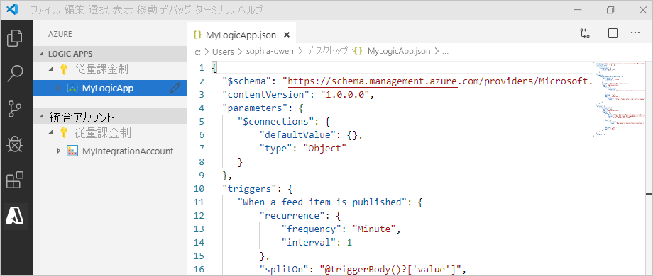
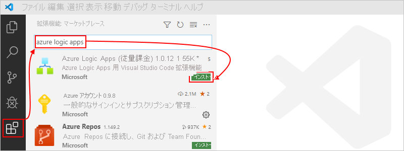
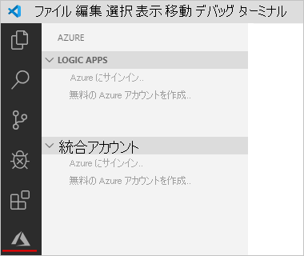
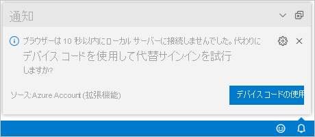
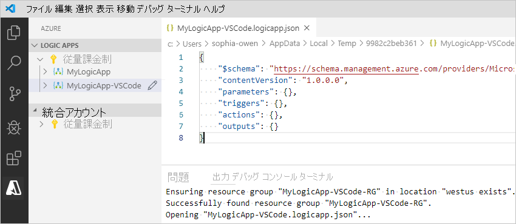
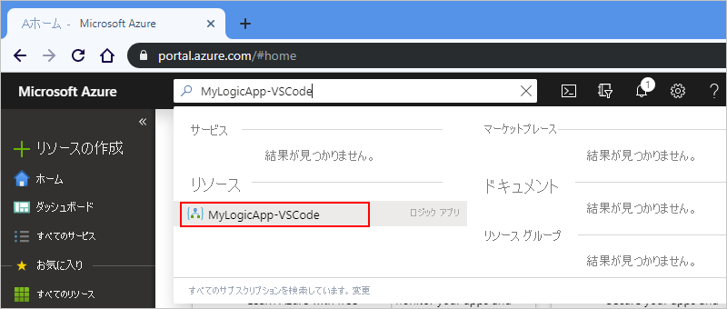
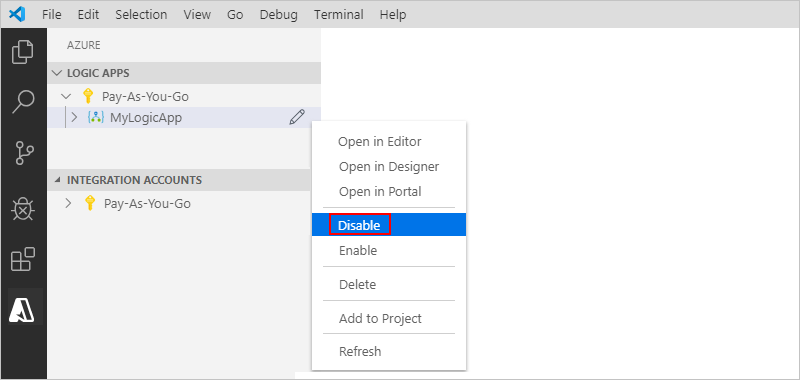
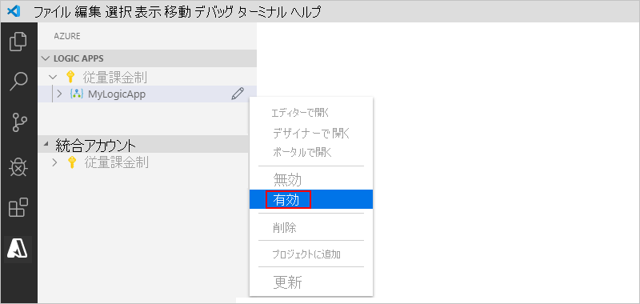
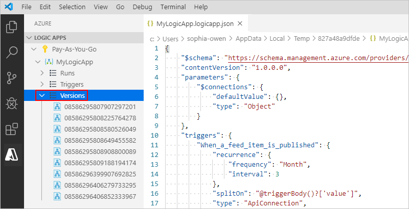
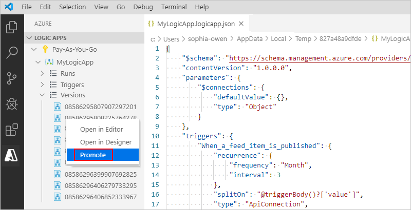

# <a name="quickstart-create-and-manage-logic-app-workflow-definitions-by-using-visual-studio-code"></a>クイック スタート:Visual Studio Code を使用してロジック アプリ ワークフローの定義を作成、管理する

[Azure Logic Apps](../logic-apps/logic-apps-overview.md) と Visual Studio Code を使用して、ロジック アプリを作成し、管理できます。ロジック アプリを使用すると、組織や企業間でアプリ、データ、システム、サービスを統合するためのタスク、ワークフロー、プロセスを自動化できます。 このクイックスタートでは、コードベースのエクスペリエンスを通じて、ロジック アプリの JavaScript Object Notation (JSON) を使用する、基になるワークフロー定義を作成および編集する方法を示します。 Azure に既にデプロイされている既存のロジック アプリを使用することもできます。

これらのタスクは [Azure portal](https://portal.azure.com) と Visual Studio でも実行できますが、既にロジック アプリ定義を使い慣れていて、コードで直接作業する場合は、Visual Studio Code の方が迅速に作業を開始できます。 たとえば、既に作成されているロジック アプリを無効化、有効化、削除、更新することができます。 また、Visual Studio Code が実行されている開発プラットフォーム (Linux、Windows、Mac など) からロジック アプリと統合アカウントを操作することもできます。

この記事では、基本的な概念に重点を置いた[クイックスタート](../logic-apps/quickstart-create-first-logic-app-workflow.md)と同じロジック アプリを作成できます。 [Visual Studio でサンプル アプリを作成する方法について学習する](quickstart-create-logic-apps-with-visual-studio.md)ことも、[Azure コマンド ライン インターフェイス (Azure CLI) を使用してアプリを作成および管理する方法について学習する](quickstart-logic-apps-azure-cli.md)こともできます。 Visual Studio Code では、ロジック アプリは次の例のようになります。



## <a name="prerequisites"></a>[前提条件]

開始する前に、以下を用意してください。

* Azure アカウントとサブスクリプションがない場合は、[無料の Azure アカウントにサインアップ](https://azure.microsoft.com/free/)してください。

* JSON で記述されている[ロジック アプリのワークフロー定義](../logic-apps/logic-apps-workflow-definition-language.md)とその構造についての基礎知識

  Azure Logic Apps を初めて使用する方は、こちらの[クイックスタート](../logic-apps/quickstart-create-first-logic-app-workflow.md)をお試しください。Azure portal で初めてのロジック アプリを作成し、基本的な概念を重点的に身に付けることができます。

* Azure と Azure サブスクリプションにサインインするための Web へのアクセス

* まだお持ちでない場合は、以下のツールをダウンロードしてインストールしてください。

  * [Visual Studio Code バージョン 1.25.1 以降](https://code.visualstudio.com/) (無料)

  * Azure Logic Apps 用 Visual Studio Code 拡張機能

    この拡張機能は、[Visual Studio Marketplace](https://marketplace.visualstudio.com/items?itemName=ms-azuretools.vscode-logicapps) からダウンロードしてインストールすることも、Visual Studio Code 内から直接インストールすることもできます。 インストール後、Visual Studio Code を再度読み込む必要があります。

    

    拡張機能が正しくインストールされたことを確認するには、Visual Studio Code ツール バーにある Azure アイコンを選択します。

    

    詳細については、「[Extension Marketplace (拡張機能 Marketplace)](https://code.visualstudio.com/docs/editor/extension-gallery)」をご覧ください。 この拡張機能のオープン ソース バージョンに協力するには、[GitHub の Visual Studio Code 用 Azure Logic Apps 拡張機能](https://github.com/Microsoft/vscode-azurelogicapps)に関するページを参照してください。

* ロジック アプリが特定の IP アドレスへのトラフィックを制限するファイアウォールを経由して通信する必要がある場合、そのファイアウォールは、Logic Apps サービスまたはロジック アプリが存在する Azure リージョンのランタイムが使用する [インバウンド](logic-apps-limits-and-config.md#inbound)と [アウトバウンド](logic-apps-limits-and-config.md#outbound)の IP アドレスの "*両方*" のアクセスを許可する必要があります。 また、ロジック アプリが Office 365 Outlook コネクタや SQL コネクタなどの [マネージド コネクタ](../connectors/apis-list.md#managed-api-connectors)を使用している場合、または [カスタム コネクタ](/connectors/custom-connectors/)を使用している場合、そのファイアウォールでは、ロジック アプリの Azure リージョン内の "*すべて*" の [マネージド コネクタ アウトバウンド IP アドレス](logic-apps-limits-and-config.md#outbound)へのアクセスを許可する必要もあります。

<a name="access-azure"></a>

## <a name="access-azure-from-visual-studio"></a>Visual Studio から Azure にアクセスする

1. Visual Studio Code を開きます。 Visual Studio Code ツール バーで、Azure アイコンを選択します。

   

1. Azure ウィンドウで、 **[Logic Apps]** の **[Sign in to Azure]\(Azure にサインインする\)** を選択します。 Microsoft サインイン ページが表示されたら、Azure アカウントでサインインします。

   ![[Sign in to Azure]\(Azure にサインインする\) を選択する](./media/quickstart-create-logic-apps-visual-studio-code/sign-in-azure-visual-studio-code.png)

   1. サインインに通常よりも長い時間がかかる場合、Visual Studio Code はデバイス コードを提供して、Microsoft 認証 Web サイトでサインインするよう求めます。 代わりにコードでサインインするには、 **[Use Device Code] (デバイス コードを使用)** を選択します。

      

   1. コードをコピーするには、 **[Copy & Open] (コピーして開く)** を選択します。

      

   1. 新しいブラウザー ウィンドウを開いて認証 Web サイトに進むには、 **[リンクを開く]** を選択します。

      

   1. **[アカウントにサインインする]** ページで認証コードを入力し、 **[次へ]** を選択します。

      

1. Azure アカウントを選択します。 サインインしたら、ブラウザーを閉じて Visual Studio Code に戻ることができます。

   Azure ウィンドウの **[ロジック アプリ]** と **[統合アカウント]** セクションに、アカウントに関連付けられた Azure サブスクリプションが表示されます。 ただし、想定しているサブスクリプションが表示されない場合、またはセクションにサブスクリプションが多すぎる場合は、次の手順を実行します。

   1. ポインターを **[ロジック アプリ]** ラベルの上に移動します。 ツールバーが表示されたら、 **[サブスクリプションの選択]** (フィルター アイコン) を選択します。

      

   1. 表示された一覧から、表示したいサブスクリプションを選択します。

1. **[ロジック アプリ]** で目的のサブスクリプションを選択します。 サブスクリプション ノードが展開され、そのサブスクリプションに存在するすべてのロジック アプリが表示されます。

   

   > [!TIP]
   > **[統合アカウント]** でサブスクリプションを選択すると、そのサブスクリプションに存在する統合アカウントが表示されます。

<a name="create-logic-app"></a>

## <a name="create-new-logic-app"></a>新しいロジック アプリを作成する

1. まだ Visual Studio Code 内から Azure アカウントおよびサブスクリプションにサインインしていない場合は、先ほどの手順に従って[今すぐサインイン](#access-azure)します。

1. Visual Studio Code の **[ロジック アプリ]** でサブスクリプションのショートカット メニューを開き、 **[ロジック アプリの作成]** を選択します。

   ![サブスクリプション メニューから [ロジック アプリの作成] を選択する](./media/quickstart-create-logic-apps-visual-studio-code/create-logic-app-visual-studio-code.png)

   一覧が表示され、サブスクリプション内の Azure リソース グループが表示されます。

1. リソース グループのリストから、 **[新しいリソース グループの作成]** または既存のリソース グループを選択します。 この例では、新しいリソース グループを作成します。

   

1. Azure リソース グループの名前を指定し、Enter キーを押します。

   

1. ロジック アプリのメタデータを保存する Azure リージョンを選択します。

   

1. ロジック アプリの名前を指定し、Enter キーを押します。

   

   Azure ウィンドウの Azure サブスクリプションの下に新しい空のロジック アプリが表示されます。 また Visual Studio Code では、ロジック アプリのスケルトン ワークフロー定義を含む JSON (.logicapp.json) ファイルも開きます。 これで、この JSON ファイルにロジック アプリのワークフロー定義を手動で作成することができます。 ワークフロー定義の構造と構文に関するテクニカル リファレンスについては、「[Azure Logic Apps のワークフロー定義言語スキーマ](../logic-apps/logic-apps-workflow-definition-language.md)」を参照してください。

   

   たとえば、次に示すのは、RSS トリガーと Office 365 Outlook アクションから始まるサンプル ロジック アプリ ワークフロー定義です。 通常、JSON 要素は各セクション内でアルファベット順に表示されます。 ただし、このサンプルでは、ロジック アプリのステップがデザイナーに表示される順序でこれらの要素を大まかに示しています。

   > [!IMPORTANT]
   > このサンプル ロジック アプリの定義を再利用する場合は、@fabrikam.com などの組織アカウントが必要です。 架空の電子メール アドレスを実際の電子メール アドレスに置き換えてください。 Outlook.com や Gmail など、別の電子メール コネクタを使用するには、`Send_an_email_action` アクションを、[Azure Logic Apps がサポートしている電子メール コネクタ](../connectors/apis-list.md)から入手できる同様のアクションに置き換えます。
   >
   > Gmail コネクタの使用を希望する場合、ロジック アプリで制限なしにこのコネクタを使用できるのは、G-Suite ビジネス アカウントだけです。 
   > Gmail コンシューマー アカウントを持っている場合は、Google によって承認された特定のサービスのみでこのコネクタを使用できるほか、[認証に使用する Google クライアント アプリを Gmail コネクタで作成する](/connectors/gmail/#authentication-and-bring-your-own-application)ことができます。 
   > 詳細については、「[Azure Logic Apps での Google コネクタのデータ セキュリティとプライバシー ポリシー](../connectors/connectors-google-data-security-privacy-policy.md)」を参照してください。

   ```json
   {
      "$schema": "https://schema.management.azure.com/providers/Microsoft.Logic/schemas/2016-06-01/workflowdefinition.json#",
      "contentVersion": "1.0.0.0",
      "parameters": {
         "$connections": {
            "defaultValue": {},
            "type": "Object"
         }
      },
      "triggers": {
         "When_a_feed_item_is_published": {
            "recurrence": {
               "frequency": "Minute",
               "interval": 1
            },
            "splitOn": "@triggerBody()?['value']",
            "type": "ApiConnection",
            "inputs": {
               "host": {
                  "connection": {
                     "name": "@parameters('$connections')['rss']['connectionId']"
                  }
               },
               "method": "get",
               "path": "/OnNewFeed",
               "queries": {
                  "feedUrl": "http://feeds.reuters.com/reuters/topNews"
               }
            }
         }
      },
      "actions": {
         "Send_an_email_(V2)": {
            "runAfter": {},
            "type": "ApiConnection",
            "inputs": {
               "body": {
                  "Body": "<p>Title: @{triggerBody()?['title']}<br>\n<br>\nDate published: @{triggerBody()?['updatedOn']}<br>\n<br>\nLink: @{triggerBody()?['primaryLink']}</p>",
                  "Subject": "RSS item: @{triggerBody()?['title']}",
                  "To": "sophia-owen@fabrikam.com"
               },
               "host": {
                  "connection": {
                     "name": "@parameters('$connections')['office365']['connectionId']"
                  }
               },
               "method": "post",
               "path": "/v2/Mail"
            }
         }
      },
      "outputs": {}
   }
   ```

1. 完了したら、ロジック アプリのワークフロー定義を保存します。 ([ファイル] メニュー > [保存]、または Ctrl + S キーを押す)

1. ロジック アプリを Azure サブスクリプションにアップロードするように求めるメッセージが表示されたら、[**アップロード]** を選択します。

   この手順では、ロジックアプリを [Azure portal](https://portal.azure.com)に発行します。これにより、ロジックが有効になり、Azure で実行されます。

   

## <a name="view-logic-app-in-designer"></a>デザイナーでロジック アプリを表示する

Visual Studio Code では、読み取り専用のデザイン ビューでロジック アプリを開くことができます。 デザイナーでロジック アプリを編集することはできませんが、デザイナー ビューを使用すると、ロジック アプリのワークフローを視覚的に確認できます。

Azure ウィンドウの **[ロジック アプリ]** で、ロジック アプリのショートカット メニューを開き、 **[Open in Designer] (デザイナーで開く)** を選択します。

読み取り専用のデザイナーが別のウィンドウで開き、ロジック アプリのワークフローが表示されます。次に例を示します。


## <a name="view-in-azure-portal"></a>Azure portal に表示

Azure portal でロジック アプリを確認するには、次の手順を実行します。

1. ロジック アプリに関連付けられているのと同じ Azure アカウントとサブスクリプションを使用して、[Azure portal](https://portal.azure.com) にサインインします。

1. Azure portal の検索ボックスに、ロジック アプリの名前を入力します。 結果の一覧からロジック アプリを選択します。

   

<a name="disable-enable-logic-app"></a>

## <a name="disable-or-enable-logic-app"></a>ロジック アプリを無効または有効にする

Visual Studio Code では、発行されたロジック アプリを編集して変更を保存すると、既にデプロイされているアプリを *上書き* します。 運用環境でのロジック アプリの中断を回避し、中断を最小限に抑えるには、ロジック アプリを最初に非アクティブ化します。 ロジック アプリが引き続き動作することを確認した後で、ロジック アプリを再度アクティブにすることができます。

1. まだ Visual Studio Code 内から Azure アカウントおよびサブスクリプションにサインインしていない場合は、先ほどの手順に従って[今すぐサインイン](#access-azure)します。

1. サブスクリプション内のすべてのロジック アプリを表示できるように、Azure ウィンドウの **[ロジック アプリ]** で、Azure サブスクリプションを展開します。

   1. ロジック アプリを無効にするには、ロジック アプリのメニューを開き、 **[Disable] (無効化)** を選択します。

      

   1. ロジック アプリを再アクティブ化する準備ができたら、ロジック アプリのメニューを開き、 **[Enable] (有効化)** を選択します。

      

<a name="edit-logic-app"></a>

## <a name="edit-deployed-logic-app"></a>デプロイされたロジック アプリの編集

Visual Studio Code では、既に Azure にデプロイされているロジック アプリのワークフロー定義を開いて編集することができます。

> [!IMPORTANT] 
> 実稼働環境でアクティブに実行されているロジック アプリを編集する前に、[まずロジック アプリを無効化する](#disable-enable-logic-app)ことで、ロジック アプリが破損するリスクを回避し、中断を最小限に抑えることができます。

1. まだ Visual Studio Code 内から Azure アカウントおよびサブスクリプションにサインインしていない場合は、先ほどの手順に従って[今すぐサインイン](#access-azure)します。

1. Azure ウィンドウの **[Logic Apps]** で、Azure サブスクリプションを展開し、目的のロジック アプリを選択します。

1. ロジック アプリのメニューを開き、 **[エディターで開く]** を選択します。 または、ロジック アプリ名の横の編集アイコンを選択します。

   

   Visual Studio Code はローカルの一時フォルダーにある .logicapp.json ファイルを開き、ロジック アプリのワークフロー定義を表示します。

   

1. ロジック アプリのワークフロー定義を変更します。

1. 完了したら、変更を保存します。 ([ファイル] メニュー > [保存]、または Ctrl + S キーを押す)

1. 変更内容をアップロードして Azure portal の既存のロジック アプリ *上書き* するように求められたら、 **[アップロード]** を選択します。

   この手順では、[Azure portal](https://portal.azure.com) のロジック アプリのアップデートを発行します。

   

## <a name="view-or-promote-other-versions"></a>他のバージョンを表示または昇格する

Visual Studio Code では、以前のバージョンのロジック アプリを開いて確認することができます。 また、以前のバージョンを現在のバージョンに昇格させることもできます。

> [!IMPORTANT] 
> 実稼働環境でアクティブに実行されているロジック アプリを変更する前に、[まずロジック アプリを無効化する](#disable-enable-logic-app)ことで、ロジック アプリが破損するリスクを回避し、中断を最小限に抑えることができます。

1. サブスクリプション内のすべてのロジック アプリを表示できるように、Azure ウィンドウの **[ロジック アプリ]** で、Azure サブスクリプションを展開します。

1. サブスクリプションの下で、ロジック アプリを展開し、 **[バージョン]** を展開します。

   **[バージョン]** 一覧に、ロジック アプリの以前のバージョン (存在する場合) が表示されます。

   

1. 以前のバージョンを表示するには、次のいずれかの手順を選択します。

   * JSON 定義を表示するには、 **[バージョン]** で、その定義のバージョン番号を選択します。 または、そのバージョンのショートカット メニューを開き、 **[エディターで開く]** を選択します。

     ローカル コンピューターで新しいファイルが開き、そのバージョンの JSON 定義が表示されます。

   * 読み取り専用のデザイナー ビューでバージョンを表示するには、そのバージョンのショートカット メニューを開き、 **[デザイナーで開く]** を選択します。

1. 以前のバージョンを現在のバージョンに昇格させるには、次の手順に従います。

   1. **[バージョン]** で、以前のバージョンのショートカット メニューを開き、 **[昇格]** を選択します。

      

   1. Visual Studio Code で確認を求めるメッセージが表示されたら、 **[はい]** を選択して続行します。

      

      Visual Studio Code は選択したバージョンを現在のバージョンに昇格させ、昇格したバージョンに新しい番号を割り当てます。 以前のバージョンは、昇格されたバージョンの下に表示されます。

## <a name="next-steps"></a>次のステップ

> [!div class="nextstepaction"]
> [Visual Studio Code でステートフルおよびステートレスなロジック アプリを作成する (プレビュー)](../logic-apps/create-stateful-stateless-workflows-visual-studio-code.md)
