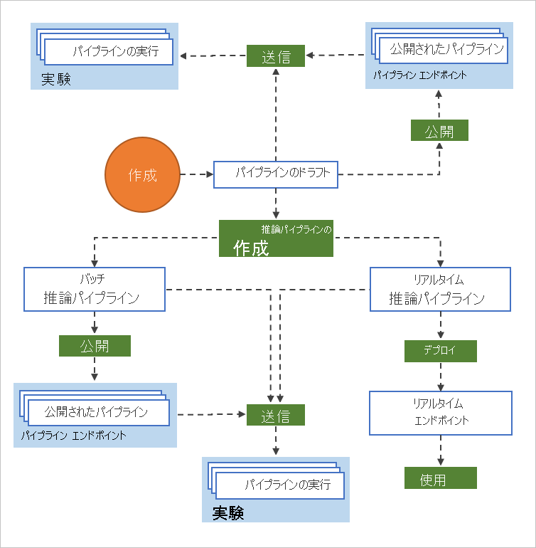

# Azure Machine Learning デザイナーとは 

Azure Machine Learning デザイナーは、Azure Machine Learning 内でのモデルのトレーニングとデプロイに使用されるドラッグ アンド ドロップ インターフェイスです。 この記事では、デザイナー内で実行できるタスクについて説明します。

 - デザイナーで作業を開始するには、[コードなし回帰モデルをトレーニングするためのチュートリアル](tutorial-designer-automobile-price-train-score.md)をご覧ください。 
 - デザイナー内で使用できるコンポーネントについては、[アルゴリズムとコンポーネントのリファレンス](./algorithm-module-reference/module-reference.md)をご覧ください。

デザイナーでは、Azure Machine Learning の[ワークスペース](concept-workspace.md)を使用して、次のような共有リソースが整理されます。

+ [パイプライン](#pipeline)
+ [データセット](#datasets)
+ [コンピューティング リソース](#compute)
+ [登録済みモデル](concept-azure-machine-learning-architecture.md#models)
+ [公開済みパイプライン](#publish)
+ [リアルタイム エンドポイント](#deploy)

## モデルのトレーニングとデプロイ

ビジュアル キャンバスを使用して、エンドツーエンドの機械学習ワークフローを構築します。 デザイナーでモデルすべてをトレーニング、テスト、デプロイします。

1. [データセット](#datasets)と[モジュール](#module)をキャンバスにドラッグ アンド ドロップします。
1. モジュールを接続して[パイプラインのドラフト](#pipeline-draft)を作成します。
1. Azure Machine Learning ワークスペースのコンピューティング リソースを使用して、[パイプラインの実行](#pipeline-run)を送信します。
1. **トレーニング パイプライン** を **推論パイプライン** に変換します。
1. パイプラインを REST **パイプライン エンドポイント** に [発行](#publish)し、異なるパラメーターとデータセットを使用して実行される新しいパイプラインを送信します。
    + **トレーニング パイプライン** を発行し、1 つのパイプラインを再利用して、パラメーターとデータセットを変更しながら、複数のモデルをトレーニングします。
    + **バッチ推論パイプライン** を発行し、以前にトレーニングしたモデルを使用して、新しいデータで予測を行います。
1. **リアルタイム推論パイプライン** をリアルタイム エンドポイントに [デプロイ](#deploy)して、新しいデータの予測をリアルタイムで行います。

## パイプライン

[パイプライン](concept-azure-machine-learning-architecture.md#ml-pipelines)は、ユーザーによって接続されたデータセットとアルゴリズム モジュールで構成されます。 パイプラインには多くの用途があります。1 つのモデルをトレーニングするパイプラインや、複数のモデルをトレーニングするパイプラインを作成できます。 リアルタイムまたはバッチで予測を行うパイプラインや、データをクリーンアップするだけのパイプラインを作成できます。 パイプラインを使用して、作業を再利用し、プロジェクトを整理することができます。

### パイプラインのドラフト

デザイナーでパイプラインを編集している間、進捗は **パイプラインのドラフト** として保存されます。 いつでも、モジュールの追加または削除、コンピューティング先の構成、パラメーターの作成などを行って、パイプラインのドラフトを編集することができます。

有効なパイプラインには、次のような特徴があります。

* データセットは、モジュールにのみ接続できる。
* モジュールは、データセットまたは別のモジュールにのみ接続できる。
* モジュールのすべての入力ポートに、データ フローへの何らかの接続がある
* 各モジュールの必須パラメーターがすべて設定されている

パイプラインのドラフトを実行する準備ができたら、パイプラインの実行を送信します。

### パイプラインの実行

パイプラインを実行するたびに、パイプラインの構成とその結果が、**パイプラインの実行** としてワークスペースに格納されます。 任意のパイプラインの実行に戻り、トラブルシューティングや監査のために検査することができます。 パイプラインの実行を **複製** し、編集用に新しいパイプラインのドラフトを作成します。

実行の履歴を整理するために、パイプラインの実行は[実験](concept-azure-machine-learning-architecture.md#experiments)にグループ化されます。 すべてのパイプラインの実行に対して、実験を設定できます。 

## データセット

機械学習データセットによって、データへのアクセスと操作がより容易になります。 デザイナーには、実験に利用できるいくつかの[サンプル データセット](samples-designer.md#datasets)が含まれています。 必要に応じて、データセットをさらに[登録](how-to-create-register-datasets.md)することができます。

## Module

モジュールとは、データに対して実行できるアルゴリズムのことです。 デザイナーには、データのイングレス機能や、プロセスのトレーニング、スコアリング、検証などのいくつかのモジュールが用意されています。

モジュールに一連のパラメーターが含まれている場合、これらを使用してモジュールの内部アルゴリズムを構成することができます。 キャンバスでモジュールを選択すると、モジュールのパラメーターは、キャンバス右側の [プロパティ] ウィンドウに表示されます。 このウィンドウでパラメーターを変更することにより、パイプラインを微調整できます。 デザイナーでは、個々のモジュールに対してコンピューティング リソースを設定できます。 

:::image type="content" source="./media/concept-designer/properties.png" alt-text="モジュールのプロパティ":::

利用できる機械学習アルゴリズムのライブラリ内の移動に関するヘルプについては、「[アルゴリズムとモジュールのリファレンスの概要](algorithm-module-reference/module-reference.md)」をご覧ください。 アルゴリズムの選択の詳細については、[Azure Machine Learning アルゴリズムのチート シート](algorithm-cheat-sheet.md)をご覧ください。

##  コンピューティング リソース

自分のワークスペースからコンピューティング リソースを使用して、パイプラインを実行し、デプロイ済みのモデルをリアルタイム エンドポイントまたはパイプライン エンドポイント (バッチ推論用) としてホストします。 サポートされているコンピューティング ターゲットを次に示します。

| コンピューティング ターゲット | トレーニング | デプロイ |
| ---- |:----:|:----:|
| Azure Machine Learning コンピューティング | ✓ | |
| Azure Kubernetes Service | | ✓ |

コンピューティング先は、自分の [Azure Machine Learning ワークスペース](concept-workspace.md)に接続されています。 [Azure Machine Learning Studio](https://ml.azure.com) で自分のワークスペース内のコンピューティング先を管理します。

## 配置

リアルタイムの推論を実行するには、**リアルタイム エンドポイント** としてパイプラインをデプロイする必要があります。 リアルタイム エンドポイントでは、外部アプリケーションと自分のスコアリング モデルの間のインターフェイスが作成されます。 リアルタイム エンドポイントを呼び出すと、予測結果がリアルタイムでアプリケーションに返されます。 リアルタイム エンドポイントを呼び出すには、エンドポイントのデプロイ時に作成された API キーを渡します。 エンドポイントは、Web プログラミング プロジェクトで広く使われているアーキテクチャの REST に基づいています。

リアルタイム エンドポイントは、Azure Kubernetes Service クラスターにデプロイする必要があります。

モデルのデプロイ方法の詳細については、「[チュートリアル: デザイナーで機械学習モデルをデプロイする](tutorial-designer-automobile-price-deploy.md)」を参照してください。

[!INCLUDE [endpoints-option](../../includes/machine-learning-endpoints-preview-note.md)]

## 発行

**パイプライン エンドポイント** にパイプラインを発行することもできます。 リアルタイム エンドポイントと同様に、パイプライン エンドポイントでは、REST 呼び出しを使用して、外部アプリケーションから新しいパイプラインの実行を送信することができます。 ただし、パイプライン エンドポイントを使用してリアルタイムでデータを送受信することはできません。

発行されたパイプラインは柔軟性があり、モデルのトレーニングや再トレーニング、[バッチ推論の実行](how-to-run-batch-predictions-designer.md)、新しいデータの処理などに使用できます。 複数のパイプラインを 1 つのパイプライン エンドポイントに発行し、実行するパイプラインのバージョンを指定できます。

発行されたパイプラインは、各モジュールのパイプライン ドラフトで定義されているコンピューティング リソース上で実行されます。

デザイナーでは、SDK と同じ [PublishedPipeline](/python/api/azureml-pipeline-core/azureml.pipeline.core.graph.publishedpipeline) オブジェクトが作成されます。

## 次のステップ

* 予測分析と機械学習の基本について学習する: [チュートリアル:デザイナーを使用して自動車の価格を予測する](tutorial-designer-automobile-price-train-score.md)
* 既存の[デザイナーのサンプル](samples-designer.md)を変更して、ニーズに合わせて調整する方法について説明します。