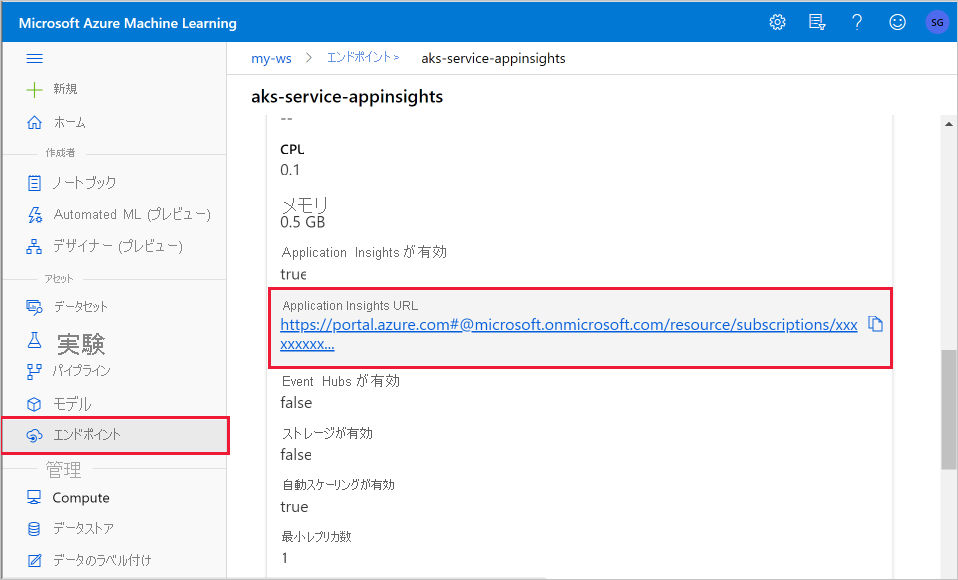

# <a name="monitor-and-collect-data-from-ml-web-service-endpoints"></a>ML Web サービス エンドポイントからのデータを監視および収集する


この記事では、Azure Kubernetes Service (AKS) または Azure Container Instances (ACI) で Web サービス エンドポイントにデプロイされたモデルからデータを収集する方法について説明します。 [Azure Application Insights](../azure-monitor/app/app-insights-overview.md) を使用して、エンドポイントから次のデータを収集します。
* 出力データ
* 応答
* 要求率、応答時間、失敗率
* 依存率、応答時間、失敗率
* 例外

[enable-app-insights-in-production-service.ipynb](https://github.com/Azure/MachineLearningNotebooks/blob/master/how-to-use-azureml/deployment/enable-app-insights-in-production-service/enable-app-insights-in-production-service.ipynb) ノートブックは、この記事の概念を示しています。
 
[!INCLUDE [aml-clone-in-azure-notebook](../../includes/aml-clone-for-examples.md)]
 
## <a name="prerequisites"></a>前提条件

* Azure サブスクリプション - [無料版または有料版の Azure Machine Learning](https://azure.microsoft.com/free/) をお試しください。

* Azure Machine Learning ワークスペース、スクリプトを保存するローカル ディレクトリ、および Azure Machine Learning SDK for Python のインストール。 詳細については、[開発環境の構成方法](how-to-configure-environment.md)に関するページを参照してください。

* トレーニングされた機械学習モデル。 詳細については、[画像分類モデルのトレーニング](tutorial-train-models-with-aml.md)に関するチュートリアルを参照してください。

<a name="python"></a>

## <a name="configure-logging-with-the-python-sdk"></a>Python SDK を使用してログを構成する

このセクションでは、Python SDK を使用して Application Insights のログを有効にする方法について説明します。 

### <a name="update-a-deployed-service"></a>デプロイされたサービスを更新する

既存の Web サービスを更新するには、次の手順に従います。

1. ワークスペースで、サービスを特定します。 `ws` の値はワークスペースの名前です。

    ```python
    from azureml.core.webservice import Webservice
    aks_service= Webservice(ws, "my-service-name")
    ```
2. サービスを更新し、Azure Application Insights を有効にします。

    ```python
    aks_service.update(enable_app_insights=True)
    ```

### <a name="log-custom-traces-in-your-service"></a>サービスのカスタム トレースをログに記録する

> [!IMPORTANT]
> Azure Application Insights では、最大 64 KB のペイロードのみがログに記録されます。 この制限に達すると、メモリ不足などのエラーが発生したり、情報がログに記録されないことがあります。 ログに記録するデータが 64 kb より大きい場合は、「[実稼働環境でモデルのデータを収集する](how-to-enable-data-collection.md)」の情報を使用して、Blob ストレージに格納する必要があります。
>
> AKS デプロイ内でのモデル追跡などのより複雑な状況では、[OpenCensus](https://opencensus.io) のようなサードパーティ製のライブラリを使用することをお勧めします。

カスタム トレースをログするには、[デプロイする方法と場所](how-to-deploy-and-where.md)のドキュメントにある AKS または ACI のための標準のデプロイ プロセスに従います。 次に、次の手順を使用します。

1. 推論中に Application Insights にデータを送信するには、print ステートメントを追加してスコアリング ファイルを更新します。 要求データや応答などのより複雑な情報に対しては、JSON 構造体を使用してください。 

    次の例では、`score.py` ファイルに、モデルが初期化された時刻、推論時の入力と出力、およびエラーが発生した時刻がログされます。

    
    ```python
    import pickle
    import json
    import numpy 
    from sklearn.externals import joblib
    from sklearn.linear_model import Ridge
    from azureml.core.model import Model
    import time

    def init():
        global model
        #Print statement for appinsights custom traces:
        print ("model initialized" + time.strftime("%H:%M:%S"))
        
        # note here "sklearn_regression_model.pkl" is the name of the model registered under the workspace
        # this call should return the path to the model.pkl file on the local disk.
        model_path = Model.get_model_path(model_name = 'sklearn_regression_model.pkl')
        
        # deserialize the model file back into a sklearn model
        model = joblib.load(model_path)
    

    # note you can pass in multiple rows for scoring
    def run(raw_data):
        try:
            data = json.loads(raw_data)['data']
            data = numpy.array(data)
            result = model.predict(data)
            # Log the input and output data to appinsights:
            info = {
                "input": raw_data,
                "output": result.tolist()
                }
            print(json.dumps(info))
            # you can return any datatype as long as it is JSON-serializable
            return result.tolist()
        except Exception as e:
            error = str(e)
            print (error + time.strftime("%H:%M:%S"))
            return error
    ```

2. サービス構成を更新し、Application Insights を有効にします。
    
    ```python
    config = Webservice.deploy_configuration(enable_app_insights=True)
    ```

3. イメージをビルドし、AKS または ACI にデプロイします。 詳しくは、[デプロイする方法と場所](how-to-deploy-and-where.md)に関するページをご覧ください。


### <a name="disable-tracking-in-python"></a>Python で追跡を無効にする

Azure Application Insights を無効にするには、次のコードを使用します。

```python 
## replace <service_name> with the name of the web service
<service_name>.update(enable_app_insights=False)
```

<a name="studio"></a>

## <a name="configure-logging-with-azure-machine-learning-studio"></a>Azure Machine Learning Studio を使用してログを構成する

Azure Machine Learning Studio から Azure Application Insights を有効にすることもできます。 モデルを Web サービスとしてデプロイする準備ができたら、次の手順に従って Application Insights を有効にします。

1. https://ml.azure.com でスタジオにサインインします。
1. **[モデル]** に移動し、デプロイするモデルを選択します。
1. **[+ デプロイ]** を選択します。
1. **[モデルのデプロイ]** フォームに入力します。
1. **[詳細設定]** メニューを展開します。

    
1. **[Application Insights の診断とデータ収集を有効にする]** を選択します。

    

## <a name="view-metrics-and-logs"></a>メトリックとログを表示する

### <a name="query-logs-for-deployed-models"></a>デプロイ済みモデルのログのクエリを実行する

リアルタイム エンドポイントのログは、お客様のデータです。 `get_logs()` 関数を使用して、以前にデプロイした Web サービスからログを取得できます。 ログには、デプロイ中に発生したエラーに関する詳細情報が含まれている場合があります。

```python
from azureml.core import Workspace
from azureml.core.webservice import Webservice

ws = Workspace.from_config()

# load existing web service
service = Webservice(name="service-name", workspace=ws)
logs = service.get_logs()
```

複数のテナントがある場合は、`ws = Workspace.from_config()` の前に次の認証コードを追加する必要が生じることがあります

```python
from azureml.core.authentication import InteractiveLoginAuthentication
interactive_auth = InteractiveLoginAuthentication(tenant_id="the tenant_id in which your workspace resides")
```

### <a name="view-logs-in-the-studio"></a>スタジオでログを表示する

Azure Application Insights では、Azure Machine Learning ワークスペースと同じリソース グループにサービス ログが格納されます。 スタジオを使用してデータを表示するには、次の手順に従います。

1. [Studio](https://ml.azure.com/) の Azure Machine Learning ワークスペースに移動します。
1. **[エンドポイント]** を選択します。
1. デプロイされたサービスを選択します。
1. **Application Insights URL** リンクを選択します。

    [](././media/how-to-enable-app-insights/appinsightsloc.png#lightbox)

1. Application Insights で、 **[概要]** タブまたは __[監視]__ セクションから、 __[ログ]__ を選択します。

    [![監視の [概要] タブ](./media/how-to-enable-app-insights/overview.png)](./media/how-to-enable-app-insights/overview.png#lightbox)

1. score.py ファイルからログに記録された情報を表示するには、__traces__ テーブルを参照してください。 次のクエリは、__input__ 値が記録されたログを検索しています。

    ```kusto
    traces
    | where customDimensions contains "input"
    | limit 10
    ```

   [](././media/how-to-enable-app-insights/model-data-trace.png#lightbox)

Azure Application Insights の使用方法の詳細については、「[Application Insights とは何か?](../azure-monitor/app/app-insights-overview.md)」を参照してください。

## <a name="web-service-metadata-and-response-data"></a>Web サービスのメタデータと応答データ

> [!IMPORTANT]
> Azure Application Insights では、最大 64 KB のペイロードのみがログに記録されます。 この制限に達すると、メモリ不足などのエラーが発生したり、情報がログに記録されないことがあります。

Web サービスの要求情報をログするには、`print` ステートメントを score.py ファイルに追加します。 各 `print` ステートメントによって、メッセージ `STDOUT` の下の Application Insights トレース テーブルの 1 つのエントリになります。 Application Insights により、`print` ステートメントの出力が `customDimensions` および `Contents` トレース テーブルに格納されます。 JSON 文字列を出力すると、`Contents` の下のトレース出力に階層データ構造が生成されます。

## <a name="export-data-for-retention-and-processing"></a>保持と処理のためにデータをエクスポートする

>[!Important]
> Azure Application Insights では、BLOB ストレージへのエクスポートのみがサポートされています。 この実装の制限の詳細については、[App Insights からのテレメトリのエクスポート](../azure-monitor/app/export-telemetry.md#continuous-export-advanced-storage-configuration)に関するページを参照してください。

Application Insights の[連続エクスポート](../azure-monitor/app/export-telemetry.md)を使用して、保有期間の設定を定義できる BLOB ストレージ アカウントにデータをエクスポートします。 Application Insights では、データは JSON 形式でエクスポートされます。 

:::image type="content" source="media/how-to-enable-app-insights/continuous-export-setup.png" alt-text="連続エクスポート":::

## <a name="next-steps"></a>次のステップ

この記事では、Web サービス エンドポイントのログを有効にし、ログを表示する方法について説明しました。 次のステップのために、以下の記事をご覧ください。


* [AKS クラスターにモデルをデプロイする方法](./how-to-deploy-azure-kubernetes-service.md)

* [Azure Container Instances にモデルをデプロイする方法](./how-to-deploy-azure-container-instance.md)

* [MLOps: Azure Machine Learning でモデルを管理、デプロイ、および監視する](./concept-model-management-and-deployment.md)」を参照して、運用環境のモデルから収集されたデータの利用の詳細について確認してください。 このようなデータは、機械学習プロセスを継続的に改善するのに役立ちます。